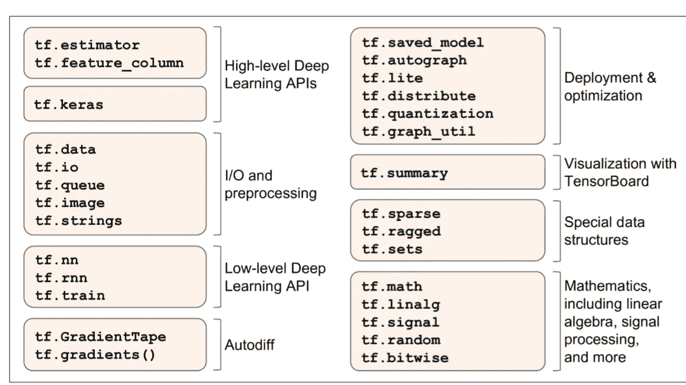
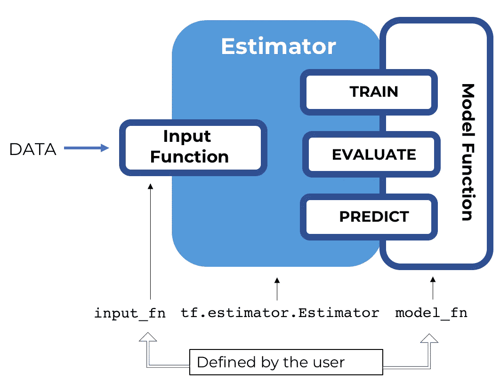

# Tf.estimator，一个 Tensorflow 高级 API

> 原文：<https://pub.towardsai.net/tf-estimator-an-another-tensorflow-high-level-api-ef763c32465b?source=collection_archive---------0----------------------->



现在 Tensorflow 2.0 已经正式发布，它有两个高级深度学习 API。
第一个是 tf.keras，另一个是 tf.estimator，上图可以看到 TensorFlow 的 Python API 列表。你们中的一些人熟悉使用 Keras 构建 ML 模型。但是我们对 tf.estimator 不是那么熟悉(假设我们指的是 ML 初学者)。
那么让我们来了解一下 tf.estimator。

# 这篇文章的背景是:

> 1.给你一个关于 tf.estimator 的概念。
> 2。在编写基于估算器(预制估算器)的张量流程序时，我们必须遵循什么任务。
> 3。优点。
> 4。评估者的能力。
> 5。我们将使用 tf.estimator 建立并测试一个模型，将鸢尾花分为三个种类。

# 什么是 tf.estimator？

估计器是 TensorFlow 对完整模型的高级表示，它旨在方便扩展和异步训练。它用于训练神经网络模型，并使用它们来预测新数据。它是一个高级 API，位于低级核心 TensorFlow API 之上。人们可以使用预制的评估器或定制的评估器。

## 1.预制估算器

与基本的 TensorFlow APIs 相比，预制的估算器使您能够在更高的概念层次上工作。您不再需要担心创建计算图或会话，因为评估人员会为您处理所有的“管道”。此外，预制的评估器允许您通过只做最小的代码更改来试验不同的模型架构。例如，tf.estimator. DNNClassifier 是一个预制的估计器类，它基于密集的前馈神经网络训练分类模型。

## 2.定制估算器

无论是预制的还是定制的，每个估计器的核心都是其模型函数，这是一种为训练、评估和预测构建图表的方法。当你在使用一个预制的估算器时，别人已经实现了模型函数。当依赖一个定制的估计器时，你必须自己编写模型函数。在这个模型中，我们主要处理预先做好的估计

# 编写张量流预制估计量的任务。



来源。 [https://torres.ai](https://torres.ai)

> 1.创建一个或多个输入函数。
> 2。定义模型的特征列。
> 3。实例化一个估计器，指定特性列和各种超参数。
> 4。调用 Estimator 对象上的一个或多个方法，传递适当的输入函数作为数据源。

在本文的后面，我们将为虹膜分类实现上述任务。

# 优势

> tf.estimator 为 tf.keras.
> 提供了一些目前仍在开发中的功能，它们是:-
> 1。我们可以使用评估者 API
> 2 在多个服务器上进行分布式训练。完全 TFX 一体化。
> TensorFlow Extended (TFX)是一个用于部署生产 ML 管道的端到端平台。tf.estimator 支持完全 TFX 积分。

# 评估者能力

估计器提供了以下好处:

1.  您可以在本地主机或分布式多服务器环境中运行基于评估器的模型，而无需更改您的模型。此外，您可以在 CPU、GPU 或 TPU 上运行基于估算器的模型，而无需重新编码您的模型。

2.估算器提供了一个安全分布的训练循环，控制如何以及何时:
(a)加载数据
(b)处理异常
创建检查点文件并从故障中恢复
(d)保存 TensorBoard 的摘要

# 使用 tf 估计器的虹膜分类器

我们将使用 tf.estimator 建立一个虹膜分类器。我们使用的数据集是虹膜数据集，它有四个特征萼片长度、萼片宽度、花瓣长度和花瓣宽度以及三个标签 Setosa、Versicolor 和 Virginica。
但是首先，我们导入所有的依赖项

```
from __future__ import absolute_import, division, print_function, unicode_literals import tensorflow as tfimport pandas as pd
```

然后我们对数据进行预处理，以执行以下任务

(a)创建一个或多个输入函数。
(b)定义模型的特征列。(c)实例化一个估计器，指定特征列和各种超参数。
(d)调用评估器对象上的一个或多个方法，传递适当的输入函数作为数据源。

**数据预处理**

```
CSV_COLUMN_NAMES = ['SepalLength', 'SepalWidth', 'PetalLength', 'PetalWidth', 'Species']
SPECIES = ['Setosa', 'Versicolor', 'Virginica']
```

正在下载数据集。

```
train_path = tf.keras.utils.get_file(
    "iris_training.csv", "https://storage.googleapis.com/download.tensorflow.org/data/iris_training.csv")
test_path = tf.keras.utils.get_file(
    "iris_test.csv", "https://storage.googleapis.com/download.tensorflow.org/data/iris_test.csv")train = pd.read_csv(train_path, names=CSV_COLUMN_NAMES, header=0)
test = pd.read_csv(test_path, names=CSV_COLUMN_NAMES, header=0)
```

## 创建输入函数

您必须创建输入函数来为训练、评估和预测提供数据。

输入函数是返回 tf.data.Dataset 对象的函数，该对象输出以下两元素元组:

features——一个 Python 字典，其中:
(a)每个键都是一个特性的名称。
(b)每个值都是一个数组，包含了该特性的所有值。
标签-包含每个示例的标签值的数组。
我们用熊猫来建立输入管道

```
def input_fn(features, labels, training=True, batch_size=256):
    """An input function for training or evaluating"""
    # Convert the inputs to a Dataset.
    dataset = tf.data.Dataset.from_tensor_slices((dict(features), labels)) # Shuffle and repeat if you are in training mode.
    if training:
        dataset = dataset.shuffle(1000).repeat()

    return dataset.batch(batch_size)
```

## 定义特征列

要素列是描述模型应如何使用要素字典中的原始输入数据的对象。当您构建一个估计器模型时，我们向它传递一个特性列的列表，该列表描述了您希望模型使用的每个特性。tf.feature_column 模块提供了许多向模型表示数据的选项。

对于 Iris，4 个原始特征是数值，因此我们将构建一个特征列列表，告诉估计器模型将 4 个特征中的每一个表示为 32 位浮点值。因此，创建 feature 列的代码是:

```
# Feature columns describe how to use the input.
my_feature_columns = []
for key in train.keys():
    my_feature_columns.append(tf.feature_column.numeric_column(key=key))
```

# 实例化一个评估者

虹膜问题是一个经典的分类问题。幸运的是，TensorFlow 提供了几个预制的分类器估计器，包括:

a.TF . estimator . dnn 用于执行多类分类的深度模型的分类器。
b . TF . estimator . dnnlinearcombinedclassifier 用于宽&深度模型。
基于线性模型的分类器 c . TF . estimator . linear classifier。

对于虹膜问题，tf.estimator.DNNClassifier 似乎是最好的选择。下面是我们如何实例化这个估计器的:

```
# Build a DNN with 2 hidden layers with 30 and 10 hidden nodes each.
classifier = tf.estimator.DNNClassifier(
    feature_columns=my_feature_columns,
    # Two hidden layers of 10 nodes each.
    hidden_units=[30, 10],
    # The model must choose between 3 classes.
    n_classes=3)
```

## 训练、评估和预测

*训练模型*
通过调用估计器的训练方法训练模型，如下所示:

```
# Train the Model.
classifier.train(
    input_fn=lambda: input_fn(train, train_y, training=True),
    steps=5000)
```

评价

现在模型已经训练好了，您可以得到一些关于它的性能的统计数据。下面的代码块根据测试数据评估定型模型的准确性:

```
eval_result = classifier.evaluate(
    input_fn=lambda: input_fn(test, test_y, training=False))print('\nTest set accuracy: {accuracy:0.3f}\n'.format(**eval_result))
```

评估后，我们将获得大约 56%的准确率

## 根据训练好的模型进行预测(推断)

您现在已经有了一个经过训练的模型，可以产生良好的评估结果。现在，您可以根据一些未标记的测量值，使用训练好的模型来预测鸢尾花的种类。与训练和评估一样，您可以使用单个函数调用进行预测:

```
# Generate predictions from the model
expected = ['Setosa', 'Versicolor', 'Virginica']
predict_x = {
    'SepalLength': [5.1, 5.9, 6.9],
    'SepalWidth': [3.3, 3.0, 3.1],
    'PetalLength': [1.7, 4.2, 5.4],
    'PetalWidth': [0.5, 1.5, 2.1],
}def input_fn(features, batch_size=256):
    """An input function for prediction."""
    # Convert the inputs to a Dataset without labels.
    return tf.data.Dataset.from_tensor_slices(dict(features)).batch(batch_size)predictions = classifier.predict(
    input_fn=lambda: input_fn(predict_x))
```

`predict`方法返回一个 Python iterable，为每个例子生成一个预测结果字典。以下代码打印了一些预测及其概率:

```
for pred_dict, expec in zip(predictions, expected):
    class_id = pred_dict['class_ids'][0]
    probability = pred_dict['probabilities'][class_id] print('Prediction is "{}" ({:.1f}%), expected "{}"'.format(
        SPECIES[class_id], 100 * probability, expec))
```

我们将得到这样的输出

```
INFO:tensorflow:Calling model_fn.
INFO:tensorflow:Done calling model_fn.
INFO:tensorflow:Graph was finalized.
INFO:tensorflow:Restoring parameters from /tmp/tmpy5w5zoj8/model.ckpt-5000
INFO:tensorflow:Running local_init_op.
INFO:tensorflow:Done running local_init_op.
Prediction is "Setosa" (73.0%), expected "Setosa"
Prediction is "Virginica" (42.6%), expected "Versicolor"
Prediction is "Virginica" (49.0%), expected "Virginica"
```

## 参考资料:- Tensorflow 的官方文档

希望你喜欢这篇文章

你知道吗，你可以按 50 次拍手键？如果你喜欢这个博客，鼓掌来表达你的爱。

