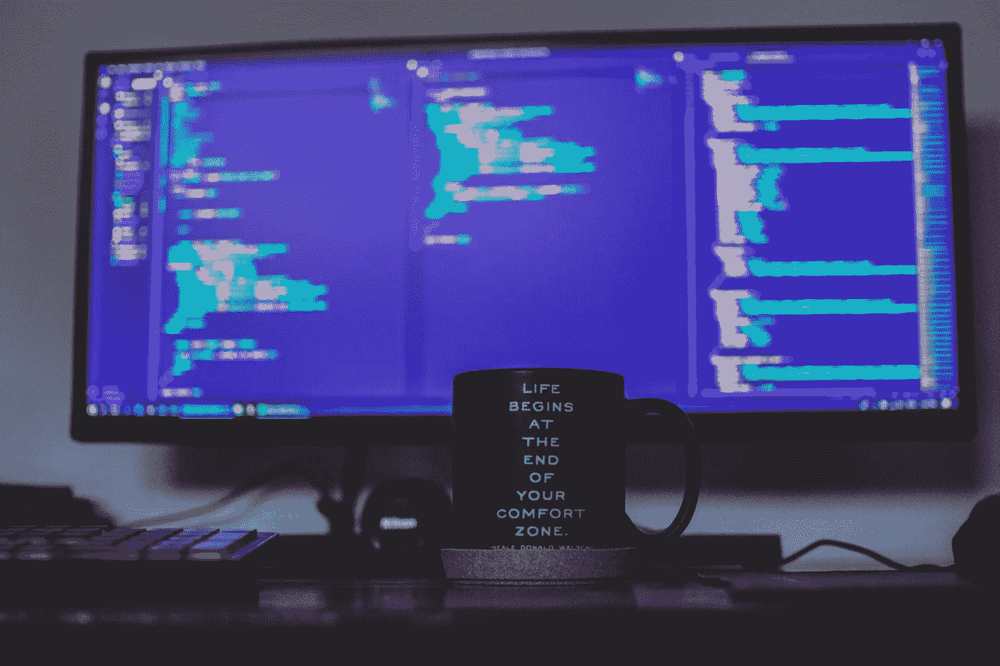
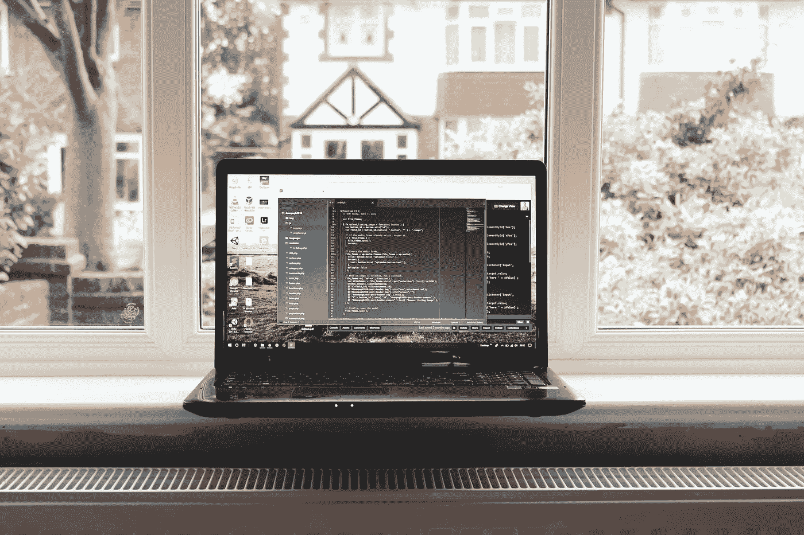
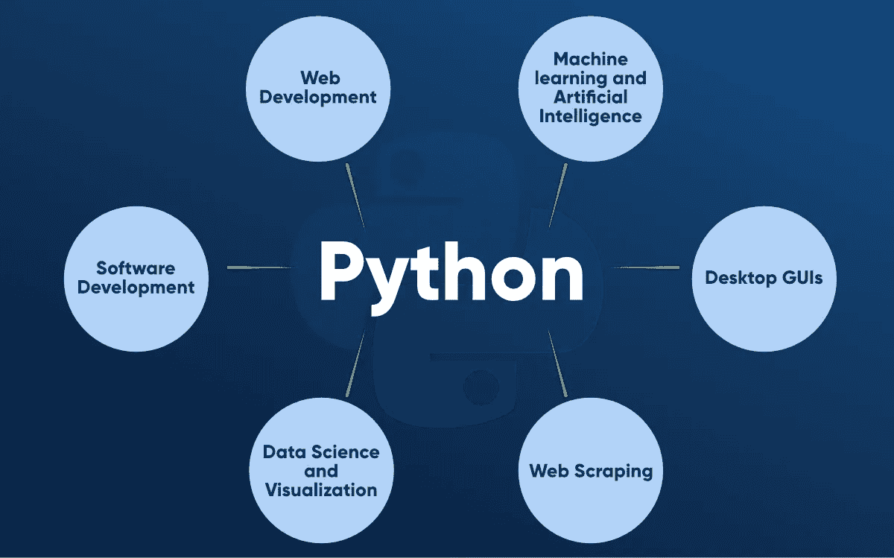
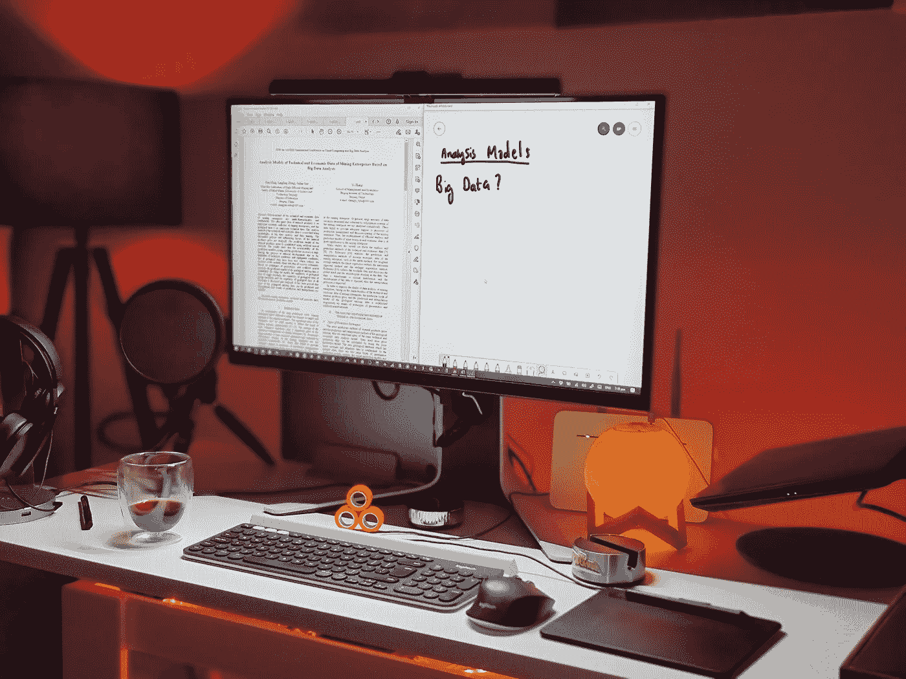
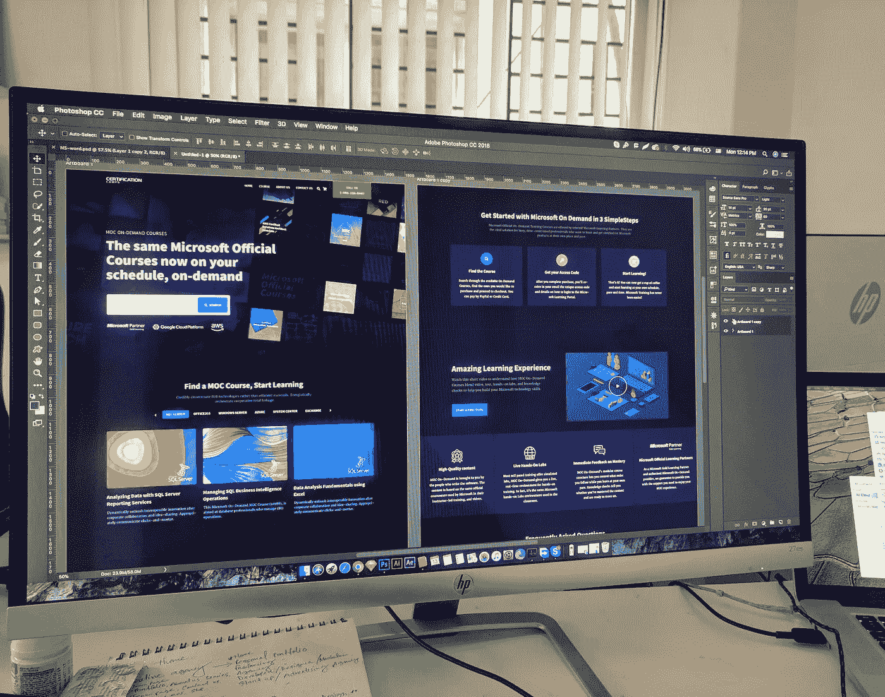
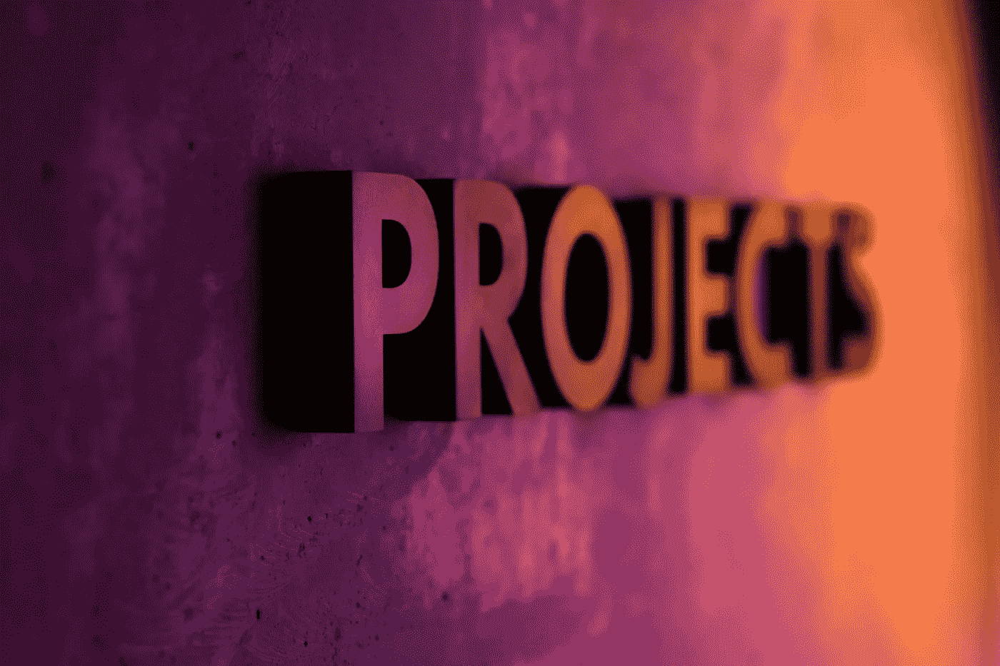

# 2021 Python 开发者路线图

> 原文：<https://pub.towardsai.net/the-2021-python-developer-roadmap-255a6d05ec92?source=collection_archive---------2----------------------->

## [编程](https://towardsai.net/p/category/programming)

## 成为 Python 开发者的一体化指南，包含有用课程的链接！

由[弗朗西斯科·温加罗](https://unsplash.com/@francesco_ungaro?utm_source=unsplash&utm_medium=referral&utm_content=creditCopyText)在 [Unsplash](https://unsplash.com/s/photos/pathway?utm_source=unsplash&utm_medium=referral&utm_content=creditCopyText) 上拍摄的照片

Python 是数据科学家、软件工程师和开发人员最想要的编程语言之一，因为它具有绝对的通用性。Python 是一种解释型通用编程语言。我们可以在不同的领域使用 Python，比如软件开发、web 开发、web 抓取、数据科学、机器学习、人工智能、竞争性编程等等。难怪这种多功能性使 Python 成为 2021 年最受欢迎的学习语言。

不溅

因此，在本文中，我们将讨论成为一名成功的 Python 开发人员所需的结构良好的路线图。我们将在这篇博客中讨论以下内容—

1.  为什么要成为 Python 开发者？
2.  如何成为一名 Python 开发者？
3.  Python 项目列表

# 为什么要成为 Python 开发者？

有几个原因可以解释为什么你应该通过学习 Python 来开始你的编程生涯。首先，Python 易于理解，语法简单，可读性强。它使初学者和中级程序员学习语言变得容易。第二，Python 是一种通用编程语言，具有出色的分析能力和大量有用的库。Python 的这种特性使得程序员可以花更多的时间开发不同的应用程序。

由[都铎巴休](https://unsplash.com/@baciutudor?utm_source=unsplash&utm_medium=referral&utm_content=creditCopyText)在 [Unsplash](https://unsplash.com/s/photos/developer?utm_source=unsplash&utm_medium=referral&utm_content=creditCopyText) 上拍摄

Python 允许开发人员为需要用其他语言编写更多代码的程序编写更少的代码行。例如，Python 程序比 Java 慢，但开发时间也少得多，因为 Python 代码比 Java 代码短三到五倍。其他一些因素是—

1.  Python 是开源的，可以在所有操作系统上免费使用
2.  它是最有生产力的语言
3.  使用 Python 可以做几件事
4.  Python 有一个庞大而活跃的社区
5.  它有数百个内置的库和框架

迪安·普在 [Unsplash](https://unsplash.com/s/photos/python-programming?utm_source=unsplash&utm_medium=referral&utm_content=creditCopyText) 上的照片

像谷歌、脸书、网飞、IBM 和许多其他组织使用 Python 来完成各种任务，比如软件开发、机器学习、Web 开发等等。看着 Python 越来越受欢迎，就可以想象学习 Python 有多有用了。

# 如何成为一名 Python 开发者？

首先，我们将从成为 Python 开发人员所需的一些基本技能和计算机基础开始

# 第 1 阶段—计算机基础

## 1.饭桶

Git 是最流行的版本控制系统之一。Git 是一个开源的免费软件，用于多种用途，例如在软件开发过程中跟踪文件集的变化、开发和管理源代码。请查看以下资源以了解更多关于 Git 的信息——

1.  [用 Git (Coursera)进行版本控制](https://www.coursera.org/learn/version-control-with-git)
2.  使用 Git 进行版本控制 (Udacity)
3.  [学习 Git](https://www.codecademy.com/learn/learn-git) (Codecademy)
4.  [Git 文档](https://git-scm.com/doc)

## **2。Linux 命令行基础知识**

Linux 命令行对于任何程序员来说也是必不可少的学习内容。我建议您至少花些时间学习这些命令的基础知识。如果您渴望成为 Python 开发人员，这些命令会非常方便。这些资源将帮助你免费学习更多关于 Linux 命令的知识——

1.  [面向初学者的 Linux 命令行](https://ubuntu.com/tutorials/command-line-for-beginners#1-overview) (Ubuntu)
2.  [Linux 命令行基础知识](https://www.udacity.com/course/linux-command-line-basics--ud595) (Udacity)

## **3。GitHub**

您知道吗，如今几乎每个招聘人员都要求 GitHub 简介？这是一个很好的地方来建立你的网上投资组合和展示你的技能。拥有 GitHub 个人资料有助于你脱颖而出。当你申请数据科学家、ML 工程师、web 开发人员或 Python 开发人员等竞争性职位时，招聘人员首先会看你的 GitHub 简介。它让招聘人员了解你的编码能力、解决问题的技能以及解决问题的方法。如果你有一个维护良好的、最新的 GitHub 档案，你就有更大的机会脱颖而出。

毫无疑问，GitHub 是一项有价值的技能，它将帮助你在专业上脱颖而出。数百万开发者使用 GitHub 分享他们的代码并建立在线作品集。请参考这篇 [*博客*](https://medium.com/javarevisited/7-best-courses-to-master-git-and-github-for-programmers-d671859a68b2) 和后续课程，免费了解更多关于 GitHub 的内容——

1.  [Git 和 GitHub 简介](https://www.coursera.org/learn/introduction-git-github) (Coursera)
2.  GitHub 学习实验室
3.  [GitHub 终极版:Git 大师和 GitHub——初学者到专家](https://www.udemy.com/course/github-ultimate/) (Udemy)

# **第二阶段:— Python 基础知识**

一旦我们完成了计算机编程基础，我们将学习 Python 编程的基础。这些是您应该学习掌握 Python 基础知识的主题—

1.  使用 Python 3 的 Hello World
2.  基本语法
3.  像 Vim，Jupyter Notebook，Google Colab，Atom 这样的代码编辑器。
4.  刻痕
5.  循环、逻辑运算符
6.  数据类型和变量
7.  经营者
8.  字符串和数字
9.  条件语句和类型转换
10.  函数和内置函数

## 去哪里学？

学习 Python 不存在资源匮乏的问题。你可以在网上找到数百万的免费资源来学习 Python。其中一些是—

1.  [人人专用 Python](https://www.coursera.org/specializations/python)(Coursera)
2.  [Python 3 编程](https://www.coursera.org/specializations/python-3-programming) (Coursera)
3.  [Python 编程简介](https://www.edx.org/professional-certificate/introduction-to-python-programming) (edX)
4.  [CS50 用 Python 和 JavaScript 的 Web 编程](https://www.edx.org/course/cs50s-web-programming-with-python-and-javascript) (edX)
5.  [学习 Python 3](https://www.codecademy.com/learn/learn-python-3) (Codecademy)

# **第三阶段 Python 中的数据结构和算法**

完成 Python 基础知识之后，我们将转向 Python 最重要的部分，数据结构和算法(DSA)。它们是任何编程语言的基础。DSA 是软件开发和编码面试的必备。这些是你应该学会掌握 DSA 的主题—

1.  数组和链表
2.  二分搜索法树，递归
3.  Python 列表
4.  元组、字典、集合和切片
5.  堆栈和队列
6.  哈希、哈希表、图形遍历
7.  排序算法，分而治之
8.  动态规划

免费查看以下资源，了解 Python DSA——

1.  [Python 中的数据结构和算法](https://jovian.ai/learn/data-structures-and-algorithms-in-python) (Jovian.ai)
2.  [掌握 Python 中的数据结构和算法](https://courses.learncodeonline.in/learn/Mastering-Data-Structure-and-Algorithm-with-Python)
3.  [Python 中完整的数据结构和算法课程](https://www.udemy.com/course/data-structures-and-algorithms-bootcamp-in-python/) (Udemy)
4.  [数据结构和算法介绍](https://www.udacity.com/course/data-structures-and-algorithms-in-python--ud513) (Udacity)
5.  [使用 Python 的数据结构](https://practice.geeksforgeeks.org/courses/Data-Structures-With-Python)(极客对极客)

# **阶段 4 —高级 Python**

完成 Python DSA 之后，我们将转向 Python 中的一些高级概念。这里的相关主题是—

1.  面向对象编程
2.  方法
3.  函数式编程
4.  遗产
5.  邓德
6.  班级
7.  装修工
8.  λ函数
9.  装修工
10.  正则表达式

免费查看以下资源，了解高级 Python——

1.  [完整的 Python 3 课程:从初级到高级！](https://www.udemy.com/course/python-complete/?ranMID=39197&ranEAID=JVFxdTr9V80&ranSiteID=JVFxdTr9V80-33coiUtUcLaW1L1tD9nPqQ&LSNPUBID=JVFxdTr9V80&utm_source=aff-campaign&utm_medium=udemyads) (Udemy)
2.  [学习 Python 编程大师班](https://www.udemy.com/course/python-the-complete-python-developer-course/?gclid=EAIaIQobChMIrbjowrHJ8QIVhn0rCh0ZWwHPEAAYASAAEgLDmfD_BwE&matchtype=b&utm_campaign=Python_v.PROF_la.EN_cc.INDIA_ti.7380&utm_content=deal4584&utm_medium=udemyads&utm_source=adwords&utm_term=_._ag_78980844146_._ad_463012611504_._kw_python+course_._de_c_._dm__._pl__._ti_kwd-354107289009_._li_1007785_._pd__._) (Udemy)

# 阶段 5 —模块、包、I/O 操作符和文件处理

完成高级概念后，我们将转向 Python 中的模块、包和文件处理。相关主题是—

1.  数字模块、随机模块、计数器、系统模块
2.  defaultdict 和 OrderedDict 模块
3.  Pip 和 PyPI 包、日期时间、日历模块
4.  用 Python 读/写文件
5.  在 Python 中重命名/复制/管理文件
6.  操作系统模块
7.  压缩文件和目录

免费查看以下资源，了解模块、软件包—

 [## Python 模块和包-简介-真正的 Python

### 在 Python 中定义模块实际上有三种不同的方式:模块可以用 Python 本身编写。一个…

realpython.com](https://realpython.com/python-modules-packages/)  [## 6.模块- Python 3.9.6 文档

### 如果你退出 Python 解释器并再次进入，你所做的定义(函数和变量)是…

docs.python.org](https://docs.python.org/3/tutorial/modules.html)  [## 模块和包-学习 Python -免费的交互式 Python 教程

### 在编程中，模块是一个具有特定功能的软件。例如，在构建 ping 时…

www.learnpython.org](https://www.learnpython.org/en/Modules_and_Packages)  [## Python 模块

### 将模块视为代码库。包含一组要包含在您的…中的函数的文件

www.w3schools.com](https://www.w3schools.com/python/python_modules.asp)  [## Python 中的文件处理

### Python 也支持文件处理，并允许用户处理文件，例如，读取和写入文件，以及许多其他…

www.geeksforgeeks.org](https://www.geeksforgeeks.org/file-handling-python/)  [## Python 文件打开

### 文件处理是任何 web 应用程序的重要组成部分。Python 有几个函数用于创建、读取…

www.w3schools.com](https://www.w3schools.com/python/python_file_handling.asp)  [## Python -文件输入/输出

### 本章涵盖了 Python 中所有可用的基本 I/O 函数。更多功能，请参考标准…

www.tutorialspoint.com](https://www.tutorialspoint.com/python/python_files_io.htm) 

# **Python 的应用—**

[图片来源](https://www.geeksforgeeks.org/python-programming-language/learn-python-tutorial/)

Python 因其多才多艺的特性而拥有大量的应用。下面是您可以用 Python 及其库和框架探索的少数几个应用领域。掌握以上概念后，你就可以自由选择自己感兴趣的职业道路了。

## **途径 1 —走向数据科学**

在 [Unsplash](https://unsplash.com/s/photos/data-science?utm_source=unsplash&utm_medium=referral&utm_content=creditCopyText) 上由 [Boitumelo Phetla](https://unsplash.com/@writecodenow?utm_source=unsplash&utm_medium=referral&utm_content=creditCopyText) 拍摄的照片

《哈佛商业评论》将[数据科学](https://hbr.org/2012/10/data-scientist-the-sexiest-job-of-the-21st-century)评为 21 世纪最热门的领域之一。数据科学是一个跨学科领域，它使用算法、数学、统计学从数据中提取有意义的见解。如果你想在数据科学领域开始你的职业生涯，以下是你应该考虑学习的东西

1.  Matplotlib、Pandas、NumPy、Seaborn 等库
2.  数学和统计
3.  数据可视化
4.  数据操作、数据分析和解释
5.  数据库管理

用 Python 学习数据科学，不缺资源。查看以下资源，免费了解 Python 数据科学—

1.  [Python 专门化的应用数据科学](https://www.coursera.org/specializations/data-science-python) (Coursera)
2.  [使用 Python 的数据科学家](https://www.datacamp.com/tracks/data-scientist-with-python) (Datacamp)
3.  [Python 数据科学教程](https://realpython.com/tutorials/data-science/)(realpython.org)
4.  [IBM 数据科学专业证书](https://www.coursera.org/professional-certificates/ibm-data-science) (Coursera)
5.  [Python 专门化统计](https://www.coursera.org/specializations/statistics-with-python) (Coursera)

## **途径 2 —网络开发**

照片由 [Eftakher Alam](https://unsplash.com/@easiblu?utm_source=unsplash&utm_medium=referral&utm_content=creditCopyText) 在 [Unsplash](https://unsplash.com/s/photos/web-design?utm_source=unsplash&utm_medium=referral&utm_content=creditCopyText) 拍摄

如果你正在考虑从事 Web 开发，请参考这篇 [*博客*](https://medium.com/javarevisited/the-2019-web-developer-roadmap-ab89ac3c380e) 帖子。学习 Web 开发时要考虑的事情有

1.  前端开发人员
2.  后端开发人员
3.  HTML，CSS
4.  弗拉斯克·姜戈
5.  JavaScript，类型脚本
6.  Angular，React JS，Vue.js
7.  Node.js，Ruby，PHP，MySQL

查看以下资源，免费学习 Web 开发—

1.  面向所有人的网页设计:网页开发基础&编码专业 (Coursera)
2.  [网页开发者的 HTML、CSS 和 JavaScript】](https://www.coursera.org/learn/html-css-javascript-for-web-developers)
3.  [IBM 全栈云开发者专业证书](https://www.coursera.org/professional-certificates/ibm-full-stack-cloud-developer) (Coursera)
4.  [HTML & CSS BY](https://courses.w3schools.com/) (W3School)
5.  [Web 开发职业道路](https://www.codecademy.com/learn/paths/web-development) (Codecademy)

## 路径 3——走向机器学习和人工智能

[Katarzyna Pe](https://unsplash.com/@kasiape?utm_source=unsplash&utm_medium=referral&utm_content=creditCopyText) 在 [Unsplash](https://unsplash.com/s/photos/machine-learning?utm_source=unsplash&utm_medium=referral&utm_content=creditCopyText) 上拍照

机器学习是当今发展最快的领域之一。如果你有兴趣在 ML 和 AI 领域开始你的职业生涯，你应该学习以下内容—

1.  应用数学和统计学
2.  机器学习算法
3.  sci-kit learn、TensorFlow、Keras 等库
4.  预测模型
5.  用于深度学习的神经网络
6.  自然语言处理

谈到机器学习，互联网上有大量可用的资源。查看以下资源，免费学习 ML 和 AI—

1.  斯坦福大学的机器学习
2.  哈佛大学颁发的人工智能计算机科学专业证书
3.  [机器学习基础:案例研究方法](https://www.coursera.org/learn/ml-foundations) (Coursera)
4.  [深度学习专业化](https://www.coursera.org/specializations/deep-learning) (Coursera)
5.  [深度学习。AI TensorFlow 开发者专业证书](https://www.coursera.org/professional-certificates/tensorflow-in-practice) (Coursera)
6.  [自然语言处理专业](https://www.coursera.org/specializations/natural-language-processing) (Coursera)

## **路径 4——网页抓取、计算机视觉和自动化测试**

照片由[伊戈尔·米斯克](https://unsplash.com/@igormiske?utm_source=unsplash&utm_medium=referral&utm_content=creditCopyText)在 [Unsplash](https://unsplash.com/s/photos/website?utm_source=unsplash&utm_medium=referral&utm_content=creditCopyText) 上拍摄

学习 Web 抓取和自动化测试时要考虑的事情是—

1.  使用 BeautifulSoup 请求库的网络抓取
2.  Selenium Web 驱动程序
3.  硒栅
4.  使用 OpenCV 的计算机视觉

查看以下资源—

1.  [TensorFlow:高级技术专精](https://www.coursera.org/specializations/tensorflow-advanced-techniques) (Coursera)
2.  [计算机视觉与图像处理简介](https://www.udacity.com/course/introduction-to-computer-vision--ud810) (Coursera)
3.  [计算机视觉简介](https://www.coursera.org/learn/introduction-computer-vision-watson-opencv) (Udacity)
4.  [计算机视觉的深度学习](https://onlinecourses.nptel.ac.in/noc20_cs88/preview) (NPTEL)
5.  [使用 Python 访问 Web 数据](https://www.coursera.org/learn/python-network-data) (Coursera)
6.  [学习 Python 测试自动化](https://automationpanda.com/2020/11/09/learning-python-test-automation/)(自动化熊猫)
7.  从零开始使用 Python 框架的 Selenium Web 驱动程序 (Udemy)

## **第五阶段—个人 Python 项目**

照片由[屋大维丹](https://unsplash.com/@octadan?utm_source=unsplash&utm_medium=referral&utm_content=creditCopyText)在 [Unsplash](https://unsplash.com/s/photos/project?utm_source=unsplash&utm_medium=referral&utm_content=creditCopyText) 上拍摄

使用 Python 作为编程语言构建动手项目将帮助您获得实用的编码技能。在你的项目中工作将会增强你的自信，并帮助你理解所有的编程概念。你将利用技术知识建立一个令人印象深刻的投资组合。这是向未来的招聘人员展示你的编码技能的最好方式。

*感谢阅读！*如果你对我有任何疑问或建议，请随时打招呼！