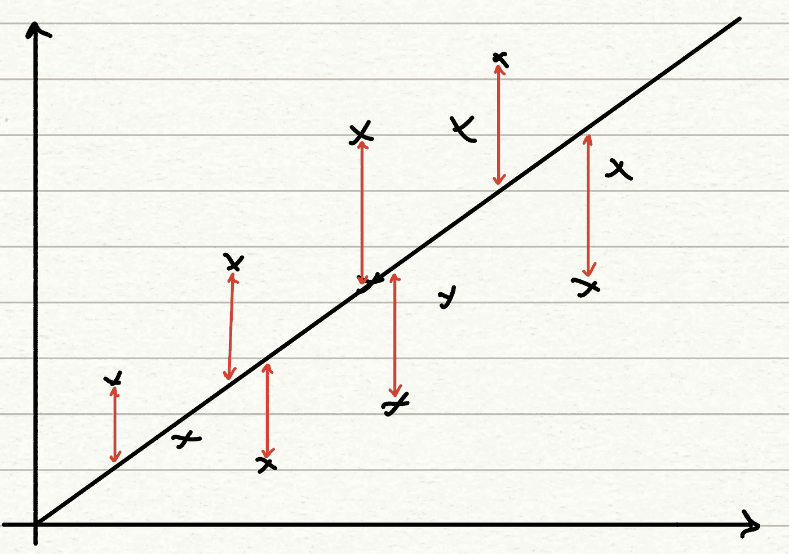
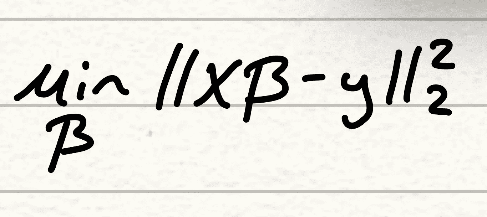
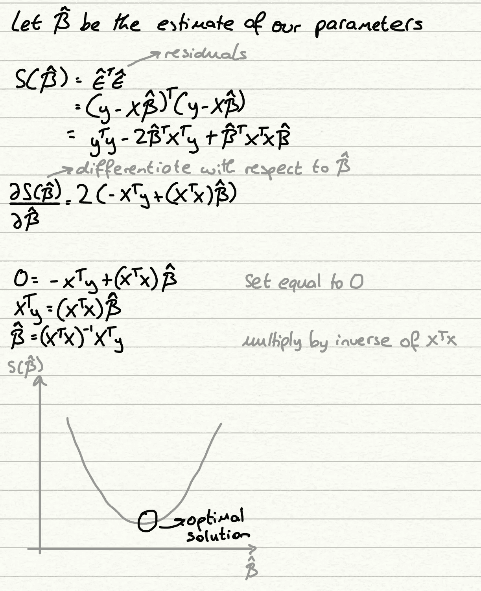

# 线性回归的 3 个关键变量

> 原文：<https://pub.towardsai.net/the-3-key-variations-of-linear-regression-8454d61c798b?source=collection_archive---------4----------------------->

## [机器学习](https://towardsai.net/p/category/machine-learning)

由[马库斯·温克勒](https://unsplash.com/@markuswinkler?utm_source=unsplash&utm_medium=referral&utm_content=creditCopyText)在 [Unsplash](https://unsplash.com/s/photos/graph?utm_source=unsplash&utm_medium=referral&utm_content=creditCopyText) 上拍摄

任何项目中建立的第一个预测模型通常是回归模型。作为所有“白盒模型”之母，线性回归提供了直接的实现和解释。我们可以清楚地看到哪些变量对我们的目标有很大的影响，我们还可以使用统计测试来检查这些系数的显著性。遵循奥卡姆剃刀的灵感，即“实体的繁殖不应超过必要性”[1]，在我们的模型中建立复杂性是合乎逻辑的。

我们的分析工具箱中有 3 种重要的线性回归方法。本文旨在详细介绍它们，从它们的方法和设计到它们各自的独特性和有效性。

## 普通最小二乘法(OLS)

普通最小二乘法或 OLS 模型是线性回归的基本方法，通常是论文或项目提到进行回归时描述或参考的方法。sk learn*linear regression()*函数默认调用 OLS 模型，R 的 *lm()* 函数也是如此。

OLS 模型旨在找到最小化残差平方和的线性估计值，残差平方和以数据点和估计值之间的欧氏距离计算。这在下面的二维设置中用图表表示。

作者图片

在一个更高维的设置中，这条线转换成一个维数=D-1 的超平面，其中 D 是数据点的维数(解释变量的数目)。

从数学上讲，OLS 方法是通过以下函数计算的，这是残差平方和的公式。

作者图片

由于我们知道残差平方和函数是一个凸函数，因此 OLS 方法的解可以以封闭形式计算，并通过扩展上述公式，在设置微分等于 0 后微分并计算β来实现。

作者图片

那么，这些如何转化为一个适用的场景呢？事实上，我们的解决方案是一个封闭的形式(本质上这意味着它可以精确计算，我们不需要任何形式的数值方法来估计解决方案)，这意味着性能通常是相当快和可解释的。回归被称为“白盒模型”,因为我们可以看到他们为了得出一个解决方案而进行的所有计算，上面的证明显示了这一点。计算中的这种透明性也反映在输出中，通常，除了我们的标准误差图之外，回归还为我们提供了系数值(beta_hat 值)和 p 值，以检查这些值的显著性。这有助于我们轻松地识别作为我们目标的关键预测因素的变量，并立即提出新的研究，我们可以研究为什么某些变量具有高度影响力，而其他变量则没有。

## 里脊回归

岭回归是我们在本文中讨论的两种收缩方法中的第一种，之所以这样命名是因为这个模型的目标是将系数的估计值收缩到 0。这样做的好处是，我们可以创建更简单、更稀疏的模型(参数更少的模型)，这很有用，因为它可以帮助我们真正隔离重要的变量，并丢弃那些对我们的研究没有帮助的变量。

这两种收缩方法实现这一点的方式是在损失函数计算中增加一个额外的惩罚项。寻找最低损失现在是估计值与目标值的接近程度和每个系数的大小之间的平衡。相对于它们的大小，没有成比例地有助于减少 OLS 损耗的系数开始向 0 收缩，因为它们的大小不能被模型证明是合理的。这种行为可以用下面新的损失函数来概括。

作者图片

这种关键变量“隔离”的额外好处是，收缩法的表现往往略好于标准的 OLS 模型。由于增加了惩罚参数，它们在训练数据上的准确性通常较低，但在评估我们构建的任何模型时，我们优先考虑的是它的泛化能力，而 ridge 和 lasso 往往在这方面做得相当好。更简单的模型更容易避免过度拟合，这有助于推广到看不见的数据。

你还会注意到，在我们的惩罚项中有一个 lambda 变量。这被称为调整参数，本质上决定了损失和损失之间的平衡是如何分配的。当λ= 0 时，我们的模型将与之前的 OLS 方法完全一样，λ值太小将导致模型过于复杂，可能会过度拟合我们的数据。λ值太高，我们的模型将完全集中在惩罚项上，所有变量将向 0 收缩，影响模型的性能和我们对解释变量可预测性的解释。因此，选择一个好的λ值至关重要。

## 套索回归

Lasso 不是一种严格的回归，而是一种可应用于各种回归方法的要素选择工具，包括 OLS 和逻辑回归。从公式上来说，lasso 模型看起来非常类似于 ridge 模型，但是有一个关键的区别-> lasso 不是在惩罚项中计算参数的平方值，而是使用系数的绝对值。

作者图片

lasso 和 ridge 回归之间的行为差异在于，虽然 ridge 系数趋向于向 0 收缩，但在 lasso 中，这些系数恰好变为 0。我们将在下一篇文章中详细介绍这是如何发生的，但是这样做的主要好处是我们现在可以使用套索作为精确特征选择的一种形式。系数正好为 0 的变量可以立即从模型中丢弃，因为它们不提供对目标的任何预测能力。这有助于我们清理我们的模型，并将焦点放在有明确关联的变量上。

## 参考

[1] — [奥卡姆剃刀—维基百科](https://en.wikipedia.org/wiki/Occam%27s_razor)