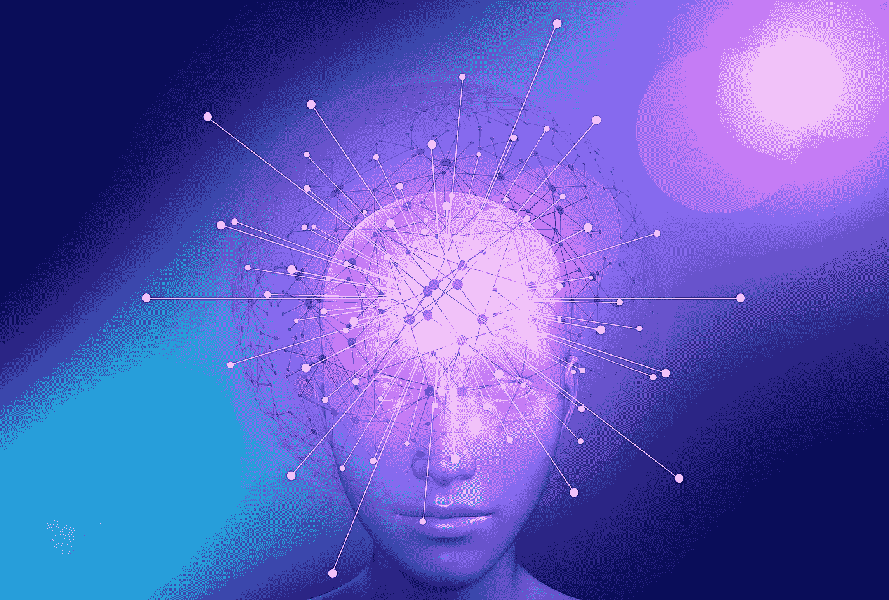

# 我们都在等着在现实生活中看到的 5 个最令人期待的科幻人工智能用例！

> 原文：<https://pub.towardsai.net/the-5-most-anticipated-sci-fi-ai-use-cases-were-all-waiting-to-see-in-real-life-fae5278eea01?source=collection_archive---------2----------------------->

## [人工智能](https://towardsai.net/p/category/artificial-intelligence)，[未来](https://towardsai.net/p/category/future)

图片由 [Gerd Altmann](https://pixabay.com/users/geralt-9301/?utm_source=link-attribution&amp;utm_medium=referral&amp;utm_campaign=image&amp;utm_content=5371562) 从 [Pixabay](https://pixabay.com/?utm_source=link-attribution&amp;utm_medium=referral&amp;utm_campaign=image&amp;utm_content=5371562) 拍摄

如果你不是住在山洞里，而是住在山洞里，那么你可能听说过人工智能是一种新的趋势技术。它影响着我们今天的大部分日常生活，我们都一直在使用它的服务。如果你不认为你受到了影响，只要记住 YouTube 是如何向你推荐合适的视频，这样你就可以继续看 2 个多小时，而不是原来计划的 5 分钟。脸书建议你如何认识你的邻居。或者你如何发现自己在亚马逊上买了一个 200 美元的篮子，而不是你最初买的 5 美元的铅笔。

这些只是人工智能如何影响我们生活的例子。我们没有把太多的注意力放在他们身上，因为，嗯，他们不像我们想象的那样令人兴奋。它看起来不像终结者的天网人工智能。

然而，这并不意味着我们没有做到这一点。这可能需要比预期更长的时间，但人工智能有一个光明(或黑暗，取决于视角)的未来。让我们来挖掘一下我们都在等着看的 5 个最有趣的人工智能应用。

# 机器人

即使机器人领域的研究已经处于非常先进的水平，我们仍然没有得到我们所期待的。当然，我说的机器人不仅仅是指电影《I-Robots》中的机器人，还包括各种自动化的物理任务，如自动驾驶汽车、飞机、餐厅炊具等等。

这是最先进的人工智能用例。我们可能会在十年内看到自动驾驶汽车的普及，其他的也会随之而来。

# 预测疾病

医疗保健行业可能是未来几年最大的颠覆性行业，但也是最复杂的行业之一。由于非常复杂的立法，阻止我们将我们的生命交到人工智能手中的心理障碍，以及缺乏高质量的数据，这是这场战争的关键。

实际上，医疗保健已经是人工智能算法的一个大操场:在放射图像中检测乳腺癌，或在心电图中检测心脏病，所有这些都比医生好。

然而，在我看来，最大的突破不是从各种类型的数据中检测出你患有的疾病，而是在疾病发生之前很久就预测出你会患上某种特定的疾病。想象一下，你可以提前两年以非常精确的百分比知道你会得癌症，这可能会改变我们今天的医疗方式。

我不认为这是太多的未来主义，即使它看起来像，我们只是需要足够的数据！

# 复活死者

当然，我指的不是真的让一个人有血有肉地起死回生。但是想象一下，如果你有一份你多年前去世的妻子的非常忠实的复制品。这不是《黑镜》中的一集，而是微软已经在开发的真实用例(他们甚至提交了专利)。

千禧一代正在产生比历史上任何其他人都多的数据。想想看，如果你可以访问一个人所有的社交网络帖子、消息、图片、搜索历史、语音、视频……你可以了解这个人的长相、说话方式、思维方式和骂人方式。

想象一下，聚合这些数据，并从这些数据中创建一个人工智能，难道不会非常接近你认识的那个人吗？它可以是聊天机器人的形式(像微软的专利)，虚拟世界中的化身，甚至是我们可以制造的机器人。

# 艺术人工智能

所谓艺术，我不仅仅指绘画和写作故事，而是指任何源于人类想象力的新发明。

我们实际上已经有可能使用 GANs(生成对抗网络)，即一种人工智能算法，来生成绘画和故事。然而，像(几乎)所有当前的人工智能一样，它使用已经存在的数据。为了生成绘画，人工智能需要在成千上万幅过去的绘画上进行训练。这有点像是把它之前已经看过的东西混合在一起。

真正的突破是当人工智能能够生成新的内容，而以前看不到任何类似的东西，就像人类一样…还是没有？我们可能就像 GAN 一样:从我们之前看到的内容中产生内容。但这是另一个讨论！

# 直觉人工智能

在我看来，这是唯一也是最终的颠覆，将会导致通常所说的:*奇点*。

要理解为什么它是人工智能领域有史以来最重要的发现，我们应该首先了解当前人工智能是如何工作的。简单地说，人工智能是一个数学函数，代表它被训练的数据。

就拿一个很简单的识别图片中猫的 AI 来说吧。为了做到这一点，你需要给它数以千计不同姿势、不同颜色的猫的图片，这样它就可以建立一个猫图片的表示。老实说，人类不是这样学习的。一个 3 岁的孩子可以认出任何姿势和任何颜色的猫，只要给他看几次。

我个人的信念是，我们实际上并没有在做“人工”的“智能”。我们最多可以称之为“机器学习”，但最好的叫法可能只是“数据科学”。我们只是在优化一个数学方程，使它能够代表特定数据类型的最大样本数。

下一个(真正的)人工智能，将是能够从上下文、从它们的用途中识别物体，并理解它们的性质，而不是试图愚蠢地将一个方程与一些数据拟合。就像人类一样。

这可能吗？可能，大概。如果这让我们害怕，我想是的。什么时候会这样？很难说。我认为，今天，我们只是没有朝正确的方向看。

# 结论

可能还有更有趣的用例。这个排名或多或少是个人的，有些人可能认为其他人值得在这个列表中引用。但我们可以肯定的是，AI 将给我们的生活带来的颠覆远比我们想象的要大。而我们才刚刚处于它崛起的开始。