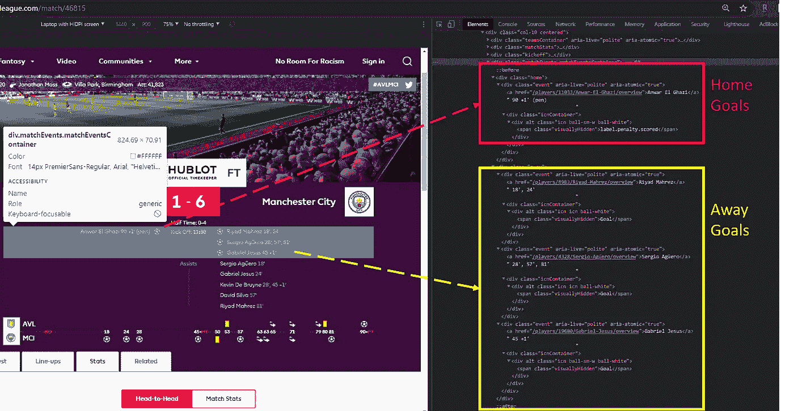
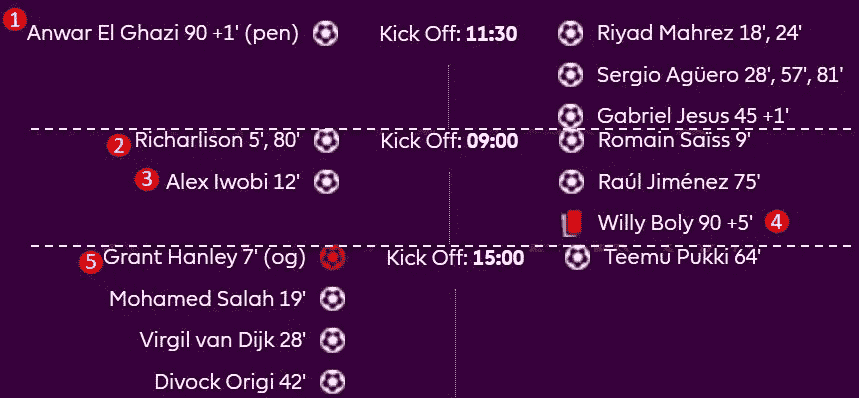

# 网络抓取的 5 W 和 H

> 原文：<https://pub.towardsai.net/the-5-ws-and-h-of-web-scraping-c96f12fabfb1?source=collection_archive---------2----------------------->

## [网页抓取](https://towardsai.net/p/category/web-scraping)

## 减少时间、麻烦和代码错误

照片由[荷西西瓦](https://burst.shopify.com/@josesilva?utm_campaign=photo_credit&utm_content=Browse+Free+HD+Images+of+Plastering+Up+Motivational+Posters&utm_medium=referral&utm_source=credit)从[爆出](https://burst.shopify.com/inspirational?utm_campaign=photo_credit&utm_content=Browse+Free+HD+Images+of+Plastering+Up+Motivational+Posters&utm_medium=referral&utm_source=credit)

***免责声明:*** *本文仅出于教育目的。我们不鼓励任何人抓取网站，尤其是那些可能有条款和条件反对此类行为的网站。*

网络抓取本质上是一个简单的概念。大量的文章和教程涵盖了如何在 5 个简单的步骤或 8 分钟的时间内构建自己的 web scraper。然而，虽然抓取行为确实很容易做到和掌握，但现实是大多数定制的 web 抓取项目并不适合千篇一律的模式，因为许多网站结构可能很复杂，很难导航。

与其专注于一个完美的抓取例子，不如把一个网络抓取项目当作你想要解决的问题来处理。就像许多大问题一样，五个 w 和 H 是一组很好的问题，是解决问题的关键，并且已经在生活的许多领域证明了成功。

你可能听说过他们，这些是**谁，什么，何时，何地，为什么，**偶尔**如何**？对于网络抓取，我们*肯定*想要知道如何做。

这篇文章将集中在应用这些关键问题的思考过程中考虑时，建立一个网页刮刀。我们将使用 Python 和 Selenium 来构建一个英超联赛数据集，但这种思维过程和方法可以而且应该应用于您所进行的任何网络抓取项目，无论您使用的是 Beautiful Soup、Selenium、Scrapy、Rvest 还是任何其他抓取工具。

W hy？

就像你试图解决的任何好问题一样，最好从“为什么”开始，正如《领导力》一书的作者和灵感演讲者西蒙·西内克所说。问为什么定义了你搜集特定数据的目的。

您是否希望收集人口数据用于犯罪统计的研究目的？您是否正在提取电子商务数据，以便在仪表板中可视化最成功的产品？或者，您是否希望聚集每日股票价格数据，以用于机器学习预测？“为什么”的答案将决定你要采取的其余步骤和程序。

## 应用

在我们的例子中,“为什么”与在新冠肺炎时代对足球比赛进行探索性数据分析的兴趣有关。我们很想知道有球迷和没有球迷的比赛结果有什么不同。

 [## 主场优势:没有粉丝还存在吗？

### 疫情时代之前和期间的数据和统计

towardsdatascience.com](https://towardsdatascience.com/home-field-advantage-does-it-exist-without-fans-a0778c5a6a29) 

W ho？

一旦你知道你的目标或者你要用这些数据做什么，你就需要定义你将从谁那里收集数据。换句话说，谁的网站？

你可能有几个网站，或者只有一个网站有你需要的数据。有时候，你正在考虑的某个特定网站上的条件条款和抓取规则(robots.txt)可能会帮助你做出决定。如果一个网站不允许刮，那你就不要考虑。

 [## 如何理解 Robots.txt 文件

### 一个网页抓取者的问题在看似吓人但简单的文本文件上得到回答

levelup.gitconnected.com](https://levelup.gitconnected.com/how-to-understand-a-robots-txt-file-667246d7fa18) 

## 应用

在我们的例子中，who 是英超(EPL)官方[网站](https://www.premierleague.com/)。虽然各种体育统计网站提供所需的数据，但 EPL 是官方提供者，似乎可以不受限制地轻松访问，因为其条件条款允许个人下载和使用数据用于个人和非商业用途。

W 帽子？

询问你将收集哪些数据通常与询问谁密切相关，因为你可能会将你的决定建立在一个组合的基础上，即哪个网站以最容易获得的形式拥有你需要的数据。

在流程的这一点上，您需要定义要提取的具体数据类型，包括但不限于以下内容:

*   日期
*   数值
*   名称
*   标题
*   摘要
*   文本描述

## 应用

在我们的例子中，英超联赛 2019-2021 赛季的比赛数据包括主客场球队的具体细节:

*   所有进球的分钟标记
*   决赛和半场比分
*   一般比赛统计

有了所有进球的记录，我们就可以回答这样的问题:大多数进球发生在一场比赛的什么时候，球迷的出现会改变这种分布吗？一般的比赛统计数据，如控球率、犯规次数和射门次数，将允许我们进行比较，看看球迷在比赛中对球员和裁判施加的压力是否会对结果和比赛产生影响。

W 这里？

存储您想要的数据的特定网页和部分构成了抓取过程的位置。在这里，你可以使用你所拥有的任何网络开发经验和工具，如 [Google Chrome DevTools](https://developer.chrome.com/docs/devtools/) 或[Mozilla Firefox Developer Tools](https://developer.mozilla.org/en-US/docs/Tools)来检查和理解页面上的网络组件。这些 web 组件包括诸如特定的 HTML 元素名称或 XPaths 之类的东西，使得在 web scraper 程序中引用您需要的数据变得更加容易。

## 应用

在我们的例子中，所有的英超比赛都有一个唯一的`ID`，并且存在于网站的 URL 路径:`www.premierleague.com/match/{ID}`。您可以在每页上找到最终比分、半场比分、球队名称以及进球发生的具体时间。

EPL 匹配网页检查使用谷歌浏览器(作者)

通过查看和放大上面的页面，我们可以看到，游戏的事件存储在`matchEvents.MatchEventsContainer` div 容器中，每个团队有各自的 div 类`home`和`away`。此外，在这个容器中，还有额外的内部嵌套 div 元素`event`，它存储了每个行项目事件(goals & penalties ),这些事件与该容器中页面上显示的每个球员姓名相关联。

H ow？

您构建的实际程序代码和负责引用数据提取所需的 web 元素的所有逻辑构成了抓取过程的方式。

这个过程可能会占用你 80 %的时间，因此记住以下具体的注意事项是很重要的。

> 边缘案例

很多时候，如果您在不同的页面上抓取同一个表，您会希望基于对一两个页面的检查，所呈现的数据将是完全相同的形式和相同的位置。但是，您应该考虑可能存在的所有边缘情况或场景，无论是变化的数据格式、丢失的值还是数据呈现方式的其他变化。这意味着对您的逻辑进行编码，以检查各种条件，并根据这些情况提取所需的数据。

> 可重用性和动态

通常，您可能无法在一次运行中收集到所有需要数据。如果您这样做了，您可能希望以后回去为同一个或另一个项目收集更多的数据。使您的 web 抓取可重用和动态，可以更容易地抓取更多的数据，并允许您轻松地与他人共享您的代码。这也是良好的整体工程和编程最佳实践。

> 处理错误

有时，如果您的代码不能处理特定的页面元素，或者从站点服务器请求数据时有延迟，您的 scraper 可能会遇到错误。在程序中引入错误处理逻辑总是一个好的做法，这样你的 scraper 可以避免并记录这些错误，同时继续毫无问题地抓取页面。如果您的清理任务很耗时，这一点尤其重要。

> 了解所需的最终数据输出

牢记您的最终目的(为什么),以一种能使您更容易使用数据的关键目标的格式操作和存储数据总是很有帮助的。例如，如果您从一个美国网站上抓取日期，但需要使用`DD-MM-YYYY`格式，您可能希望在前面进行转换，而不是在后面编写额外的代码。

## 应用

现在，让我们看看我们的例子，以及如何应用这些考虑因素。

我们要做的第一件事(在导入包括 selenium 在内的所有 python 包之后)是创建一个循环，允许我们动态地抓取每个匹配的 URL。这允许我们定义一个匹配 id 的范围或列表，我们希望迭代地收集这些 id。通过更新 iterable 元素，可以很容易地重新找到我们错过的任何匹配或发现的任何错误。

接下来，我们要提取与比赛的各种分钟事件相关的进球。这很棘手，因为每场比赛的事件数量和类型都不像你预期的那样一致。在这种情况下，我们需要考虑 5 种不同的事件或边缘情况:

1.  罚球得分了
2.  一名球员进了 2 个以上的球
3.  一名球员进了 1 个球
4.  一名球员收到了第二张黄牌或红牌
5.  一名球员踢进了一个乌龙球

匹配事件要考虑的 5 种不同边缘情况的片段

这些信息告诉我们什么？这意味着我们不能简单地查看每个项目并提取唯一的数字来对该分钟内的进球进行分类，因为有些项目有多个进球或追踪红牌。因此，我们的代码逻辑应该检查所有的边缘情况，并相应地提取信息。

为此，我们将指向存储各自主队和客场队容器的 XPATHs，这些容器保存事件，并计算每个容器中 div 元素的数量。div 元素的数量表示视觉中事件的数量。然后，我们将遍历两个团队的所有事件，并只提取那些在其元素文本中包含短语`Goal`或`penalty.scored`的事件的分钟数。对于一名球员进了多个球的比赛，我们将为在场的每个号码计算一个球。

W 母鸡？

一旦您准备好部署最终的 web scraper,“何时”指示您将运行程序来抓取和提取数据的时间间隔。

根据您的铲运机的广泛性，您可能希望先在几个案例中进行测试，而不是全面运行。如果搜集数据需要几个小时，那么最好确定何时启动搜集器，是在夜间还是在一天中的低流量时段，以便有充足的时间来处理可能出现的任何错误。

## 应用

在我们的例子中，收集数据每个赛季需要几个小时，所以我们想先在几场比赛中运行它，以确保它看起来不错。一旦我们对结果满意，我们将在一个赛季运行它，收集任何错误或错过的比赛，如果需要的话，在错误上重新运行它，然后在第二个赛季重复。

# 最后的话

上面提出的 6 个问题将帮助你更有效地处理每个网络抓取项目。请记住，在任何刮擦问题上，始终从*为什么*开始，通过回答中间的问题，逐步深入到*如何* & *何时*。

使用 web 抓取的 *WWWWWH* 方法，您可以避免头痛、浪费时间和代码错误。

感谢您的宝贵时间！如果您喜欢这篇文章，请随意查看其他文章，这些文章着重于将这些问题应用到实际的 web 抓取项目中。

 [## 推文主题建模:使用 Twint 抓取推文

### 多部分系列展示了如何刮擦，清理，并应用和可视化短文本主题建模的任何集合…

pub.towardsai.net](/tweet-topic-modeling-using-twint-to-scrape-tweets-part-1-a9274e5199d2)  [## 如何使用 RSS 源轻松抓取播客数据

### 通过访问 RSS feeds 使用 R 获取播客数据很容易，只需 5 个简单的步骤

pub.towardsai.net](/how-to-easily-scrape-podcast-data-using-rss-feeds-e864710cb62) 

# 资源

*   使用了完整的[网刮刀代码](https://github.com/bicachu/EPL-fans-presence-experiment/blob/main/premier_league_scraper.py)