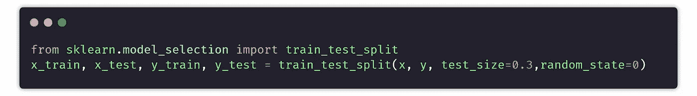

# 为机器学习准备数据的 7 个阶段

> 原文：<https://pub.towardsai.net/the-7-stages-of-preparing-data-for-machine-learning-dfe454da960b?source=collection_archive---------1----------------------->

## [机器学习](https://towardsai.net/p/category/machine-learning)

## 学会高效掌握每个阶段


由 [Justin Main](https://unsplash.com/@photified?utm_source=medium&utm_medium=referral) 在 [Unsplash](https://unsplash.com?utm_source=medium&utm_medium=referral) 上拍照

你可能已经知道数据是任何机器学习任务的关键。开始时，我们有数据被提取到一个算法中，该算法从数据中找到一些模式和有用的信息，并将所有的学习保存在一个模型中。所以机器学习是从数据开始的。在将数据提取到机器学习算法中之前，我们需要采取几个步骤来为建模准备数据。

# 0.网页抓取

第一步，找数据。有两种方法可以找到它——一种是你下载了网上搜集或整理的数据，或者是你自己搜集的数据。有一个较小的机会，你总是找到一个人把你的数据放在一个盘子里，只是拥有它。大多数时候你不得不做艰苦的工作来收集问题的数据。

Web 抓取是从不同站点抓取数据的过程。数据可以是文本、图像、链接和表格的形式。

python 中最好最简单的 web 抓取库之一是`BeautifulSoup`和`request`，两者结合在一起是一个很好的组合。

[](https://medium.com/pythoneers/master-web-scraping-completly-from-zero-to-hero-38051423256b) [## 网络抓取大师从零到英雄🕸

### 利用美汤和 3 个项目请求库

medium.com](https://medium.com/pythoneers/master-web-scraping-completly-from-zero-to-hero-38051423256b) 

# 1.创建单个数据帧

抓取数据后，下一步是将数据合并到单个数据框中，因为大多数情况下，您最终会得到多个抓取的文件。将数据合并到一个文件中的好处是，我们可以更快地进行分析，减少时间消耗。

有多种方法可以做到这一点，你可以尝试使用 excel 手动完成，但最有效和最快的方法之一是用 python 中的库`pandas`来完成。熊猫有两个功能`concat`和`merge`，在不同的用例中，都可以用来将两个数据帧合并成一个。

Concat 函数只是追加数据帧，并添加新的数据帧作为新的行和列。当两个数据框有相同的列时使用。另一方面，Merge 用于使用连接和键合并两个数据集。它主要用于根据一个公共键将两个数据集合并到一起。

样本数据集上的合并与串联示例

[](https://medium.com/pythoneers/pandas-handbook-for-beginners-in-10-minutes-721bd5d1fcf2) [## 10 分钟内为初学者提供熊猫手册

### 需要一本将来可以使用的熊猫手册👋

medium.com](https://medium.com/pythoneers/pandas-handbook-for-beginners-in-10-minutes-721bd5d1fcf2) 

# 2.处理缺失值

完成第二步后，我们已经完成了一个 CSV 文件，并将其加载到我们的笔记本中。接下来我们需要对数据进行预处理。预处理阶段的第一步是处理丢失的值。我们拥有的数据可能包含许多缺失值，为了将这些数据提取到机器学习模型中，我们需要处理它们。

缺失数据有三种类型—
1。**完全随机缺失(MCAR):** 缺失和观测数据之间没有关系。在这种情况下，我们可以简单地删除所有丢失的值。
2。**非随机缺失数据(MNAR):** 缺失数据和观测数据之间会有一定的关系。我们必须处理丢失的值，用其他值替换它们。
3。**随机缺失(MAR):** 表示数据点被遗漏的倾向与缺失数据无关，而与数据集中其他一些观察到的数据有关。它还需要处理数据。

我们有许多方法来处理缺失值，如用列的平均值/中值/众数替换缺失值、随机样本插补、将所有 NaN 作为新特征捕获、用第三个偏差值替换、用任意值(大多数情况下为 0 或 100)填充所有空值、使用 KNN 估算器等等。

[](/9-ways-to-handle-missing-values-in-machine-learning-1bbda345699a) [## 机器学习中处理缺失值的 9 种方法

### 简单但有效

pub.towardsai.net](/9-ways-to-handle-missing-values-in-machine-learning-1bbda345699a) 

# 3.处理分类数据

分类数据是一种包含标签值而非数值的变量。这些通常被称为名义。Ex:男，初一，纽约等。

每个 ML 新手都会想到一个常见的问题，当机器学习如此强大时，为什么我们需要在特征工程上花费大量时间。答案很简单，每个机器学习算法都是基于一些数学概念，你知道数学只对数字数据起作用。

为了将分类数据处理成数字数据，我们将其编码成数值。编码主要有三种类型—
1。**名义编码**:当数据没有固有顺序时使用。包含像 one-hot 编码(两个特性，多个特性)，mean 编码这样的编码。
2。**顺序编码**:当数据有固有顺序时使用。它包含标签编码、目标导向编码等方法。
3。**计数编码:**我们用它们的计数**替换分类值。**

[](/different-approaches-to-handle-categorical-values-a2e35fbd6128) [## 处理分类值的不同方法

### 特征工程第二部分

pub.towardsai.net](/different-approaches-to-handle-categorical-values-a2e35fbd6128) 

# 4.分配

大多数数据科学家将采取的下一步是检查数据的分布。了解后续步骤的数据分布非常重要。

主要有六种类型的数据分布。—伯努利分布、均匀分布、二项式分布、正态分布、泊松分布和指数分布。

每个数据的分布都是不同的，需要不同的方法进行预处理。最佳分布是正态分布。否则，每隔一个分布都需要根据问题转换成正态分布。

你可以查看 Pier Paolo Ippolito 关于数据科学中不同概率分布的这篇文章。

[](https://towardsdatascience.com/probability-distributions-in-data-science-cce6e64873a7) [## 数据科学中的概率分布

### 介绍数据科学中一些最常用的概率分布，并附有实际例子。

towardsdatascience.com](https://towardsdatascience.com/probability-distributions-in-data-science-cce6e64873a7) 

# 5.处理异常值

异常值是与样本的其余部分显著不同的异常数据点。这些点离其他类似的点很远。例如，如果我们分析一所学校学生的年龄数据。在这些数据中，年龄通常在 5-25 岁之间，但如果有 50 或 100 岁的数据点，则属于异常值。这可能是由于数据收集或输入验证中的某些错误造成的。

一个糟糕的机器学习模型的原因之一是，它是在有如此多离群值的数据上训练的。离群值很容易影响模型的性能。

离群值分为三部分—
1 .**点或全局异常值:**数据点值远在整个数据集之外。

2.**上下文(条件)异常值:**如果一个单独的数据实例在特定的上下文或条件下是异常的，那么它被称为上下文异常值。

3.**集体异常值:**当数据点的集合对于整个数据集是异常的时，值本身不是异常的。

我们可以使用两种方法来处理异常值——完全删除它们，用合适的值替换异常值。该值可以是 IQR 或分位数值。

[](/handling-outliers-in-machine-learning-f842d8f4c1dc) [## 机器学习中异常值的处理

### 简单且易于实施的方法

pub.towardsai.net](/handling-outliers-in-machine-learning-f842d8f4c1dc) 

# 6.特征变换和缩放

特征变换只是将特征从一种表示形式变换到另一种表示形式的函数。要素缩放是一种转换同一范围内要素的所有值的技术。例如，0 到 1

当您有两个不同单位的列时，考虑要素转换是很重要的，例如一个列以 km 为单位，另一个列以米或厘米为单位。另一方面，当您有两个不同范围的列时，例如年龄列的范围从 1 到 100，薪金列的范围从 10000 到 50000，要素缩放是很重要的。在这些类型的场景中，**值越大的列对输出的影响越大。**

有许多特征缩放和变换技术，如最小-最大缩放器、标准缩放器、最大绝对值缩放器、鲁棒缩放器等等。

[](/feature-transformation-and-scaling-techniques-f9645cb538e) [## 特征变换和缩放技术

### 提高机器学习模型性能的 9 种方法

pub.towardsai.net](/feature-transformation-and-scaling-techniques-f9645cb538e) 

此外，不需要对您使用的每个算法执行特征缩放。许多算法不需要特征缩放。


[来源](https://i.stack.imgur.com/kRbSk.png)

# 7.数据分割和特征选择

数据拆分是将可用数据分成两部分的过程。一部分用于创建称为训练集的预测模型，另一部分用于评估称为测试集的模型。数据分割的主要原因是为了避免过度拟合。您可以通过使用 pandas `iloc`函数自己拆分数据，但更有效的方法是使用 Scikit-Learn 库中可用的函数`train_test_split()`。



完成数据分割后，下一步是减少一些过多的要素。

特征选择方法用于减少模型的输入数量。它旨在只选择那些对预测模型输出最有用的特征。例如，如果模型试图根据一个人的经验来预测他的工资，那么这个人的姓名和地址对于产生工资数字并不重要，因此最好将其删除。

[](https://github.com/Abhayparashar31/feature-engineering) [## abhayparashar 31/特征工程

### 有助于功能工程的笔记本集合…

github.com](https://github.com/Abhayparashar31/feature-engineering) 

> *感谢阅读，可以关注*[*Me*](https://abhayparashar31.medium.com/)*For*[*更多*](http://medium.com/pythoneers) *这里。*

# 作者✍的一些精选文章

```
[**A Quick Look At The Object Oriented Programming In Python**](https://medium.com/pythoneers/a-quick-look-at-object-oriented-programming-oop-in-python-975fc3cb9618)[**10 Advance Python Concepts To Level Up Your Python Skills**](https://levelup.gitconnected.com/10-advance-python-concepts-to-level-up-your-python-skills-da3d6284ad53)[**10 Facts You didn't Know About Python**](https://medium.com/pythoneers/10-facts-you-didnt-know-about-python-b18d87529c23)[**10 Python Tricks For Speed Up Your Code**](https://levelup.gitconnected.com/10-python-tricks-for-speed-up-your-code-8c189d8c99b6)[**10 Must Known Build In Functions In Python**](https://medium.com/pythoneers/10-must-known-built-in-functions-in-python-2f196b9c0359)[**15 Python Packages You Probably didn't know Existed**](https://medium.com/pythoneers/15-python-packages-you-probably-dont-know-exits-aef0525a965f)[**The 7 Stages For Preparing Data For Machine Learning**](/the-7-stages-of-preparing-data-for-machine-learning-dfe454da960b)
```