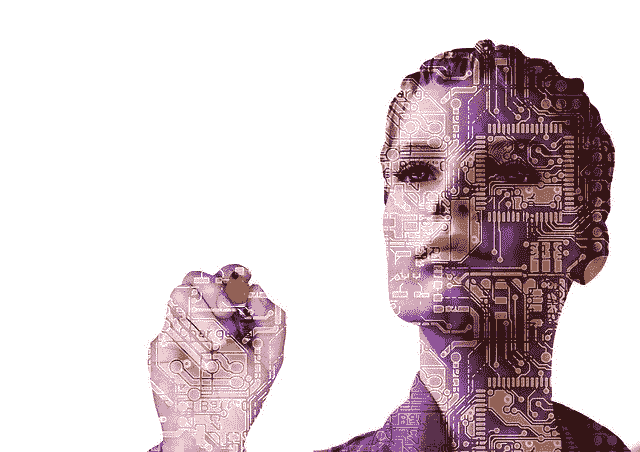

# 人工智能(AI)的先进时代:AI 现在将把你的思想转化为文本

> 原文：<https://pub.towardsai.net/the-advanced-era-of-artificial-intelligence-ai-ai-will-now-transform-your-thoughts-into-texts-d46592514970?source=collection_archive---------3----------------------->

最近，来自旧金山加利福尼亚大学的 Joseph Makin 和研究人员开发了一个系统，他们在《自然神经科学》杂志上公布了他们的发现。

一个非常令人印象深刻和惊人的突破可能就在眼前！人工智能有如此多的改进和发现，语音识别不再是让人类敬畏的事情。这个由研究人员开发的系统可以通过研究神经活动或思想来构建完整的句子，最好是在没有人说话的情况下！

在过去的十年里，脑-机-接口领域有了巨大的飞跃。机器能读懂人类思想的未来就在眼前！

# 这个系统是如何工作的？

在解释了这一过程后，研究人员称他们招募了 4 名患有癫痫的女性，并在她们的大脑中植入了电极阵列来监测癫痫发作。在这项活动中，这些参与者必须大声朗读并重复一组句子，其中包括“蒂娜·特纳是一名流行歌手”、“那些小偷偷了 30 件珠宝”等句子，同时神经活动由电极记录下来，并由一组研究人员进行监控。然后，这些数据被输入机器学习算法，训练它识别重复模式，这些重复模式可能与语音的重复方面(如元音或辅音)有关。这种算法将输入的数据转换成一串数字。然后，这些数据被输入到另一个神经网络中，后者将这些数据转换成文字。起初，算法产生了不正确的结果。然而，观察到了逐渐的改善。

“记忆这些句子的大脑活动不会有帮助，所以网络必须学习它们的相似之处，以便可以归纳到最后一个例子中，”Makin 说。在 4 名参与者中，翻译的平均错误率被观察到为 3%，这是 AI 的最佳表现。观察到的错误如下:“蛋糕的一部分被狗吃了”被预测为“蛋糕的一部分是饼干”；“蒂娜·特纳是个流行歌手”变成了“特纳是个流行歌手吗？”

网络试图识别一个接一个出现的单词模式。根据输入的数据，人工智能神经网络训练自己识别“特纳”这个词将总是跟在“蒂娜”后面。这使得系统很难扩大规模，因为随着词汇量的增加，可能的句子数量增加，准确性降低。

然而，一组 250 个独特的单词仍然可以服务于在有语言残疾的患者中部署该系统的目的。

没有参与这项研究的马斯特里赫特大学的该领域专家克里斯蒂安·赫夫(Christian Herff)告诉《卫报》，“这项研究令人兴奋，因为该系统对每个参与者使用了不到 40 分钟的训练数据和少量句子，而不是通常需要的数百万小时。”

“通过这样做，他们达到了迄今为止从未达到过的精确度，”他说。

旧金山加利福尼亚大学的约瑟夫·马金博士说:“我们还没有达到这一步，但我们认为这可能是言语假体的基础。”

