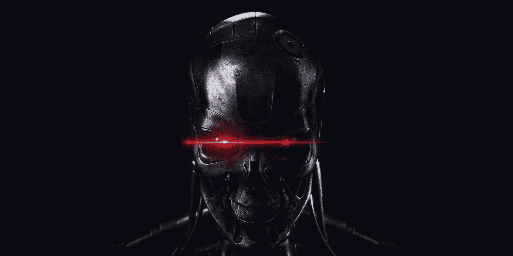
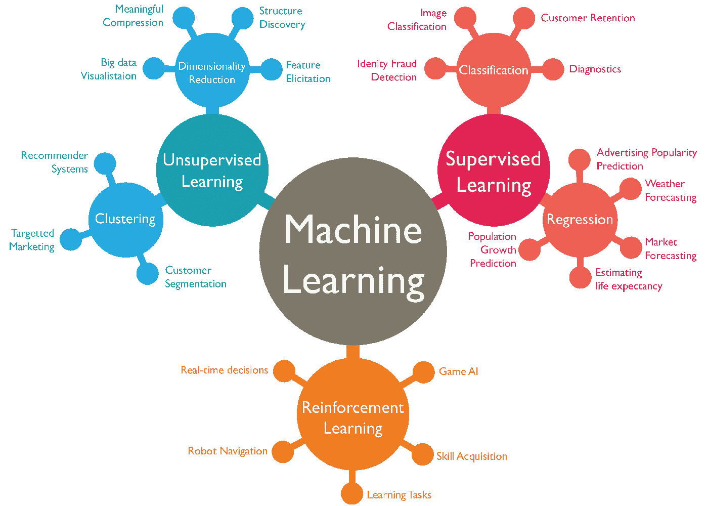
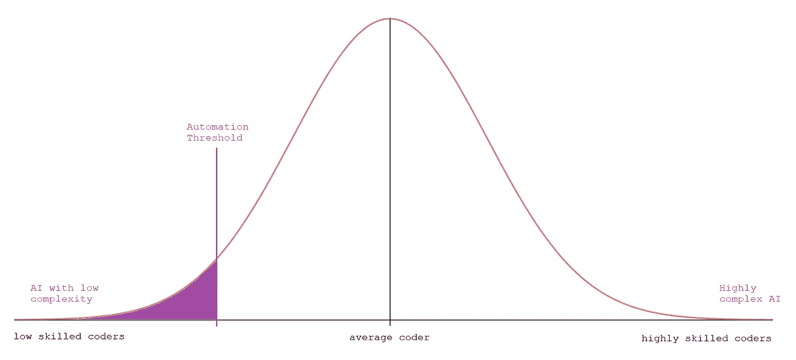

# 人工智能的破坏已经开始了

> 原文：<https://pub.towardsai.net/the-ai-disruption-is-starting-already-cd1a00e38148?source=collection_archive---------1----------------------->

## [人工智能](https://towardsai.net/p/category/artificial-intelligence)，[观点](https://towardsai.net/p/category/opinion)

一场我的颠覆**已经开始**。看看 autoML 或 Lobe 之类的工具。他们将很快吃掉处于能力分布低端的 ML 工程师的需求。

不久前，我发表了一篇文章，说: [AI 还没有准备好颠覆](https://medium.com/towards-artificial-intelligence/the-ai-industry-is-not-ready-for-disruption-bf4636383b97)。我的意思是，这个行业非常复杂，在达到可能发生大规模破坏的程度之前，仍有太多方面需要考虑。

然而，这并不意味着由工程师执行的更直接的人工智能任务不能自动化，行业被部分扰乱。

# AutoML

AutoML 是一个工具，它能够对每一个机器学习算法进行调整，直到它没有找到数据集的最佳拟合(没有过度拟合，否则将毫无意义)。它需要的只是特征和标签:X 和 y。

然而，人工智能工程师仍然需要执行特征选择，以向 AutoML 提供有效数据(目前)。

当然，执行来自算法的如此苛刻的请求(检查每一个机器学习算法，直到找到最佳匹配)需要大量的计算能力。

因为可用的计算能力只能以稳定的速度增长，根据摩尔定律，这个过程将随着时间的推移变得更快、更便宜。

摩尔定律的计算能力估算(黑线)与现实(黑点)

例如，在 AutoML GitHub 简介上，适合一个中等大小数据集的估计时间(很抱歉我找不到更精确的规格)大约是 1 小时。有了更强大的 GPU，AutoML 所需的时间将大幅减少，使其看起来像是机器学习工程师的有效商业替代方案。

## 标准程序

训练机器学习模型的标准过程需要一个工程师，他具有统计学和应用程序设计的良好知识，能够在众多可用的 ML 工具中选择最佳的 ML 工具。

[https://wordstream-files-prod . S3 . Amazon AWS . com/s3fs-public/machine-learning . png](https://wordstream-files-prod.s3.amazonaws.com/s3fs-public/machine-learning.png)

## 自动程序

AutoML 扰乱 ML 算法选择。它介于两者之间，避免了选择正确模型的需要。即使预处理数据集(选择正确的数据、取消选择其余的数据、插值缺失的值……)需要大量时间，选择正确的模型也是最终决定模型性能的因素。

当还是初学者时，人工智能开发人员通常做的是尝试每一种可能的模型(使用他们自己的默认设置，通常甚至不接触超参数)并比较他们的结果。这需要专家来选择正确的模型，并以正确的方式进行调整。这就是 AutoML 等工具所能破坏的。

# 裂片

Lobe 是一个工具，现在由微软赞助，它试图在不需要编码的情况下自动创建深度学习模型。众所周知，适应神经网络来解决非常复杂的问题一直需要工程师的干预，然而，至少对于不太复杂的问题，有兴趣将 AI 实现到自己的产品中的人将能够不用太多的努力就能自己完成。

# 行业预测

我们已经看到，人工智能的某些方面已经成为自动化的目标。与此同时，自动化可能需要几年时间才能推出，功能齐全，价格实惠(希望每种型号的价格都更低)。

## 如果出现中断，员工会怎么样？

这是我对未来几年的估计。随着 GPU 性能的提高和新的自动化工具，对低技能(这取决于我们在哪里设置阈值)机器学习工程师的需求将会下降。