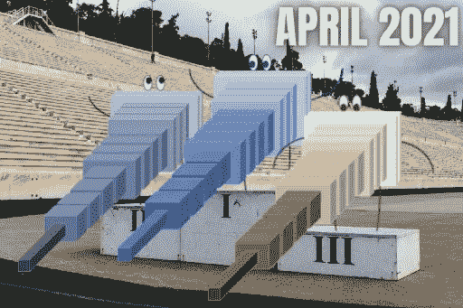

# 人工智能月度前三名—2021 年 4 月

> 原文：<https://pub.towardsai.net/the-ai-monthly-top-3-april-2021-dccefe8fa20a?source=collection_archive---------4----------------------->

## [人工智能](https://towardsai.net/p/category/artificial-intelligence)

## 2021 年 4 月人工智能和数据科学最新突破的精选列表，带有清晰的视频解释、更深入文章的链接和代码(如果适用)

> 原载于 [louisbouchard.ai](https://www.louisbouchard.ai/the-ai-monthly-top-3-april-2021/) ，前两天在[我的博客](https://www.louisbouchard.ai/tag/artificial-intelligence/)上看到的！

如果你错过了其中的任何一篇，这里有 3 篇本月最有趣的研究论文。这是一个按发布日期排列的人工智能和数据科学最新突破的精选列表，带有清晰的视频解释、更深入文章的链接和代码(如果适用)。享受阅读的乐趣，如果我错过了任何重要的论文，请在评论中告诉我，或者直接通过 LinkedIn[联系我](https://www.linkedin.com/in/whats-ai/)！

# 论文#1:

## 从图像创建三维模型！GANverse3D 和 NVIDIA Omniverse [1]

这个被称为 GANverse3D 的有前途的模型只需要一个图像就可以创建一个可以定制和动画的 3D 人物！

## 观看视频

## 简短阅读版本

 [## 从图像创建三维模型！GANverse3D 和 NVIDIA Omniverse

### 人工智能这个被称为 GANverse3D 的有前途的模型只需要一个图像就可以创建一个 3D 图形，可以…

www.louisbouchard.me](https://www.louisbouchard.me/ganverse3d/) 

# 论文#2:

## AI 在计算机视觉中处于什么状态？[2]

我将公开分享关于视觉应用深度网络的一切，它们的成功，以及我们必须解决的局限性。

## 观看视频

## 简短阅读版本

 [## AI 在计算机视觉中处于什么状态？

### 人工智能我将公开分享关于视觉应用深度网络的一切，它们的成功，以及…

www.louisbouchard.me](https://www.louisbouchard.me/ai-in-computer-vision/) 

# 论文#3:

## 无限的自然:飞入影像，探索风景[3]

视图合成的下一步:永久视图生成，目标是拍摄一幅图像，然后飞进去探索风景！

## 观看视频

## 简短阅读版本

 [## 无限自然:飞入一幅图像，探索风景

### 人工智能视图合成的下一步:永久视图生成，目标是拍摄图像…

www.louisbouchard.me](https://www.louisbouchard.me/infinite-nature/) 

代码:[https://github.com/microsoft/Swin-Transformer](https://github.com/google-research/google-research/tree/master/infinite_nature)[Colab demo](https://colab.research.google.com/github/google-research/google-research/blob/master/infinite_nature/infinite_nature_demo.ipynb#scrollTo=sCuRX1liUEVM)你现在就可以试试！

# 奖励纸:

# 一个有人工智能手的截肢者！🦾[Bonus]

有了这个人工智能驱动的神经接口，截肢者可以像生活一样灵活和直观地控制神经假体手。

## 观看视频

## 简短阅读版本

 [## 一个有人工智能手的截肢者！🦾

### 人工智能通过这种人工智能驱动的神经接口，截肢者可以用…

www.louisbouchard.me](https://www.louisbouchard.me/an-amputee-with-an-ai-powered-hand/) 

如果你喜欢我的工作，并想与人工智能保持同步，你绝对应该关注我的其他社交媒体账户( [LinkedIn](https://www.linkedin.com/in/whats-ai/) 、 [Twitter](https://twitter.com/Whats_AI) )并订阅我的每周人工智能[简讯](http://eepurl.com/huGLT5) ！

## 支持我:

*   支持我的最好方式是在[**Medium**](https://medium.com/@whats-ai)**上关注我，或者如果你喜欢视频格式，在[**YouTube**](https://www.youtube.com/channel/UCUzGQrN-lyyc0BWTYoJM_Sg)**上订阅我的频道。****
*   ****支持我在 [**上的工作**](https://www.patreon.com/whatsai)****
*   ****加入我们的 [**Discord 社区:** **一起学 AI**](https://discord.gg/learnaitogether)和*分享你的项目、论文、最佳课程、寻找 Kaggle 队友等等！*****

## ****参考****

****[1]张等，(2020)，“图像满足逆图形的可微绘制和可解释的三维神经绘制”:[、](https://arxiv.org/pdf/2010.09125.pdf)****

****[2]尤耶和刘，2021 年。[深网:他们为视觉做过什么？](https://arxiv.org/abs/1805.04025)。《国际计算机视觉杂志》，129(3)，第 781–802 页，[https://arxiv.org/abs/1805.04025](https://arxiv.org/abs/1805.04025)。****

****[3]刘，a .，塔克，r .，贾帕尼，v .，马卡迪亚，a .，斯内夫利，n .，金泽，a .，2020。无限自然:从单一图像生成自然场景的永久视图，[https://arxiv.org/pdf/2012.09855.pdf](https://arxiv.org/pdf/2012.09855.pdf)****

****[奖金] Nguyen & Drealan 等人(2021)一种便携式、自给自足的神经假体手，具有基于深度学习的手指控制:[https://arxiv.org/abs/2103.13452](https://arxiv.org/abs/2103.13452)****