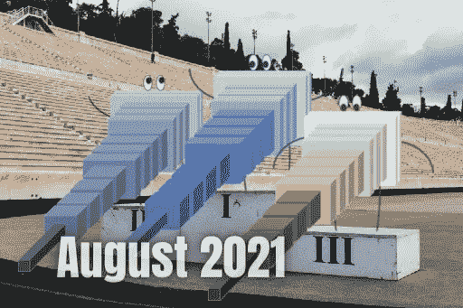

# 人工智能月度前三名—2021 年 8 月

> 原文：<https://pub.towardsai.net/the-ai-monthly-top-3-august-2021-5fbf8352f73c?source=collection_archive---------3----------------------->

## [简讯](https://towardsai.net/p/category/newsletter)

## 本月 3 篇最有趣的人工智能论文，包括视频演示、短文、代码和论文参考。

> 原载于 [louisbouchard.ai](https://www.louisbouchard.ai/tag/state-of-ai/) ，前两天在[我的博客](https://www.louisbouchard.ai/tag/state-of-ai/)上看到的！

如果你错过了其中的任何一篇，这里有 3 篇本月最有趣的研究论文。它是按发布日期排列的人工智能和数据科学的**最新突破的精选列表，带有**清晰的视频解释**、**指向更深入文章的链接**和**代码**(如果适用)。享受阅读，如果我错过了任何重要的论文，请在评论中告诉我，或者直接在 [LinkedIn](https://www.linkedin.com/in/whats-ai/) 上联系我！**

如果你也想阅读更多的研究论文，我推荐你阅读我的文章**，在那里我分享了寻找和阅读更多研究论文的最佳技巧。**

> **跟着我上[媒](https://whats-ai.medium.com/)看这个 AI top 3 月度！**

# **论文#1:**

## **来自草图的图像合成和编辑:SDEdit。不再需要繁琐的培训！[1]**

**告别复杂的 GAN 和变压器架构，实现图像生成！斯坦福大学和卡耐基梅隆大学的孟等人提出的这种新方法可以从任何基于用户的输入中生成新图像。即使像我这样没有艺术技巧的人，现在也可以从快速草图中生成美丽的图像或修改…**

## **观看视频**

## **简短阅读版本**

** [## 从草图合成和编辑图像。不再需要繁琐的培训！

### 人工智能告别复杂的 GAN 和变压器架构进行图像生成。这种新方法…

www.louisbouchard.ai](https://www.louisbouchard.ai/image-synthesis-from-sketches/) 

代号:[https://github.com/ermongroup/SDEdit](https://github.com/ermongroup/SDEdit)** ****

# **论文#2:**

## **[让 GANs 训练对每个人都更容易:根据草图生成图像【2】](https://arxiv.org/pdf/2108.02774v1.pdf)**

**通过根据草图生成图像，使 GANs 训练对每个人来说都更容易！事实上，有了这种新方法，你可以根据你能提供的最简单的知识类型来控制你的 GAN 的输出:手绘草图。**

## **观看视频**

## **简短阅读版本**

** [## 让 GANs 训练对每个人都更容易:根据草图生成图像

### 人工智能控制 GANs 输出基于你能提供的最简单的知识类型:手绘…

www.louisbouchard.ai](https://www.louisbouchard.ai/make-gans-training-easier/) 

代号:[https://github.com/PeterWang512/GANSketching](https://github.com/PeterWang512/GANSketching)** 

# **应用#3:**

## **特斯拉的自动驾驶解释！10 分钟后特斯拉艾天**

**如果你想知道特斯拉汽车如何不仅能看到其他车辆，还能在道路上导航，这就是你一直在等待的视频。几天前是第一个特斯拉人工智能日，特斯拉人工智能总监 Andrej Karpathy 和其他人展示了特斯拉的自动驾驶仪如何通过他们的八个摄像头进行图像采集，以及在道路上的导航过程。**

**本周，我报道了 Andrej Karpathy 在特斯拉人工智能日关于特斯拉自动驾驶仪如何工作的演讲。**

## **观看视频**

## **简短阅读版本**

** [## 特斯拉的自动驾驶解释！10 分钟后特斯拉 AI 日

### 人工智能安德烈·卡帕西(Andrej Karpathy)关于特斯拉自动驾驶仪的演讲在不到 10 分钟的时间里解释得很清楚，如果你想知道…

www.louisbouchard.ai](https://www.louisbouchard.ai/tesla-autopilot-explained-tesla-ai-day/)** 

> **关注我在[中](https://whats-ai.medium.com/)看这个 AI top 3 月刊！**

**如果你喜欢我的工作，并想与人工智能保持同步，你绝对应该在我的其他社交媒体账户( [LinkedIn](https://www.linkedin.com/in/whats-ai/) 、 [Twitter](https://twitter.com/Whats_AI) )上关注我，并订阅我的每周人工智能 [**简讯**](http://eepurl.com/huGLT5) ！**

## **支持我:**

*   **支持我的最好方式是在 [**媒体**](https://medium.com/@whats-ai) 上关注我，或者如果你喜欢视频格式，在[**YouTube**](https://www.youtube.com/channel/UCUzGQrN-lyyc0BWTYoJM_Sg)**上订阅我的频道。****
*   ****支持我在 [**Patreon**](https://www.patreon.com/whatsai) **上的工作。******
*   ****加入我们的 [**Discord 社区:** **一起学习 AI**](https://discord.gg/learnaitogether)和*分享你的项目、论文、最佳课程、寻找 Kaggle 队友等等！*****

# ****参考****

****[1] SDEdit，孟等著，2021，[著](https://arxiv.org/pdf/2108.01073.pdf)****

****[2]盛-等著，《素描你自己的甘》，2021 年，****

****[3]“特斯拉 AI 日”，特斯拉，2021 年 8 月 19 日，[https://youtu.be/j0z4FweCy4M](https://youtu.be/j0z4FweCy4M)****