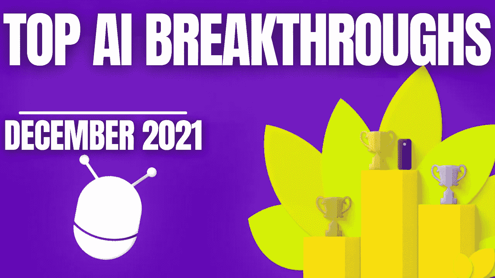

# 人工智能月度前三名—2021 年 12 月

> 原文：<https://pub.towardsai.net/the-ai-monthly-top-3-december-2021-4791dee63e31?source=collection_archive---------3----------------------->

## [社论](https://towardsai.net/p/category/editorial)

## 12 月最有趣的人工智能突破，包括视频演示、短文、代码和论文参考。

> 原载于 [louisbouchard.ai](https://www.louisbouchard.ai/the-ai-monthly-top-3-december-2021/) ，前两天在[我的博客](https://www.louisbouchard.ai/the-ai-monthly-top-3-december-2021/)上看到的！

如果你错过了其中的任何一篇，这里有 3 篇本月最有趣的研究论文。它是按发布日期排列的人工智能和数据科学的**最新突破的精选列表，带有**清晰的视频解释**、**指向更深入文章的链接**和**代码**(如果适用)。享受阅读，如果我错过了任何重要的论文，请在评论中告诉我，或者直接在 [LinkedIn](https://www.linkedin.com/in/whats-ai/) 上联系我！**

如果你也想阅读更多的研究论文，我推荐你阅读我的文章**，在那里我分享了寻找和阅读更多研究论文的最佳技巧。**

> ***关注我上* [*中*](https://whats-ai.medium.com/membership) *看这个 AI top 3 月！***

# **论文#1:**

## **[EditGAN:高精度语义图像编辑[1]](https://arxiv.org/abs/2111.03186)**

**控制快速草稿中的任何功能，它将只编辑你想要的，保持图像的其余部分不变！NVIDIA，MIT 和 UofT 基于 GANs 的草图模型的 SOTA 图像编辑。**

## **观看视频**

## **简短阅读版本**

** [## 从草图编辑图像:EditGAN

### 控制快速草稿中的任何功能，它将只编辑你想要的，保持图像的其余部分不变！SOTA…

pub.towardsai.net](/image-editing-from-sketches-editgan-4cacca609e2d) 

[代码](https://nv-tlabs.github.io/editGAN/)

**

# **论文#2:**

## **[城市 NeRF:城市规模的建筑 NeRF[2]](https://arxiv.org/pdf/2112.05504.pdf)**

**这个模型被称为 CityNeRF，它是从 NeRF 发展而来的，我之前在我的频道中介绍过。NeRF 是首批使用辐射场和机器学习从图像中构建 3D 模型的模型之一。但是 NeRF 并不是那么有效，而且只适用于单一规模。在这里，CityNeRF 同时应用于卫星和地面图像，为任何视点生成各种 3D 模型比例。简而言之，他们将 NeRF 带到了城市规模。但是怎么做呢？**

## **观看视频**

## **简短阅读版本**

** [## CityNeRF:城市比例的 3D 渲染！

### 以任何比例生成具有高质量细节的城市级 3D 场景！

pub.towardsai.net](/technology-fcb0fbfa9c00) 

[代码](https://city-super.github.io/citynerf/)** 

# **论文#3:**

## **[ClipCap:图像字幕的剪辑前缀[3]](https://arxiv.org/abs/2111.09734)**

**我们已经看到人工智能使用 GANs 从其他图像生成图像。然后，有模型能够使用文本生成有问题的图像。2021 年初， [DALL-E](/openais-dall-e-text-to-image-generation-explained-1f6fb4bb5a0a?source=your_stories_page----------------------------------------) 发布，击败了之前所有使用 CLIP 从文本输入中生成图像的尝试，CLIP 是一种以文本为导向链接图像的模型。一个非常相似的任务叫做图像字幕，听起来可能很简单，但实际上也很复杂。它是机器生成图像的自然描述的能力。**

**简单地标记你在图像中看到的物体是很容易的，但要理解在一张二维图像中发生的事情却是另一个挑战，这个新模型做得非常好！**

## **观看视频**

## **简短阅读版本**

** [## 带剪辑和 GPT 的图像字幕

### 使用剪辑和 GPT 模型轻松生成图像的文本描述！

pub.towardsai.net](/image-captioning-with-clip-and-gpt-d0cb3f3fddda) 

[代码](https://github.com/rmokady/CLIP_prefix_caption)

[Colab 演示](https://colab.research.google.com/drive/1tuoAC5F4sC7qid56Z0ap-stR3rwdk0ZV?usp=sharing)** 

**如果你喜欢我的工作，并想了解人工智能的最新动态，你绝对应该关注我的其他社交媒体账户( [LinkedIn](https://www.linkedin.com/in/whats-ai/) ， [Twitter](https://twitter.com/Whats_AI) )，并订阅我的每周人工智能 [**简讯**](http://eepurl.com/huGLT5) ！**

## **支持我:**

*   **支持我的最好方式是在 [**媒体**](https://whats-ai.medium.com/membership) 上关注我，或者如果你喜欢视频格式，在[**YouTube**](https://www.youtube.com/channel/UCUzGQrN-lyyc0BWTYoJM_Sg)**上订阅我的频道。****
*   ****支持我在 [**Patreon**](https://www.patreon.com/whatsai) **上的工作。******
*   ****加入我们的 [**Discord 社区:** **一起学习 AI**](https://discord.gg/learnaitogether)和*分享你的项目、论文、最佳课程、寻找 Kaggle 队友等等！*****
*   ****这里是我作为一名研究科学家每天用来寻找和阅读人工智能研究论文的最有用的工具… [在这里阅读更多。](https://www.louisbouchard.ai/research-papers/)****

# ****参考****

****[1] Ling，h .，Kreis，k .，Li，d .，Kim，S.W .，Torralba，a .和 Fidler，s .，2021 年 5 月。EditGAN:高精度语义图像编辑。在第三十五届神经信息处理系统会议上。****

****[2]，杨，徐，李，潘，徐，赵，饶，李，戴，林，2021 .城市 NeRF:在城市尺度上建造 NeRF。****

****[3]莫凯迪、赫兹和伯尔曼诺，2021 年。ClipCap:图像字幕的剪辑前缀。[https://arxiv.org/abs/2111.09734](https://arxiv.org/abs/2111.09734)****