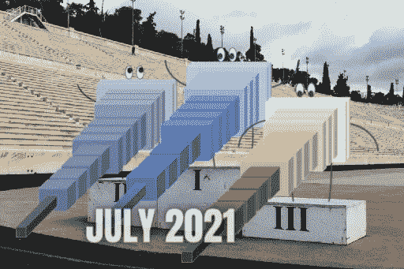

# 人工智能月度前三名—2021 年 7 月

> 原文：<https://pub.towardsai.net/the-ai-monthly-top-3-july-2021-22e84f306217?source=collection_archive---------4----------------------->

## [研究](https://towardsai.net/p/category/research)

## 本月 3 篇最有趣的人工智能论文，包括视频演示、短文、代码和论文参考。

> 原载于 [louisbouchard.ai](https://www.louisbouchard.ai/tag/state-of-ai/) ，前两天在[我的博客](https://www.louisbouchard.ai/tag/state-of-ai/)上看到的！

如果你错过了其中的任何一篇，这里有 3 篇本月最有趣的研究论文。它是按发布日期排列的人工智能和数据科学的**最新突破的精选列表，带有**清晰的视频解释**、**指向更深入文章的链接**和**代码**(如果适用)。享受阅读，如果我错过了任何重要的论文，请在评论中告诉我，或者直接在 [LinkedIn](https://www.linkedin.com/in/whats-ai/) 上联系我！**

如果你也想阅读更多的研究论文，我推荐你阅读我的文章**，在那里我分享了寻找和阅读更多研究论文的最佳技巧。**

> **跟着我上[媒](https://whats-ai.medium.com/)看这个 AI top 3 月度！**

# **论文#1:**

## **[CVPR 2021 年最佳论文奖:长颈鹿可控图像生成[1]](https://m-niemeyer.github.io/project-pages/giraffe/index.html)**

**使用改进的 GAN 架构，他们可以移动图像中的对象，而不会影响背景或其他对象！**

## **观看视频**

## **简短阅读版本**

** [## CVPR 2021 最佳论文奖:长颈鹿可控图像生成

### 人工智能采用改良的 GAN 架构，它们可以在不影响图像的情况下移动物体…

www.louisbouchard.ai](https://www.louisbouchard.ai/cvpr-2021-best-paper/) 

代号:[https://github.com/autonomousvision/giraffe](https://github.com/autonomousvision/giraffe)** ****

# **论文#2:**

## **[OpenAI 的新代码生成器:GitHub Copilot(和 Codex) |这个 AI 从单词中生成代码【2】](https://arxiv.org/pdf/2107.03374.pdf)**

**了解 OpenAI 的这个新模型如何从单词生成代码！**

## **观看视频**

## **简短阅读版本**

** [## OpenAI 的新代码生成器:GitHub Copilot(和 Codex)

### 人工智能了解这种人工智能如何从你可能听说过的最近的 Copilot 工具中生成代码…

www.louisbouchard.ai](https://www.louisbouchard.ai/github-copilot/) 

代号:[https://copilot.github.com/](https://copilot.github.com/)** 

# **论文#3:**

## **【Apple Photos 如何使用机器学习识别私人照片中的人【3】**

**使用多种基于机器学习的算法在你的设备上私下运行，苹果允许你在 iOS 15 上准确地管理和组织你的图像和视频。**

## **观看视频**

## **简短阅读版本**

** [## Apple Photos 如何使用机器学习识别私人照片中的人

### 人工智能使用多种基于机器学习的算法在你的设备上私下运行，苹果允许…

www.louisbouchard.ai](https://www.louisbouchard.ai/how-apple-photos-recognizes-people/)** 

> **关注我在[中](https://whats-ai.medium.com/)看这个 AI top 3 月刊！**

**如果你喜欢我的工作，并想与人工智能保持同步，你绝对应该在我的其他社交媒体账户( [LinkedIn](https://www.linkedin.com/in/whats-ai/) 、 [Twitter](https://twitter.com/Whats_AI) )上关注我，并订阅我的每周人工智能 [**简讯**](http://eepurl.com/huGLT5) ！**

## **支持我:**

*   **支持我的最好方式是在 [**媒体**](https://medium.com/@whats-ai) 上关注我，或者如果你喜欢视频格式，在[**YouTube**](https://www.youtube.com/channel/UCUzGQrN-lyyc0BWTYoJM_Sg)**上订阅我的频道。****
*   ****支持我在 [**Patreon**](https://www.patreon.com/whatsai) **上的工作。******
*   ****加入我们的 [**Discord 社区:** **一起学 AI**](https://discord.gg/learnaitogether)和*分享你的项目、论文、最佳课程、寻找 Kaggle 队友等等！*****

# ****参考****

****[1] Michael Niemeyer 和 Andreas Geiger，(2021)，“长颈鹿:将场景表示为合成生成神经特征场”，发表于 CVPR 2021 年。****

****[2] OpenAI 的 Codex/copilot 论文:【https://arxiv.org/pdf/2107.03374.pdf ****

****[3]苹果，“通过私有的设备上机器学习识别照片中的人”，(2021)，[https://Machine Learning . Apple . com/research/recognized-People-Photos](https://machinelearning.apple.com/research/recognizing-people-photos)****

 ****[## 中等

### 编辑描述

whats-ai.medium.com](https://whats-ai.medium.com/subscribe)****