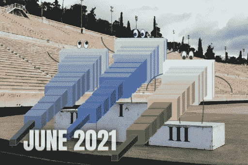

# 人工智能月度前三名—2021 年 6 月

> 原文：<https://pub.towardsai.net/the-ai-monthly-top-3-june-2021-2a3c0170f240?source=collection_archive---------4----------------------->

## [研究](https://towardsai.net/p/category/research)

## 本月 3 篇最有趣的人工智能论文，包括视频演示、短文、代码和论文参考。

> 原载于 [louisbouchard.ai](https://www.louisbouchard.ai/tag/state-of-ai/) ，前两天在[我的博客](https://www.louisbouchard.ai/tag/state-of-ai/)上看到的！

如果你错过了其中的任何一篇，这里有 3 篇本月最有趣的研究论文。它是按发布日期排列的人工智能和数据科学的**最新突破的精选列表，带有**清晰的视频解释**、**指向更深入文章的链接**和**代码**(如果适用)。享受阅读，如果我错过了任何重要的论文，请在评论中告诉我，或者直接在 [LinkedIn](https://www.linkedin.com/in/whats-ai/) 上联系我！**

如果你也想阅读更多的研究论文，我推荐你阅读我的文章**，在那里我分享了寻找和阅读更多研究论文的最佳技巧。**

> **跟着我上[媒](https://whats-ai.medium.com/)看这个 AI top 3 月度！**

# **论文#1:**

## **[DefakeHop:一种轻量级高性能 Deepfake 检测器[1]](https://arxiv.org/abs/2103.06929)**

**2021 年如何识破深度假？突破性的美国陆军技术使用人工智能寻找 deepfakes。**

**虽然它们似乎一直都在那里，但第一个现实的 deepfake 直到 2017 年才出现。它从有史以来第一个自动生成的相似的假图像发展到今天的带有声音的视频中的一模一样的某人的复制品。**

**事实是，我们再也看不出真正的视频或图片与假的之间的区别了。我们如何区分什么是真实的，什么不是？如果一个人工智能可以完全生成音频文件或视频文件，它们如何在法庭上用作证据？那么，这篇新论文可能会提供这些问题的答案。这里的答案可能再次是人工智能的使用。“当我看到它时我会相信它”这句话可能很快就会变成“当人工智能告诉我相信它时我会相信它…”**

## **观看视频**

## **简短阅读版本**

** [## 2021 年如何识破深度假

### 突破性的美国陆军技术使用人工智能寻找 deepfakes。

pub.towardsai.net](/how-to-spot-a-deep-fake-in-2021-3067ebb218fe)** ****

# **论文#2:**

## **[Barbershop:使用分段掩模的基于 GAN 的图像合成[2]](https://arxiv.org/pdf/2106.01505.pdf)**

**这篇文章本身并不是关于一项新技术。相反，它是关于 GANs 的一个令人兴奋的新应用。的确，你看到了标题，它不是 clickbait。这个人工智能可以转移你的头发，看看它会是什么样子，然后再做出改变…**

## **观看视频**

## **简短阅读版本**

** [## 理发店:尝试图片中不同的发型和发色

### 这个人工智能可以在改变之前转移你的头发，看看它会是什么样子。

pub.towardsai.net](/barbershop-try-different-hairstyles-and-hair-colors-from-pictures-gans-e5138a8ee5f4) 

代号:【https://github.com/ZPdesu/Barbershop ** 

# **论文#3:**

## **[TextStyleBrush:从单个例子看文本美学的转移【3】](https://scontent.fymq3-1.fna.fbcdn.net/v/t39.8562-6/10000000_944085403038430_3779849959048683283_n.pdf?_nc_cat=108&ccb=1-3&_nc_sid=ae5e01&_nc_ohc=Jcq0m5jBvK8AX9p0hND&_nc_ht=scontent.fymq3-1.fna&oh=ab1cc3f244468ca196c76b81a299ffa1&oe=60EF2B81)**

**这个新的脸书人工智能模型可以用你自己的语言直接翻译或编辑图像中的文本，遵循同样的风格！**

**想象你在另一个你不会说该语言的国家度假。你想试试当地的餐馆，但是他们的菜单用的是你不会说的语言。我认为这不会太难想象，因为我们大多数人已经面临这种情况，无论你看到菜单项或方向，你不能理解写的是什么。嗯，在 2020 年，你会拿出你的手机，谷歌翻译你看到的东西。2021 年你甚至不需要再打开谷歌翻译，试着把你看到的一个一个写下来翻译。相反，你可以简单地使用脸书人工智能的这个新模型，用你自己的语言翻译图像中的每一个文本…**

## **观看视频**

## **简短阅读版本**

** [## 从模拟样式的图像翻译文本:TextStyleBrush

### 这个新的脸书人工智能模型可以用你自己的语言翻译或编辑图像中的每一个文本，遵循相同的…

pub.towardsai.net](/translate-text-from-images-emulating-the-style-textstylebrush-1b73af3d0ac9) 

code:[https://github . com/face book research/imgur 5k-手写-数据集？FB clid = iwar 0 praxhf 8 VG-5 H3 fa 0 bear rmed 21 hfo CJ-so 8v 0 QM wk 7 ub 21 dvy _ jqgiVo](https://github.com/facebookresearch/IMGUR5K-Handwriting-Dataset?fbclid=IwAR0pRAxhf8Vg-5H3fA0BEaRrMeD21HfoCJ-so8V0qmWK7Ub21dvy_jqgiVo)** 

# **奖励纸:**

## **[用欧拉运动场制作动画【奖励】](https://arxiv.org/abs/2011.15128)**

**该模型拍摄一张照片，了解哪些粒子应该在移动，并在无限循环中逼真地动画化它们，同时完全保留照片的其余部分，仍然创建像这样令人惊叹的视频……[阅读文章查看！]**

## **观看视频**

## **简短阅读版本**

** [## 从图片创建逼真的动画循环视频

### 这个模型拍一张照片，了解哪些粒子应该在移动，并逼真地将它们动画化…

pub.towardsai.net](/create-realistic-animated-looping-videos-from-pictures-58debf6f139) 

代号:[https://eulerian.cs.washington.edu/](https://eulerian.cs.washington.edu/)** 

> **关注我在[中](https://whats-ai.medium.com/)看这个 AI 月度前 3！**

**如果你喜欢我的工作，并想了解人工智能的最新动态，你绝对应该关注我的其他社交媒体账户( [LinkedIn](https://www.linkedin.com/in/whats-ai/) ， [Twitter](https://twitter.com/Whats_AI) )，并订阅我的每周人工智能 [**简讯**](http://eepurl.com/huGLT5) ！**

## **支持我:**

*   **支持我的最好方式是在 [**媒体**](https://medium.com/@whats-ai) 上关注我，或者在[**YouTube**](https://www.youtube.com/channel/UCUzGQrN-lyyc0BWTYoJM_Sg)**上订阅我的频道**。******
*   ****支持我在 [**Patreon**](https://www.patreon.com/whatsai) **上的工作。******
*   ****加入我们的 [**Discord 社区:** **一起学 AI**](https://discord.gg/learnaitogether)和*分享你的项目、论文、最佳课程、寻找 Kaggle 队友等等！*****

# ****参考****

****[1] DeepFakeHop:陈，洪硕，等，(2021)，“DeepFakeHop:一种轻量级高性能 Deepfake 检测器。”ArXiv abs/2103.06929****

****[2]朱佩豪等，(2021)，理发店，****

****[3] Praveen Krishnan，Rama Kovvuri，Guan Pang，Boris Vassilev，和 Tal Hassner，AI，(2021)，《文本风格刷:从单个例子的文本美学转移》，[https://s content . fymq 3-1 . FNA . FBC dn . net/v/t 39.8562-6/10000000 _ 944085403038430 _ 377984999590488488_ NC _ cat = 108&CCB = 1-3&_ NC _ sid = ae5e 01&_ NC _ OHC = jcq 0 M5 JB vk 8 ax 9 p 0 hnd&_ NC _ ht = s content . fymq 3-1 . FNA&oh = ab 1c 3 f 244468 ca 196 c 76 b 81 a 299 FFA 1&OE = 60 ef 2 b 81](https://scontent.fymq3-1.fna.fbcdn.net/v/t39.8562-6/10000000_944085403038430_3779849959048683283_n.pdf?_nc_cat=108&ccb=1-3&_nc_sid=ae5e01&_nc_ohc=Jcq0m5jBvK8AX9p0hND&_nc_ht=scontent.fymq3-1.fna&oh=ab1cc3f244468ca196c76b81a299ffa1&oe=60EF2B81)****

****Holynski，Aleksander 等人，“用欧拉运动场制作动画”IEEE/CVF 计算机视觉和模式识别会议录。2021.，【https://arxiv.org/abs/2011.15128 ****