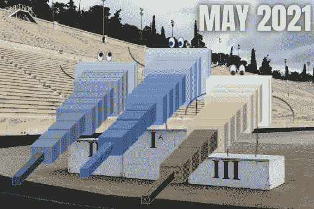

# 人工智能月度前三名—2021 年 5 月

> 原文：<https://pub.towardsai.net/the-ai-monthly-top-3-may-2021-425ef4460733?source=collection_archive---------2----------------------->

## [研究](https://towardsai.net/p/category/research)

## 本月 3 篇最有趣的人工智能论文，包括视频演示、短文、代码和论文参考。

> 在分享到这里的前两天，在[我的博客](https://www.louisbouchard.ai/the-ai-monthly-top-3-may-2021/)上阅读我的故事！

如果你错过了其中的任何一篇，这里有 3 篇本月最有趣的研究论文。这是一份按发布日期排列的**在人工智能和数据科学方面的最新突破列表，带有**清晰的视频解释**、**指向更深入文章的链接**，以及**代码**(如果适用)。享受阅读，如果我错过了任何重要的论文，请在评论中告诉我，或者直接在 [LinkedIn](https://www.linkedin.com/in/whats-ai/) 上联系我！**

> 关注我[中](https://whats-ai.medium.com/)看这个 AI 月度 top 3！

# 论文#1:

## 完全重新照明:学习为背景替换重新照明肖像[1]

根据您添加的新背景的照明，正确地重新照亮任何肖像。你是否曾经想改变一张图片的背景，但却让它看起来很真实？如果你已经尝试过，你就会知道这并不简单。你不能在家里给自己拍张照片，然后给海滩换个背景。只是看起来很糟糕，不现实。任何人都会马上说“那是 PS 过的”。对于电影和专业视频，你需要完美的灯光和艺术家来再现高质量的图像，而这是超级昂贵的。你不可能用自己的照片做到这一点。还是可以？… [阅读更多。](/change-your-portraits-backgrounds-with-realistic-lighting-b6f2ebeb1a85)

## 观看视频

## 简短阅读版本

 [## 用真实的灯光改变你的肖像背景

### 根据您添加的新背景的照明，正确地重新照亮任何肖像。

pub.towardsai.net](/change-your-portraits-backgrounds-with-realistic-lighting-b6f2ebeb1a85) 

# 论文#2:

## LASR:从单目视频学习关节形状重建[2]

仅通过短视频作为输入，生成人类或动物运动的 3D 模型。这是一种仅从短视频作为输入来生成人类或动物运动的 3D 模型的新方法。事实上，它知道这是一个奇怪的形状，它可以移动，但仍然需要保持连接，因为这仍然是一个“对象”，而不仅仅是许多对象在一起… [阅读更多信息。](https://www.louisbouchard.ai/3d-reconstruction-from-videos/)

## 观看视频

## 简短阅读版本

 [## 视频三维重建:LASR

### 仅通过短视频作为输入，生成人类或动物运动的 3D 模型。

pub.towardsai.net](/3d-reconstruction-from-videos-lasr-c29459399aed) 

代码即将发布:[https://lasr-google.github.io/](https://lasr-google.github.io/)

# 论文#3:

## 增强照片真实感增强[3]

这种人工智能可以应用到视频游戏中，并使每一帧看起来更加自然。来自英特尔实验室的研究人员刚刚发表了一篇名为“增强真实感增强”的论文。如果你认为这可能是“另一个甘”，把视频游戏的照片作为输入，并按照自然世界的风格改变它，让我改变你的想法。他们花了两年时间研究这个模型，让它变得非常健壮。它可以现场应用到视频游戏中，并使每一帧看起来更加自然。想象一下这样的可能性，你可以在游戏图形中投入更少的努力，使它超级稳定和完整，然后使用这种模型改进风格……[阅读更多。](https://www.louisbouchard.ai/the-future-of-video-game/)

## 观看视频

## 简短阅读版本

 [## 电子游戏设计的未来？

### 这种人工智能可以应用到视频游戏中，并使每一帧看起来更加自然。

pub.towardsai.net](/the-future-of-video-game-design-234cbeba7ab) 

代码[T5 和数据集](https://colab.research.google.com/github/google-research/google-research/blob/master/infinite_nature/infinite_nature_demo.ipynb#scrollTo=sCuRX1liUEVM)[https://github.com/intel-isl/PhotorealismEnhancement](https://github.com/intel-isl/PhotorealismEnhancement)

# 奖励纸:

## 实时高分辨率逼真图像翻译[奖金]

使用这种基于机器学习的新方法，实时将任何风格应用到您的 4K 图像中！[多读书。](/computer-vision-fe47a52e76a5)

## 观看视频

## 简短阅读版本

 [## 实时高分辨率真实感图像翻译

### 使用这种基于机器学习的新方法，实时将任何风格应用到您的 4K 图像中！

pub.towardsai.net](/computer-vision-fe47a52e76a5) 

代号:[https://github.com/csjliang/LPTN](https://github.com/csjliang/LPTN)

来我们的 [**Discord 社区和我们聊天:** **一起学 AI**](https://discord.gg/learnaitogether)和*分享你的项目、论文、最佳课程、寻找 Kaggle 队友等等！*

如果你喜欢我的工作，并想与人工智能保持同步，你绝对应该关注我的其他社交媒体账户( [LinkedIn](https://www.linkedin.com/in/whats-ai/) 、 [Twitter](https://twitter.com/Whats_AI) )并订阅我的每周人工智能[简讯](http://eepurl.com/huGLT5) ！

## 支持我:

*   支持我的最好方式是成为这个网站的成员，或者如果你喜欢视频格式，在[**YouTube**](https://www.youtube.com/channel/UCUzGQrN-lyyc0BWTYoJM_Sg)**上订阅我的频道。**
*   **在经济上支持我在 T21 的工作**
*   **跟着我到这里来！**

## **参考**

**[1] Pandey 等人，2021，Total Relighting:学习为背景替换重新照亮人像，doi: 10.1145/3450626.3459872，[https://augmented perception . github . io/Total _ re lighting/Total _ re lighting _ paper . pdf](https://augmentedperception.github.io/total_relighting/total_relighting_paper.pdf)。**

**[2]耿山阳等，(2021)，:从单目视频学习关节式形状重建，，。**

**[3]里克特，阿布·阿尔海贾，科尔敦，(2021)，“增强照片真实感增强”，[https://intel-isl.github.io/PhotorealismEnhancement/](https://intel-isl.github.io/PhotorealismEnhancement/)。**

**【附加信息】梁，解，曾，惠，张，雷，(2021)，“高分辨率真实感图像实时翻译:拉普拉斯金字塔翻译网络”，[，](https://export.arxiv.org/pdf/2105.09188.pdf)。**