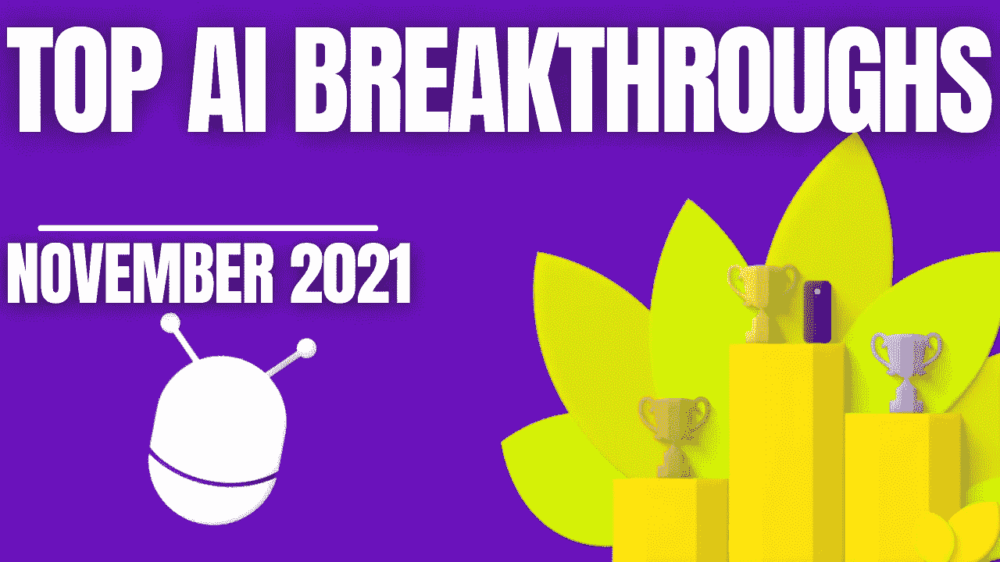

# 人工智能月度前三名—2021 年 11 月

> 原文：<https://pub.towardsai.net/the-ai-monthly-top-3-november-2021-a24952929f44?source=collection_archive---------4----------------------->

## [职业生涯](https://towardsai.net/p/category/careers)

## 11 月最有趣的人工智能突破，包括视频演示、短文、代码和论文参考。

> 原载于 [louisbouchard.ai](https://www.louisbouchard.ai/the-ai-monthly-top-3-november-2021/) ，前两天在[我的博客](https://www.louisbouchard.ai/the-ai-monthly-top-3-november-2021/)上看到的！

如果你错过了其中的任何一篇，这里有 3 篇本月最有趣的研究论文。它是按发布日期排列的人工智能和数据科学的**最新突破的精选列表，带有**清晰的视频解释**、**指向更深入文章的链接**和**代码**(如果适用)。享受阅读，如果我错过了任何重要的论文，请在评论中告诉我，或者直接在 [LinkedIn](https://www.linkedin.com/in/whats-ai/) 上联系我！**

如果你也想阅读更多的研究论文，我推荐你阅读我的文章**，在那里我分享了寻找和阅读更多研究论文的最佳技巧。**

> ***关注我上* [*中*](https://whats-ai.medium.com/membership) *看这个 AI top 3 月！***

# **论文#1:**

## **[StyleCLIPDraw:文本到绘图合成中内容和样式的耦合[1，2]](https://arxiv.org/abs/2111.03133)**

**你有没有梦想过采用图片的风格，比如左边这个很酷的抖音绘画风格，并将其应用到你选择的新图片中？是的，我做到了，而且从来没有这么容易做到。事实上，你甚至可以只通过文本来实现，现在就可以用这种新方法和他们为每个人提供的 Google Colab 笔记本来尝试。只需拍下你想要复制的样式的图片，输入你想要生成的文本，这个算法就会从中生成一张新的图片！回头看看上面的结果就知道了，这么大的进步！结果非常令人印象深刻，尤其是如果您考虑到它们是由单行文本构成的！**

## **观看视频**

## **简短阅读版本**

** [## 具有艺术控制的文本到绘图合成| CLIPDraw & StyleCLIPDraw

### 给你想要复制的风格拍张照，输入文字，算法会从中生成一张新的图片！

pub.towardsai.net](/text-to-drawing-synthesis-with-artistic-control-clipdraw-styleclipdraw-dd56fa208bea) 

*   CLIPDraw 代码:[https://colab . research . Google . com/github/kvfrans/clip draw/blob/main/clip draw . ipynb](https://colab.research.google.com/github/kvfrans/clipdraw/blob/main/clipdraw.ipynb)
*   StyleCLIPDraw 代码:【https://github.com/pschaldenbrand/StyleCLIPDraw 
*   StyleCLIPDraw Colab:[https://Colab . research . Google . com/github/pschaldenbrand/StyleCLIPDraw/blob/master/Style _ clipdraw . ipynb](https://colab.research.google.com/github/pschaldenbrand/StyleCLIPDraw/blob/master/Style_ClipDraw.ipynb)

**

# **论文#2:**

## **[SwinIR:使用 swin transformer 进行图像恢复【3】](https://arxiv.org/abs/2108.10257)**

**你是否曾经有过一个你非常喜欢的图像，但只能找到一个小版本，看起来像上面左边的这个图像？如果你能把这张图片放大两倍，那该有多酷？这很棒，但是如果你能把它的清晰度提高四到八倍呢？现在我们在谈话，看看那个。**

**在这里，我们将图像的分辨率提高了四倍，这意味着我们有四倍多的高度和宽度像素来获得更多的细节，使它看起来更加平滑。最棒的是，这是在几秒钟内完成的，完全自动，几乎可以处理任何图像。哦，你甚至可以通过他们提供的演示自己使用它…**

## **观看视频**

## **简短阅读版本**

** [## 这个人工智能使模糊的脸看起来清晰 8 倍！SwinIR:照片上采样

### 用 AI 把你的小 512 像素大图转换成 4k！

pub.towardsai.net](/this-ai-makes-blurry-faces-look-8-times-sharper-swinir-photo-upsampling-b41d394b41e9) 

*   代号:[https://github.com/JingyunLiang/SwinIR](https://github.com/JingyunLiang/SwinIR)
*   演示:[https://replicate.ai/jingyunliang/swinir](https://replicate.ai/jingyunliang/swinir)** 

# **论文#3:**

## **[EditGAN:高精度语义图像编辑【3】](https://arxiv.org/abs/2111.03186)**

**控制快速草稿中的任何功能，它将只编辑你想要的，保持图像的其余部分不变！SOTA 图像编辑草图模型的基础上甘斯由英伟达，麻省理工学院和 UofT…**

## **观看视频**

## **简短阅读版本**

** [## 从草图编辑图像:EditGAN

### 控制快速草稿中的任何功能，它将只编辑你想要的，保持图像的其余部分不变！SOTA…

pub.towardsai.net](/image-editing-from-sketches-editgan-4cacca609e2d) 

代码(即将发布):https://nv-tlabs.github.io/editGAN/** 

**如果你喜欢我的工作，并想与人工智能保持同步，你绝对应该关注我的其他社交媒体账户( [LinkedIn](https://www.linkedin.com/in/whats-ai/) 、 [Twitter](https://twitter.com/Whats_AI) )并订阅我的每周人工智能[简讯](http://eepurl.com/huGLT5) ！**

## **支持我:**

*   **支持我的最好方式是在[**Medium**](https://whats-ai.medium.com/membership)**上关注我，或者如果你喜欢视频格式，在[**YouTube**](https://www.youtube.com/channel/UCUzGQrN-lyyc0BWTYoJM_Sg)**上订阅我的频道。******
*   ****支持我在 [**Patreon**](https://www.patreon.com/whatsai) **上的工作。******
*   ****加入我们的 [**Discord 社区:** **一起学 AI**](https://discord.gg/learnaitogether)和*分享你的项目、论文、最佳课程、寻找 Kaggle 队友等等！*****
*   ****这里是我作为一名研究科学家每天用来寻找和阅读人工智能研究论文的最有用的工具… [在这里阅读更多。](https://www.louisbouchard.ai/research-papers/)****

## ****参考****

****[1] CLIPDraw: Frans，k .，Soros，L.B .和维特科夫斯基，o .，2021 年。CLIPDraw:通过语言图像编码器探索文本到绘图的合成。[https://arxiv.org/abs/2106.14843](https://arxiv.org/abs/2106.14843)****

****[2] StyleCLIPDraw: Schaldenbrand，p .，Liu，z .和 Oh，j .，2021。StyleCLIPDraw:文本到绘图合成中内容和样式的耦合。[https://arxiv.org/abs/2111.03133](https://arxiv.org/abs/2111.03133)****

****[3]梁军、曹军、孙、张、范古尔和，2021。SwinIR:使用 swin transformer 进行图像恢复。IEEE/CVF 国际计算机视觉会议论文集(第 1833-1844 页)。****

****[4] Ling，h .，Kreis，k .，Li，d .，Kim，S.W .，Torralba，a .和 Fidler，s .，2021 年 5 月。EditGAN:高精度语义图像编辑。在*第三十五届神经信息处理系统会议上*。****