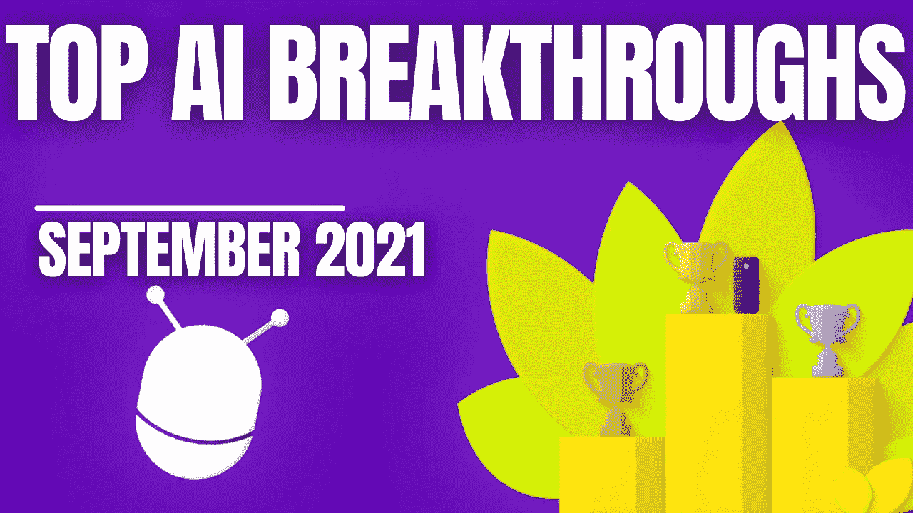

# 人工智能月度前三名—2021 年 9 月

> 原文：<https://pub.towardsai.net/the-ai-monthly-top-3-semptember-2021-e730e304771c?source=collection_archive---------4----------------------->

## [简讯](https://towardsai.net/p/category/newsletter)

## 最有趣的 9 月人工智能突破，包括视频演示、短文、代码和论文参考。

> 原载于 [louisbouchard.ai](https://www.louisbouchard.ai/ai-monthly-top-3-september-2021/) ，前两天在[我的博客](https://www.louisbouchard.ai/ai-monthly-top-3-september-2021/)上看到的！

如果你错过了其中的任何一篇，这里有 3 篇本月最有趣的研究论文。它是按发布日期排列的人工智能和数据科学的**最新突破的精选列表，带有**清晰的视频解释**、**指向更深入文章的链接**和**代码**(如果适用)。享受阅读，如果我错过了任何重要的论文，请在评论中告诉我，或者直接在 [LinkedIn](https://www.linkedin.com/in/whats-ai/) 上联系我！**

如果你也想阅读更多的研究论文，我推荐你阅读我的文章**，在那里我分享了寻找和阅读更多研究论文的最佳技巧。**

> **跟着我上[媒](https://whats-ai.medium.com/membership)看这个 AI top 3 月度！**

# **论文#1:**

## **[Styleclip:文本驱动的 StyleGAN 图像操作[1]](https://arxiv.org/abs/2103.17249)**

**人工智能可以生成图像，然后，使用大量的脑力和反复试验，研究人员可以按照特定的风格控制结果。现在，有了这个新模型，你可以只用文本就能做到！**

## **观看视频**

## **简短阅读版本**

** [## 用文本处理真实图像

### 创意艺术家的人工智能！StyleCLIP 解释

pub.towardsai.net](/manipulate-real-images-with-text-25b9f583e292) 

代码(与本地 GUI 或 colab 笔记本一起使用):[https://github.com/orpatashnik/StyleCLIP](https://github.com/orpatashnik/StyleCLIP)

演示:[https://colab . research . Google . com/github/orpatashnik/style clip/blob/main/notebooks/style clip _ global . ipynb](https://colab.research.google.com/github/orpatashnik/StyleCLIP/blob/main/notebooks/StyleCLIP_global.ipynb)

**

# **论文#2:**

## **[TimeLens:基于事件的视频帧插值[2]](http://rpg.ifi.uzh.ch/docs/CVPR21_Gehrig.pdf)**

**TimeLens 可以理解视频帧之间的粒子运动，以我们肉眼无法看到的速度重建真实发生的事情。事实上，它实现了我们的智能手机和其他型号之前无法达到的效果！**

## **观看视频**

** [## 如何用 AI 制作慢动作视频！

### TimeLens 可以理解视频帧之间的粒子运动，以重建真正的…

www.louisbouchard.ai](https://www.louisbouchard.ai/timelens/) 

## 简短阅读版本

 [## 用 AI 把视频换成慢动作！TimeLens 解释道

### 时间镜头可以理解视频帧之间的粒子运动，以重建真正的…

pub.towardsai.net](/change-video-into-slow-motion-with-ai-timelens-explained-4281d97c9b9d) 

官方代号:[https://github.com/uzh-rpg/rpg_timelens](https://github.com/uzh-rpg/rpg_timelens)

# 论文#3:

## [从一个视频中产生不同的一代人成为可能【3】](https://arxiv.org/abs/2109.08591)

你有没有想过剪辑一个视频？

删除或添加某人，更改背景，使其持续更长时间，或者更改分辨率以适应特定的纵横比，而不压缩或拉伸它。对于那些已经开展过广告活动的人来说，你肯定希望有不同的视频来进行 AB 测试，看看什么效果最好。Niv Haim 等人的这项新研究可以帮助你在一个高清视频中完成所有这些事情！

的确，使用一个简单的视频，你可以在几秒钟或几分钟内完成我刚才提到的任何高质量视频的任务。你基本上可以把它用于任何你想到的视频操作或视频生成应用。它甚至在所有方面都优于 GANs，并且不使用任何深度学习的花哨研究，也不需要庞大而不切实际的数据集！最棒的是，这项技术可以扩展到高分辨率视频。

## 观看视频

## 简短阅读版本

 [## 从单个视频生成不同的内容成为可能—不需要数据集或深度学习！

### 这种模式可以做任何视频操作或视频生成应用程序，你记住了！

pub.towardsai.net](/diverse-generation-from-a-single-video-made-possible-no-dataset-or-deep-learning-required-f4377c0c56bf) 

代码(即将推出):【https://nivha.github.io/vgpnn/ 

# 人工智能专业人员的奖金

## 人工智能中任何人都应该知道的 8 个工具

两年前，我看到了我的第一篇研究论文。我记得它看起来有多旧，里面的数学是多么令人沮丧。这看起来确实像研究人员在电影中所做的工作。公平地说，这张纸是上世纪 50 年代的，但从那以后就没怎么变过。时至今日，在去年为我的 youtube 频道读了几百篇论文后，我获得了很多阅读它们的经验，在那里我试图简单地解释它们。尽管如此，我知道第一次阅读是多么令人难以接受，尤其是第一次阅读你的第一篇研究论文。这就是为什么我想分享我的最佳技巧和实用工具 **的原因，我每天使用**来**简化我的生活，在寻找和阅读有趣的研究论文时更有效率**。

这里是我作为一名研究科学家每天用来寻找和阅读人工智能研究论文的最有用的工具… [在这里阅读更多。](https://www.louisbouchard.ai/research-papers/)

如果你喜欢我的工作，并想与人工智能保持同步，你绝对应该关注我的其他社交媒体账户( [LinkedIn](https://www.linkedin.com/in/whats-ai/) ， [Twitter](https://twitter.com/Whats_AI) )，并订阅我的每周人工智能 [**简讯**](http://eepurl.com/huGLT5) ！

## 支持我:

*   支持我的最好方式是在[**Medium**](https://whats-ai.medium.com/membership)**上关注我，或者如果你喜欢视频格式，在[**YouTube**](https://www.youtube.com/channel/UCUzGQrN-lyyc0BWTYoJM_Sg)**上订阅我的频道。****
*   ****支持我在 [**Patreon**](https://www.patreon.com/whatsai) **上的工作。******
*   ****加入我们的 [**Discord 社区:** **一起学 AI**](https://discord.gg/learnaitogether)和*分享你的项目、论文、最佳课程、寻找 Kaggle 队友等等！*****

# ****参考****

****[1] Patashnik，Or，et al .(2021)，“风格剪辑:风格图像的文本驱动操作。”，[https://arxiv.org/abs/2103.17249](https://arxiv.org/abs/2103.17249)****

****[2]斯捷潘·图利亚科夫*、丹尼尔·格赫里希*、斯塔马蒂亚斯·乔戈里斯、朱利叶斯·埃尔巴希、马蒂亚斯·格赫里希、李、大卫·斯卡拉穆扎，TimeLens:基于事件的视频帧内插，IEEE 计算机视觉和模式识别会议(CVPR)，纳什维尔，2021，****

****[3]哈伊姆、范因斯坦、格拉诺特、肖彻、巴贡、戴克尔和伊拉尼(2021 年)。多样化的一代从一个单一的视频成为可能，【https://arxiv.org/abs/2109.08591】T2。****

********

****照片由 [Cyrus Chew](https://unsplash.com/@cyrus_c?utm_source=medium&utm_medium=referral) 在 [Unsplash](https://unsplash.com?utm_source=medium&utm_medium=referral) 上拍摄******