# 人工智能驱动的在线试衣间:VOGUE

> 原文：<https://pub.towardsai.net/the-ai-powered-online-fitting-room-vogue-5f77c599832?source=collection_archive---------1----------------------->

## [计算机视觉](https://towardsai.net/p/category/computer-vision)，[深度学习](https://towardsai.net/p/category/machine-learning/deep-learning)

## 谷歌使用修改后的 StyleGAN2 架构创建了一个在线试衣间，在这里你可以只使用自己的图像自动试穿任何你想要的裤子或衬衫。

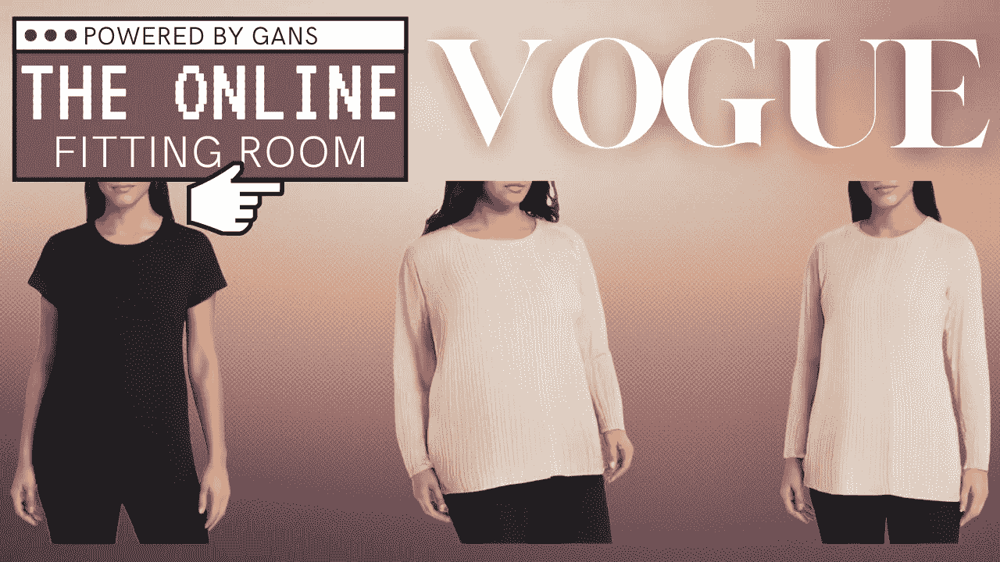

## 时尚:StyleGAN 插值优化的尝试[1]

来自谷歌、麻省理工学院和华盛顿大学的一组研究人员最近发表了一篇名为“VOGUE: Try-On by StyleGAN 插值优化”的论文。他们使用 GAN 架构创建了一个在线试衣间，在这里你可以只使用自己的图像自动试穿任何你想要的裤子或衬衫。也称为服装转移，目标是将照片中一个人的衣服转移到另一个人身上，同时保留正确的体形、头发和肤色。这是一项复杂的任务，因为需要从一幅图像中提取输出图像的某些部分，如衣服，而从另一幅图像中提取真实人物的其他部分，以保持我们想要试穿衣服的人的“身份”。

嗯，他们能够使用基于 GAN 的架构做到这一点。更准确地说，姿势控制的 StyleGAN2 是其架构的核心。我不会深入讨论这个 StyleGAN2 和 GAN 架构的细节，因为我已经在许多视频中解释过了，比如在这个视频中，我解释了 Toonify，它也使用了基于 StyleGAN2 的架构。如果你不熟悉 GANs 或 StyleGAN2，我肯定会邀请你在继续这个视频之前观看这个视频。

## 模型

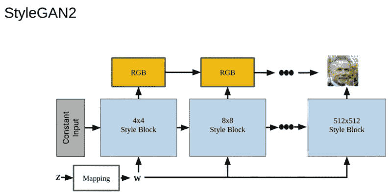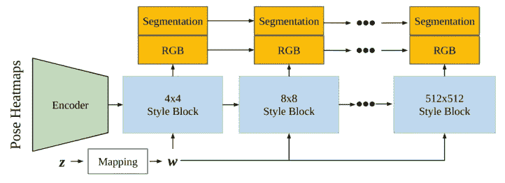

StyleGAN2 和 VOGUE 版 StyleGAN2 的区别。经 Kathleen Lewis 许可使用[1]

因此，为了用不同的服装创作出逼真的照片,《VOGUE》需要训练这种受姿势限制的风格架构。但这比简单地实现 StyleGAN2 更难，因为它主要是为面部图像开发的，这也是它受欢迎的原因。他们必须做两个关键的修改:首先，他们必须用一个编码器修改生成器的开头，该编码器将图像的姿态关键点作为输入。这用作 StyleGAN2 的第一个“4x4 样式块”的输入，而不是实现该姿势条件的常量输入。

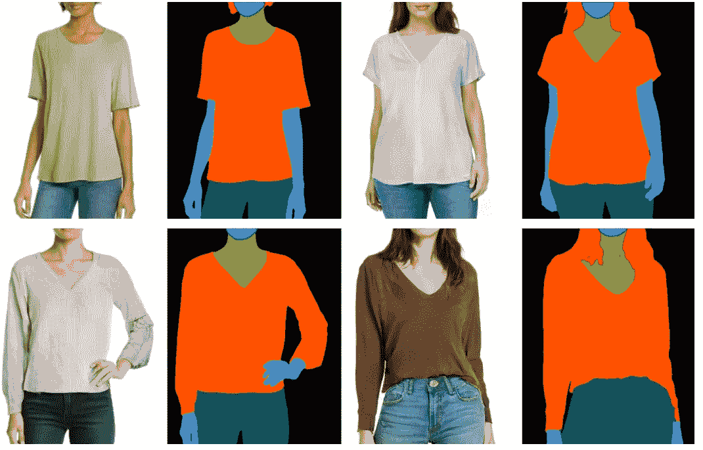

VOGUE 的 StyleGAN2 模型生成的细分图[1]

然后，他们训练他们的 StyleGAN2 输出除 RGB 图像之外的每个分辨率的分割，正如你在这里看到的。使用这个网络，他们能够生成许多图像，并以期望的姿势对它们进行分割。

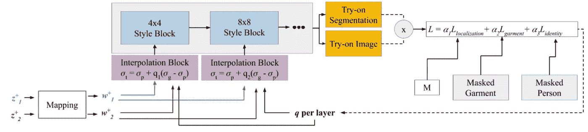

VOGUE 的模特。经 Kathleen Lewis 许可使用[1]

接下来，给定一对输入图像，他们可以将图像“投影”到生成器的潜在空间中，以计算潜在代码，该潜在代码将最好地区分这对输入图像的特征。使用优化器来找到第二图像中的服装和第一图像中的人所处的组合空间。他们必须最大化感兴趣区域内的变化，同时最小化感兴趣区域外的变化。为此，他们使用两个潜在空间，代表两个输入图像，第一个来自要生成的人的图像，第二个来自要转移的衣服的图像。正如我们看到的，他们还需要姿势热图作为 StyleGAN2 生成器的输入，这里再次以灰色显示。然后，他们可以访问由经过训练的 GAN 架构生成的分割和图像。接下来，他们使用了一个由三个独立项组成的损失函数，每个项都优化了生成图像的一部分。

存在编辑定位损失项，该损失项鼓励网络使用分割输出仅在感兴趣的区域(这里定义为 M)内插入样式。

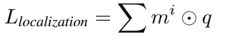

然后，有服装损失用于转移服装的正确形状和纹理。

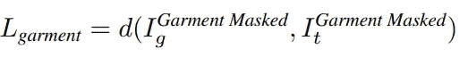

使用一种非常流行的卷积神经网络架构 VGG-16 的嵌入，他们再次使用分割标签来计算两幅图像的服装区域之间的距离。然后，将创建的蒙版应用于生成的 RGB 图像。

最后，身份丢失引导网络，正如它所说的，保存人的身份。

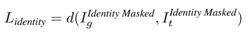

这也是使用分段标签按照与服装损失相同的程序来完成的。

请花点时间看看这些损耗如何影响输出图像。你可以清楚地看到什么时候本土化缺失或者身份缺失，以及它们的重要性。

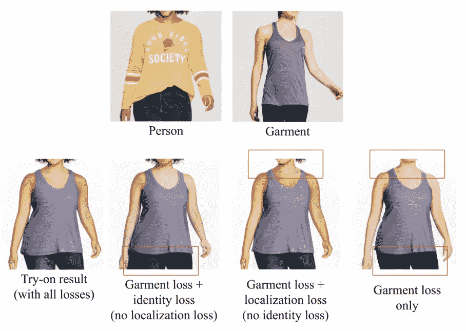

损耗对服装转移效果的影响。经 Kathleen Lewis 许可使用[1]

## 更多结果

正如他们所说:“我们的方法可以通过固定风格向量来合成不同姿势和体型的同一风格的衬衫。我们以多种姿势呈现几种不同的风格。”[1]

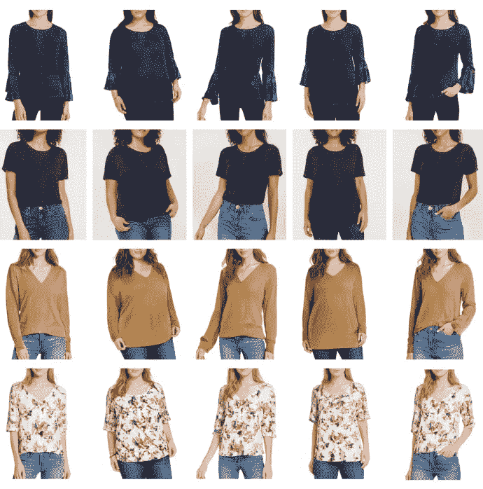

在这个图中，每一行都是固定的样式，每一列都是固定的姿势和身体形状。经 Kathleen Lewis 许可使用[1]

看看这种新方法的效果有多好:

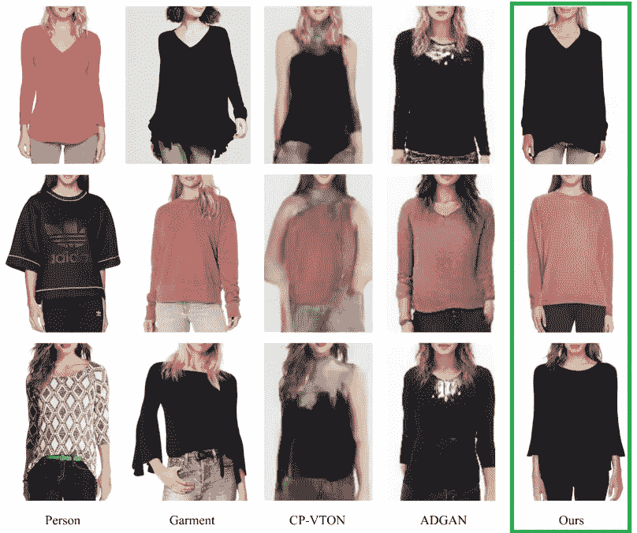

VOGUE 的定性比较。经 Kathleen Lewis 许可使用[1]

## 甚至更多的结果！

当然，这只是这篇新论文的概述。我强烈邀请您阅读下面参考资料中他们的论文，以获得更好的技术理解。

如果你喜欢我的工作，并想了解最新的人工智能技术，你绝对应该在我的社交媒体频道上关注我。

*   订阅我的 [**YouTube 频道**](https://www.youtube.com/channel/UCUzGQrN-lyyc0BWTYoJM_Sg) 。
*   关注我的项目上 [**LinkedIn**](https://www.linkedin.com/in/whats-ai/) 和这里上[**中**](https://whats-ai.medium.com/) **。**
*   一起学习 AI，加入我们的 [**不和谐社区**](https://discord.gg/learnaitogether) ，*分享你的项目、论文、最佳课程，寻找 Kaggle 队友，等等！*

## 参考

[1] Lewis，Kathleen M 等，(2021)，VOGUE:通过 StyleGAN 插值优化试穿，[https://vogue-try-on.github.io/](https://vogue-try-on.github.io/)

互动示例:[https://vogue-try-on.github.io/demo_rewrite.html](https://vogue-try-on.github.io/demo_rewrite.html)