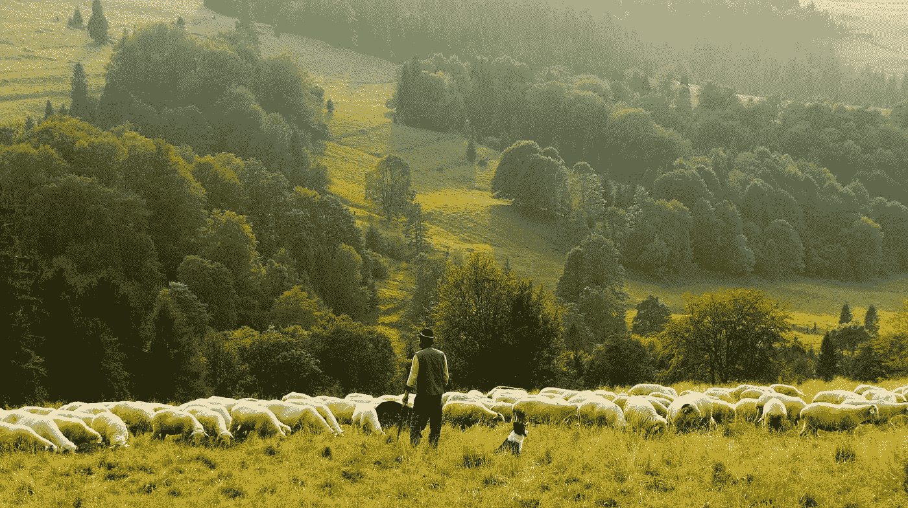

# 削弱民主的人工智能“牧羊人”

> 原文：<https://pub.towardsai.net/the-ai-shepherds-that-weaken-democracy-c8af4c91b671?source=collection_archive---------1----------------------->

免费照片由 Pixabay 提供

2011 年，我搬进了新房子。早上 6 点，在相隔一周的两次事件中，我让 6 名澳大利亚联邦武装警察寻找一个“杰西”。我第一次说，不，我们刚搬进来，这里没有人叫这个名字。第二次我说了同样的话，并补充说，欢迎他们每周来，我们不知道一个“杰西”。没有出示逮捕证或徽章。枪支和制服就足够了。他们说这个“杰西”给了我们的房子作为他们的地址。他们没有回来。我不知道为什么。当地警察局对他们一无所知。

执法官员有一个有罪推定，这可能是不言而喻的，一旦嫌疑人被逮捕，司法程序就会将其推翻为无罪推定。

总的来说，我们大多数人都是守法的，或者说我们的目标是守法。虽然我们大多数人都没有详细阅读过这些法律，或者事实上甚至不知道在哪里可以找到它们[1]，但我们从学校教育和媒体对非法活动的报道中已经有了一个大致的概念。我相信这就是为什么媒体在法庭报道上花费了过多的时间，试图向公众强调什么是“对和错”。

事实上，虽然普遍的看法是法律告诉我们什么是好的和坏的，但事实上并不是这样。它为所有人设定了社会行为标准，让他们遵守，以保持国家公民的身份，并有效地避免惩罚。是后伦理。对惩罚的先验恐惧让政府在没有任何监管的情况下控制了许多公民的行为。

那么，按照这些思路，公民可能会出现什么样的分化呢？也许我们可以试着猜一下，比如三个类:

**A 级**:约 60%没有意图，不需要维持治安来遵守每一项法律和道德规范；

**B 类**:约 30%的人是机会主义者，需要纪律约束信息，如媒体对被捕罪犯的报道；和

**C 类**:约 10%有机会和预谋，需要积极监控和监管，是潜在的关注对象。

一个拥有被动人工智能技术基础设施的社会，如 CBD 摄像机装置；亚马逊围栏；设备地理定位服务；广告社交媒体事件的数据挖掘；地理围栏商场；总是收听支持网络的语音助手；面部识别 UFID 的存储(参见能力)；不仅在设备上进行面部认证，例如公交票价；社会信用评分意味着我们都被无意识的监控所包围，这使得 A 级和 B 级陷入 c 级。

我认为这已经成为这样的情况，我们在 A & B 的阶级中，没有任何明确的协议，由于加强了立法以保护大多数人免受可能的恐怖主义行动，已经不由自主地受到人工智能监控，好像我们都是 c 级

在澳洲，1979 年的*电信(监听和访问)法案*和 2004 年的*监控设备法案*允许授权执法人员在存在[合理理由](https://www.legislation.gov.au/Details/C2019C00296)(美国:[合理怀疑](https://www.thedefenders.com.au/6-examples-of-reasonable-suspicion/))的情况下请求授权令监听数字通信。

虽然我不是律师，但合理理由实际上似乎是一个循环论证。在没有收集信息以形成怀疑的情况下形成了一个人的观点，一个官员将如何形成这个观点？虽然这个[网站](https://www.thedefenders.com.au/6-examples-of-reasonable-suspicion/)提供了一些指导方针，但当涉及到加密数字的使用时，很难形成这种观点，因为物理搜索是不可能的。

似乎至少在 2015 年的新南威尔士州，363 份监视令中只有 [6 份被驳回，搜查令申请被“橡皮图章”:](https://nswcourts.com.au/articles/nsw-judges-rubber-stamping-surveillance-warrants/)

“[警察]经常进行‘钓鱼调查’，试图挖出他们不喜欢的人的丑闻。”；和

*“据报道，新南威尔士州法院现在平均每天收到五份逮捕令请求(比 2014 年初多得多)，通常来自新南威尔士州警方、ICAC 和澳大利亚联邦警察局。”*

在这个 2020 年的未来，我们现在是其中的一部分，正在表达合理的怀疑(这似乎可以是任何事情，由法律实践担保，这与其说是一种道德，不如说是一种过程)，警察操作的最佳方式是嗅出潜在的*每个人的*在线行为，使用人工智能/人工智能对“证据”进行模式化，然后相应地对我们的犯罪倾向进行分类，提前*？*

*与我们似乎都以某种方式有机吸收的法律本身不同，曾经不被记录或不为人所知的数字言论或视频行为现在可以被分析、讨论和曲解，而这从来就不是它的本意。在合理怀疑 AI/ML 红旗解释的情况下，可获得或可能获得授权令。*

*那不是蛋糕，是炸弹。蜂拥而至。*

*除了语音(参见 MelNet)和视频图像 DeepFakes 之外，事实和背景都受到人类和机器识别偏见的影响。美国谷歌最近被要求在没有 1500 个合理理由的情况下公开 1500 部手机 8 小时的位置数据。使用 ToR 或 VPN 来欺骗一个美国 IP，这样你就可以看到在澳洲被屏蔽的网飞 HBO，这合理吗？*

*对于这一新生的调查，A 级或 B 级的反应是，我们可能会说‘我们没有什么可隐瞒的，继续吧’。但是对于有这种懒散态度的 A 级和 B 级公民来说，有五个关键问题:*

*1.**名声**。虽然我们没有做错任何事，怀疑也过去了，但如果你的声誉受到影响，对未来的机会产生重大影响，那么民事损害就发生了。如果我的任何一个邻居在联邦警察来访时早上 6 点就起床了，他们可能会大吃一惊。也许他们不会在发生事故时帮助我，因为在他们眼里我已经是 c 级了。否则为什么 6 名武装警察会两次造访我的住所？*

*2.**信任**。公民与政府之间信任假设的丧失。在社会契约中，A 级 B 级公民对警察和法律的恐惧似乎不再足以让政府信任我们，因为我们现在都意外地成为了 c 级公民。为了政府和公民之间的信任，全面的数字信息披露真的是必需的吗？*

*3.**隐私**。在一个永远在线的数字监控社会中，隐私假设的丧失。如果有合理的理由，你被错误地怀疑，你可以不受限制地监听你的电话。使用加密应用程序也是如此，因为[以色列技术](https://www.technologyreview.com/s/614898/cops-see-an-encryption-problem-spyware-makers-see-an-opportunity/) PicSix 展示了它可以充当一个虚假的手机信号塔，挫败加密通信，迫使你回到未加密的移动频道。或者政府的加密后门。*

*4.**法律纠葛**。在本应被推定为“无辜”的情况下，错误地成为一名嫌疑人，意味着你可能会面临一场漫长而耗费财力的法律诉讼，只是为了让你的生活回到正轨，并在没有成功把握的情况下洗清你的名声。*

*5.**民主**。最后，我认为最令人不安的是，由于学会了不愿意发表公开言论和学会了自我审查，这意味着民主的丧失。如果没有银行、谷歌或脸书的明确逐案同意就进行分析和模式化还不够糟糕，那么现在出于国家安全的目的，政府似乎在假设我们都是 C 级公民，不值得信任，受到持续的人工智能监控。如果我们认识到这一点，我们就不希望用容易被误解的言语或视频图像行为引起怀疑或合理的理由，我们被监控的行为将变得无聊、刻板、平凡和狭隘。*

**民主的词源来自希腊语 demos +奎托斯。**

**德莫斯*在希腊语中代表‘人民的’，而*奎托斯*代表‘力量’。迈克尔·福柯曾在他 1977-1978 年的演讲中反映，自由和独立的希腊人永远不会屈服于同质的基督教牧师的力量，这是对真正的希腊民主政府的牧羊人模仿。*

*我认为没有意识到这一点，因为我们可能在中间(或结束！)在这个失去自由的过程中，人工智能所做的是推动我们进入下一步*失去民主自由，这要归功于所谓的某些数字数据之间的权力关系&人工智能代理胜过可变的顺从人类代理。一旦意识到，这些趋势将开始主要影响人际关系中的交流自由，特别是我们的孩子，我们将被迫在我们的社区中变得害怕和怀疑彼此，并最终失去社会契约吗？**

*我们现在是否只是生活在过去想象的民主形象中？*

*也许真正发生的是，我们开始被人工数字牧羊人服务，他们先验地认为我们都是 C 类人，因为由于政府对公民失去信任，以及终生数据事件流的可用性，我们都以某种方式通过了合理怀疑的恐惧门，从而自动和永久地描述了我们的机会和意图。*

**吐露内米尼。**

***脚注***

*[1] [austlii.edu.au](http://austlii.edu.au) 或[https://www.legislation.gov.au/](https://www.legislation.gov.au/)*