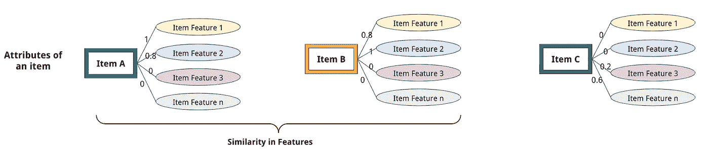
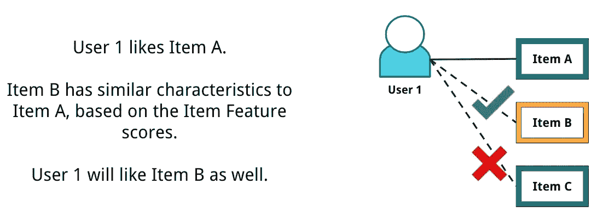
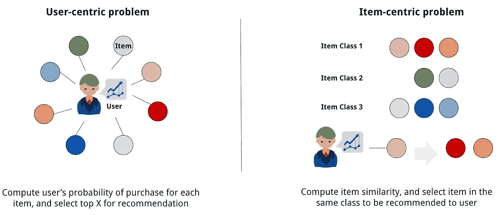
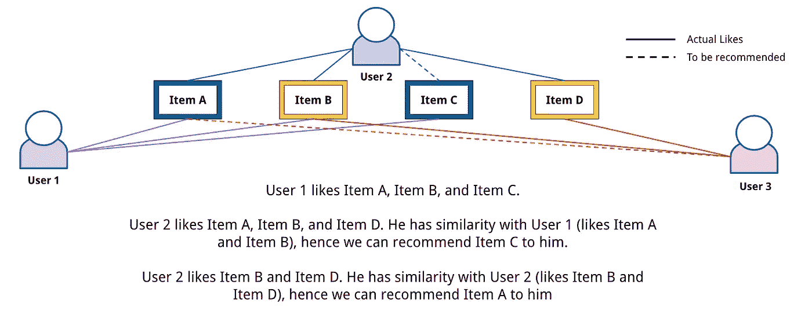
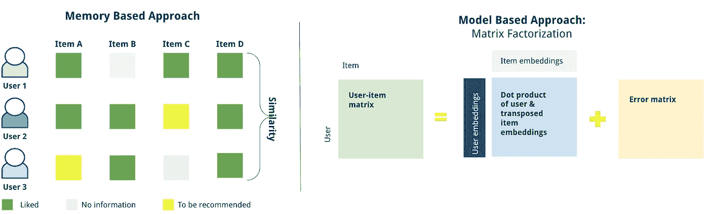

# 理解推荐系统背后的逻辑

> 原文：<https://pub.towardsai.net/the-analytics-approaches-behind-recommendation-systems-bdc6268f43ca?source=collection_archive---------0----------------------->

照片由 [Unsplash](https://unsplash.com?utm_source=medium&utm_medium=referral) 上的 [Prateek Katyal](https://unsplash.com/@prateekkatyal?utm_source=medium&utm_medium=referral) 拍摄

## [数据科学](https://towardsai.net/p/category/data-science)

## 为您的产品推荐提供多种方法和算法

当你的产品是一个数字平台，其价值在于向客户提供内容时，有一种趋势是将尽可能多的内容放在平台内，以获得他们想要的任何东西。这带来了一个 UX 问题，即如何组织这些内容，使客户能够轻松找到他们想要的东西。展示这一点的一种方式是通过**产品推荐**。

当你浏览网飞、亚马逊、Airbnb、Linked In 或 UberEats 等在线平台时，你可能已经对它们很熟悉了。类似“**相似物品**”、“**经常一起购买**”、“**相关工作**”、“**你可能也会喜欢这些产品上的**”的列表都是**推荐系统**的结果。

# 什么是推荐系统？

引用 [Ricci、Rokach 和 Saphira (2010)](https://link.springer.com/chapter/10.1007/978-0-387-85820-3_1) 的话，推荐系统是为用户提供**有用**物品建议的软件工具和技术。推荐通常以项目列表的形式提供，可以根据项目对用户的适合性进行排序。

推荐系统使用关于用户和项目的数据，这些数据可以是**明确收集的**(即用户评级、购买历史等)，或者是通过解释用户行为(即导航流量、在特定页面上花费的时间)推断的**，作为衡量用户对项目的(潜在)兴趣的标志。基于这些数据，可以创建一个分析或机器学习模型来**预测用户购买商品的可能性**。可能性高的将被显示为产品推荐。**

与任何其他机器学习模型一样，推荐系统为产品推荐问题提供了一个可扩展的解决方案。这很重要，因为产品推荐可以帮助:

*   **增加交易的可能性**。高概率的产品可以直接展示给顾客，确保其可被发现并最终被购买。
*   **追加销售**。在实际选择的项目之上，你可以显示一个可能对用户有用的补充项目(但是他们还没有意识到)，比如在购买手机时推荐一个手机壳。这将使用户在平台上进行更多的交易。
*   **更好的用户体验。**容易且有保证地发现需要的物品将提供令人愉快的用户体验，并最终导致用户对产品的粘性。

*现在我们已经了解了推荐系统，让我们深入了解这些系统背后的逻辑！*

# 推荐系统的设计方法

构建推荐系统有多种方法，但最常用的是**协同过滤**和**基于内容的**方法。

## 基于内容的推荐系统

根据 Pazzani 和 Billsus 的，基于内容的推荐系统根据项目的**描述**和用户兴趣的**简档向用户推荐项目。它基于这样的想法，如果用户喜欢某个项目 A，他/她也会喜欢与项目 A 具有相似特征的另一个项目 B**

YouTube 上的视频推荐就是一个例子。基于你的历史观看，它会收集你观看的视频的**元数据**，从类型(喜剧/音乐/戏剧/等)、创作者、主题(时事/生活方式/等)，到视频长度和它所用的语言。然后，它会找到内容相似的视频供你接下来观看。

项目分组(图片来自作者)

基于内容的推荐(图片来自作者)

**技术实现**

为了能够构建基于内容的推荐系统，您将需要 2 个主要数据点:

*   **条目元数据**:条目列表和每个特征的分数。项目特征是描述项目的**选定特征。如果项目是一首歌曲，特征可以是流派、响度、声学、持续时间、乐观情绪，甚至歌词(可以使用 NLP 技术处理)。如果项目是食物，特征可以是烹饪、配料、主要味道(甜味/咸味/等)、合适的用餐时间、如果是完整的菜(开胃菜/主菜/甜点/小吃/饮料)的话，甚至是价格点。分数可以由选择的专家手动确定，或者集体使用调查或一起分析的外部数据点来确定。**
*   **用户资料**:用户对物品特性的偏好。这可以从用户输入中直接**(即*还记得当你第一次注册时网飞让你选择几部电影吗？*)或**源自历史用户交易**(即*因为你看了《我从未有过》和《性教育》的所有剧集，现在网飞知道你喜欢这部青少年浪漫喜剧剧*)。**

我们可以将问题公式化为以**用户为中心的**(预测用户购买物品的可能性)或以**物品为中心的**(获取与用户上次购买的物品相似的物品)。

对于以用户为中心的问题，您将**使用条目元数据和用户配置文件作为输入变量，使用**用户事务作为输出变量**来构建预测模型**。根据业务用例，您可以使用分类问题(即预测用户是否会购买商品)或回归问题(即预测用户对商品的评分)。

对于以项目为中心的问题，**计算项目的相似度**。为此可以采用多种技术。一个简单的方法是使用**分类技术**，像贝叶斯分类器或对物品特征进行聚类，然后计算这些物品的欧几里德距离。另一种可行的方法是使用**矢量嵌入**。您为每个项目创建一个向量表示，然后计算每个向量之间的距离。

实施基于内容的推荐(使用由 macrovector_official 在 [Freepik](https://www.freepik.com/vectors/business) 上创建的业务向量的图标)

以用户为中心的问题可能更好地解释了用户在选择购买物品时的主观倾向，但也更容易遇到不足/过多的问题，因为我们没有必要检查物品的相似性。由于客观性，以项目为中心的问题在某些情况下可能不是最佳的，但是它可以更稳定，并且它需要更少的计算资源(不需要为所有用户计算)。

创建基于内容的推荐系统的示例教程可以在[这里](https://www.datacamp.com/community/tutorials/recommender-systems-python)找到。

**注意事项**

虽然基于内容的推荐看起来很直观，也很符合逻辑，但是要让系统完美地工作，还是要注意一些注意事项。

*   **需要足够的物品属性数据。**为了让它更好地工作，您需要构建具有正确评分和重要性的广泛项目功能，并与用户如何对这些项目评分保持一致。你可以有数百个特征，但用户可能只关心决定商品的 10 个特征。
*   **对不同产品的追加销售价值较低。基于内容的**方法更适合在“替代”用例上使用，当用例是推荐相同程度的东西时，即具有高相似性的视频/歌曲/新闻。这对于在电子商务使用追加销售案例中寻找补充商品来说效果不佳。

## 协同过滤

根据[斯查费、弗兰科斯基、赫洛克和森](https://link.springer.com/chapter/10.1007/978-3-540-72079-9_9)的说法，协同过滤(CF)是通过其他人**的意见**来过滤或评估项目的过程。它基于这样一种假设，即过去同意的人将来也会同意，他们会像过去一样喜欢类似的物品。如果人 A 和人 B 喜欢项目 1、2、3，然后是具有相似特征并且被人 B 喜欢的项目 4，则它也很有可能被人 A 喜欢。

使用协同过滤的一个例子是像亚马逊这样的电子商务平台上的产品推荐。在您将商品添加到购物车后，您可以看到“经常一起购买”的商品列表或“购买 X 的用户也购买 Z”的列表。他们**使用来自其他用户的交易数据**在您已经添加到购物车的商品上提供可能对您有用的额外商品推荐。

协同过滤(图片由作者提供)

**技术实现**

协同过滤方法可以进一步分为 2 组:**基于记忆的**(使用用户-项目交互相似度)和**基于模型的**(使用机器学习模型)过滤方法。

在基于内存的过滤方法中，我们为数据库中的所有用户收集用户和项目的历史交互。然后，我们找到具有**相似历史交互**的用户(即既喜欢动作片又喜欢科幻片的用户；并且不喜欢戏剧/爱情电影)和**潜在相似的简档**(即位于新加坡，使用英语/普通话)。从这些历史交易中，我们发现一个用户已经喜欢但具有相似爱好的另一个用户尚未探索的项目，然后向他们推荐这些新项目。相似性查找可以使用类似余弦相似性或 k-最近邻(kNN)的算法来完成。

另一方面——顾名思义，基于模型的协同过滤利用**机器学习方法**来揭示用户购买行为的底层驱动因素。它可以考虑用户的主观性，而不需要明确地理解用户简档上下文。一种常用的算法是矩阵分解。它基于用户交互矩阵等于用户矩阵(具有嵌入)和转置项目矩阵(具有嵌入)的点积加上一些误差的逻辑来操作。

协同过滤的实现(图片由作者提供)

关于构建协同过滤推荐系统的示例教程可以在[这里](https://www.analyticsvidhya.com/blog/2018/06/comprehensive-guide-recommendation-engine-python/)找到。

**注意事项**

在协作过滤中，您可以构建推荐，而无需收集项目功能的详尽列表。在实现这一点时，仍有一些事情需要考虑。

*   **冷启动问题**。对于新系统、新用户或新项目，推荐准确度可能会低于。这只是因为没有检测到以前的用户-项目交互，因此不推荐。
*   **人缘偏差。当项目集合太宽时，可能会有一些项目太受欢迎，而其他项目不受欢迎。受欢迎的项目将有更多的用户-项目互动，因此更频繁地被推荐，这使得偏向这些项目。**

## 其他方法

除了上面的两种主要方法，还有其他流行的方法来构建推荐系统:

*   **简单推荐器:**对每个用户使用通用推荐(无特定个性化)。它可以基于流行度/趋势(即前 20 名最畅销的商品)、最高正面评论(即 IMDB 上评分最高的电影)、推广过滤器，甚至是距离等上下文因素(即旅游或餐厅推荐)来生成。
*   **混合推荐器**:结合多种方法构建最终推荐。例如，我们可以建立基于内容和协同过滤的模型，然后使用加权来计算最终的推荐。

# 评估指标

为了评估推荐器模型，我们可以使用通用的机器学习指标，如 [**【精确度/召回率】**](https://en.wikipedia.org/wiki/Precision_and_recall) (对于分类问题)或 [**均方误差/均方误差**](https://en.wikipedia.org/wiki/Mean_squared_error) (对于回归问题)。

如果推荐系统包括项目的排名，则可以使用 [MRR](https://en.wikipedia.org/wiki/Mean_reciprocal_rank) (平均倒数排名)或 [NDCG](https://en.wikipedia.org/wiki/Discounted_cumulative_gain) (标准化折扣累积收益)度量来评估它。

为了估计推荐系统的影响——这个推荐会带来多少交易的增长，我们可以对一组有推荐系统的用户和另一组没有推荐系统的用户进行 [A/B 测试](https://en.wikipedia.org/wiki/A/B_testing)实验，然后计算他们之间的测试统计差距。

# 结束语

这总结了推荐系统方法的概述，这些方法可用于数字世界中的产品推荐。当选择使用哪种特定方法时，我们需要**考虑每种方法的注意事项**。当你刚刚起步，历史交易点数有限时，使用基于内容的推荐系统可能会更好。但是，当您有非常大的历史交易数据时，特别是对于促销赠品，协作过滤可能会更加强大。**了解要构建的推荐系统的实际用例**和数据可用性是选择适当方法的关键。