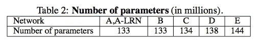
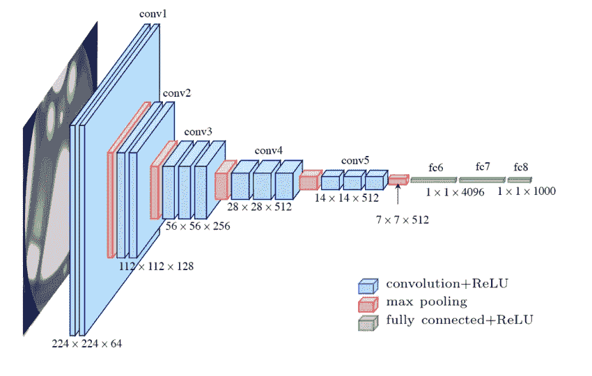
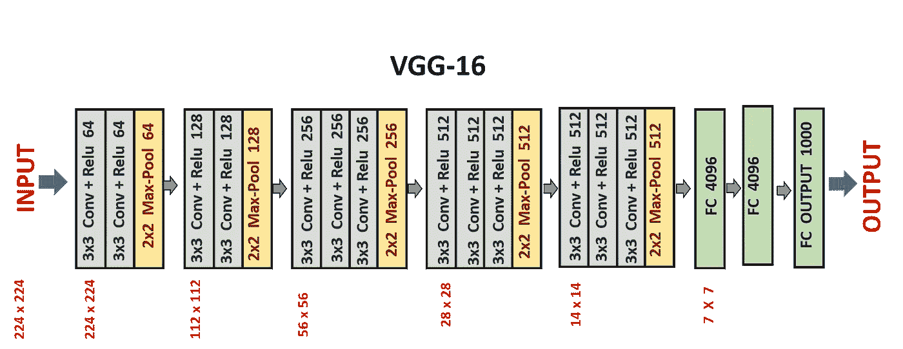
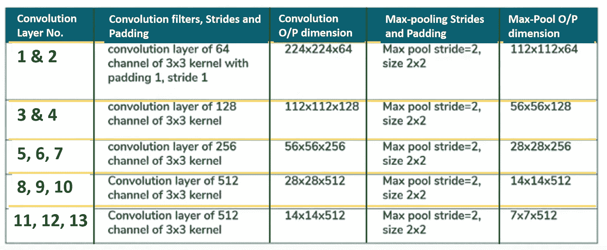
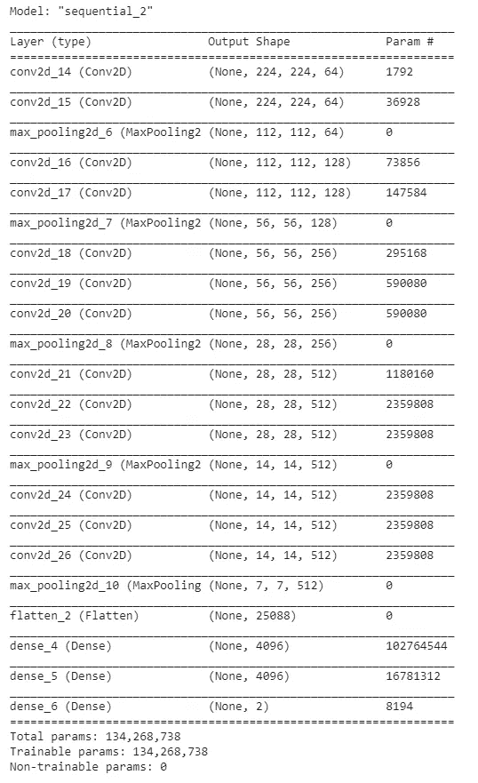
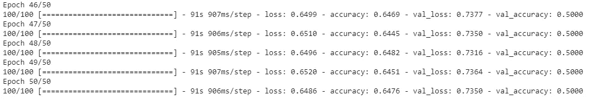
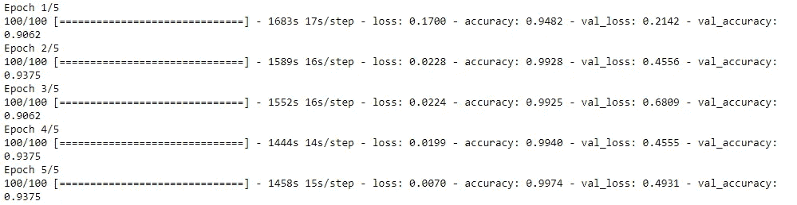

# VGG-16 的体系结构和实现

> 原文：<https://pub.towardsai.net/the-architecture-and-implementation-of-vgg-16-b050e5a5920b?source=collection_archive---------0----------------------->

## [机器学习](https://towardsai.net/p/category/machine-learning)

V **GG** 是牛津大学视觉几何小组的首字母缩写 **VGG-16** 是视觉几何小组提出的 16 层网络。这 16 层包含可训练参数，还有其他层也像最大池层，但那些不包含任何可训练参数。该架构是 2014 年视觉识别挑战赛的亚军，即 ***ILSVRC-2014*** ，由****Simon Yan***和 ***Zisserman*** 开发。*

*VGG 研究组发布了从 VGG11 到 VGG19 的一系列卷积网络模型。VGG 深度小组的主要目的是了解卷积网络的深度如何影响大规模图像分类和识别模型的准确性。与具有 16 个卷积层和 3 个全连接层的最大 VGG19 相比，最小 VGG11 具有 8 个卷积层和 3 个全连接层。vgg 的不同变体在最后三个完全连接的层中完全相同。整体结构包括 5 组卷积层，后面是一个最大池。但不同之处在于，随着深度的增加，即从 VGG11 到 VGG19，越来越多的级联卷积层被添加到五组卷积层中。*

*下图是 VGG 创建的不同模型的整体网络配置，这些模型使用相同的原理，只是深度不同。*

**

***来自原始纸张的图像-参考文献[1]***

*从上面代表不同网络的比较表中，我们可以看到，随着模型从简单到复杂，网络的深度也在增加。这是解决任何问题的最佳方式，也就是说，用一个更简单的模型解决问题，然后通过使它变得复杂来逐步优化它。*

*下图显示了不同型号中可训练参数的数量:*

**

***来自原始纸张的图像-参考文献[1]***

*在这里，我们将深入探索 VGG 16 号的建筑。*

**

***来自 Researchgate.net 的 VGG 16 号的建筑图片***

*在上图中，所有蓝色矩形代表卷积层以及非线性激活函数，它是一个校正的线性单元(或 ReLU)。从图中可以看出，有 13 个蓝色和 5 个红色矩形，即有 13 个卷积层和 5 个最大池层。除此之外，还有 3 个绿色矩形，代表 3 个完全连接的层。因此，具有可调参数的总层数为 16 层，其中 13 层用于卷积层，3 层用于全连接层，因此命名为 VGG-16。在输出端，我们有一个 softmax 层，在 imagenet 数据集中每个图像类别有 1000 个输出。*

*在这种架构中，我们从一个非常低的通道大小(64)开始，然后在每个最大池层之后逐渐增加 2 倍，直到达到 512。*

*VGG-16 的扁平架构如下图所示:*

**

***作者图片***

*架构非常简单。它有 2 个由 2 个卷积层组成的连续块，后跟一个最大池，然后有 3 个由 3 个卷积层组成的连续块，后跟一个最大池，最后，我们有 3 个密集层。后 3 个卷积层在不同的架构中具有不同的深度。*

*这里要分析的重要一点是，每次最大池化之后，大小都会减半。*

# *VGG-16 网络的特点*

1.  ***输入层:**接受彩色图像作为输入，尺寸为 224 x 224，3 个通道，即红、绿、蓝。*
2.  ***卷积层:**图像通过一堆卷积层，其中每个卷积滤波器都有一个 3 x 3 的非常小的感受野和 1 的步幅。每个卷积核使用行和列填充，以便输入和输出特征图的大小保持不变，或者换句话说，执行卷积后的分辨率保持不变。*
3.  ***最大池:**它在大小为 2 x 2 的最大池窗口上执行，跨距等于 2，这意味着这里的最大池窗口是非重叠窗口。*
4.  *并非每个卷积层后面都有一个最大池层，因为在某些地方，一个卷积层后面是另一个卷积层，中间没有最大池层。*
5.  *前两个完全连接的层各有 4096 个通道，第三个完全连接的层(也是输出层)有 1000 个通道，每个通道用于 imagenet 数据库中的一类图像。*
6.  *隐藏层的激活函数是 ReLU。*

> ***注意:**这里要注意的一件重要事情是，我们使用了 3 x 3 的内核大小，这是捕捉左/右、上/下和中心概念的最小可能大小。此外，两个 3 × 3 卷积层(中间没有空间汇集或最大汇集)的堆叠具有 5×5 的有效感受野，并且相同的三个 3 × 3 卷积层具有 7 × 7 的有效感受野。*

## ***让我们从数学上来理解这个:***

> *用于计算每个卷积层的输出大小的公式如下- [(N-f)/S] + 1*

*假设我们有一个形状为 224 x 224 的输入，具有 K 个通道，即 224 x 224 x K。我们将使用步长=1 的不同大小的内核来应用卷积。*

## *情况 1:当我们的内核大小为 3×3 时*

*   ***第一次卷积后***

*N = 224，f = 3，S = 1*

*输出形状**=**[(N-f)/S]+1**=**[(224–3)/1]+1**=**222*

*   ***第二次卷积后***

*N = 222，f = 3，S = 1*

*输出形状**=**[(N-f)/S]+1**=**[(222–3)/1]+1**=**220*

*   ***在第三个卷积后***

*N = 220，f = 3，S = 1*

*输出形状**=**[(N-f)/S]+1**=**[(220–3)/1]+1**=**218*

*因此，在三次同时卷积之后，我们得到了大小为 **218 x 218 x K** 的输出*

## *案例 2:当我们的内核大小为 7×7 时*

*N = 224，f = 7，S = 1*

*输出形状**=**[(N-f)/S]+1**=**[(224–7)/1]+1**=**218*

*因此，仅在一次卷积之后，我们就获得了大小为 **218 x 218 x K** 的输出*

*因此，看着上面的两种情况，我们说三个 3 × 3 卷积层具有 7 × 7 的有效感受野。*

## *内核大小为 3 x 3 的优势*

1.  *因为我们知道的卷积层数越多，与层数较少时相比，从输入中提取的特征就越清晰。因此，具有 3×3 的内核大小将导致比 7×7 的内核大小更好的特征提取。*
2.  *当我们取 3×3 内核大小时，可训练参数的数量将是 27K，相比之下，当取 7×7 内核大小时，给出 49K 可训练参数，多 81%。*

## *从每个图层获取输出大小所涉及的计算*

*下表总结了 VGG-16 的完整结构:*

**

***作者图片***

****输入图层* :***

*   *输入图像的尺寸为 **224 x 224** 。*

****卷积层- 1* :***

*   ***输入大小= N =** 224*
*   ***过滤器尺寸= f =**3×3*
*   *过滤器的数量= 64*
*   ***步幅= S =** 1*
*   ***填充= P =** 1*
*   ***输出特征图大小=**[(224–3+2)/1]+1**=**224*
*   ***带通道的输出=** 224 x 224 x 64*

****卷积层- 2* :***

*   ***输入大小= N =** 224*
*   ***过滤器尺寸= f =** 3 x 3*
*   *过滤器的数量= 64*
*   ***大踏步= S =** 1*
*   *填充= P = 1*
*   ***输出特征映射大小=**[(224–3+2)/1]+1**=**224*
*   ***通道输出=** 224 x 224 x 64*

****最大池层- 1* :***

*   ***输入大小= N =** 224*
*   ***滤镜尺寸= f =** 2 x 2*
*   *步幅= S = 2*
*   ***Padding = P =** 0*
*   ***输出特征图大小=**[(224–2+0)/2]+1**=**112*
*   ***带通道的输出=**112×112×64*

****卷积层- 3* :***

*   ***输入大小= N =** 112*
*   ***过滤器尺寸= f =** 3 x 3*
*   ***过滤器数量= 128***
*   ***大踏步= S =** 1*
*   ***填充= P =** 1*
*   ***输出特征图大小=**[(112–3+2)/1]+1**= 112***
*   ***通道输出=** 112 x 112 x 128*

****卷积层- 4* :***

*   ***输入大小= N =** 112*
*   ***过滤器尺寸= f =**3×3*
*   *过滤器数量= 128*
*   ***大步数= S =** 1*
*   ***填充= P =** 1*
*   ***输出特征图 size =**[(112–3+2)/1]+1**=**112*
*   ***通道输出=** 112 x 112 x 128*

****Max-Pooling Layer-2*:***

*   ***输入大小= N =** 112*
*   ***过滤器尺寸= f =** 2 x 2*
*   *2 大踏步*
*   ***Padding = P =** 0*
*   ***输出特征图大小=**[(112–2+0)/2]+1**=**56*
*   ***通道输出=**56×56×128*

****卷积层- 5* :***

*   ***输入大小= N =** 56*
*   ***过滤器尺寸= f =**3×3*
*   *过滤器数量= 256*
*   ***大步数= S =** 1*
*   ***填充= P =** 1*
*   ***输出特征图大小=**[(56–3+2)/1]+1**=**56*
*   ***带通道的输出=**56×56×256*

****卷积层- 6* :***

*   ***输入大小= N =** 56*
*   ***过滤器尺寸= f =** 3 x 3*
*   *过滤器数量= 256*
*   *步幅= S = 1*
*   ***1***
*   ***输出特征图 size =**[(56–3+2)/1]+1**=**56*
*   ***通道输出=** 56 x 56 x 256*

****卷积层- 7* :***

*   ***输入大小= N =** 56*
*   ***过滤器尺寸= f =** 3 x 3*
*   *过滤器数量= 256*
*   *大踏步= S = 1*
*   *填充= P = 1*
*   ***输出特征图大小=**[(56–3+2)/1]+1**=**56*
*   ***输出通道数=**56×56×256*

****Max-Pooling Layer-3*:***

*   ***输入大小= N =** 56*
*   ***过滤器尺寸= f =** 2 x 2*
*   ***大步数= S =** 2*
*   ***填充= P =** 0*
*   ***输出特征图大小=**[(56–2+0)/2]+1**=**28*
*   ***带通道的输出=**28×28×256*

***将对网络的其余部分进行类似的计算。***

# *VGG-16 和 AlexNet 的区别*

1.  *与 VGG-16 相比，其中所有卷积核的大小都是统一的 3×3，跨距为 1，AlexNet 具有可变大小的卷积核，如 5×5 和 3×3。*

*虽然 AlexNet 使用不同大小的多个核，但是不同大小的每个卷积核的实现可以使用多个 3×3 大小的核来完成。*

> *探索 VGG16 架构的代码*

***任务-** 将图像分成两类- ***猫*** 和 ***狗****

***有两种方法可以完成这项任务-***

1.  *从头开始编写代码*
2.  *使用在 imagenet 数据集上训练的预训练 VGG16 模型*

***方法-1: W *从头开始编写 VGG16 架构代码****

## **导入库:*

## **增加训练和测试数据集*

## **模型的创建*

## **模型摘要*

**总结的输出如下:**

**

## **模型的编译*

## **拟合模型*

**拟合的输出如下:**

**

## **加载图像进行测试*

**待预测的图像如下:**

**

## **将加载的图像转换成数组*

## **预测加载图像的标签*

**输出将-* ***猫****

***方法-2: U *唱出在 imagenet 数据集上训练的预训练 VGG16 模型****

## **直到增强，步骤将与上述方法相同*

> *现在，首先需要下载预训练 VGG16 模型的权重。*

## **从预先训练的模型中下载重量*

**第一次运行时，上述代码会将权重下载到我们的本地系统，因此第一次运行上述代码将需要一些时间来执行，因为下载的权重大约为 528 Mb，当您再次运行相同的代码时，将需要几秒钟的时间来执行，因为这次权重将被本地加载，并使模型在几秒钟内即可使用**

## *注意:*

*   *从上面的总结中，我们可以看到，我们已经把`include_top = False`因此，我们没有密集层在我们的总结。*
*   *此外，我们输入了`weights="imagenet"`,这意味着我们需要在 imagenet 数据集上训练的 VGG-16 模型的权重*
*   *正如我们所说的`include_top = False`，这就是为什么必须指定`input_shape`参数的原因。*

## **防止训练 13 个卷积层*

## **模型的创建*

## **编译模型*

## **拟合模型*

**拟合的输出如下:**

**

## **其余步骤将与前一方法相同*

*📌**要获得 VGG16 或任何其他网络的完整代码，请访问我的** [**GitHub 资源库**](https://github.com/vaibhavcodes/DeepLearning-Architectures) **。***

****参考文献****

*[1]卡伦·西蒙扬*和安德鲁·齐泽曼，[用于大规模图像识别的极深度卷积网络](https://arxiv.org/pdf/1409.1556.pdf)，2015 年 ICLR 会议论文*

> *感谢阅读。希望这篇博客对你的编码和理解架构有所帮助。😃*