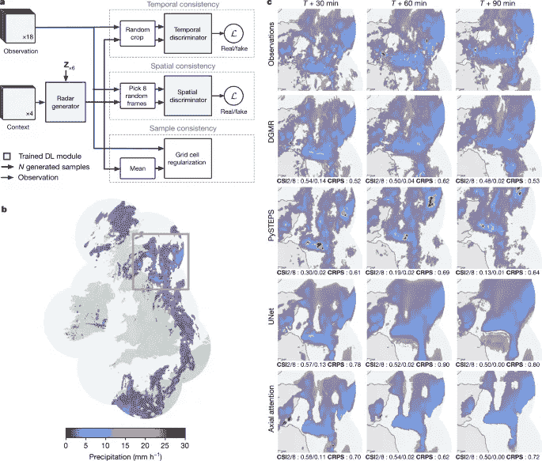
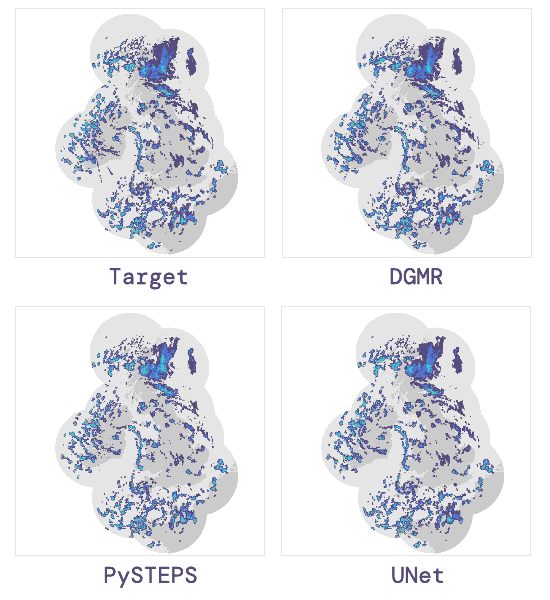

# DeepMind 的近实时天气预报模型背后的架构

> 原文：<https://pub.towardsai.net/the-architecture-behind-deepminds-model-for-near-real-time-weather-forecasts-df1f8aba1d9d?source=collection_archive---------0----------------------->

## [机器学习](https://towardsai.net/p/category/machine-learning)

## 雨水深度生成模型(DGMR)是 DeepMind 的最新产品，可以预测短期内的降雨量。

来源:[https://technohubnewzz . blogspot . com/2021/10/artificial-intelligence-can-forecast-if . html](https://technohubnewzz.blogspot.com/2021/10/artificial-intelligence-can-forecast-if.html)

> 我最近创办了一份专注于人工智能的教育时事通讯，已经有超过 10 万名订户。《序列》是一份无废话(意思是没有炒作，没有新闻等)的 ML 导向时事通讯，需要 5 分钟阅读。目标是让你与机器学习项目、研究论文和概念保持同步。请通过订阅以下内容来尝试一下:

 [## 序列

### 订阅人工智能世界中最相关的项目和研究论文。受到 102，000 多人的信任…

thesequence.substack.com](https://thesequence.substack.com/) 

上周，DeepMind 通过发布另一项开创性的深度学习研究再次制造了新闻。[在《自然》杂志](https://www.nature.com/articles/s41586-021-03854-z)发表的一篇论文中，DeepMind 提出了一个 1-2 小时降水预报(临近预报)的模型。今天，我想讨论一下 DeepMind 模型所使用的架构的一些方面。

几乎从最大似然技术出现以来，天气预报就是它的经典问题之一。虽然今天我们有强大的预测模型，能够提前几天准确预测天气状况，但大多数模型都难以进行短期预测。这种类型的预测在农业或交通运输等领域非常重要，因为短期天气变化会对这些领域产生重大影响。为了应对临近预报场景中的挑战，DeepMind 依赖于一种非常传统的深度学习技术。

# 临近预报的生成模型

从功能的角度来看，DeepMind 模型侧重于根据雷达图像进行预测。更具体地，该模型基于雷达图像预测雷达图像。对于这个场景，DeepMind 使用了一种被称为深度生成模型(DGMs)的深度学习方法。为了让事情更简单，DeepMind 将其模型称为雨的深度生成模型(DGMR)。

图片来源:DeepMind

dgm 是统计模型，它学习数据的概率分布，并可以根据学习到的分布生成新的样本。dgm 特别适合于天气预报，因为它们不仅能够从特定的分布中学习，而且能够在空间和时间设置中表示不确定性。

DeepMind 的 DGM 基于一个生成器，该生成器使用两个区分网络和一个附加的正则化层进行训练。这两个鉴别器分别关注时间和空间数据。这两个组件都是基于具有半相同结构的生成对抗网络(GANs)。正则化层包括为防止过度拟合而设计的特殊注意块。

图片来源:DeepMind

DeepMind 评估了其用于中雨和大雨预测的生成模型，并将结果提交给了许多气象学家，他们更喜欢 DGMR 而不是其他预测。下面你可以看到 DGMR 的预测和替代方法平流方法(PySTEPS)和确定性深度学习方法(UNet)之间的比较。

图片来源:DeepMind

DGMR 代表了临近预报场景的相关发展，也是深度学习方法如何在这些领域提供帮助的首要例子。在 DGMR 使用的一些技术可能会在这个具有挑战性但重要的领域激发出新的模式。