# LeNet-5 的体系结构与实现

> 原文：<https://pub.towardsai.net/the-architecture-implementation-of-lenet-5-eef03a68d1f7?source=collection_archive---------1----------------------->

## [深度学习](https://towardsai.net/p/category/machine-learning/deep-learning)

## 揭秘 LeNet-5 最古老的神经网络架构

【Faz.net 图片来自

T 他非常古老的神经网络架构是由法裔美国计算机科学家 *Yann André LeCun、Leon Bottou、Yoshua Bengio、*和 *Patrick Haffner* 于 1998 年开发的。这种体系结构是为识别手写和机器打印的字符而开发的。它是其他深度学习模型的基础。

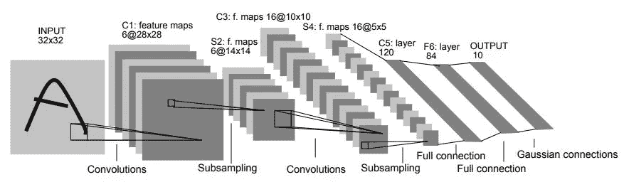

[原图发表于【乐存等，1998】](http://yann.lecun.com/exdb/publis/pdf/lecun-01a.pdf)

该架构总共由 7 层组成，包括 2 组卷积层和 2 组平均池层，之后是平坦卷积层。之后，我们有 2 个密集的全连接层，最后是一个 softmax 分类器。

## 输入层

如果我们取一个标准的 MNIST 图像来理解，那么我们有一个(32×32)灰度图像的输入，它通过第一个卷积层，具有 6 个特征图或滤波器，具有(5×5)核的大小，步长为 1。对输入像素的值进行归一化处理，使白色背景和前景黑色分别对应于 **-0.1** 和 **1.175** ，使 ***的均值近似为 0*** ，使 ***的方差近似为 1*** 。

> 该输入层不计入 LeNet-5 的网络结构中，因为传统上，输入层不被认为是网络层级之一。

## 第一层

用 6 个滤波器对输入图像进行卷积的结果必须导致尺寸从(32×32×1)变化到(28×28×6)，并且我们得到我们的**第一层**。因此，当对我们的输入图像应用 6 个滤波器时，1 个通道变为 6 个通道。此外，由于内核大小为(5x5)的零填充，图像大小也减小了。

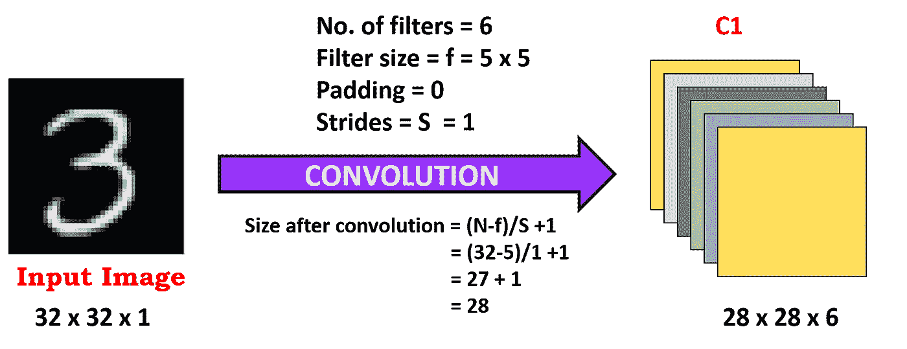

**作者图片**

## >第一层的计算

*   **过滤器尺寸= f =** 5 x 5
*   **过滤器数量= 6**
*   **大步数= S =** 1
*   **填充= P =** 0
*   **输出特征映射大小=** 28 x 28
*   **神经元数量= 28 * 28 * 6 =**4704

> 在卷积中，滤波器值是可训练的参数。

*   **学习参数数量= *(权重+偏差)每个滤波器*滤波器数量***

= **(5 * 5 + 1) * 6 =** 156

其中， **5 * 5 = 25** 为*单位参数*和 **1** 每滤波器的*偏差，我们总共有*个*滤波器 **6 个**滤波器*

*   ***连接数量= 156** 28 * 28*=**122304*

## *>详细描述:*

1.  *对输入图像应用第一次卷积运算(使用大小为 5×5 的 6 个卷积核)以获得 6 个 C1 特征图(6 个特征图，每个大小为 28×28)，其中大小通过 **(N-f+2P)/S+1** 获得，但是这里 **P=0** 并且 **S=1，**因此我们在整个内容中使用 **N-f+1** 。因此，卷积后的输出大小为 32–5+1 = 28。*
2.  *让我们看看需要的参数数量。卷积核的大小为 5×5，共有 6 * (5 * 5 **+ 1** ) = 156 个参数，其中 ***+1 表示核有偏差*** 。*
3.  *对于卷积层 **C1** ，C1 每个像素连接 5 * 5 个像素，1 个偏置，所以总共有 156 * 28 * 28 = 122304 个连接。虽然有 1，22，304 个连接，但我们只需要学习 156 个参数，主要通过权重共享。*

## *第二层*

*在**第二层**中，我们实现了一个平均池层，过滤器大小为(2x2)，跨距为 2。因此，生成的图像尺寸将减小到(14x14x6)。这里，每个特征地图中的每个单元都连接到**2×2)**C1 的相应特征地图中的邻域。*

*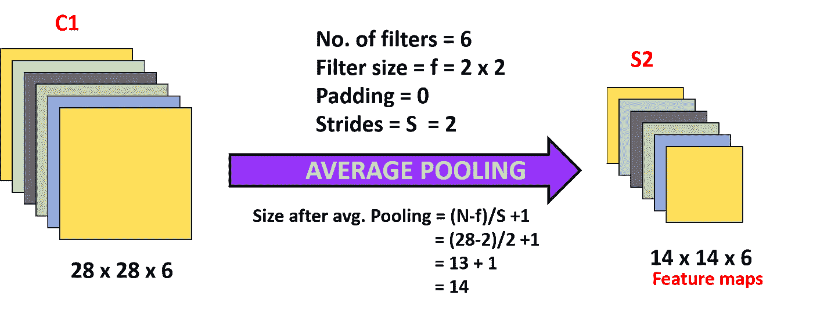*

***作者图片***

## *>第二层的计算*

*   ***过滤器尺寸= f =**2×2*
*   *过滤器的数量= 6*
*   *步幅= S = 2*
*   ***填充= P =** 0*
*   ***输出特征图尺寸=**14×14*
*   *神经元的数量= 14 * 14 * 6 =1176*

> *将 **4 个**输入从*中的相应特征映射添加到 **S2** 中的一个单元，然后乘以一个**可训练系数**，并添加一个**可训练偏差**。然后结果通过一个 s 形激活函数，我们得到结果 **Q****

**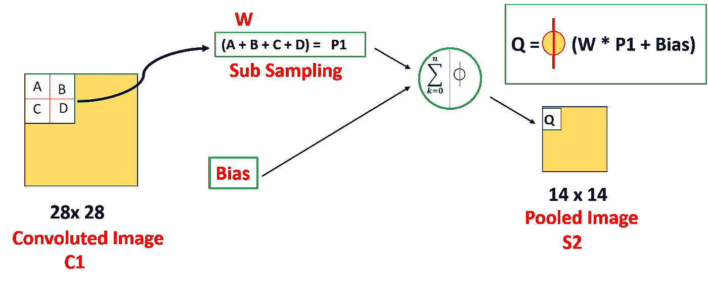**

****作者图片****

*   ****学习参数个数= *(系数+偏差)*滤波器个数*****

**= **(1+ 1) * 6 =** 12**

**其中，第一个 **1** 为汇集对应的 2×2 感受野的*权重，第二个 **1** 为*偏差*。***

*   ****连接数=(2 * 2+1)* 14 * 14 * 6 = 5880****

## **>详细描述:**

1.  **在第一次卷积之后，立即进行汇集操作。使用 2 * 2 个核进行池化，并且获得 6 个 14 * 14 的 S2 特征图。**
2.  **S2 的池层是 C1 ***中 2 * 2 区域像素的平均值乘以一个权重系数再加上一个偏移或偏置*** ，然后结果再次映射。**
3.  **所以每个池核心都有两个训练参数，因而在 ***中总共有 2*6 = 12 个训练参数，但是有 5*14*14*6 = 5880 个连接。*****

## **第三层**

**如果我们进一步进行到**第三层**，我们将内核大小为(5x5)的 **16** 滤镜应用到 **S2** 上，产生一个卷积层 **C3** 和 **16** *特征贴图。*这个卷积导致图像的尺寸从 ***S2*** 中的***(14×14×6)****变为****【C3***中的***10×16】****。***

**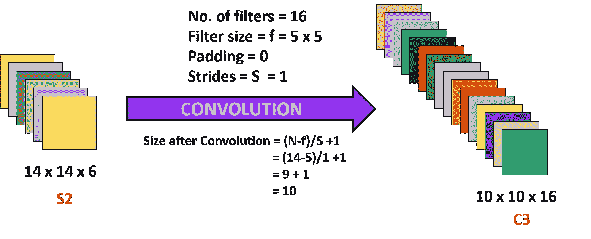**

****作者图片****

## **>第三层的计算**

*   ****过滤器尺寸= f =**5×5**
*   **过滤器数量= 16**
*   ****大步数= S =** 1**
*   ****填充= P =** 0**
*   ****输出特征图尺寸=**10×10**
*   **神经元数量= 10 * 10 * 16 =1600**

**这里我们可以看到输入即 **S2** 有 **6** 层，输出即 **C3** 有 16 层。因此，我们不能直接将每个输入层映射到输出层。因此，每个特征地图中的每个单元，即 **C3** 都连接到**5 x 5)**S2 特征地图子集中相同位置的几个邻域。**

> **来自 S2 的不同输入特征地图选择的组合将允许提取更多的新特征。**

**从 **S2** 拍摄的特征地图的不同组合如下图所示:**

1.  *****从来自 S2 的 3 幅特征地图的每个相邻子集获取输入:***C3 的前 6 个卷积层用该组合制成。**
2.  *****从来自 S2 的 4 个特征图的每个相邻子集获取输入:-***C3 的接下来 6 个卷积层用该组合制成。**
3.  *****从来自 S2 的 4 个特征地图的不连续子集获取输入:-*** 接下来的 3 个 C3 层用这个组合制作。**
4.  *****取所有的特征图:-****C3 最后的*图层就是用这个组合做出来的。**

**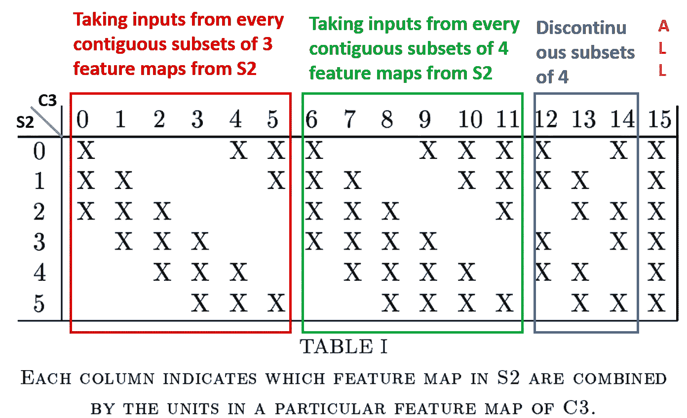**

**[**原图发表于【乐存等著，1998】**](http://yann.lecun.com/exdb/publis/pdf/lecun-01a.pdf)**

*   ****学习参数个数= *(组合类型-1 中的参数)+(组合类型-2 中的参数)+(组合类型-3 中的参数)+(组合类型-4 中的参数)*****

**=**[6 *(5 * 5 * 3+1)]+[6 *(5 * 5 * 4+1)]+[3 *(5 * 5 * 4+1)]+[1 *(5 * 5 * 6+1)]****

**= 456 + 606 + 303 + 151 = **1516****

> *****注:-*** *以上计算中，括号中与 5*5 一起使用的数字 3、4、4、6 基本上就是* ***深度。*****

*   ****连接数量=**1516 *(10 * 10)**= 151600****

## **第四层**

**在**第四层，**我们将再次应用平均池层，过滤器大小为(2x2)，步长为 2。因此，生成的图像具有平均池的结果，其大小为(5x5x16)。这里 **S4** 的每个特征地图中的每个单元都连接到 **C3 的相应特征地图中的( **2 x 2)** 邻域。****

**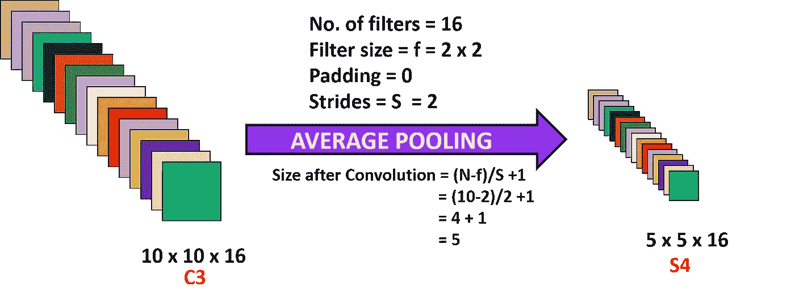**

****作者图片****

## **>第四层的计算**

*   ****过滤器尺寸= f =**2×2**
*   **过滤器的数量= 16**
*   **跨度= S = 2**
*   ****填充= P =** 0**
*   ****输出特征图尺寸=**5×5**
*   ****神经元数量= 5*5*16 = 400****
*   ****学习参数数量= *(系数+偏差)*滤波器数量*****

**= **(1+ 1) * 16 =** 32**

**其中，第一个 **1** 为汇集对应的 2×2 感受野的*权重，第二个 **1** 为*偏差*。***

*   ****连接数=(2 * 2+1)* 5 * 5 * 16 = 2000****

**这完成了 2 次卷积运算和 2 次汇集运算。**

## **第五层**

**在**第五层**中，我们有一个 ***全连通卷积层 C5*** ，它有 120 个神经元单元，C5 的每个单元都连接到所有 16 个 S4 特征图上的(5×5)邻域，即 C5 的每个单元都连接到 S4 的所有特征图上，因此 ***C5*** 被称为 ***全连通卷积层。*****

> **C5 被命名为**“全连接卷积层”**，而不是简单的**“全连接层”**，因为如果 LeNet-5 的输入大小增加，而保持其他一切不变，则 C5 层中的特征映射的维度将大于(1 x 1)。**

**所以在第四层，得到的维度是(5x5x16)，所以总节点是 5x5x16 = 400 个神经元。这意味着，400 个节点连接到 120 个节点，形成一个密集的全连接网络。**

**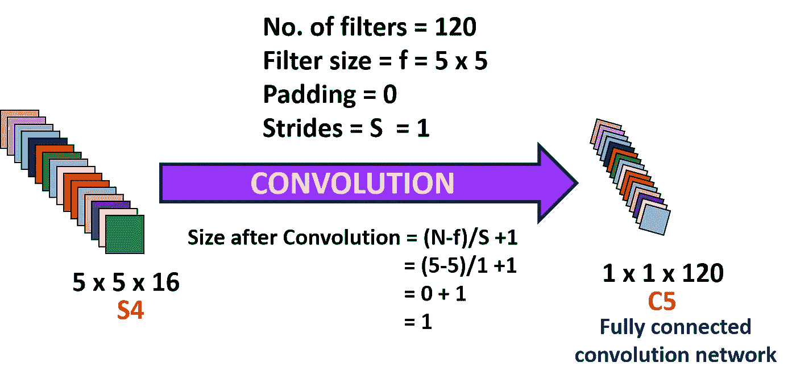**

****作者图片****

## **>第五层的计算**

*   ****过滤器尺寸= f =**5×5**
*   **过滤器数量= 120**
*   **步幅= S = 1**
*   **填充= P = 0**
*   ****输出特征图尺寸=**1×1**
*   ****神经元数量= 1*1*120 =** 120**
*   ****学习参数个数=(5 * 5 * 16+1)* 120 =**48120**
*   ****连接数量= 48120 * 1 * 1 = 48120****

## **第六层**

****第六层 F6** 由 84 个神经元 ***与*** 和 **C5** 完全连接而成。这里，执行输入向量和权重向量之间的点积，然后向其添加偏差。然后，结果通过一个 s 形激活函数。**

**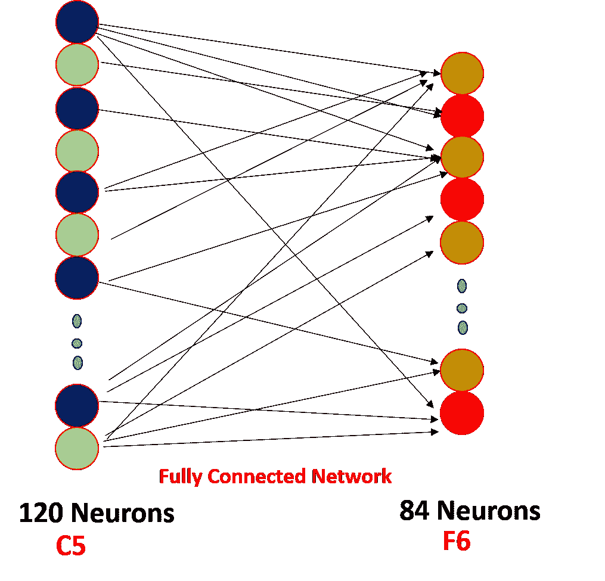**

****作者图片****

## **>第六层的计算**

*   ****输入:** C5 有 120 个神经元**
*   ****输出:**有 84 个神经元的 F6**
*   ****学习参数个数=(120 * 84)+84 = 10164****

****F6 层**的神经元个数选择为 **84** ，对应一个**7×12 位图**， **-1** 表示**白色**， **1** 表示**黑色**，所以每个符号位图的黑白对应一个代码。这种表示对于识别从可打印的 **ASCII** 集中提取的字符串非常有用。与大写 O、0 和小写 O 相似且容易混淆的字符将具有相同的输出代码。**

**ASCII 编码集如下所示:**

**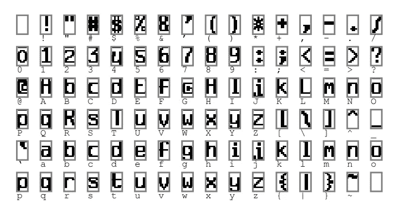**

**[**原图发表于【乐存等著，1998】**](http://yann.lecun.com/exdb/publis/pdf/lecun-01a.pdf)**

**和**最后是**，我们有一个完全连接的 softmax 输出层，它有 10 个可能的值，对应于从 ***0 到 9 的数字。*****

**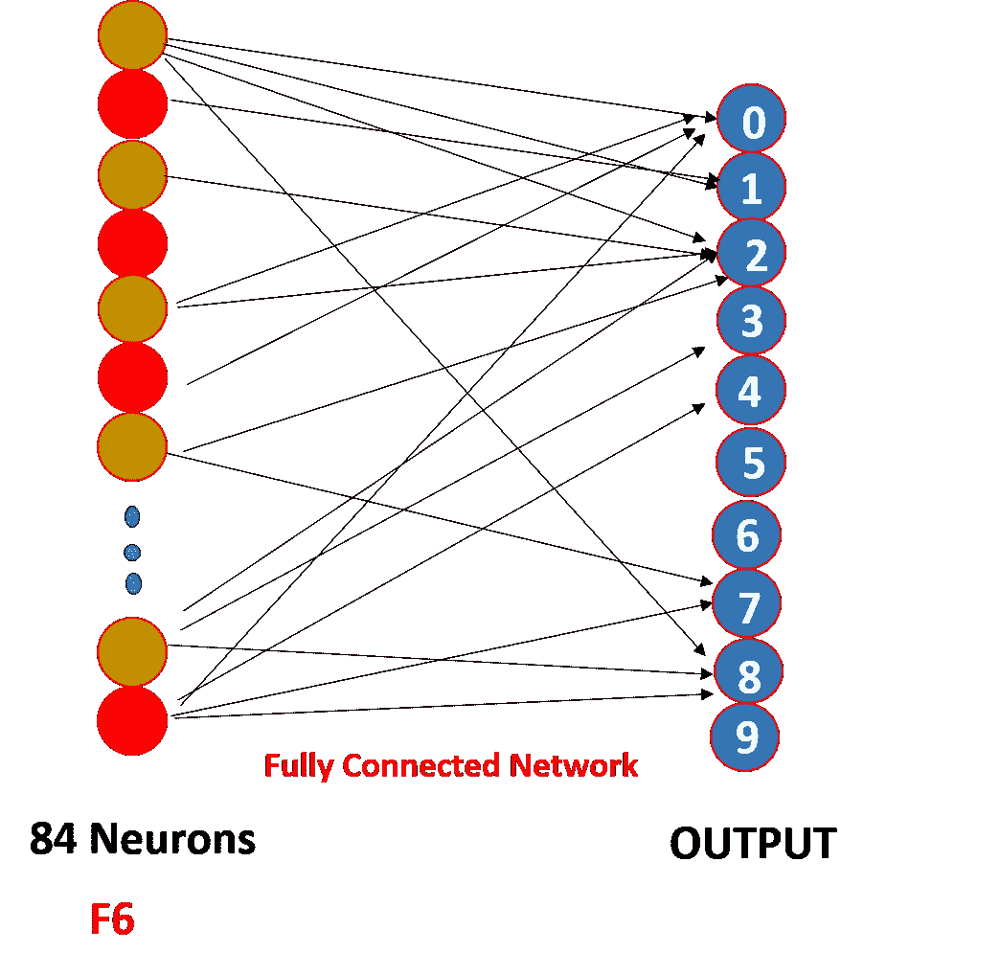**

****作者图片****

> ****因此，我们在输出层使用了“softmax activation”函数，我们看到其他层使用“tanh”作为激活函数，因为 softmax 将在最后给出每个输出类出现的概率。****

> **我们现在正冒险进入编码领域。**

# **使用 Keras 实现 LeNet-5**

**在我们开始通过代码实现 LeNet-5 之前，有几个要点需要记住:**

1.  **LeCun 使用的输入大小为 **(32 x 32)** ，但是由于我们将使用 MNIST 数据集，因此该数据集中的图像大小为 **(28 x 28)。**因此，我们的输入大小是 **(28 x 28)** 。**
2.  **当 LeCun 应用第三卷积，即 **C5、**时，输入大小为**(5×5)**，但是从最初开始，只有我们对网络的输入大小小于 LeCun 的输入大小，因此，在我们的情况下， **C5** 的输入大小将为**(4×4)**，并且使用**(5×5)**滤波器对该输入应用卷积将导致负维大小，这是不可能的，因此**

## **导入库**

****导入的库****

## **加载数据集并执行训练测试分割**

****拆分成列车并测试****

## **检查火车和测试分裂的大小**

****列车和测试的尺寸****

**上述代码的输出如下所示:**

**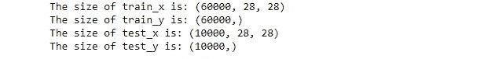**

****列车和试拼的形状****

## **执行整形操作-转换为四维**

****图像值的整形****

## **将图像转换的值归一化在 0 和 1 之间**

****归一化图像值****

## **一键编码标签**

****标签的一个热编码****

## **构建模型架构**

****模型架构****

## **模型概述**

*   **这里大约有 45，000 个可训练参数，从后续图像中可以看出。**

**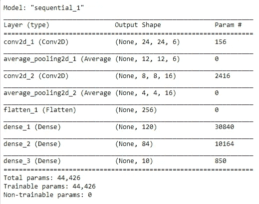**

****型号总结****

## **模型的编译**

****编译模型****

> **最后，谈一谈评估你的模型。**

## **寻找模型的损失和准确性**

****模型的损失和精度****

**损耗和精度的输出如下:**

**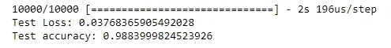**

****模型的损失和准确性-** 作者图片**

**📌**要获得 LeNet-5 或任何其他网络的完整代码，请访问我的** [**GitHub 库**](https://github.com/vaibhavcodes/DeepLearning-Architectures) **。****

*****参考文献:*****

**[1] Yann LeCun，[基于梯度的学习应用于文档识别](http://yann.lecun.com/exdb/publis/pdf/lecun-01a.pdf) (1998)，IEEE 学报(1998)**

> **感谢阅读。希望这篇博客对你的编码和理解架构有所帮助。😃**