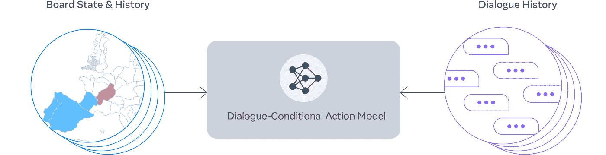
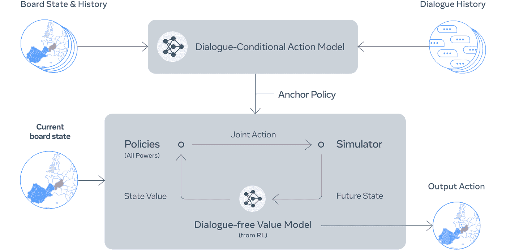
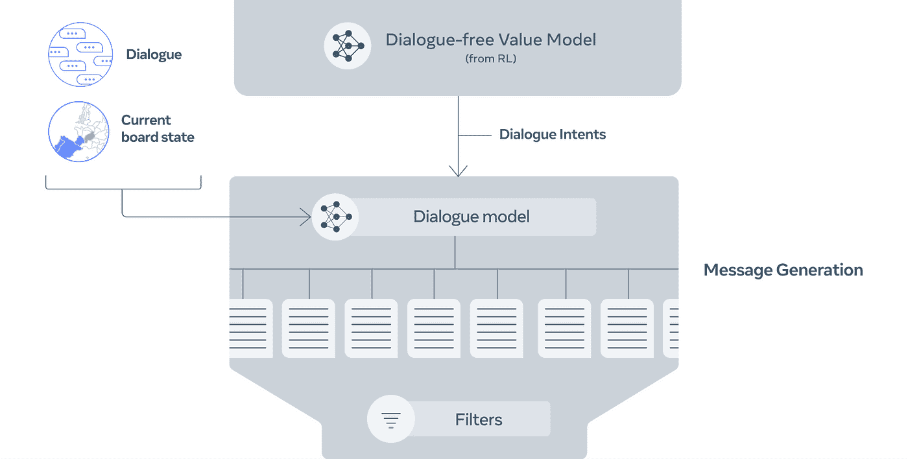
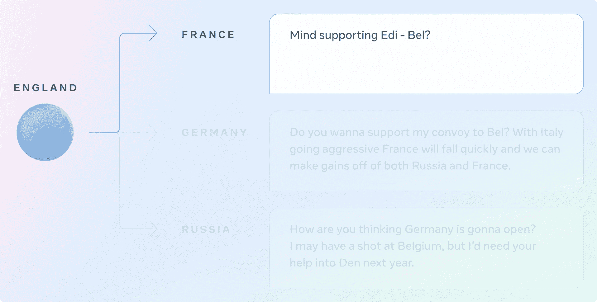

# 谈判的艺术:西塞罗·艾

> 原文：<https://pub.towardsai.net/the-art-of-negotiation-cicero-ai-6e04354fe990?source=collection_archive---------2----------------------->

自从深蓝战胜特级大师加里·卡斯帕罗夫，以及最近 OpenAI 的 OpenAI Five 称霸 DOTA 2 和 *Pluribus* 玩扑克的 AI 智胜人类以来，我们已经取得了很大进展。游戏玩家人工智能的最新版本是 Meta 的西塞罗人工智能。这个突破性的人工智能玩的是外交游戏。西塞罗是开创性的，因为外交游戏的复杂性很高。它包括与玩家的对话，联合攻击，以及许多其他可以在“谈判”的保护伞下考虑的行动。

11 月 22 日，Meta 宣布，

> 今天，我们宣布在构建掌握这些技能的人工智能方面取得了突破。我们已经建立了一个代理人——[西塞罗](https://ai.facebook.com/research/cicero/)——这是第一个在流行的战略游戏外交*中实现人类水平性能的人工智能。西塞罗通过玩在线版游戏 webDiplomacy.net 证明了这一点，西塞罗的平均得分是人类玩家的两倍多，并且在玩一个以上游戏的参与者中排名前 10%。

或许，扑克和外交有很多相似之处。这些游戏是关于玩人而不是纸牌或一手牌。外交包括理解社会规范和发挥社交技能。这些游戏允许虚张声势，这是一种动机、策略、语言和反应的表现，以某种方式让其他玩家以对你有利的方式做出回应。

演职员表:[https://unsplash.com/@santesson89](https://unsplash.com/@santesson89)

关于人工智能如何构建的细节可以在研究论文[中找到，通过结合语言模型和战略推理](https://www.science.org/doi/10.1126/science.ade9097)在外交游戏中进行人类层面的游戏。西塞罗网站可以在[这里](https://ai.facebook.com/research/cicero/diplomacy/)找到。如果您有兴趣获得西塞罗的数据，请在此提交 RFP。西塞罗的代码是可用的( [GitHub](https://github.com/facebookresearch/diplomacy_cicero?fbclid=IwAR1FDGEhhA1KU8PUZVGquThANbEGRtRefnzyxyiBSfv89YKo4TXfQoitxXo) )。

# 西塞罗是如何建成的？

支持 CICERO 的语言模型已经在 2.7B 参数上进行了训练。这个模型所用的数据是来自互联网上在 webDiplomacy.net 上玩的 40000 个游戏的文本。使用该模型生成的对话被称为“可控对话”。CICERO 解释和计划下一次谈判的行动计划分为 4 个不同的步骤:

1.  形成初始预测
2.  完善预测和意图
3.  提出候选消息作为回复
4.  过滤回复，找出在游戏中最有“价值”的回复

第一步:西塞罗做了一个初步的预测——鸣谢:脸书人工智能博客。

第二步:西塞罗提炼预测，形成意图——鸣谢:脸书人工智能博客。

第三步:西塞罗生成候选信息——致谢:脸书人工智能博客。

第四步:西塞罗过滤输出以最大化影响/输出——鸣谢:脸书人工智能博客。

OpenAI Five-like AI 模型是使用自玩强化学习(RL)生成的，其中游戏选择随机步骤进行传播，以结果(积极或消极)结束。在每一个结果中，模型都会学习自我修正，以获得积极的结果而不是消极的结果，这是一个高度迭代的过程，游戏会不断学习比自己更好的方法来实现最积极的结果。

# piKL 模型

西塞罗使用的方法是一种混合方法，介于使用纯监督学习和无监督学习之间。Meta 开发的算法叫做 piKL。在每一步，西塞罗都会根据与其他玩家的对话预测每个人的政策。然后，西塞罗选择一个新的政策，在这一步中，给定预测的原始政策，该政策有最高的机会赢得意图。这类似于贝叶斯方法，然而，等式中的依赖性是由 AI 本身预测的。首先，通过根据当前给对手的信息预测对手的当前政策，然后利用这些政策预测来制定自己的政策，西塞罗避免了被导致损失的非常直接的“谎言”所欺骗。

# 产生对话

第一项任务是与其他参与者展开对话，从而引发回应，为政策预测提供信息，这是一项关键任务。通过使用受控词汇，西塞罗能够清晰地与其他玩家交流并制定策略。

# 对人-AI 交互意味着什么？

Meta 提到，“在一个既涉及合作又涉及竞争的游戏中，面向目标的对话系统的出现提出了重要的社会和技术挑战，以使人工智能与人类的意图和目标保持一致。”Meta 认为，他们在将语言模型与意图联系起来的工作中取得了重大进展。这种进展的一部分是确定和优先考虑的意图。Meta 希望保持这个模型的开源性，以允许其他研究人员继续利用他们已经取得的成果。

谈判信用:[https://unsplash.com/@headwayio](https://unsplash.com/@headwayio)

# 结束语:信任需要时间来赢得

像我迄今为止写的许多其他文章一样，人工智能方面的进展令人印象深刻。能够生成能够成功进行半自然对话的文本，以实现人工智能被编程要做的事情，这是一项令人印象深刻的技术成就。

然而不幸的是，我不得不使用“信任是随着时间的推移而赢得的”这个标题作为结束语。目前，我们生活在两代人之间技术差距最大的时代。婴儿潮一代和 X 世代没有成长在一个技术复杂的世界。期望他们能够识别并智胜一个专门为打败你而制造的人工智能/假角色是不现实的。即使是千禧一代和出生在科技时代的一代也遭受了不受监管和受利润驱动的社交媒体激增的影响。

Meta 希望其他研究人员能够“以负责任的方式”开发它的代码，但是我们真的能期待吗？我们需要投资于能够识别和评估社会影响的能力。这项技术可能会被用来操纵人类。我坚信，如果没有合适的护栏，这项技术将会被滥用。

如果你喜欢这篇文章或以任何方式提供了帮助，请通过按住“喜欢”按钮来分享一些爱。

请 [***成为会员***](https://ithinkbot.com/membership)*[***订阅***](https://ithinkbot.com/subscribe) 获取更多*

* [## 医疗保健隐私的生成人工智能

### Syntegra 使用基因人工智能创建准确、隐私保护的合成数据

ithinkbot.com](https://ithinkbot.com/generative-ai-for-healthcare-privacy-22994a4ec8c4)  [## 世界上最贵的药物 350 万美元！

### 药品 Hemgenix 归 CSL Behring 所有。这是治疗 b 型血友病的一剂良药，治疗费用为 3.5 美元…

ithinkbot.com](https://ithinkbot.com/worlds-most-expensive-drug-3-5-million-1e46b5abf74f)  [## GitHub CoPilot 遭遇第二起诉讼

### 第二次集体诉讼已于 11 月 10 日提交

ithinkbot.com](https://ithinkbot.com/github-copilot-hit-with-2nd-lawsuit-ed537c0b2c9a)  [## 什么是 GPT-4(什么时候？)

### GPT-4 是一个自然语言处理模型，由 openAI 作为 GPT-3 的继承者开发

pub.towardsai.net](/what-is-gpt-4-and-when-9f5073f25a6d)  [## 人工智能中的领导力:你的领导力适合数据科学吗？

### 可能已经转变为数据科学领导的非技术人员领导通常不熟悉…

pub.towardsai.net](/leadership-in-ai-is-your-leadership-fit-for-datascience-d0e9296be2d6)  [## Meta 的卡拉狄加将在 48 小时后关闭！

### 以下是关于卡拉狄加的论文摘要 NLP 被认为是一种新的开源大型语言…

ithinkbot.com](https://ithinkbot.com/metas-galactica-shuts-down-in-48-hrs-76178054f41a)*