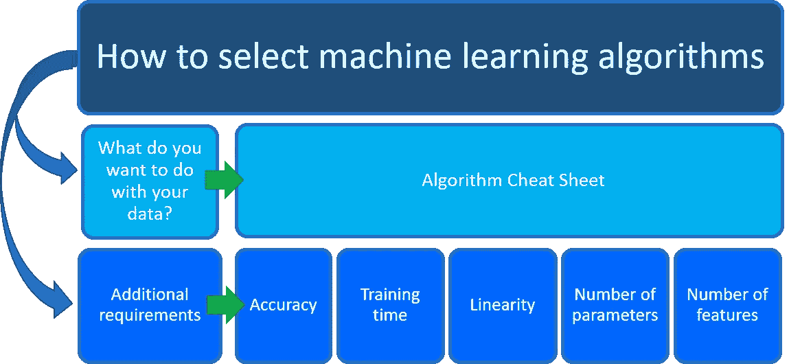
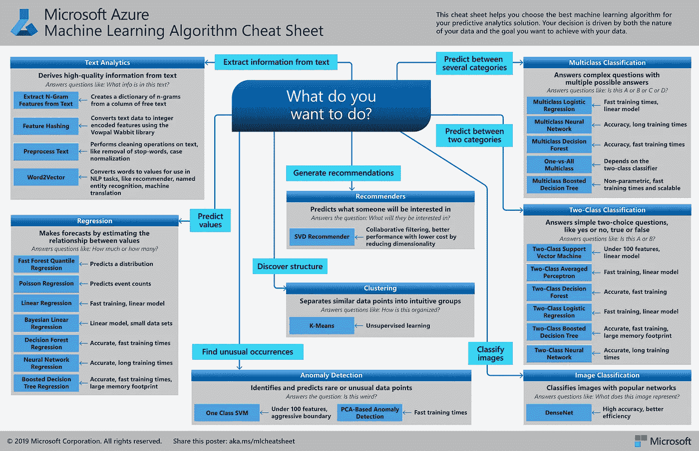
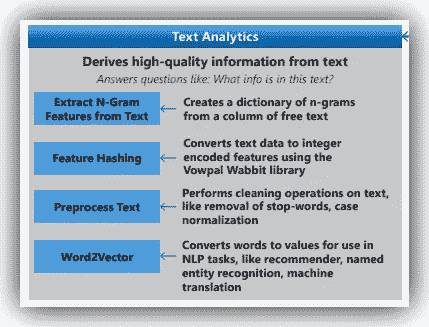
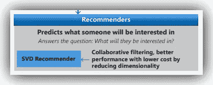
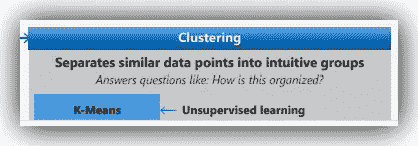
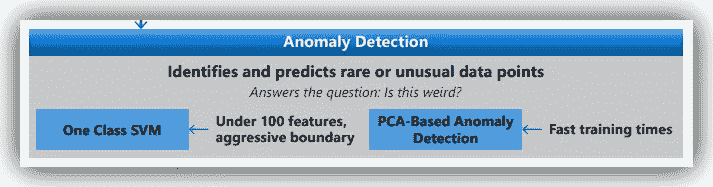
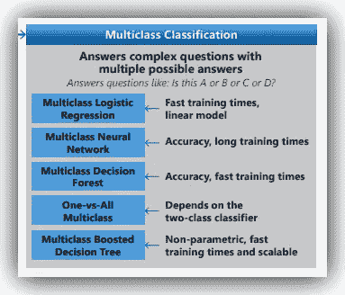
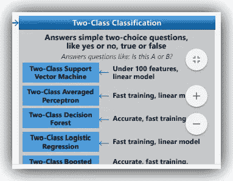
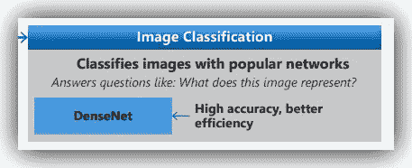
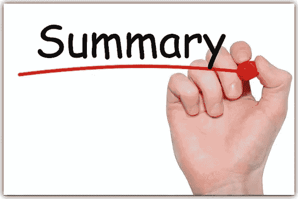

# Azure ML 算法备忘单

> 原文：<https://pub.towardsai.net/the-azure-ml-algorithm-cheat-sheet-451547832cad?source=collection_archive---------0----------------------->

## [云计算](https://towardsai.net/p/category/cloud-computing)，[机器学习](https://towardsai.net/p/category/machine-learning)

## 了解如何选择最佳的 ML 模型

数据科学中一个常见的问题是:-

> **我应该使用哪种机器学习算法？**

虽然没有能够零错误解决所有业务问题的*神奇算法*，但是您选择的算法应该取决于您的数据科学场景的两个不同部分…

[img_credit](https://docs.microsoft.com/en-us/azure/machine-learning/media/how-to-select-algorithms/how-to-select-algorithms.png)

1.  **您希望如何处理您的数据？:**具体来说，通过学习你过去的数据，你想回答的商业问题是什么？
2.  **您的数据科学场景的要求是什么**？:具体来说，您的解决方案支持的精度、训练时间、线性度、参数数量和功能数量是多少？

> ML 算法备忘单帮助您为预测分析解决方案选择最佳的机器学习算法。您的决策是由数据的性质和您希望使用数据实现的目标共同决定的。

机器学习算法备忘单由 [**微软 Azure 机器学习(AML)**](https://docs.microsoft.com/en-us/azure/machine-learning/algorithm-cheat-sheet?WT.mc_id=docs-article-lazzeri) **，**设计，专门回答这个问题:-

> 您想如何处理您的数据？

# 数据科学方法:

我必须在这里声明，我们需要对指导数据科学家使用[数据科学方法论](https://medium.com/towards-artificial-intelligence/the-data-science-methodology-50d60175a06a)解决问题的理想方法的迭代方法系统有一个坚实的理解。否则，我们可能永远不会完全理解 ML 算法备忘单的本质。

# Azure 机器学习算法备忘单:

AML 备忘单旨在作为我们尝试选择正确模型进行预测性或描述性分析的起点。这是基于这样一个事实，即没有任何东西可以替代理解每种算法的原理和生成数据的系统。

***反洗钱算法小抄可以在这里*** ***下载*** [***。***](https://download.microsoft.com/download/3/5/b/35bb997f-a8c7-485d-8c56-19444dafd757/azure-machine-learning-algorithm-cheat-sheet-nov2019.pdf?WT.mc_id=docs-article-lazzeri)

反洗钱算法备忘单| [img_credit](https://download.microsoft.com/download/3/5/b/35bb997f-a8c7-485d-8c56-19444dafd757/azure-machine-learning-algorithm-cheat-sheet-nov2019.pdf?WT.mc_id=docs-article-lazzeri)

# AML 算法备忘单概述:

备忘单涵盖了从****推荐系统******聚类******异常检测******回归*** 和 ***文本分析*** 系列的广泛算法库。*

*每个机器学习算法都有自己的风格或归纳偏差。因此，对于一个特定的问题，有几种算法可能是合适的，其中一种算法可能比其他算法更合适。*

*但是事先知道哪一个是最合适的并不总是可能的。因此，在这种情况下，几种算法会一起列在备忘单中。适当的策略是比较相关算法的性能，并选择最适合业务问题和数据科学场景要求的算法。*

> *请记住，机器学习过程是一个高度迭代的过程。*

# *AML 算法备忘单应用:*

## *1.文本分析:*

**

*如果解决方案需要从文本中提取信息，那么文本分析可以帮助获得高质量的信息，以回答以下问题*

> *这段文字包含什么信息？*

*AML 备忘单中列出的基于文本的算法包括:*

*   *[**从文本中提取 N 元特征**](https://docs.microsoft.com/en-us/azure/machine-learning/algorithm-module-reference/extract-n-gram-features-from-text) **:** 这有助于*特征化*非结构化文本数据，从一列自由文本中创建 N 元字典。*
*   *[**特征哈希:**](https://docs.microsoft.com/en-us/azure/machine-learning/algorithm-module-reference/feature-hashing) 使用将英文文本流转换为一组整数特征，这些特征可以传递给学习算法来训练文本分析模型。*
*   *[**预处理文本:**](https://docs.microsoft.com/en-us/azure/machine-learning/algorithm-module-reference/preprocess-text) 使用对文本进行清理和简化。它支持常见的文本处理操作，如停用词删除、词汇化、大小写规范化、识别以及电子邮件和 URL 的删除。*
*   *[**word 2 vector:**](https://docs.microsoft.com/en-us/azure/machine-learning/algorithm-module-reference/convert-word-to-vector)**将单词转换为值，用于 NLP 任务，如推荐器、命名实体识别、机器翻译。***

## ***2.回归:***

******

***我们可能需要对未来的连续值进行预测，如感染率等…这些可以帮助我们回答如下问题:-***

> *****多少还是多少？*****

***AML 备忘单中列出的回归算法包括:***

*   ***[**快速森林分位数回归:**](https://docs.microsoft.com/en-us/azure/machine-learning/algorithm-module-reference/fast-forest-quantile-regression) **- >** 预测一个分布。***
*   ***[**泊松回归:**](https://docs.microsoft.com/en-us/azure/machine-learning/algorithm-module-reference/poisson-regression) **- >** 预测事件计数。***
*   ***[**线性回归:**](https://docs.microsoft.com/en-us/azure/machine-learning/algorithm-module-reference/linear-regression) **- >** 快速训练线性模型。***
*   ***[**贝叶斯线性回归:**](https://towardsdatascience.com/introduction-to-bayesian-linear-regression-e66e60791ea7) **- >** 线性模型，小数据集***
*   ***[**决定森林回归:**](https://docs.microsoft.com/en-us/azure/machine-learning/algorithm-module-reference/decision-forest-regression) **- >** 准确、快速的训练次数***
*   ***[**神经网络回归:**](https://docs.microsoft.com/en-us/azure/machine-learning/algorithm-module-reference/neural-network-regression) **- >** 准确，训练次数长***
*   ***[**助推决策树回归:**](https://docs.microsoft.com/en-us/azure/machine-learning/algorithm-module-reference/boosted-decision-tree-regression) - >准确，训练次数快，内存占用大***

## ***3.推荐人:***

******

***嗯，就像网飞和媒体一样，我们可以通过使用在内容和协作过滤任务上表现出色的算法，为我们的用户或客户提供推荐。这些算法可以帮助回答如下问题***

> ***他们会对什么感兴趣？***

***反洗钱备忘单中列出的推荐算法包括***

*   ***[**SVD 推荐器:**](https://docs.microsoft.com/en-us/azure/machine-learning/algorithm-module-reference/score-svd-recommender)->SVD 推荐器基于*单值分解* ( **SVD** )算法。它可以产生两种不同的预测:***

1.  ***[预测给定用户和项目的评分](https://docs.microsoft.com/en-us/azure/machine-learning/algorithm-module-reference/score-svd-recommender#prediction-of-ratings)。***
2.  ***[向用户推荐商品](https://docs.microsoft.com/en-us/azure/machine-learning/algorithm-module-reference/score-svd-recommender#recommendations-for-users)***

***SVD 推荐器还具有以下特征:-协同过滤，通过降低维数以更低的成本获得更好的性能。***

## ***4.聚类:***

******

***如果我们想找出数据中隐藏的结构，并将相似的数据点分成直观的组，那么我们可以使用聚类算法来回答如下问题***

> ***这是如何组织的？***

***AML 备忘单中列出的聚类算法包括:-***

*   ***[**K-Means:**](https://docs.microsoft.com/en-us/azure/machine-learning/algorithm-module-reference/k-means-clustering)**->**K-Means 是最简单也是最广为人知的*无监督*学习算法之一。您可以将该算法用于各种机器学习任务，例如:***

1.  ***[检测异常数据](https://msdn.microsoft.com/magazine/jj891054.aspx)***
2.  ***聚类文本文档***
3.  ***在使用其他分类或回归方法之前分析数据集。***

## ***5.异常检测:***

******

***当我们试图识别和预测罕见或不寻常的数据点时，这种技术是有用的。例如，在物联网数据中，当我们分析机器的日志数据时，我们可以使用异常检测来检测并发出警报。这可用于识别奇怪的 IP 地址或异常频繁的系统访问尝试，或者任何其他可能造成严重威胁的异常情况。***

***异常检测可用于回答以下问题:-***

> *****这是不是很怪异，这是不是不正常？*****

***AML 备忘单中列出的异常检测算法包括:-***

*   ***[**基于 PCA 的异常检测:**](https://docs.microsoft.com/en-us/azure/machine-learning/algorithm-module-reference/pca-based-anomaly-detection) **- >** 例如，要检测欺诈交易，你往往没有足够的欺诈实例来进行训练。但是你可能有很多好交易的例子。***

***基于 PCA 的异常检测模块通过分析可用特征来确定什么构成“正常”类，从而解决了该问题。然后，该模块应用距离度量来识别代表异常的情况。***

***这种方法允许您通过使用现有的不平衡数据来训练模型。PCA 记录快速训练时间。***

*   ***[**列车异常检测模型**](https://docs.microsoft.com/en-us/azure/machine-learning/algorithm-module-reference/train-anomaly-detection-model) : **- >** 这将异常检测模型的一组参数和未标记的数据集作为输入。它返回一个经过训练的异常检测模型，以及一组用于训练数据的标签。***

## ***6.多类分类:***

******

***通常，我们可能需要从有多个可能答案的复杂问题中选择正确的答案。对于这样的任务，我们需要一个多类分类算法。这可以帮助我们回答如下问题:-***

> *****这是 A 还是 B 还是 C 还是 D？*****

***AML 备忘单中列出的多类算法包括:***

*   ***[**多类 Logistic 回归:**](https://docs.microsoft.com/en-us/azure/machine-learning/algorithm-module-reference/multiclass-logistic-regression) **- >** Logistic 回归是统计学中一种众所周知的方法，用于预测一个结果的概率，常用于分类任务。该算法通过将数据拟合到逻辑函数来预测事件发生的概率。***

***通常是二元分类器，但在多类逻辑回归中，该算法用于预测多个结果。***

*****特点**:训练次数快，线性模型。***

*   ***[**多类神经网络:**](https://docs.microsoft.com/en-us/azure/machine-learning/algorithm-module-reference/multiclass-neural-network) **- >** 一个神经网络是一组相互连接的层。输入是第一层，通过由加权边和节点组成的非循环图连接到输出层。***

***在输入层和输出层之间，可以插入多个隐藏层。大多数预测任务只需要一个或几个隐藏层就可以轻松完成。然而，最近的研究表明，具有许多层的深度神经网络(DNN)可以在复杂的任务中有效，例如图像或语音识别，连续的层用于建模语义深度的增加水平。***

*****特点**:精准，训练时间长。***

*   ***[**多类决策森林:- >**](https://docs.microsoft.com/en-us/azure/machine-learning/algorithm-module-reference/multiclass-decision-forest) 决策森林算法是一种用于分类的集成学习方法。***

***一般来说，决策树是非参数模型，这意味着它们支持不同分布的数据。在每棵树中，为每个类运行一系列简单的测试，增加树结构的层次，直到到达叶节点(决策)。***

*****特点:**精度高，训练次数快。***

*   ***[**一对多类:**](https://docs.microsoft.com/en-us/azure/machine-learning/algorithm-module-reference/one-vs-all-multiclass) **- >** 该算法实现了一对多的方法，其中为多个输出类中的每一个都创建了一个二进制模型。本质上，它创建一个单独模型的集合，然后合并结果，以创建一个预测所有类别的单一模型。***

***任何二元分类器都可以用作一对一模型的基础***

*****特征:**取决于两类分类器。***

*   ***[**多类提升决策树:**](https://docs.microsoft.com/en-us/azure/machine-learning/algorithm-module-reference/multiclass-boosted-decision-tree) **- >** 该算法创建了基于提升决策树算法的机器学习模型。***

***增强决策树是一种集成学习方法，其中第二树校正第一树的错误，第三树校正第一和第二树的错误，等等。预测是基于树木的集合。***

*****特点:**非参数化，训练时间快，可扩展。***

## ***7.二元分类:***

******

***二元分类任务是最常见的分类任务。这些通常涉及是或否，真或假，类型的反应。二元分类算法帮助我们回答如下问题:-***

> *****这是 A 还是 B？*****

***AML 备忘单中列出的二进制分类算法包括:***

*   ***[**两类支持向量机:**](https://docs.microsoft.com/en-us/azure/machine-learning/algorithm-module-reference/two-class-support-vector-machine) **- >** 支持向量机(SVMs)是一类被广泛研究的监督学习方法。这种特定的实现适合于基于连续或分类变量的两种可能结果的预测。***

*****特征:**100 以下特征，线性模型。***

*   ***[**两类平均感知器:**](https://docs.microsoft.com/en-us/azure/machine-learning/algorithm-module-reference/two-class-averaged-perceptron)**->***平均感知器方法*是神经网络的早期简单版本。在这种方法中，输入根据一个线性函数被分类为几个可能的输出，然后与一组从特征向量中导出的权重相结合——因此得名“感知器”***

*****特点:**快速训练，线性模型。***

*   ***[**两类决策森林:**](https://docs.microsoft.com/en-us/azure/machine-learning/algorithm-module-reference/two-class-decision-forest) **- >** 决策森林是快速的、有监督的集成模型。如果您想预测最多有两种结果的目标，此算法是一个不错的选择。一般来说，集成模型比单一决策树提供更好的覆盖范围和准确性。***

*****特点:**准确、快速的训练。***

*   ***[**二类 Logistic 回归:**](https://docs.microsoft.com/en-us/azure/machine-learning/algorithm-module-reference/two-class-logistic-regression) **- >** Logistic 回归是一种众所周知的统计技术，用于多种问题的建模。这个算法是一种*监督学习*方法；因此，您必须提供一个已经包含结果的数据集来为模型定型。在这种方法中，分类算法仅针对二分变量或二分变量进行优化。***

*****特点:**快速训练，线性模型。***

*   ***[**两类提升决策树:**](https://docs.microsoft.com/en-us/azure/machine-learning/algorithm-module-reference/two-class-boosted-decision-tree) **- >** 该方法创建了一个基于提升决策树算法的机器学习模型。***

*****特点:**准确，训练速度快，内存占用大。***

*   ***[**两类神经网络:**](https://docs.microsoft.com/en-us/azure/machine-learning/algorithm-module-reference/two-class-neural-network) **- > T** 他的算法用来创建一个神经网络模型，可以用来预测一个只有两个值的目标。***

***使用神经网络的分类是一种监督学习方法，因此需要一个*标记数据集*，其中包括一个标签列。例如，您可以使用这种神经网络模型来预测二元结果，如患者是否患有某种疾病，或者机器是否可能在指定的时间窗口内发生故障。***

*****特点:**准确，训练次数长。***

## ***8.图像分类:***

******

***如果分析需要从图像中提取信息，那么计算机视觉算法可以帮助我们获得高质量的信息，以回答如下问题***

> ***这张图片代表什么？***

***反洗钱备忘单中列出的计算机视觉算法包括:-***

*   ***[**DenseNet 和 ResNet:**](https://docs.microsoft.com/en-us/azure/machine-learning/algorithm-module-reference/densenet)**->**这些分类算法都是监督学习方法，需要有标签的数据集。您可以通过提供带标签的图像目录作为输入来训练模型。然后，经过训练的模型可用于预测新的未知输入示例的值。***

*****特点:**精度高，效率更好。***

# ***总结:***

******

***[Azure 机器学习算法备忘单](https://docs.microsoft.com/en-us/azure/machine-learning/algorithm-cheat-sheet?WT.mc_id=docs-article-lazzeri)帮你解决第一个考虑:**你想怎么处理你的数据**？在机器学习算法备忘单上，寻找一个你想做的任务，然后找到一个 [Azure 机器学习设计器](https://docs.microsoft.com/en-us/azure/machine-learning/concept-designer?WT.mc_id=docs-article-lazzeri)算法用于预测分析解决方案。***

***Azure 的机器学习体验相当直观，容易掌握。 [Azure 机器学习设计器](https://docs.microsoft.com/en-us/azure/machine-learning/concept-designer?WT.mc_id=docs-article-lazzeri)是一个**拖放式**可视化界面，它使得在 Azure 门户中构建 ML 管道、组装算法和运行迭代 ML 作业、构建、训练和部署模型变得有趣而有趣。部署后，您的模型可以由授权的外部第三方应用程序实时使用。***

# ***后续步骤:***

***在决定为业务问题选择正确的模型后，使用 [**Azure 机器学习备忘单**](https://download.microsoft.com/download/3/5/b/35bb997f-a8c7-485d-8c56-19444dafd757/azure-machine-learning-algorithm-cheat-sheet-nov2019.pdf?WT.mc_id=docs-article-lazzeri) ，下一步是回答第二个问题***

*   *****您的数据科学场景的要求是什么**？:具体来说，您的解决方案支持的精度、训练时间、线性度、参数数量和功能数量是多少？***

***为了获得这些指标的最佳结果，请浏览 Azure 机器学习网站的详细信息。***

*****干杯！！*****

# ***关于我:***

***劳伦斯是技术层的数据专家，对公平和可解释的人工智能和数据科学充满热情。我持有 IBM 的 ***数据科学专业*** *和* ***高级数据科学专业*** *证书。在获得 IBM 数据科学可解释徽章***后，我的任务是促进人工智能的公平性和可解释性……我喜欢尽可能从头开始编写函数。我喜欢学习和实验…我有一堆数据和人工智能认证，我写了几篇强烈推荐的文章。*****

****请随时与我联系:-****

****[**Github**](https://github.com/Lawrence-Krukrubo)****

****[**领英**](https://www.linkedin.com/in/lawrencekrukrubo/)****

****[**推特**](https://twitter.com/LKrukrubo)****