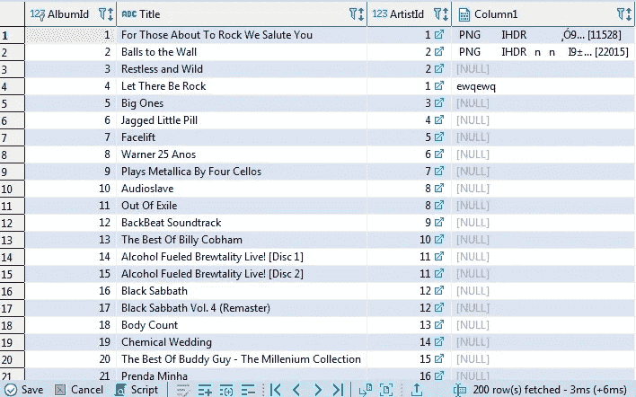
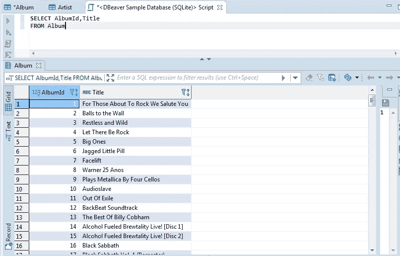
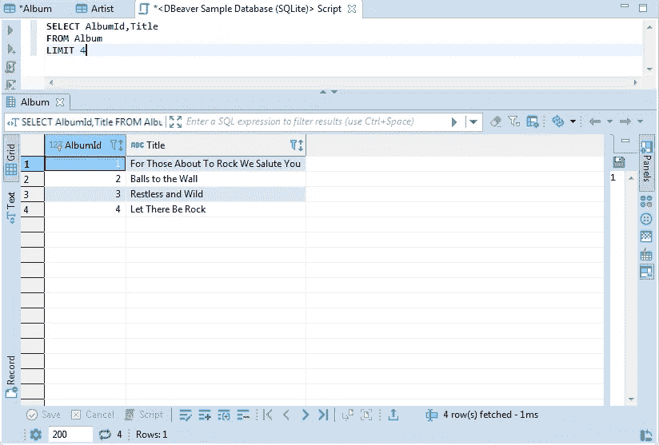
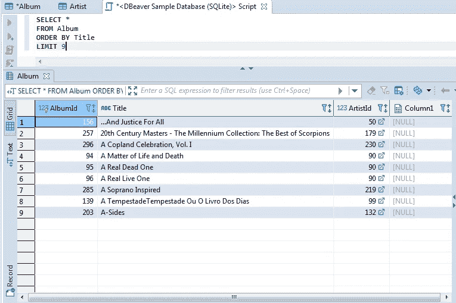
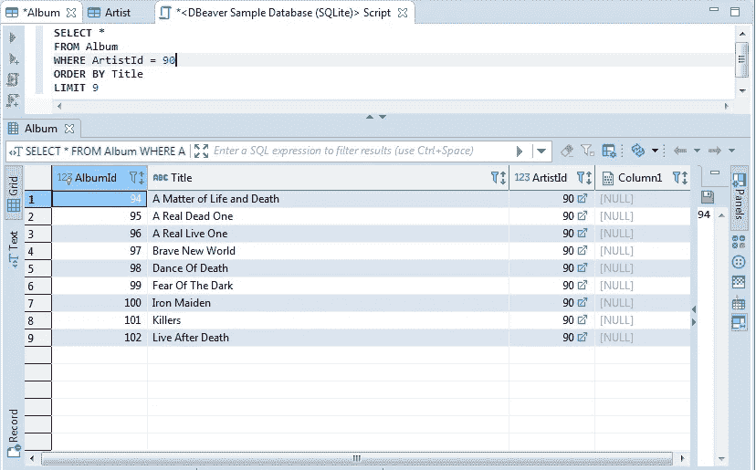
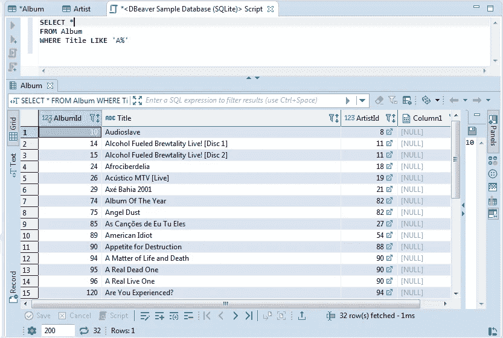
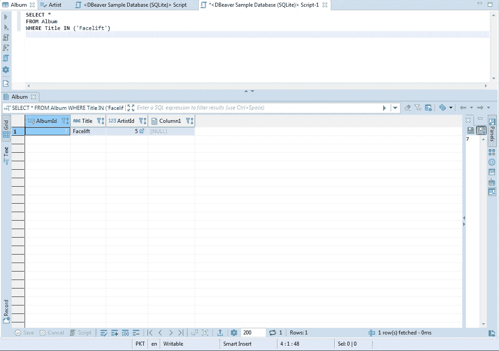
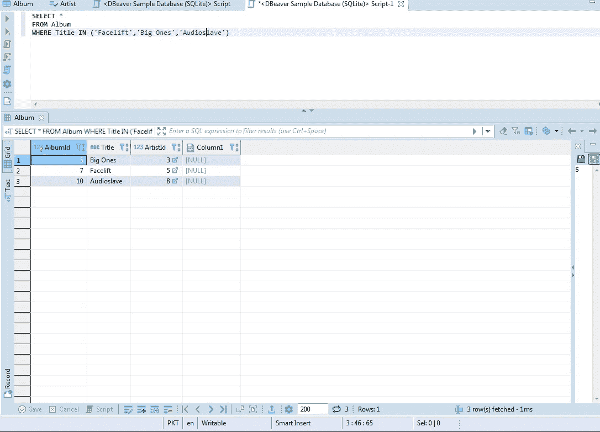
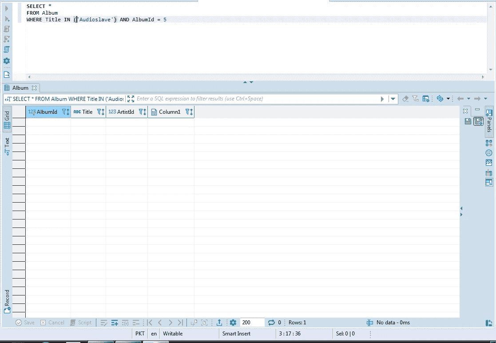
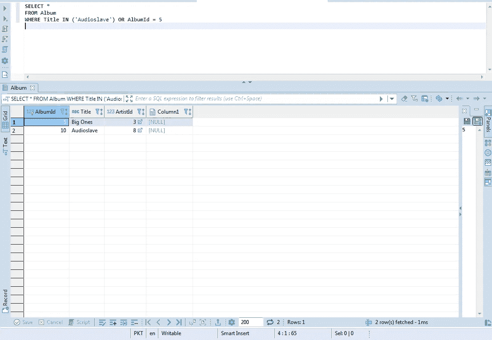

# 开始使用 SQL 需要知道的基本命令

> 原文：<https://pub.towardsai.net/the-basic-commands-you-need-to-know-to-get-started-with-sql-f50eed7a42f4?source=collection_archive---------3----------------------->

## [编程](https://towardsai.net/p/category/programming)

掌握正确的基础知识是掌握 SQL 的必要条件。


照片由[卡斯帕·卡米尔·鲁宾](https://unsplash.com/@casparrubin?utm_source=medium&utm_medium=referral)在 [Unsplash](https://unsplash.com?utm_source=medium&utm_medium=referral) 上拍摄

SQL 是您在数据科学之旅中最常用的工具之一。在实际从事实际项目之前，我对 SQL 的能力很不尊重(出于无知),也没有太关注它，但是当我进入“数据科学”的真实世界时，我意识到 SQL 对于从数据库中提取、转换和加载数据是多么重要。

在本文中，我将介绍一些基本但非常重要的 SQL 命令，每个人都应该了解这些命令，以便有一个良好的开端。

我将在 Dbeaver 上编写我的查询，这是一个通用的数据库工具，可以在这里[下载](https://dbeaver.io/)，但是只要概念清楚，你可以使用任何你选择的数据库工具。让我们开始吧

# **1)从**中选择和

我假设你们已经打开了一个 SQL 数据库工具(Dbeaver，pgAdmin)。
我想介绍的前两个命令是 SELECT 和 FROM。
SELECT，顾名思义，从我们正在处理的表中选择所有列或我们选择的列。例如



我在这里可以看到三列，比如 AlbumId、Title 和 ArtistId。
如果我在查询编辑器中输入:

```
SELECT AlbumId,Title
FROM Album
```

如果 Album 是表，我将只得到 AlbumId 和标题。让我们看看



您可以对您选择的任何列和表进行尝试。现在，你们可能会想，如果我想返回我所有的列呢？嗯，很简单，

只需键入:

```
SELECT *
FROM Album
```

这里，*表示所有的列

# 2)限制

Limit 命令顾名思义就是“限制”表格的输出，即我们可以限制我们希望看到的行数。
继续我们之前的例子，比方说，我只想看到前四行。利用极限，我们可以做到这一点。

```
SELECT AlbumId,Title
FROM Album
LIMIT 4
```

我得到了:



向前看。

# 3)订购依据

如果值是数字，ORDER BY 将按字母顺序和数字顺序重新排列我们选择的整列。这将重组整个表。让我们试一试

```
SELECT *
FROM Album
ORDER BY Title
LIMIT 9
```

结果是:



您可能已经注意到，标题现在按字母顺序出现。从 a .开始，AlbumId 和 ArtistId 似乎已相应调整。

# **4)哪里有**

WHERE 命令用于将条件语句应用于我们的表。例如，如果我只想返回 ArtistId 为 90 的那些行，我可以使用 WHERE 命令。让我们试一试。

```
SELECT *
FROM Album
WHERE ArtistId = 90
ORDER BY Title
LIMIT 9
```



很简单不是吗？WHERE 还有其他应用，比如只选择那些包含特定字符的值，或者只选择那些以 A 或 b 开头的值

# 5)在和喜欢

在尝试选择特定行时，IN 和 LIKE 操作符非常有效。例如，如果我想只返回那些标题以字母 A 开头的行，我该怎么做呢？让我们看看

```
SELECT *
FROM Album
WHERE Title LIKE 'A%'
```

我明白了:



如您所见，我所有的标题都以字母 A 开头。LIKE 语句中的“A%”字符表示标题应该以 A 开头。还有其他情况，例如:

**'%A'** 标题以 A 结尾的所有行

**'%A%'** 标题名称中任何地方都有 A 的所有行

我建议你们练习上述语句，以便更好地掌握。

IN 命令的工作方式类似于 LIKE 命令，但是它采用了一种更加**通用的**方法。我这么说是什么意思？例如，我想返回乐队名称为 Facelift 的所有行。现在，我可以通过使用 LIKE 命令来做到这一点，但有一种更好的方法。

```
SELECT *
FROM Album
WHERE Title IN ('Facelift')
```

运行上面的查询会得到:



我可以使用 IN 命令应用多个条件并返回多个值。例如:

```
SELECT *
FROM Album
WHERE Title IN ('Facelift','Big Ones','Audioslave')
```



## 6)与或

当您试图应用多个条件时，AND 和 OR 被广泛使用，并且非常方便。当您应用的两个条件都满足时，AND 将返回值，而 OR 将返回满足任一条件的所有行。例如:
比方说，我想返回标题为 Audioslave、AlbumId 为 5 的行。让我们试一试。

```
SELECT *
FROM Album
WHERE Title IN ('Audioslave') AND AlbumId = 5
```



上面的查询没有返回任何行，因为有一行的标题是 Audioslave，AlbumId 是 5。

让我们试一试 OR 命令。

```
SELECT *
FROM Album
WHERE Title IN ('Audioslave') OR AlbumId = 5
```



OR 命令确实会返回行，因为可以满足任何条件来生成结果。

# 结论

因此，这是开始使用 Dbeaver(或任何其他数据库)上的 SQL 查询的基本介绍。我回顾了一些非常基本但极其重要的概念，这些概念是开始使用 SQL 所必须知道的。希望你们会发现这篇文章很有用。如果你有，请随意与你的同伴分享。

[1]:穆伊德·洛迪..*SQL on Dbeaver* [https://www.youtube.com/watch?v=TGb7ImXsAfo&feature = youtu . be](https://www.youtube.com/watch?v=TGb7ImXsAfo&feature=youtu.be)