# 在 Kubernetes 中支持 Pods 跨名称空间通信的基础

> 原文：<https://pub.towardsai.net/the-basics-of-enabling-pods-to-communicate-across-namespaces-in-kubernetes-b6e5dbec2d3a?source=collection_archive---------3----------------------->

## [DevOps](https://towardsai.net/p/category/devops)

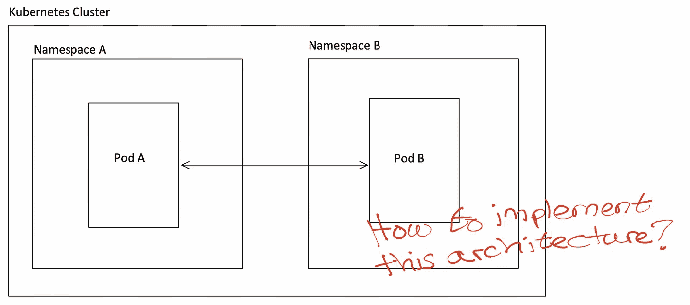

# 介绍

本文将解释如何让 pods 在同一个 K8s 集群中跨不同的名称空间进行通信。

更具体地说，我们将尝试将一个名称空间中的 [Rasa X](https://rasa.com/docs/rasa-x/) 部署连接到另一个名称空间中的 PostgreSQL 数据库。因此，我假设读者熟悉 Rasa X 部署的[架构](https://rasa.com/docs/rasa-x/api/architecture)以及[如何使用 helm](https://rasa.com/docs/rasa-x/installation-and-setup/install/helm-chart/) 部署它。

复制本文中描述的部署的代码是[这里是](https://github.com/hsm207/k8s-cross-ns)。

# 问题陈述

假设我们在 k8s 集群中有一个名为`db-ns`的 PostgreSQL 数据库，该数据库使用以下 [helm](https://github.com/bitnami/charts/tree/master/bitnami/postgresql) values.yml 进行部署:

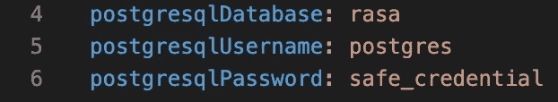

图 1:配置 PostgreSQL 部署

我们希望在同一个集群中名为`rasa-x-ns`的名称空间中部署 Rasa X 的所有组件，除了它的数据库。然后，我们希望 Rasa X 使用名称空间`db-ns`中的 PostgreSQL 数据库来存储对话、事件、用户角色等。

此图描述了我们想要创建的环境:

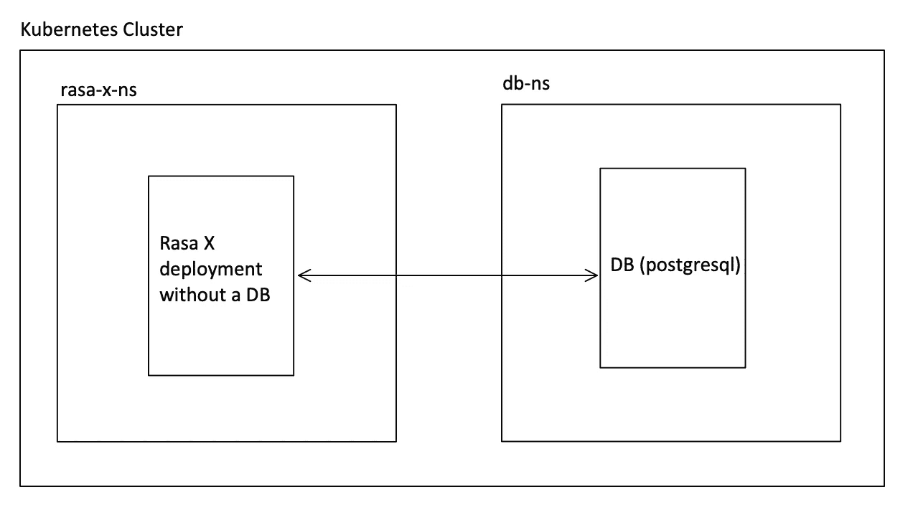

图 2:我们想要创建的 Rasa X 部署

# 解决办法

## 概观

我们假设数据库已经如图 1 所示进行了部署，我们只需要配置 Rasa X 部署。

这是一个 4 步流程:

1.  创建一个包含连接到数据库的凭据的密码
2.  告诉 Rasa X 不要创建 PostgreSQL [StatefulSet](https://kubernetes.io/docs/concepts/workloads/controllers/statefulset/)
3.  告诉 Rasa X 在哪里可以找到数据库
4.  告诉 Rasa X 在哪里可以找到 PostgreSQL 连接凭证

一旦完成上述步骤，部署 Rasa X 就可以正常进行了。

## 步骤 1:创建保存数据库凭证的密码

这一步很简单。只需运行:

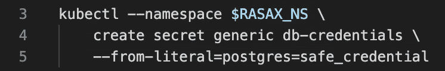

图 3:连接到数据库的凭证

图 3 将在 rasa x 名称空间中创建一个名为`db-credentials`的秘密。它有一个名为`postgres`的键，保存作为`postgres`用户连接到`db-ns`名称空间中的数据库的密码。

## 步骤 2:在部署 Rasa X 时，不要创建 Postgresql StatefulSet

这一步也很简单。我们只需要在 Rasa X 的 values.yml 中设置以下内容:

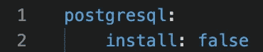

图 4:配置 Rasa X 以创建另一个 PostgreSQL 有状态集

## 步骤 3:指定数据库的位置

我们将通过其服务连接到`db-ns`名称空间中的 PostgreSQL 数据库，也就是说，我们不会直接连接到它的 pod。

为此，我们需要找出服务的完全限定名(FQN)。一种方法是查找服务的 IP 地址。例如:

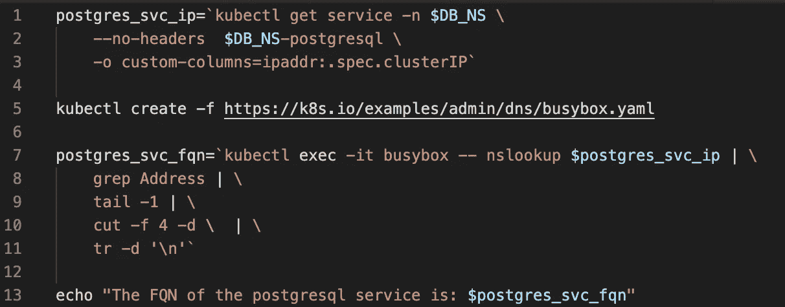

图 5:计算出 PostgreSQL 服务的 FQN

这将输出:

图 6:图 5 中脚本的输出

因此，我们编辑 Rasa X 的 values.yml 以包含此信息:

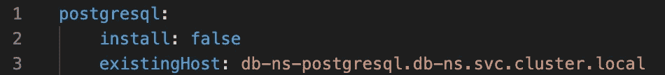

图 7:编辑图 4 以包含数据库的位置

## 步骤 4:指定凭据的位置

我们需要告诉 Rasa X 在`db-ns`中连接数据库时如何使用我们在步骤 1 中创建的秘密。这是通过以下值实现的。yml:

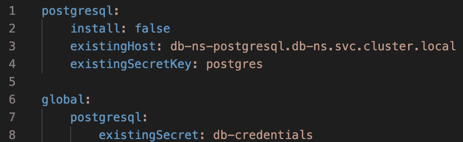

图 8:扩展图 7 以包括连接到数据库的凭证

回想一下，在步骤 1 中，我们创建了一个名为`db-credentials`的秘密，它有一个名为`postgres`的密钥。这些细节分别反映在图 8 中的第 8 行和第 4 行。

# 什么会出错？

快速检查名称空间之间的通信是否可行的方法是在安装并运行 python 和 sqlalchemy 的名称空间`rasa-x-ns`中创建一个 pod:

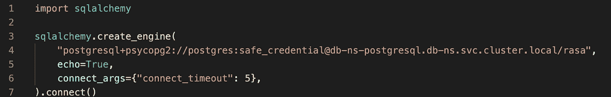

图 9:检查从 rasa-x-ns 到 db-ns 的通信是否可能

如果成功，将打印出以下内容:

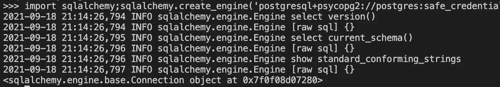

图 10:运行图 9 中 python 脚本的预期输出

另一方面，如果您得到以下输出:

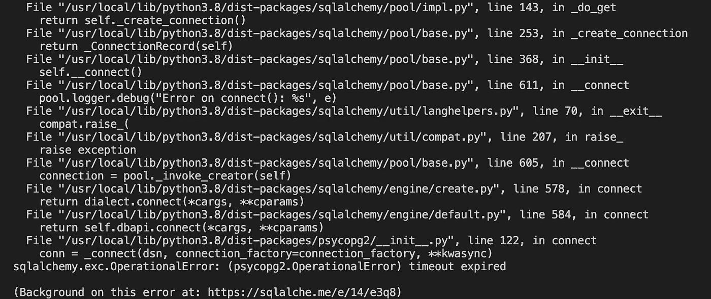

图 11:运行图 9 中脚本的意外输出

这意味着 pod 无法到达数据库服务。

其中一个原因是您的集群管理员使用以下网络策略阻止了所有进入`db-ns`pod 的流量:

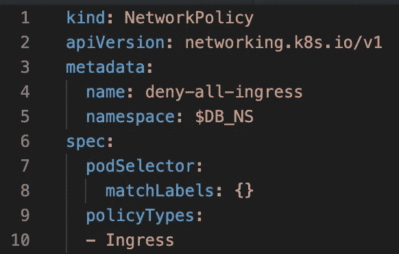

图 12:阻止所有传入网络流量进入 db-ns 名称空间中的 pod 的网络策略

或者，您的集群管理员可能已经使用以下网络策略阻止了来自`rasa-x-ns`pod 的所有传出流量:

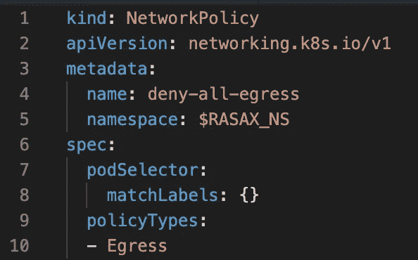

图 13:阻止来自 rasa-x-ns 名称空间中的 pod 的所有传出网络流量的网络策略

或者两者都有！

这里的要点是，您需要检查 k8s 集群上应用了什么网络策略，并请求集群管理员帮助打开正确的路径。

# 结论

本文解释了允许 pod 跨不同名称空间相互通信的一般思想。

本文以设置 Rasa X 部署连接到不同名称空间中的 PostgreSQL 数据库为例，具体说明了各个步骤以及失败的原因。

我希望你已经发现这是有用的。