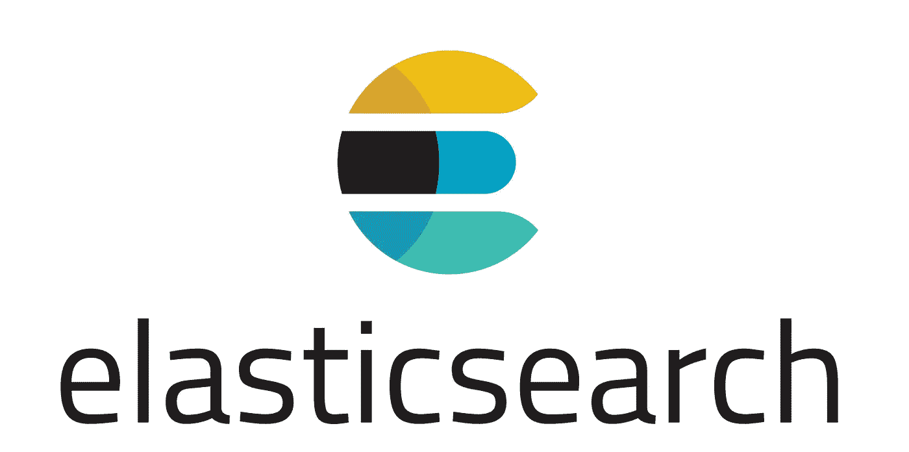
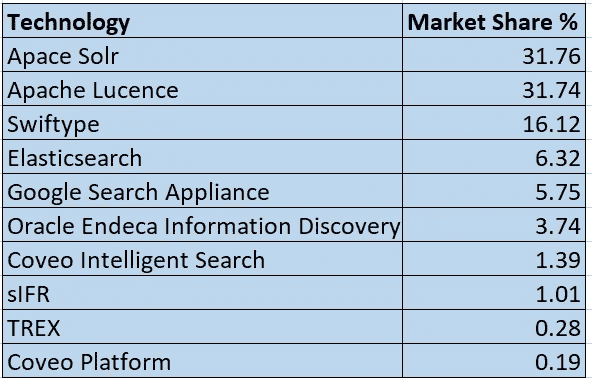

# 弹性搜索初学者指南—第 1 部分

> 原文：<https://pub.towardsai.net/the-beginners-guide-to-elasticsearch-part-1-2e50d3761e3c?source=collection_archive---------0----------------------->

## [数据科学](https://towardsai.net/p/category/data-science)，[数据分析](https://towardsai.net/p/category/data-analytics)

## 弹性搜索简介

图片来自官方页面:【elastic.co 

如果您想知道什么是 Elasticsearch，我们为什么要使用 Elasticsearch，Elasticsearch 的替代产品/竞争对手是什么，那么您来对地方了。在这篇文章中，我将尝试回答所有这些问题。那么，我们开始吧。

# 什么是弹性搜索

正如在[官方页面](https://www.elastic.co/)上提到的，Elasticsearch — *是一个分布式、开源的搜索和分析引擎，适用于所有类型的数据，包括文本、数字、地理空间、结构化和非结构化数据。Elasticsearch 建立在 Apache Lucene* 之上。

## 那么，这意味着什么呢？

**分布式** —分布式系统包含多个节点/机器，这些节点/机器在地理上分散但连接在一起，以便它们可以通信和协调来实现共同的目标。

**开源** —原始源代码免费提供，可以修改。

**搜索&分析引擎** —能够在数据库中搜索给定文本/关键词并向最终用户显示相关数据的系统。这很像谷歌或者必应搜索引擎。

**数据** — Elasticsearch 处理结构化和非结构化数据，如文本、数字、地理空间等。

Apache Lucene 是一个用 Java 编写的免费开源搜索引擎。它由 Apache 软件基金会支持，Elasticsearch 构建在 Lucene 之上。

# 为什么使用 Elasticsearch

*   分布式 : Elasticsearch 是一个分布式文档存储库。文档存储在分布于整个集群的节点中，可以从任何节点访问。
*   **可伸缩** : Elasticsearch 提供了快速增加或减少服务器(节点)的能力。Elasticsearch 自动将数据和查询负载分布到所有可用的节点上。
*   快速:弹性搜索正在飞速发展。它可以近乎实时地搜索文档，通常不到一秒钟。请注意，在为文档编制索引和准备搜索文档之间几乎没有延迟。Elasticsearch 使用一种叫做“倒排索引”的数据结构，这有助于非常快速的全文搜索。
*   **无模式** : Elasticsearch 是无模式的。这意味着我们不必指定文档中每个字段的数据类型。如果启用了动态映射，那么 Elasticsearch 足够智能，可以在索引文档时识别数据类型。
*   **丰富的功能集**:elastic search 具有强大的内置功能，使得存储和搜索数据更加高效。弹性堆栈 Logstash、Kibana 和 Beats 使数据接收、可视化和报告更加容易。

# 弹性搜索与 RDBMS

关系数据库系统(RDBMS)不适合全文搜索、同义词搜索、语音搜索、日志分析等。Elasticsearch 是专门为大量文本搜索设计的，它真的很快！！我们希望在 Elasticsearch 中搜索的数据越多，相关性就越强。

Elasticsearch 并不意味着是一个主要的数据存储，所以专家的建议是使用简单的 RDBMS，如 PostgreSQL 和 Elasticsearch 作为搜索功能。

# Elasticsearch 是用来做什么的？

全文搜索是 Elasticsearch 的核心功能。一些使用案例包括:

*   企业搜索
*   电子商务搜索
*   日志记录和日志分析
*   分析应用程序日志和系统指标(应用程序性能管理)
*   使用机器学习预测未来值
*   从多个来源抓取远程数据
*   地理空间数据分析和可视化

# 竞争对手

这些是 Elasticsearch 的一些竞争对手。目前，Elasticsearch 在全球市场份额排名前五。

来源: [Datanyze](https://www.datanyze.com/market-share/enterprise-search--287)

# 弹性叠层

如前所述，全文搜索是 Elasticsearch 的核心功能。它还提供其他功能，如日志记录、分析、可视化等。通过作为弹性堆栈一部分的软件。早先的`Elasticsearch` **、** `Logstash`和`Kibana`合称为`ELK stack`。最近`Beats`加入其中，目前，这个组合被称为`The Elastic Stack`。

## 基巴纳

Kibana 是弹性堆栈的核心产品之一。它被用作分析和可视化工具，用于创建实时直方图、折线图、饼图等。它还可以通过网络界面管理 Elasticsearch 和 Logstash 的一些功能。

## Logstash

Logstash 设计用于处理来自应用程序的日志，并将它们发送给 Elasticsearch 以供进一步处理。然而，最近几年，Logstash 增加了许多更高级的功能。

## **节拍**

这是最近进入弹性堆栈的条目。它包括一组轻量级运输代理，称为 Beats，用于向 Elasticsearch 发送数据。

# 结论

希望你能很好地理解什么是弹性搜索。我相信您会有兴趣了解更多关于 Elasticsearch 的信息。一定要检查这个 [**第二部分**](https://medium.com/towards-artificial-intelligence/the-beginners-guide-to-elasticsearch-part-2-3206a8a42051) ，我在那里已经涵盖了弹性搜索的关键概念。

【阅读更多关于 Python 和数据科学的此类有趣文章， [***订阅***](https://pythonsimplified.com/) *到我的博客*[***www.pythonsimplified.com***](http://www.pythonsimplified.com/)***。*** 你也可以通过 [**LinkedIn**](https://www.linkedin.com/in/chetanambi/) 联系到我。

# 参考

 [## 什么是 Elasticsearch，它能有什么帮助？马鲁蒂科技实验室

### 你会问，什么是弹性搜索？Elasticsearch 是一个分布式面向文档的搜索引擎，旨在存储…

marutitech.com](https://marutitech.com/elasticsearch-can-helpful-business/)  [## 开源搜索:Elasticsearch、ELK Stack & Kibana | Elastic 的创造者

### 我们是 Elastic (ELK) Stack 的创造者——Elastic search、Kibana、Beats 和 Logstash。安全可靠地…

www.elastic.co](https://www.elastic.co/)