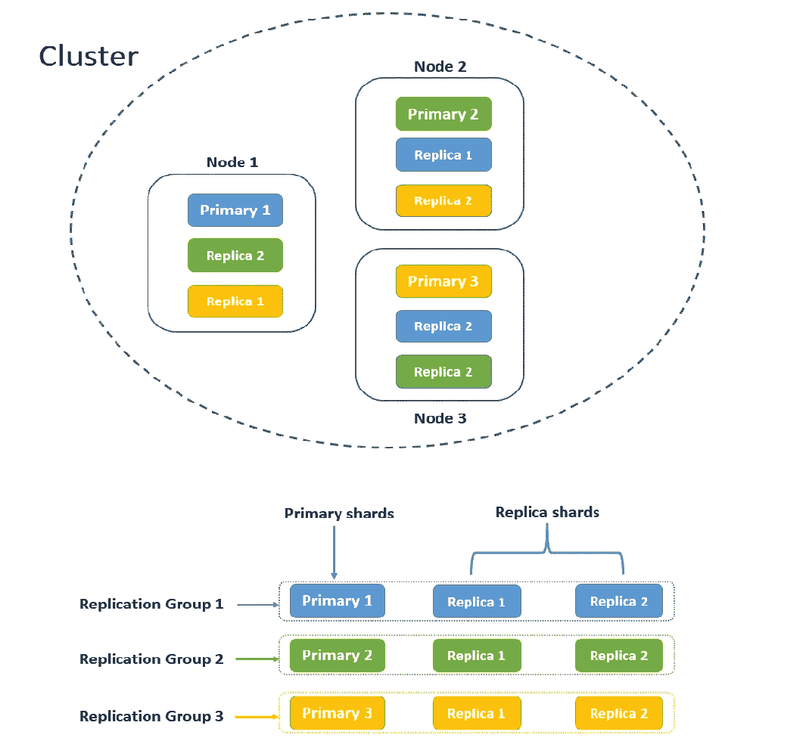
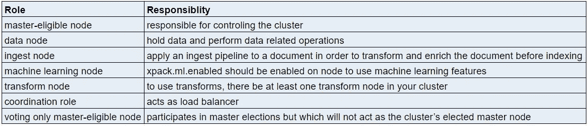

# 弹性搜索初学者指南——第二部分

> 原文：<https://pub.towardsai.net/the-beginners-guide-to-elasticsearch-part-2-3206a8a42051?source=collection_archive---------3----------------------->

## [数据科学](https://towardsai.net/p/category/data-science)，[机器学习](https://towardsai.net/p/category/machine-learning)

## 节点、索引、文档、分片、复制和路由等关键概念解释清楚

图片来自官方页面:[elastic.co](https://www.elastic.co/)

在 [**第一部分**](https://medium.com/towards-artificial-intelligence/the-beginners-guide-to-elasticsearch-part-1-2e50d3761e3c) 中，我们已经介绍了什么是 Elasticsearch，我们为什么要使用它，它的竞争对手等等。在本文中，我们将介绍一些关键概念，如什么是弹性搜索节点、索引、分片、文档、路由、复制。这将帮助你很好地了解***elastic search 如何工作*** 。

作者图片

# 结节

Elasticsearch 运行在 Java 虚拟机上。每个运行 Elasticsearch 的 JVM 实例都可以被认为是一个 Elasticsearch 节点。每当我们启动一个 Elasticsearch 实例时，我们都是在启动一个节点。如果您运行的是 Elasticsearch 的单个节点，那么您的集群只有一个节点。但是在现实生活中，一个集群会有许多节点。

节点可以扮演`master-eligible`、`data`、`ingest`、`machine learning`、`transform`、&、`coordination`等不同的角色。这些节点角色通过设置`node.roles`来配置。如果没有配置节点角色，那么默认情况下每个节点都有以下角色:`master`、`data`、`ingest`、`ml`。

作者图片

# **集群**

集群是运行在一台或多台机器(虚拟机或物理机)上的一个或多个 Elasticsearch 节点的集合。默认情况下，集群名称为`elasticsearch`，可以根据需要进行更改。我们可以在单台机器或不同的机器上设置节点。在生产环境中，我们将在不同的机器上设置节点，以实现高可用性。在非生产环境中，我们可能在同一台机器上设置多个节点，但是我们可能无法测试高可用性特性。

我们可以在群集中添加或删除节点，群集会自动重新组织数据，并在所有节点间平均分配数据。如上所述，集群中的每个节点都有一个指定的角色。

对集群默认设置的任何更改都通过`elasticsearch.yml`文件进行配置。

# **文件**

文档是存储在 Elasticsearch 中的 JSON 对象。这类似于 RDBMS 系统中的行/记录。JSON 对象包含零个或多个键值对。每个文档都存储在一个索引中，并有一个`id`。如无特别说明，此`id`由 Elasticsearch 指定。索引后请参考下面的示例文档。

# **索引**

`index`类似于关系数据库系统(RDBMS)中的数据库。Elasticsearch 中的每个文档都存储在一个索引中，该索引是具有相似特征的文档的集合。您可以在 Elasticsearch 中定义任意多的指数。例如，用于存储客户信息的*客户*索引和用于存储客户人口统计信息的*人口统计数据*索引等。

# **分片**

将索引拆分成多个部分的过程称为`sharding`。这些多个片段可以存储在集群中的同一节点或不同节点上。默认情况下，索引将有一个碎片。一旦创建了索引，我们就不能改变碎片数量的值。这是因为路由(下面讨论)使用许多碎片，所以如果我们要改变碎片的数量，将导致识别错误的碎片进行处理。此外，碎片的数量取决于需求或用例。

***我们为什么需要分片*** *—我们知道数据是存储在索引中的。由于可以存储在索引中的文档数量没有限制，因此索引的大小可能会超出服务器的处理能力。这是弹性搜索索引开始失败的主要原因。为了克服这一点，引入了分片。*

> 非常大的碎片会对群集从故障中恢复的能力产生负面影响。尽管对碎片的大小没有限制，但建议使用 50GB 的碎片大小。

# **复制**

`Replication`是创建碎片的多个副本的过程，这些副本被称为`replica shards`。被复制的碎片称为`primary shards.` `primary shards`&`replica shards`合起来称为`replication group`。为了确保高可用性，副本碎片不会存储在同一节点上。

碎片数量的默认值为 1，但可以随时修改。我们需要确保不要使用太少或太多的碎片，因为这会影响性能和速度。

# **路由**

所有数据都存储在主碎片中。您要查找的文档存储在任何一个主碎片中。`Routing`确定*该文档将驻留在哪个*碎片中的过程。默认的路由设置效果最好，可以确保文档均匀分布在碎片上。默认的路由方法使用文档的`_id`来查找碎片。这既适用于用户提供的`_ids`，也适用于 Elasticsearch 随机生成的`_ids`。

## 当我们需要自定义路由时

Elasticsearch 还提供了使用`custom routing`的选项。考虑一个有 20-25 个碎片的指数。当搜索请求到达查找文档的节点时，Elasticsearch 不知道如何找到拥有所请求数据的节点。因此节点会将请求广播给索引中的所有碎片。现在，每个碎片将执行一个搜索查询，并将响应发送回节点。最后，来自所有碎片的响应在一个专用节点上合并、排序，然后发送给用户。这可能会导致性能问题。为了避免这个潜在的问题，Elasticsearch 提供了使用自定义路由的选项。使用这个选项，您可以直接在一个特定的碎片中查找，而不是将搜索请求广播给所有的碎片。路由确保具有相同路由值的所有文档都将定位到同一个碎片，消除了广播搜索的需要。

# 结论

希望你已经理解了 Elasticsearch 中的关键概念。基于您从 [**第 1 部分**](https://medium.com/towards-artificial-intelligence/the-beginners-guide-to-elasticsearch-part-1-2e50d3761e3c) 和**第 2 部分**(本文)中获得的知识，我将在即将发布的文章中解释**elastic search 如何工作** 。敬请期待！！

*阅读更多关于 Python 和数据科学的此类有趣文章，* [***订阅***](https://pythonsimplified.com/) *到我的博客*[***【www.pythonsimplified.com】***](http://www.pythonsimplified.com/)***。*** 你也可以通过 [**LinkedIn**](https://www.linkedin.com/in/chetanambi/) 联系我。

# 参考

 [## 开源搜索:Elasticsearch、ELK Stack & Kibana | Elastic 的创造者

### 我们是 Elastic (ELK) Stack 的创造者——Elastic search、Kibana、Beats 和 Logstash。安全可靠地…

www.elastic.co](https://www.elastic.co/)