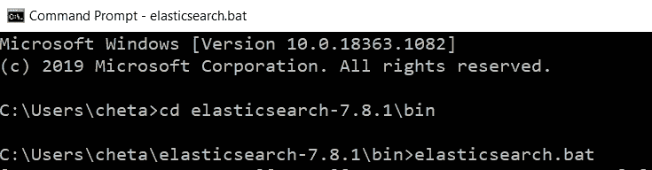
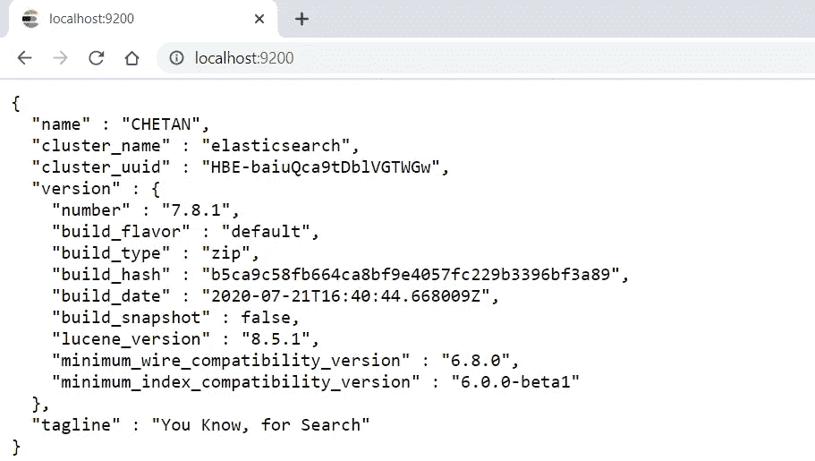
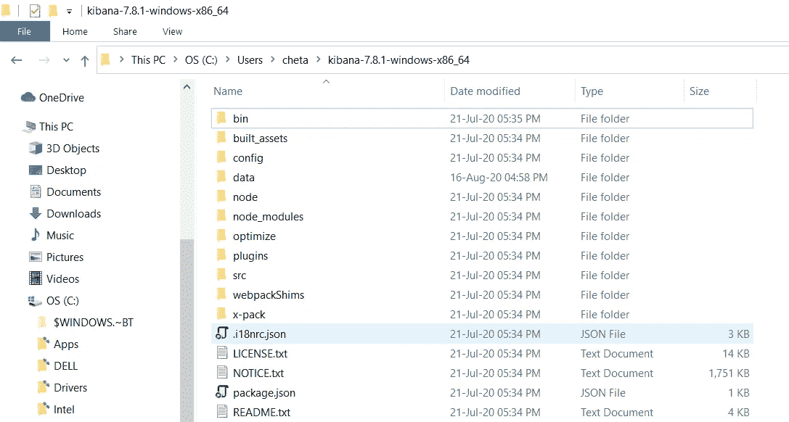
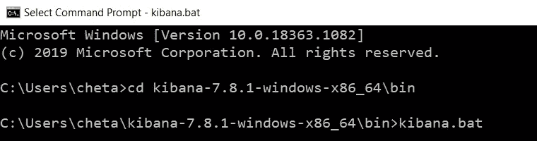
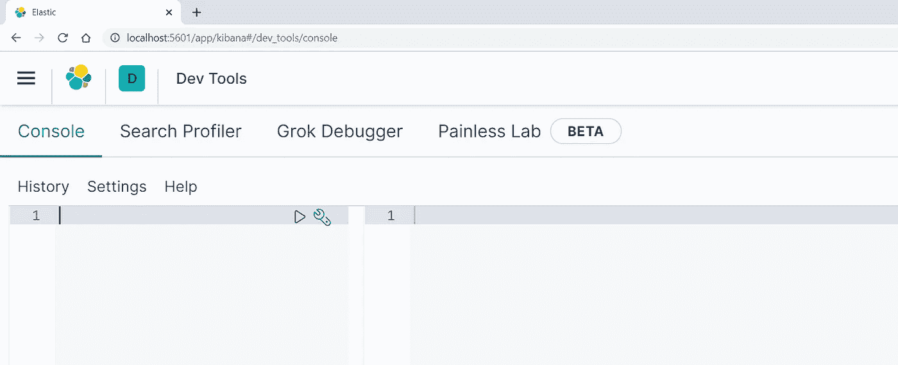
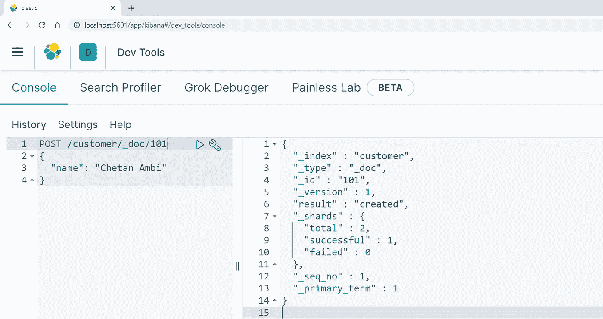
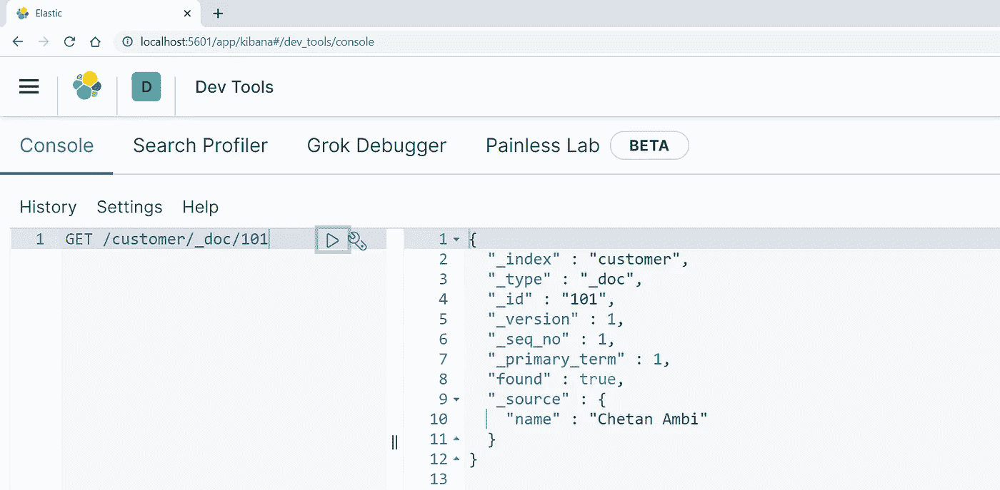

# 弹性搜索初学者指南——第三部分

> 原文：<https://pub.towardsai.net/the-beginners-guide-to-elasticsearch-part-3-50352cdce23e?source=collection_archive---------4----------------------->

## [数据科学](https://towardsai.net/p/category/data-science)，[机器学习](https://towardsai.net/p/category/machine-learning)

## Elasticsearch 和 Kibana 的安装步骤，索引和检索文档

图片来自官方页面:elastic.co

在本文中，我们将介绍在 Windows 操作系统上安装 Elasticsearch 和 Kibana 的步骤。然而，步骤将类似于 Linux、macOS 和其他系统。最后，我们将通过 Kibana 快速运行基本命令，以确保 Elasticsearch 成功运行。

# 弹性搜索

## 安装步骤

*   从这个链接下载最新版本的 Elasticsearch。解压缩下载的文件，并把它放在任何驱动器。

作者图片

*   现在，打开命令提示符并运行`bin\elasticsearch.bat`。等待，直到您在命令提示符中看到信息`Cluster health status changed from [RED] to [YELLOW]`。

作者图片

*   转到你最喜欢的浏览器，粘贴这个`[http://localhost:9200](http://localhost:9200)`，然后点击回车。如果你看到这条信息，它确认 Elasticsearch 开始运行。

作者图片

# 基巴纳

## 安装步骤

*   从这个链接下载最新版本的 Elasticsearch。解压缩下载的文件，并把它放在任何驱动器。

作者图片

*   [可选]在编辑器中打开 config/kibana.yml。设置`elasticsearch.hosts`指向您的 Elasticsearch 实例。如果我们在同一台机器上使用默认实例来尝试，您可以跳过这一步。
*   现在，打开命令提示符并运行`bin\kibana.bat`。等待，直到您在命令提示符上看到消息`[info][server][Kibana][http] http server running at [http://localhost:5601](http://localhost:5601)`。

作者图片

*   转到浏览并粘贴这个`[http://localhost:5](http://localhost:9200)601`并点击回车。如果 Kibana 启动并运行，您应该会看到 Kibana 仪表板。

作者图片

> **注意:**第一次设置 Kibana 时，您可能会遇到错误“”。如果您遇到这个错误，请打开另一个命令提示符并运行这个命令:`curl -X DELETE [http://localhost:9200/.kibana*](http://localhost:9200/.kibana*)`

现在 Elasticsearch 和 Kibana 都已经开始运行了。让我们快速索引一些记录并确认。如果您不理解这些命令

> **注意**:如果你试图通过不同的方法安装/设置 Elasticsearch 和 Kibana，你可以在这里查看步骤[。](https://www.elastic.co/guide/en/elasticsearch/reference/current/setup.html)

**基巴纳控制台:**要访问基巴纳控制台与 Elasticsearch 交互，请从基巴纳仪表板(`[http://localhost:5](http://localhost:9200)601`)转到`Manage and Administer the Elastic Stack`部分，然后点击`console`，这将打开以下屏幕:

作者图片

# 索引和检索文档的快速测试

既然 Elasticsearch 和 Kibana 实例都在运行，让我们将一些文档索引到 Elasticsearch 中(即，以关系数据库的形式将记录插入到数据库中)。

## 为文档编制索引:

在下面的例子中，我们使用 JSON 结构通过 POST 方法将一个文档插入到索引名 customer 中。结果显示在右侧。

作者图片

## 检索文档

下面的例子显示，我们能够从 Elasticsearch 中检索文档。

如果您还没有理解这些命令，请不要担心。我将在以后的文章中详细介绍它们。敬请期待！！

*阅读更多关于 Python 和数据科学的此类有趣文章，* [***订阅***](https://pythonsimplified.com/) *到我的博客*[**【www.pythonsimplified.com】**](http://www.pythonsimplified.com/)***。*** 你也可以通过 [**LinkedIn**](https://www.linkedin.com/in/chetanambi/) 联系我。

# 参考

 [## 开源搜索:Elasticsearch、ELK Stack & Kibana | Elastic 的创造者

### 我们是 Elastic (ELK) Stack 的创造者——Elastic search、Kibana、Beats 和 Logstash。安全可靠地…

www.elastic.co](https://www.elastic.co/)