# Julia 包管理器的初学者指南— Pkg

> 原文：<https://pub.towardsai.net/the-beginners-guide-to-julia-s-package-manager-pkg-c02704ac324c?source=collection_archive---------5----------------------->

## [数据科学](https://towardsai.net/p/category/data-science)，[机器学习](https://towardsai.net/p/category/machine-learning)

## Julia 用于管理包的包管理器简介


来源:朱莉娅

`Pkg`是 Julia 内置的包和环境管理器。你可以将 Pkg 视为 Python 中 Pip & Conda 的等价物(在 Python 中，我们将 Pip 用作包管理器，将 Conda 用作包&环境管理器)。Julia 和 Pkg 都有自己的 REPL。朱莉娅·REPL 可以用来快速测试代码，也可以用来管理包&环境，而 Pkg REPL 只用于管理包和环境。

**什么是 REPL？** 根据[维基百科](https://en.wikipedia.org/wiki/Read%E2%80%93eval%E2%80%93print_loop)*“REPL(read-eval-print loop，又称交互式顶级或语言外壳，是一个简单的交互式计算机编程环境，接受单个用户输入，执行它们，并将结果返回给用户；在 REPL 环境中编写的程序是分段执行的。”*

在这里的前一篇文章中，我们已经安装了 Julia，然后将其与 Jupyter Notebook 集成。在我们真正开始将 Julia 用于机器学习或通用目的之前，理解如何在 Julia 中管理包和环境是很重要的。这就是本文的目标。让我们开始吧。

# 管理包

有两种方法来管理软件包——1)使用朱莉娅 REPL 和 2) Pkg REPL。在本文中，您将学习如何使用 Pkg 来管理包。

当你打开朱莉娅你会看到下面的屏幕。这是朱莉娅·REPL。要进入 Pkg REPL，你需要按下`]`。要退出 Pkg REPL，在 Windows 机器上按`Backspace`或`Control+C`，你将回到朱莉娅 press。

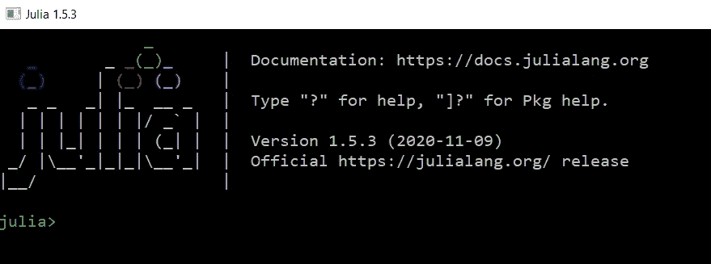

按下`]`后，你会看到下面的画面。从这个屏幕，您可以开始管理软件包。在下图中，`(@v1.5)`表示 Julia 的当前版本以及对基础环境的引用。安装的任何软件包都将是此基础环境的一部分。这类似于我们为 Python 安装 Anaconda 时创建的基础环境。

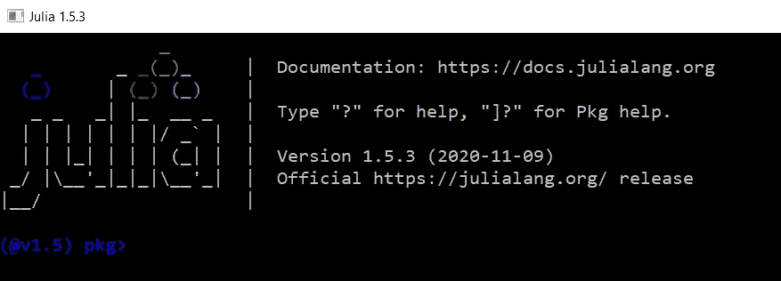

## a)添加一个包

要添加/安装软件包(库)，您可以运行下面的命令。如果您是第一次安装，安装将需要几分钟时间。要开始使用它，您需要运行命令`using pkg_name`。在下面的例子中，我们正在安装`DataFrames`包并用`using DataFrames`命令加载它。

```
(@v1.5) pkg> add DataFrames
(@v1.5) pkg> using DataFrames
```

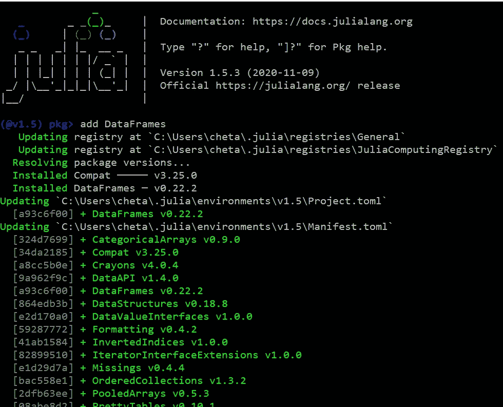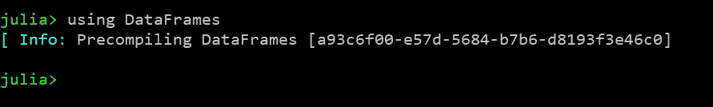

你也可以使用朱莉娅·REPL 来安装这个包，如下所示。这两种方法都非常好。

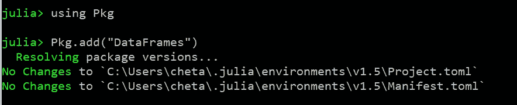

*   要在同一个命令中安装多个软件包，可以使用下面的语法。这将安装数据帧和 CSV 包。

```
([@v1](http://twitter.com/v1).5) pkg> add DataFrames CSV
```

*   要从未注册的源安装软件包，您需要指定 URL

```
([@v1](http://twitter.com/v1).5) pkg> add [https://github.com/FluxML/Flux.jl.git](https://github.com/FluxML/Flux.jl.git)
```

## b)更新软件包

要用最新版本更新软件包，运行`up package_name`或`update package_name`命令。在下面的例子中，我们试图更新`DataFrames`包。

```
([@v1](http://twitter.com/v1).5) pkg> up DataFrames
```

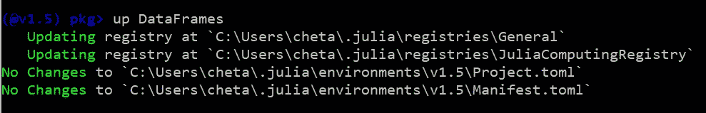

*   要更新所有的包，你可以使用不带任何参数的`up`或`update`命令。

```
([@v1](http://twitter.com/v1).5) pkg> up
```

## c)取出包装

要从当前项目/环境中移除包，您需要运行`rm package_name`命令。在下面的例子中，我们正在删除/卸载`DataFrames`包。

```
([@v1](http://twitter.com/v1).5) pkg> rm DataFrames
```

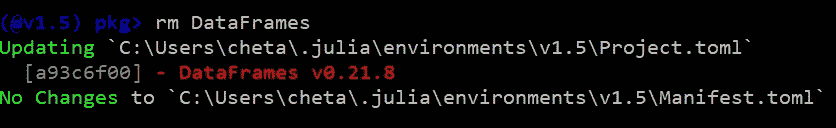

## d)列出包装

可以使用`st`命令查看项目/环境中安装的所有包。正如您从下面看到的，当前环境中安装了 3 个包——CSV、IJulia 和 Lathe。由于我们在上一步中卸载了 DataFrames，因此它不会显示在列表中。默认情况下，`st`命令将显示`Projects.toml`文件的内容，该文件包含您安装的软件包(存储环境的元数据)。

```
([@v1](http://twitter.com/v1).5) pkg> st
```

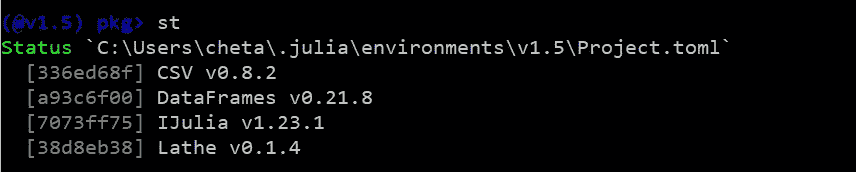

`Manifest.toml`文件包含作为您安装的软件包的依赖项安装的所有软件包。

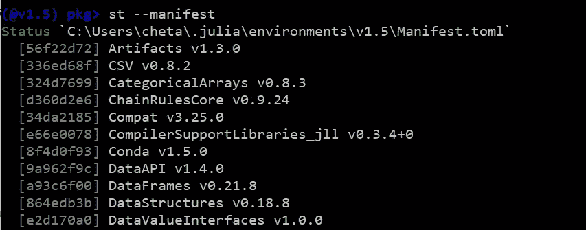

## e)钉住包裹

如果你想冻结一个更新包，你可以使用`pin`命令。固定的包将不会得到更新。引脚封装可通过其前面的`?`符号进行识别。在下面的截图中，因为我们固定了 CSV 包，所以当我们运行`st`命令时，我们可以看到 CSV 前面的`?`。

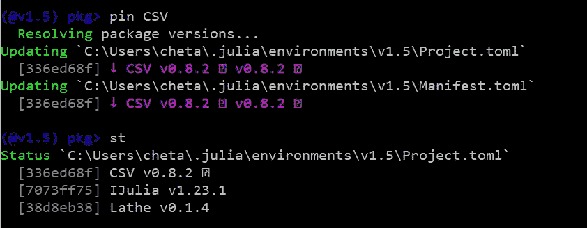

要取消固定包，您需要使用`free`命令。在下面的例子中，在取消固定 CSV 之后，符号`?`被删除，表示它不再是一个固定的包。

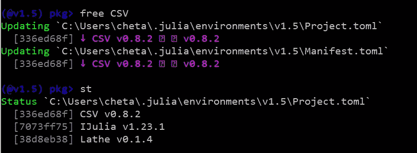

## f)移除旧的、未使用的包装

`gc`命令将从环境中识别旧的、未使用的包并删除它们。

```
([@v1](http://twitter.com/v1).5) pkg> gc
```

# 结论

在本文中，您已经了解了如何使用 Julia 的包管理器`Pkg`来管理包。我希望这篇文章对你有用。如果你有任何意见或问题，请在评论区告诉我。

***希望你喜欢看这篇文章。如果你喜欢我的文章并想订阅 Medium，你可以在这里订阅:***

[](https://chetanambi.medium.com) [## Chetan Ambi -介质

### 阅读 Chetan Ambi 在媒体上的文章。数据科学|机器学习| Python。参观 https://pythonsimplified.com/…

chetanambi.medium.com](https://chetanambi.medium.com) 

*阅读更多关于 Python 和数据科学的此类有趣文章，* [***订阅***](https://pythonsimplified.com/) *到我的博客*[***www.pythonsimplified.com***](http://www.pythonsimplified.com)***。*** 你也可以通过 [**LinkedIn**](https://www.linkedin.com/in/chetanambi/) 联系到我。

# **参考文献**

[1].[https://julialang.github.io/Pkg.jl/v1.1/](https://julialang.github.io/Pkg.jl/v1.1/)