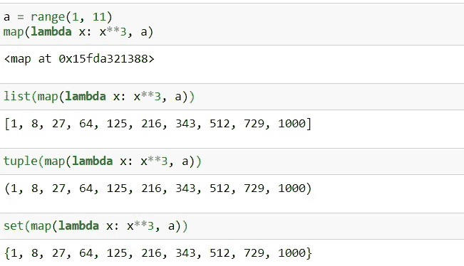
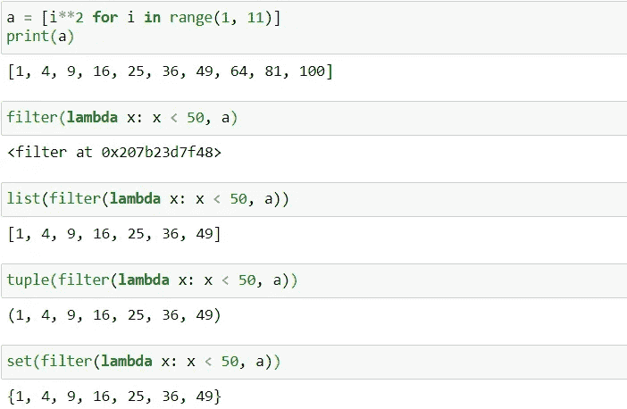
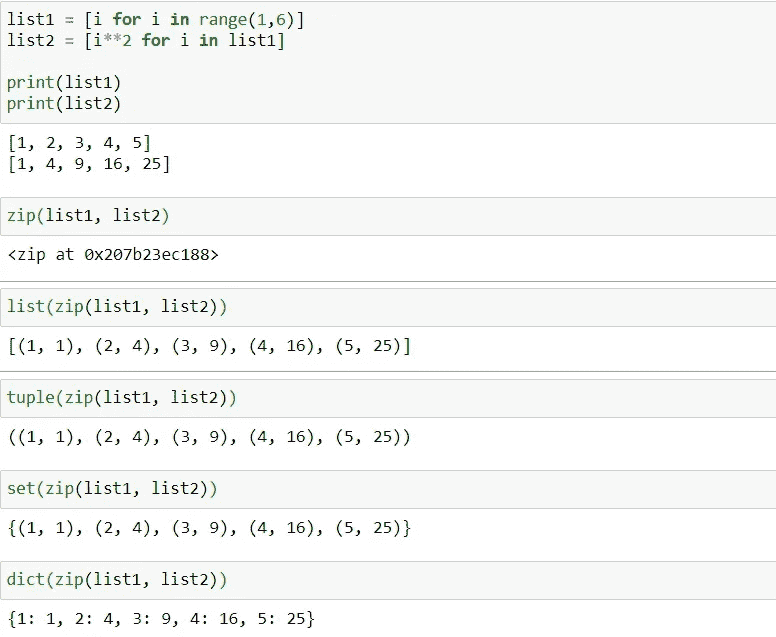

# Python 中地图、压缩和过滤函数的初学者指南

> 原文：<https://pub.towardsai.net/the-beginners-guide-to-map-zip-and-filter-functions-in-python-827d5897dcf?source=collection_archive---------2----------------------->

## [编程](https://towardsai.net/p/category/programming)， [Python](https://towardsai.net/p/category/programming/python)

## 通过示例了解 Python 中的地图、压缩和过滤函数


照片由[裘德·因凡蒂尼](https://unsplash.com/@easy_emu)在 [Unsplash](https://unsplash.com/photos/fdhL2t1ZVSM) 上拍摄

起初，`map`、`zip`和`filter`函数的用法似乎让 Python 编程的初学者望而生畏。本文的目标是提供关于这些函数是什么、其语法以及如何使用它们的详细信息，并举例说明，这样您就可以立即在应用程序中使用它们。那么，我们开始吧。

# 地图功能

map 函数在将函数应用于 iterable 后返回一个迭代器。

## 语法:

映射函数的一般语法:

```
map(<function>, <iterables>)
```

其中，
***函数*** *:针对可迭代* ***可迭代*** *中的每个元素执行的函数:一个或多个可迭代，如列表、元组等。*

> **注意**:如果传递了多个 iterables，那么返回的迭代器的长度取决于元素最少的 iterable 的大小。

> 当 Python 遇到`**map(lambda x: x**3, a)**`时，只创建地图对象。当 map 函数的输出被传递给诸如 list、tuple 之类的 iterables 时，该函数实际上被执行并显示结果。



作者图片

# 滤波函数

filter 函数返回一个迭代器，它只包含 iterable 中函数返回真值 1 或 True 的那些元素。

## 句法

过滤函数的一般语法:

```
filter(<function>, <iterable>)
```

其中，
***函数*** *:将对可迭代* ***可迭代*** *:可迭代中的每个元素执行的函数，如列表、元组等。*

> 这类似于`**map**`功能。当 Python 遇到`**filter(lambda x: x < 50, a)**`时，只创建`**filter**`对象。当`**filter**`函数的输出被传递给诸如 list、tuple 之类的 iterables 时，该函数实际上被执行并显示结果。



作者图片

# zip 功能

zip 函数根据迭代器的相对位置连接迭代器，并以元组的形式返回迭代器。

## 句法

zip 函数的一般语法:

```
zip(iterable1, iterable2,…)
```

> **注意**:如果传递了多个 iterables，那么返回的迭代器的长度取决于元素最少的 iterable 的大小。

> 类似于 map 和 filter 函数，当 Python 遇到`**zip(list1, list2)**`时，只创建和存储`**zip**`对象。当`**zip**`函数的输出被传递给诸如 list、tuple 之类的 iterables 时，该函数实际上被执行并显示结果。



作者图片

如果您有兴趣了解更多关于 Python 的知识，这里有几篇文章您可能会感兴趣:

1.  [**如何使用 Python 进行 and while 循环**](https://towardsdatascience.com/how-to-use-python-for-and-while-loops-6a6a3325929c)
2.  [**Python 中的优化—实习**](https://towardsdatascience.com/optimization-in-python-interning-805be5e9fd3e)
3.  [**Python 中的优化—窥视孔**](https://towardsdatascience.com/optimization-in-python-peephole-e9dc84cc184d)
4.  [**Python 中的可变性和不变性**](https://towardsdatascience.com/mutability-immutability-in-python-b698bc592cbc)

*阅读更多关于 Python 和数据科学的此类有趣文章，* [***订阅***](https://pythonsimplified.com/) *到我的博客*[***www.pythonsimplified.com***](http://www.pythonsimplified.com/)***。*** 你也可以在 [**LinkedIn**](https://www.linkedin.com/in/chetanambi/) 上联系我。