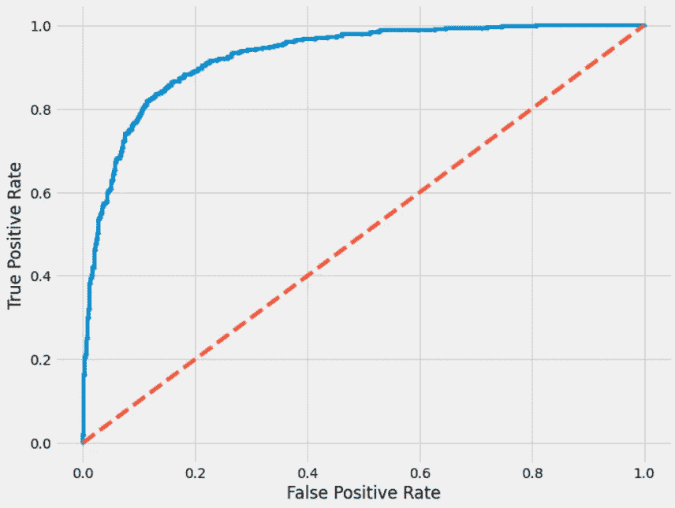
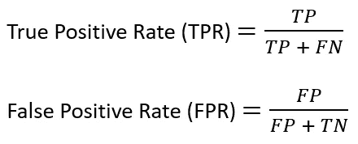
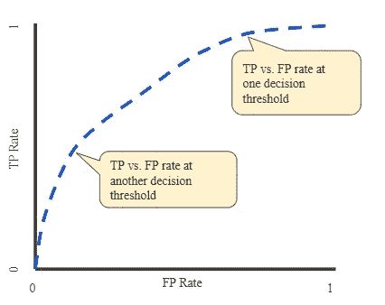
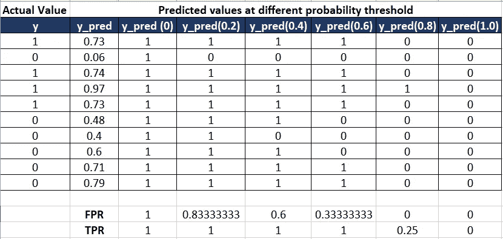
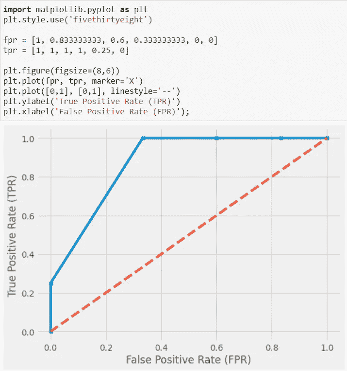

# ROC 曲线和 AUC 初学者指南

> 原文：<https://pub.towardsai.net/the-beginners-guide-to-the-roc-curve-and-auc-40585bada247?source=collection_archive---------2----------------------->

## [数据科学](https://towardsai.net/p/category/data-science)，[机器学习](https://towardsai.net/p/category/machine-learning)

## 了解什么是 ROC 曲线和 AUC，如何工作，以及如何将其用于分类问题

作者图片

在上一篇文章[这里](https://medium.com/towards-artificial-intelligence/classification-evaluation-metrics-explained-clearly-e74756dd2a0f)中，你已经了解了准确率、精确度、召回率、F1-Score 等分类评价指标。在本文中，我们将介绍另一个重要的评估指标 AUC-ROC 得分。

# 什么是 AUC-ROC

**ROC** 曲线(接收机工作特性曲线)是显示分类模型在不同概率阈值下的性能的图形。

ROC 图是通过绘制 FPR 对 TPR 而创建的，其中对于 0.0 至 1.0 的不同概率阈值，FPR(假阳性率)绘制在 x 轴上，TPR(真阳性率)绘制在 y 轴上。

**真阳性率(TPR)** 指所有阳性标记中正确预测的阳性标记的比率。

**假阳性率(FPR)** 指所有阴性标签中被错误预测的阳性标签的比率。

**AUC** 代表 ROC 曲线下面积。它测量从(0，0)到(1，1)的整个 ROC 曲线下的整个二维面积。

典型的 AUC-ROC 看起来如下—

来源:[谷歌](https://developers.google.com/machine-learning/crash-course/classification/roc-and-auc)

# 为什么选择 AUC-ROC

如果我们能够预测类别标签概率而不是预测类别标签本身，这将更加灵活。因为使用类别概率，我们可以校准概率阈值。例如，在逻辑回归中，默认情况下，0.5 被视为概率阈值。范围[0.0-0.49]内的任何值都是负标签，范围[0.5-1.0]内的任何值都是正标签。我们可以修改这个概率阈值 0.5，可能会得到更好的结果。类似地，利用 AUC ROC，我们通过使用不同的概率阈值来绘制 FPR 对 TPR，并且我们可以基于领域知识和其他因素来选择表现最佳的阈值。

# AUC-ROC 如何工作

让我们试着用一个例子来理解 AUC ROC 是如何工作的。考虑下面的玩具数据，其中`y`是实际类别标签，`y_pred`是预测概率。其余的列是不同阈值下的预测概率。对于每个阈值，计算相应的 FPR 和 TPR，并在下图中提及。例如，FPR 和 TPR 的阈值`y_pred(0.2)`是`(0.83333, 1)`等等。

***注:*** *在这个例子中，我只使用了 6 个阈值，但是，可以尝试使用任何数量的阈值。阈值数量越多，ROC 曲线越平滑。*

作者图片

如果我们绘制这些点，我们将得到如下的 ROC 曲线。蓝色曲线下的整个面积是 AUC(ROC 曲线下的面积)。

作者图片

找到下面关于如何绘制 ROC 曲线和如何计算 AUC ROC 的示例代码。

*阅读更多关于 Python 和数据科学的此类有趣文章，* [***订阅***](https://pythonsimplified.com/) *到我的博客*[***www.pythonsimplified.com***](http://www.pythonsimplified.com/)***。*** 你也可以通过 [**LinkedIn**](https://www.linkedin.com/in/chetanambi/) 联系我。

# 参考

 [## 分类:ROC 曲线和 AUC |机器学习速成班

### 预计时间:8 分钟 ROC 曲线(受试者工作特性曲线)是显示…性能的图表

developers.google.com](https://developers.google.com/machine-learning/crash-course/classification/roc-and-auc)