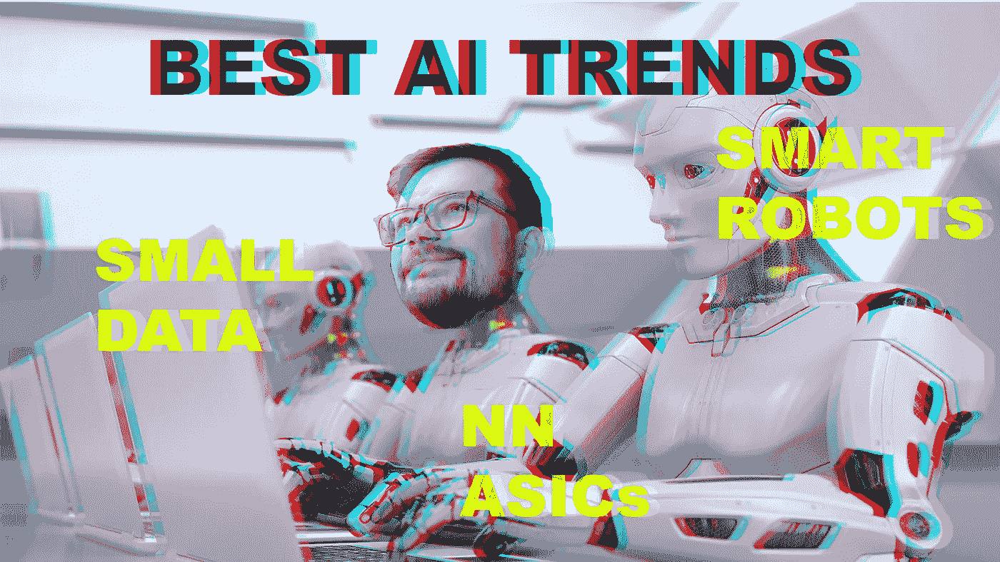
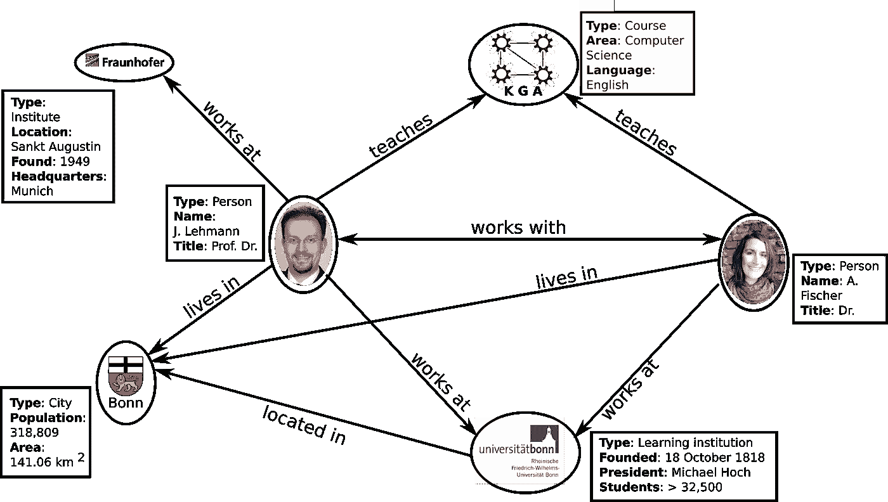
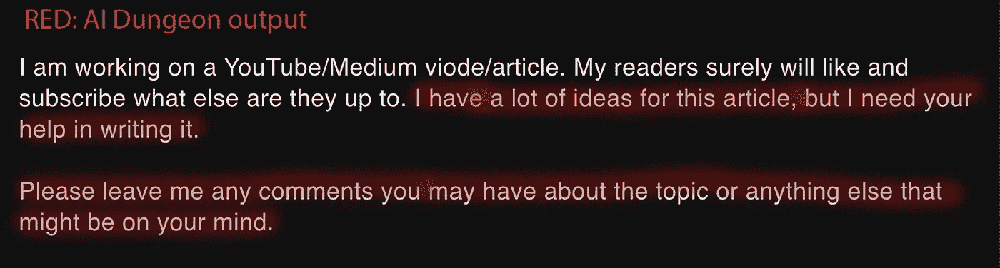
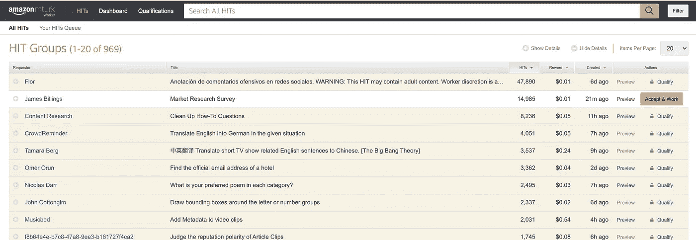

# 最好的人工智能趋势还在后头

> 原文：<https://pub.towardsai.net/the-best-ai-trend-is-yet-to-come-f21ac7145908?source=collection_archive---------0----------------------->

## [人工智能](https://towardsai.net/p/category/artificial-intelligence)、[未来](https://towardsai.net/p/category/future)、[观点](https://towardsai.net/p/category/opinion)

## 所有人工智能趋势(我们知道的)的完整概述

作者的标题图片，通过[环境元素](https://elements.envato.com/user/iLexx)持有的背景许可证

人工智能在过去十年中取得了令人难以置信的进步，每天都在开发更好的工具和模型。从 GPU 加速到自然语言处理进展，我们已经看到加速器和使能器正在形成，并在最近几年转移了大量投资。就在本周，Deepmind 再次向我们展示了被认为在下一个十年不可能实现的事情可以立即成为现实。

从智能机器人到神经形态硬件，我们将看看从现在到 2025 年每个人都会想到的 13 大人工智能趋势。

> 我与以下任何公司都没有任何关系。Gartner[在创新触发类别中列出了以下所有技术](https://www.gartner.com/smarterwithgartner/2-megatrends-dominate-the-gartner-hype-cycle-for-artificial-intelligence-2020/)

# 1.数字伦理

然而，风险也很大，因为使用敏感信息的诱惑有时太大，以至于看不到负面影响。政府和公司需要解决几个道德问题，并找到利用信息的方法，同时设计尊重人们隐私和维护信任的最佳做法。在我看来，未来最糟糕的情况是公众从根本上不信任人工智能，并停止发展。

想想武器，假媒体，社交媒体机器人，DeepFakes，我们甚至还没有开始了解国家行为者在幕后可能会做些什么。

截图来自谷歌

# 2.知识图表

知识图表已经存在 20 多年了。基本思想是分类法(更准确地说是本体论)，对信息进行分类和分组。知识图就像是智能系统的更保守的方法，建立在清晰的规则之上，具有高度的可解释性。基于深度学习的新方法和图形数据库的结合有助于这些结构的现代宣传学习。

知识图表示例，来源 [Github](https://github.com/SmartDataAnalytics/Knowledge-Graph-Analysis-Programming-Exercises)

它们通常用于需要迁移学习的领域，或者理解上下文至关重要的领域。谷歌凭借其知识图谱保持着这一记录，这些知识图谱被用于许多服务，如搜索引擎和语音助手。

# 3.智能应用

智能应用程序，又名 I-apps(我想知道为什么苹果不持有那个专利；)是以任何形式使用智能的应用。这包括人工智能、大数据，以及一切你可以在人工智能这个统称下销售的东西。这里最大的希望是应用程序能够了解他们的用户，并通过持续的使用学习如何更好地为他们服务。

这种类型最知名的应用是 Cortana/Siri 和其他助手，医疗保健应用 Ada，以及 AI dungeon，这是一款使用人工智能生成无限内容的多人文本冒险游戏。我问 AI dungeon 它对我们迄今为止的故事有什么看法，这是它的回答。

来自 I-app [AI 地牢](https://play.aidungeon.io/main/play?publicId=3f0f8e82-8faa-4559-a6ef-eb90642f522a)的例子，没错确实是这么写的

# 4.深度神经网络 ASICs

很多年前，AI 模型主要是在 CPU 上训练的。真正的突破出现在高度优化和并行化的代码开始在 GPU 上运行之后。谷歌认为这一趋势不应就此结束，并推出了 TPUs(张量处理单元)，这是一种专门针对人工智能框架 TensorFlow 上常见计算进行完美调整的芯片。

ASIC(专用集成电路)是为特定用途定制的芯片。从技术上讲，GPU 只不过是针对图形计算优化的 ASIC，也就是并行矩阵乘法。这方面的趋势是设计高度专用于特定用途的 ASICs。我们可以开发一种完全符合特斯拉汽车要求的系统，或者一种完全适用于面部识别的系统。

# 5.数据标注和注释服务

为了验证系统并让它们学习，我们首先需要知道什么是正确的。仅仅经常有数据是不够的。我们通常还需要描述数据的标签。如下图所示，在学会区分戴面具者和不戴面具者之前，机器首先需要知道实验对象戴着面具。

作者测试遮罩检测人工智能的图像

这就是数据标注和注记服务的用武之地。

第一步:上传数千张照片。

第二步:合格的用户会告诉你图片里有什么。像戴口罩和不戴口罩的低技能人员。医生在放射图像中寻找像癌症类型这样的标签。

正如你可能想象的那样，这在未来几年可能会是一个相当大的行业。亚马逊的机械土耳其人可能是最有名的。它允许你为标注数据或回答调查赚钱。

亚马逊的 Mechanical Turk 仪表盘截图。

# 6.智能机器人

人文学科是最后的梦想，还是第一个？当我还是个小男孩的时候，我就梦想着类似人形的机器人为我做一些平凡的工作。烹饪、清洁和组装宜家家具。

据雅虎财经报道，智能机器人市场预计到 2025 年将超过 230 亿美元。虽然距离我小时候想象的机器人类型还有很长的路要走，但至少可以说，目前的发展很有趣。工业智能机器人守卫着从汽车到家具的许多国际产品的装配线。它们的使用预计不会很快达到平稳状态。

当前最吸引人的发明不是儿童玩具，而是成人玩具。性爱机器人已经出现在新闻中很多年了，很明显，它们在赚钱。就我个人而言，我不会花 5000 美元以上来买这些令人毛骨悚然的娃娃，但话又说回来，我又有什么资格来评判呢？它甚至可以泡茶；)

# 7.人工智能开发者和教学套件

AI kits 是一个总括术语，指帮助开发人员/学生理解和实现 AI 解决方案的指令、示例和软件开发工具包。这种工具包目前处于起步阶段，我们可以期待它们在未来几年内成为更普遍的知识。他们的目标将是教授并让开发者和学生达到一定的知识水平，以有效地使用和促进人工智能的采用。

目前开发套件的例子包括来自 Huwai 的 [Atlas 200 DK AI。或者](https://e.huawei.com/in/products/cloud-computing-dc/atlas/atlas-200?utm_medium=display&utm_source=AIM_IN&utm_campaign=01APRIN2073I9N&source=300x600)[英特尔在 PC 上的 AI 开发套件](https://software.intel.com/content/www/us/en/develop/hardware/ai-on-pc/devkit.html)。

在教学前沿，来自 Dobot 的魔术师 Lite 是我从来不需要但一直想要的东西的顶端；)，一定要看一看。

# 8.人工智能治理

AI 治理是评估和监控算法的过程。这可能包括偏见、投资回报率、风险、有效性以及我们将来会提出的所有其他指标。

这里的主要问题是时间。在开发时，人工智能开发人员必须根据他们现在可用的数据做出假设。但是，在一个可能的黑天鹅事件(如 COVID)发生 5 年后，会发生什么呢？你的航班推荐引擎的基本假设仍然成立吗？

结果是错失机会和基于古老假设的错误决策。这就是为什么我们需要人工智能治理计划。简而言之，它至少应该包括。

1.  人工智能模型定义:人工智能的目的是什么
2.  AI 模型管理:每个模型能做什么，什么部门在用它做什么？
3.  数据治理:数据是如何转换的？您可以在哪些国家使用它们？出于何种目的可能会被复制？

对于进一步的阅读，我可以推荐 tdwi 的[数据治理入门。](https://tdwi.org/articles/2020/11/20/adv-all-getting-started-with-ai-governance.aspx)

# 9.增强智能

增强智能是指使用人工智能来增强人类的智力和生产力。它不是取代工人，而是努力开发工具，帮助他们变得更加高效和有效。

目前的例子包括投资组合管理软件，使财务规划师能够为他们的客户提供定制的解决方案。或者帮助保健专业人员为正确的病人选择正确的药物。

> “[决策支持](https://www.gartner.com/en/newsroom/press-releases/2019-08-05-gartner-says-ai-augmentation-will-create-2point9-trillion-of-business-value-in-2021)和人工智能增强将超越所有其他类型的人工智能计划”——Gartner

虽然这肯定更多地是一个什么解决方案属于什么类别的问题，但肯定是一个强有力的声明。

# 10.神经形态硬件

神经形态硬件是指从一开始就考虑到神经网络而设计的专用计算硬件。专用处理单元模拟硬件内部的神经元，并以类似网络的方式相互连接，以实现快速信息交换。

那么有什么区别呢？目前，大多数处理器实现冯诺依曼架构。在过去的几十年里，这种架构已经被证明是我们感兴趣的大多数任务的理想选择。AI 在计算方面是不同的；它高度并行化，需要分散的内存访问。这是神经形态硬件看到更高的效率和速度的机会。这种体系结构有很多种不同的用途，没有一种适合所有人的方法。

# 11.负责任的 AI

我个人只有在阅读了《数学毁灭武器》之后才意识到它有多么重要。当构建系统时，开发人员自己几乎不理解当“普通”人使用它们时会发生什么？在她的书中，作者列举了使用自动化教师评估系统的学校的例子。问题是没有人理解它给老师的分数。这导致了坏邻居中的好老师因为他们无法控制的结果而被解雇。当他们反对的时候，没有人在旁边解释这些本质上具有深刻统计学意义的结果。这只是我们应该小心行事的许多领域之一，并清楚地强调了为什么我们应该监控我们的人工智能模型的用途。以下来自微软的视频强调了需要考虑的关键组件。

# 12.小数据

我们都听说过大数据，以及如何通过简单地提供更多高质量的数据来训练模型，从而改进模型。目前，我们大多看到一个低劣的模型可以通过简单地使用更多的数据轻易地胜过一个更好的模型。但是如果我们没有更多的数据呢？或者我们有一个可爱的用例，但没有足够的数据，我们需要从头开始收集和标记一切？

例如，我们可能希望自动转录来自机械师的手写笔记/图纸。可能不存在允许我们在真实交易中学习整个系统的数据集。那么我们能做什么呢？这就是迁移学习的用武之地。我们基本上可以首先在图画和手写笔记上训练我们的模型。一旦模型学会了如何解释文字和绘画，我们就会向它展示真实的交易，我们从力学中得到的小数据。

越来越多的论文问世，计算并拼凑出一个系统，说明如何以及以什么样的顺序训练这样一个系统。迁移学习肯定会存在。

# 13.人工智能市场

分享是关怀；人工智能开发人员知道这一点，并通过每年 1000 份出版物公开分享知识。虽然分享知识很好，但分享整个模型更好。基本的概念是，在你的数据上训练出一个模型之后，你把它上传到一个网站上，然后用户就可以付费了。我为这个话题专门制作了一个视频，我认为这个趋势太大了，不容忽视，看看吧。

# 结论

世界正以前所未有的速度前进。我们正处于技术进步最激动人心的时代，AI 是很大一部分。我们了解了最令人兴奋的趋势，这些趋势应该有助于人工智能实现其承诺，并加速应用它的所有行业的进步。虽然我们要到 2025 年才能看到这些趋势的全面实施，但我们可以预计其中一些将成为我们生活中不可或缺的一部分。

如果你喜欢这篇文章，我会很高兴在 Twitter 或 LinkedIn 上联系你。

一定要看看我的 [YouTube](https://www.youtube.com/channel/UCHD5o0P16usdF00-ZQVcFog?view_as=subscriber) 频道，我每周都会在那里发布新视频。