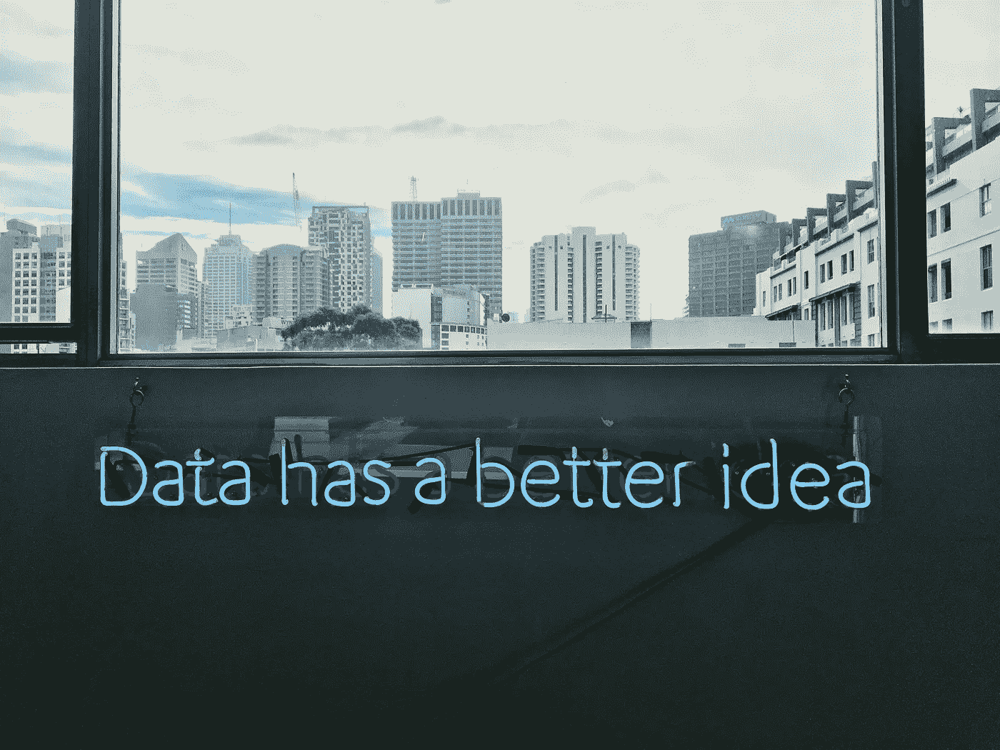
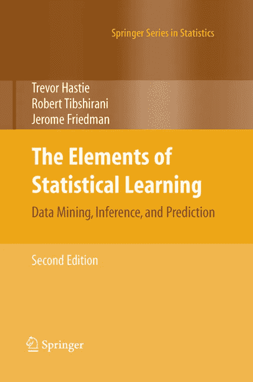

# 最佳免费数据科学资源:书籍和在线课程

> 原文：<https://pub.towardsai.net/the-best-free-data-science-resources-books-online-courses-21aaa949603?source=collection_archive---------0----------------------->

## [数据科学](https://www.linkedin.com/in/serafeim-loukas/)，[观点](https://towardsai.net/p/category/opinion)

## 对任何想了解更多数据科学知识的人来说，最有用、最免费的书籍和在线课程。

由[弗兰基·查马基](https://unsplash.com/@franki?utm_source=unsplash&utm_medium=referral&utm_content=creditCopyText)在 [Unsplash](https://unsplash.com/s/photos/data-science?utm_source=unsplash&utm_medium=referral&utm_content=creditCopyText) 上拍摄的照片

# 介绍

我决定写这篇文章，为那些想学习更多数据科学知识的人提供一些最有用的书籍和在线课程。我将提供的所有资源都是免费的。所提供的资源涵盖了从基础数据可视化到拟合复杂的机器学习模型和理解模型背后的应用统计学的主题。

如果你想在交互式路线图和活跃的学习社区的支持下自学数据科学，看看这个资源:[https://aigents.co/learn](https://aigents.co/learn)

# 开始之前

**我想说明的是，在线课程不会让你成为数据科学家。**要成为一名数据科学家，你需要具备以下几方面的综合素质:

*   工程/计算机科学学位/文凭(非强制性，但有帮助)
*   关于所用工具的知识(例如，最常用的聚类方法是什么？)
*   现实世界和项目的实践经验(例如，通过参加一些无限的 [Kaggle](https://www.kaggle.com/competitions) 竞赛或从事与数据科学相关的工作)
*   数据结构、系统和算法如何工作的理论知识(如微积分、统计学、应用数学和编程知识)。

如前所述，仅靠以下课程和书籍并不能让你成为一名数据科学家，但这些资源将使你能够学到许多关于数据科学 101 的东西，即从可视化、编程、模型如何工作、如何绘制 SVM 模型的决策面到构建神经网络。

# 课程

## 1.计算机科学和使用 Python 编程入门(价格:免费)

 [## 计算机科学和使用 Python 编程简介

### 本课程是两个系列课程中的第一个:计算机科学导论和使用 Python 编程，以及…

www.edx.org](https://www.edx.org/course/introduction-to-computer-science-and-programming-7) 

这是我个人认为为了学习 Python 3 最好的课程。

*编程语言:Python3*

## 2.斯坦福大学的机器学习(价格:免费)

 [## 斯坦福大学的机器学习| Coursera

### 机器学习是让计算机在没有明确编程的情况下行动的科学。在过去的十年里…

www.coursera.org](https://www.coursera.org/learn/machine-learning) 

**可能是 Coursera 平台提供的关于机器学习最著名的课程**。来自斯坦福大学的著名教授和人工智能倡导者 **Andrew** **Ng** 是这门在线课程的讲师。该课程令人惊叹，重点讲解最著名的**机器学习算法**、**包括其数学基础。**

*编程语言:Python3*

## 3.从数据中学习(机器学习入门)(价格:免费)

 [## 从数据中学习(机器学习入门课程)

### 这门机器学习的计算机科学入门课程将涵盖基础理论、算法和应用…

www.edx.org](https://www.edx.org/course/learning-from-data-introductory-machine-learning) 

**机器学习入门**课程涵盖理论、算法和应用。重点是真正的理解，而不仅仅是“知道”。它由加州理工学院(CALTEC)提供。

## 4.深度学习专业化(价格:免费)

 [## 深度学习

### 从 deeplearning.ai 学习深度学习，如果你想打入人工智能(ai)，这个专精…

www.coursera.org](https://www.coursera.org/specializations/deep-learning) 

这是**吴恩达教授著名的**和必做的**深度学习专精。**

这是一个**长**的 5 门课程的专业，专注于神经网络，当今最重要的算法之一，最适合处理非结构化数据(图像、声音、文本、视频等)。).它涵盖了第一门课程中神经网络背后的**基础**和**数学**到**超参数调整**、**项目规划和策略**、**卷积架构、**以及最后的**序列模型**架构。

# 书

## 1.Python 数据科学手册(价格:免费)

 [## Python 数据科学手册

### 该网站包含 Jake VanderPlas 的 Python 数据科学手册的全文；该内容可在…上获得

jakevdp.github.io](https://jakevdp.github.io/PythonDataScienceHandbook/) 

Python 现在是，将来也会是数据科学和机器学习的主导语言。《Python 数据科学手册》是提升我们 Python 技能的最佳书籍。对于那些使用 Pandas 进行频繁数据操作的人来说，这是一个很好的参考资料。

这本书涵盖了用于计算的 **IPython** 、 **Numpy** 、使用 **Pandas** 的数据操作、使用 **Matplotlib** 的数据可视化、使用 **Scikit** - **Learn** 的机器学习。

*编程语言:Python3*

## 2.统计学习入门(价格:免费)

 [## 统计学习导论

### 与应用在 R 加雷斯詹姆斯，丹妮拉威滕，特雷弗哈斯蒂，和罗伯特 Tibshirani 主页下载本书 PDF…

faculty.marshall.usc.edu](http://faculty.marshall.usc.edu/gareth-james/ISL/) 

机器学习最好的入门教材之一。它用 r 提供了易于理解的概念解释和编码示例。

这本书涵盖了 K-fold 交叉验证，正则化，特征选择，多项式回归，决策树，支持向量机，无监督学习即聚类。

*编程语言:R*

## 3.统计学习的要素(价格:免费)

这本书涵盖了从线性方法到神经网络，助推和随机森林的一切。

下载链接:[https://web.stanford.edu/~hastie/ElemStatLearn/](https://web.stanford.edu/~hastie/ElemStatLearn/)

## 4.理解机器学习:从理论到算法(价格:免费)

 [## 理解机器学习

### 机器学习是计算机科学发展最快的领域之一，具有深远的应用。的目的是…

www.cambridge.org](https://www.cambridge.org/core/books/understanding-machine-learning/3059695661405D25673058E43C8BE2A6) 

如果你想更深入地了解机器学习算法，这是一本黄金标准的书。这本书提供了关于最著名和最广泛使用的算法的广泛理论。

下载链接:[http://www . cs . huji . AC . il/~ shais/understanding machine learning/understanding-machine-learning-theory-algorithms . pdf](http://www.cs.huji.ac.il/~shais/UnderstandingMachineLearning/understanding-machine-learning-theory-algorithms.pdf)

## 5.深度学习(麻省理工学院出版社出版的一本书)(价格:免费)

 [## 深度学习

### 深度学习教材是一个资源，旨在帮助学生和从业人员进入机器领域…

www.deeplearningbook.org](https://www.deeplearningbook.org/) 

如果没有免费的深度学习书籍，我无法完成这篇文章。**深度学习教材**是一个旨在帮助学生和从业者进入机器学习领域，特别是深度学习领域的资源。这本书的网络版现在已经完成，将继续在网上免费提供。

## 6.思考统计(价格:免费)

 [## 想想统计数据

### 想想统计手册。阅读来自世界上最大的读者社区的 47 篇评论。如果你知道如何编程，你有…

www.goodreads.com](https://www.goodreads.com/book/show/12042357-think-stats) 

下载链接:[http://greenteapress.com/thinkstats/](http://greenteapress.com/thinkstats/)

**如果没有免费的统计学书籍，我无法完成这篇文章。**

作为一名数据科学家，牢固掌握概率和统计知识非常重要。机器学习模型植根于概率论的基础。

这本书涵盖了描述统计，分布函数，概率，假设检验，以及许多其他内容。

那都是乡亲们！我希望你喜欢这篇文章！

# 敬请关注并支持这一努力

如果你喜欢这篇文章并且觉得它有用，**关注**我就可以看到我所有的新帖子。

我的个人资料如果您想关注我:

 [## Serafeim Loukas —中等

### 阅读 Serafeim Loukas 在媒介上的作品。电气和计算机工程文凭(NTUA)。…理科硕士。

medium.com](https://medium.com/@seralouk) 

有问题吗？把它们作为评论贴出来，我会尽快回复。

# 最新帖子

 [## 时间序列预测:用脸书的先知模型预测股票价格

### 使用可从《先知脸书》公开获得的预测模型预测股票价格

towardsdatascience.com](https://towardsdatascience.com/time-series-forecasting-predicting-stock-prices-using-facebooks-prophet-model-9ee1657132b5)  [## 用新冠肺炎假设的例子解释 ROC 曲线:二分类和多分类…

### 在这篇文章中，我清楚地解释了什么是 ROC 曲线以及如何阅读它。我用一个新冠肺炎的例子来说明我的观点，我…

towardsdatascience.com](https://towardsdatascience.com/roc-curve-explained-using-a-covid-19-hypothetical-example-binary-multi-class-classification-bab188ea869c)  [## 支持向量机(SVM)解释清楚:分类问题的 python 教程…

### 在本文中，我解释了支持向量机的核心，为什么以及如何使用它们。此外，我还展示了如何绘制支持…

towardsdatascience.com](https://towardsdatascience.com/support-vector-machines-svm-clearly-explained-a-python-tutorial-for-classification-problems-29c539f3ad8)  [## PCA 清楚地解释了——如何、何时、为什么使用它以及特性的重要性:Python 指南

### 在这篇文章中，我解释了什么是 PCA，何时以及为什么使用它，以及如何使用 scikit-learn 在 Python 中实现它。还有…

towardsdatascience.com](https://towardsdatascience.com/pca-clearly-explained-how-when-why-to-use-it-and-feature-importance-a-guide-in-python-7c274582c37e)  [## 关于 Python 中的最小-最大规范化，您需要知道的一切

### 在这篇文章中，我解释了什么是最小-最大缩放，何时使用它，以及如何使用 scikit-learn 在 Python 中实现它

towardsdatascience.com](https://towardsdatascience.com/everything-you-need-to-know-about-min-max-normalization-in-python-b79592732b79)  [## Scikit-Learn 的标准定标器如何工作

### 在这篇文章中，我将解释为什么以及如何使用 scikit-learn 应用标准化

towardsdatascience.com](https://towardsdatascience.com/how-and-why-to-standardize-your-data-996926c2c832) 

# 和我联系

*   **LinkedIn**:[https://www.linkedin.com/in/serafeim-loukas/](https://www.linkedin.com/in/serafeim-loukas/)
*   **研究之门**:[https://www.researchgate.net/profile/Serafeim_Loukas](https://www.researchgate.net/profile/Serafeim_Loukas)