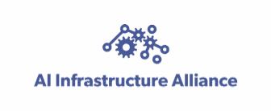
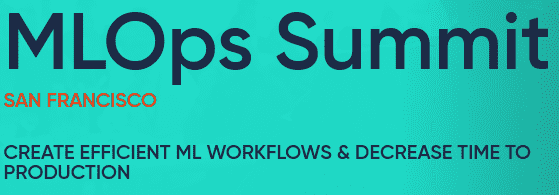
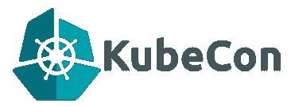
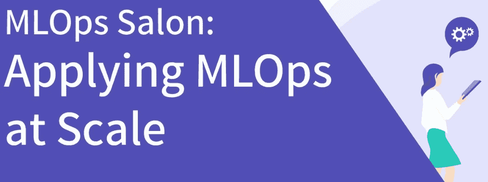
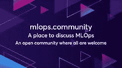
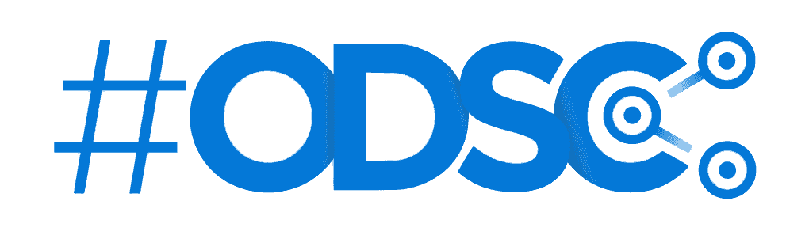
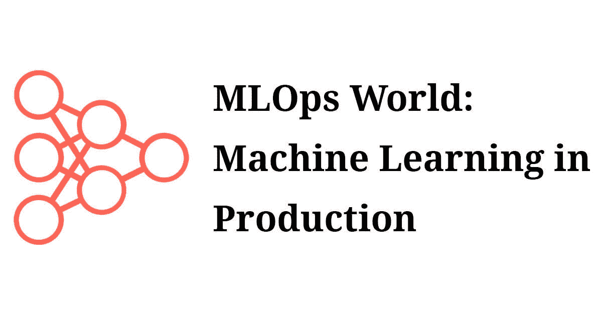
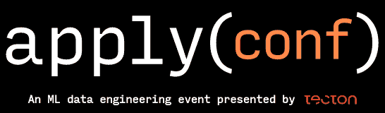

# 2022 年最佳 MLOps 活动和会议

> 原文：<https://pub.towardsai.net/the-best-mlops-events-and-conferences-for-2022-2f73a1290369?source=collection_archive---------0----------------------->

## [DevOps](https://towardsai.net/p/category/devops)

由 [Chris Montgomery](https://unsplash.com/@cwmonty?utm_source=medium&utm_medium=referral) 在 [Unsplash](https://unsplash.com?utm_source=medium&utm_medium=referral) 上拍摄的照片

2021 年被吹捧为“MLOps 年”，这是非常正确的。随着成千上万的公司采用旨在帮助他们更快、更有效地将模型投入生产的实践和工具，MLOps 场景呈现爆炸式增长。大量新的供应商、咨询公司和开源工具进入该领域，这使得保持对正在发生的事情的了解比以往任何时候都更重要。

整个一月份，我都在四处打听，想找出人们去年参加的最佳 MLOps 活动。有很多很好的建议需要考虑，但只有少数几个建议反复出现。我把这些和我自己的经历结合起来，列出了你绝对不想错过的活动和会议:

# **AIIA**

AIIA(AI 基础设施联盟)是一个非营利基金会，目标是汇集最好的个人 MLOps 工具来构建“规范堆栈”。2022 年，AIIA 将举办一系列活动，涵盖 MLOps 生命周期的不同方面。讲座将是高度互动的，主要由技术演示组成，而不是没完没了的幻灯片

他们前四项赛事的时间表如下:

**3 月 3 日** —实验跟踪
**4 月 7 日** —模型部署
**5 月 5 日** —监控和跟踪模型
**6 月 2 日** —机器学习的编排和流水线

事件是虚拟的，将很快在 AIIA 网站上发布。

# **MLOps 峰会**

这是 2021 年少数几个完全致力于 MLOps 主题的会议之一。峰会很好地聚集了来自福乐鸡快餐店、第一资本和 BBC 等终端用户公司的演讲者，这意味着一些非常有趣的战争故事。

2022 年版将于 6 月 23 日至 24 日在旧金山举行(希望也能在网上举行)

# **KubeCon**

没有 Ops 就没有 MLOps，众所周知，大部分 Ops(和 DevOps)已经选择 Kubernetes 作为他们的部署平台。Kubecon 已经发展到足以拥有自己的“机器学习和数据”轨道，其中将充满 MLOps 内容。Kubernetes 用户和开源爱好者不能错过这一个。

[Kubecon EU](https://events.linuxfoundation.org/kubecon-cloudnativecon-europe/) 于 5 月 16 日至 20 日在西班牙的**巴伦西亚举行(也是虚拟的)**

[Kubecon NA](https://events.linuxfoundation.org/kubecon-cloudnativecon-north-america/) 将于 10 月 24 日**至 28 日**在密歇根州底特律举行

# **MLOps 沙龙**

Verta.ai 的团队组织了几次微型会议(这是真的吗？)去年重点关注了 MLOps。我通常对供应商举办的活动持怀疑态度，因为大多数情况下，他们都充满了产品宣传。令人兴奋的是，这些并不是这样的。他们的[大规模应用 MLOps](https://info.verta.ai/applying-mlops-at-scale)活动邀请了一些才华横溢、知识渊博的外部演讲者。

我找不到任何关于 2022 年这些事件的时间表的信息，但我希望他们肯定会做更多的事情！

# **MLOps 社区**

如果您还不是 [MLOps.community](https://mlops.community/) 的成员，那么现在就去加入吧！在整个 2021 年，他们定期举行聚会、阅读小组、咖啡会议和播客。演讲者是供应商、最终用户和开源贡献者的完美结合。slack 频道也是一个寻求帮助或建议的好地方。

期待 2022 年有更多同样的[精彩内容](https://mlops.community/watch/)

# **ODSC**

过去，ODSC(开放数据科学大会)可能专注于传统的数据科学，并包括一些机器学习内容，但现在更有可能是相反的。随着 ODSC 这么大，有这么多的 ML 内容，在过去的几年里已经看到越来越多的 MLOps 内容被包括在内。这一趋势必将保持不变，我们将在今年的 ODSC 会议上看到更多精彩的 MLOps 会谈。

[ODSC 东](https://odsc.com/boston/)于**4 月 19-21 日**在波斯顿

[西 ODSC](https://odsc.com/california/)将于 11 月 1 日至 3 日在三藩市

[ODSC 欧洲](https://odsc.com/europe/)于 6 月 15 日至 16 日在伦敦

**[ODSC·APAC](https://odsc.com/apac/)计划于**9 月 7 日—8 日**上映，目前已经完全虚拟化**

****

# ****MLOps 世界****

**正如我前面提到的，完全致力于 MLOps 的成熟会议屈指可数……MLOps World 就是其中之一！2021 年的活动充满了有趣的谈话，我完全期待 2022 年的活动会更大更好。**

**[2022 年大会](https://mlopsworld.com/)于**6 月 7 日—10 日**在加拿大多伦多举行**

****

# ****应用()****

**当我为这个列表收集意见时，这个会议一次又一次地出现。Apply() conf 是由泰克顿的团队制作的。ML 工程是会议的主要焦点，因此任何在 MLOps 领域工作的人都一定会学到一些新东西。**

**[Apply()于**2022 年 5 月【18-19】**回归](https://www.applyconf.com/apply-conf-may-2022/)，为虚拟**

****

# **伦敦警察厅**

**我不能列出 2022 年的最佳赛事而不包括我自己的吗？那样很不礼貌，对吧？除了玩笑和裙带关系，我真的相信 MLOps 伦敦聚会属于这个名单。**

**我已经注意确保所有这些聚会不仅有高质量的 MLOps 演讲者，而且在线直播，以便世界各地的人们都可以参加。**

**伦敦奥运会每两个月举行一次。你可以[在伦敦亲自出席](https://mlops.london)或[关注 youtube 频道](https://www.youtube.com/channel/UCSBfllj_pRPB36TAZJfjXWg)观看他们的直播或点播。**

**如果我错过了你去年喜欢的活动，请在评论中告诉我。我总是在寻找学习的地方！**