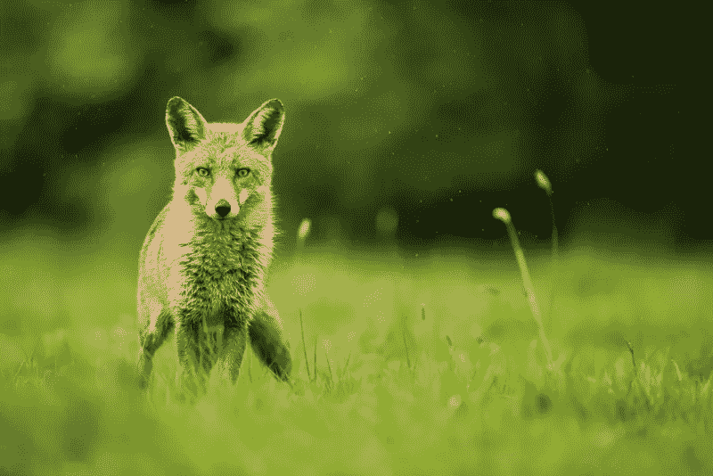
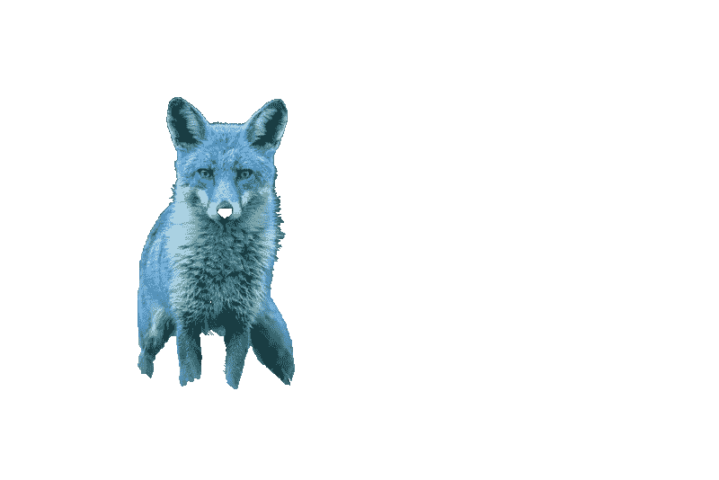
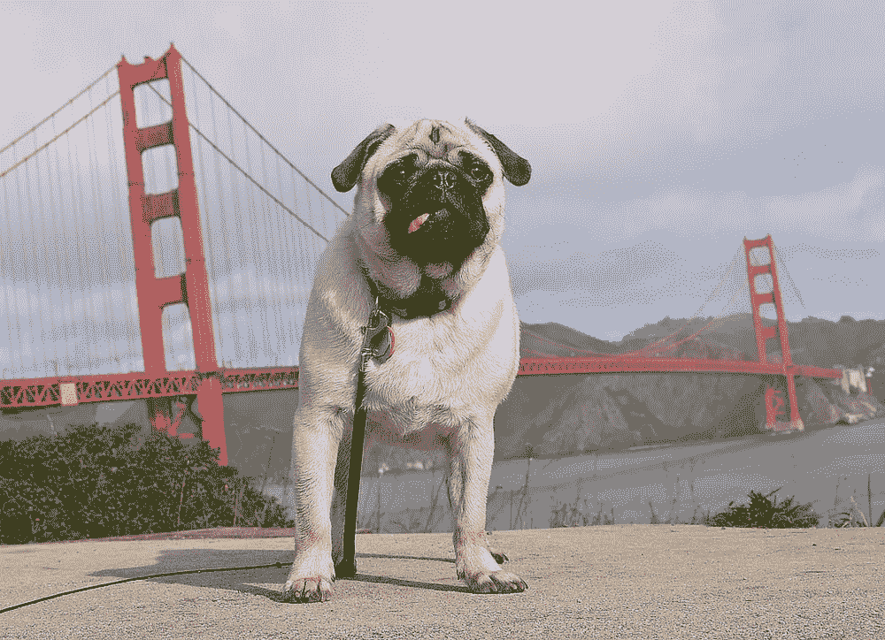
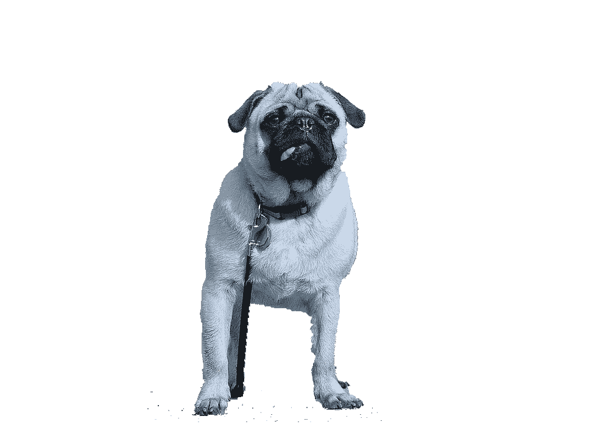
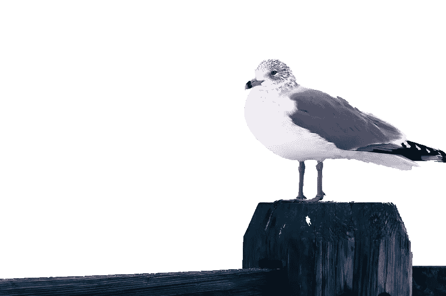

# 用 Python 开始计算机视觉的最佳项目

> 原文：<https://pub.towardsai.net/the-best-project-to-start-in-computer-vision-with-python-3ff14aba88a8?source=collection_archive---------1----------------------->

## [计算机视觉](https://towardsai.net/p/category/computer-vision)

## grab cut——用于图像抠图(背景去除)的 Google Colab 笔记本实现

> 跟随本文以及 GitHub 上的[完整代码实现。在](https://github.com/louisfb01/iterative-grabcut) [Google Colab](https://colab.research.google.com/) 中打开笔记本，导入你的图片，然后运行单元格！
> 
> 最初发表于 [louisbouchard.ai](https://www.louisbouchard.ai/grabcut-notebook-implementation/) ，两天前在[我的博客](https://www.louisbouchard.ai/tag/artificial-intelligence/)上读到的！

凯文·Ku 在 [Unsplash](https://unsplash.com?utm_source=medium&utm_medium=referral) 上拍摄的照片

图像抠图是一项非常有趣的任务，目标是在图片中找到任何感兴趣的对象或人，并移除其背景。这项任务很难完成，因为它的复杂性，找到完美轮廓的人，人或物体。这篇文章回顾了一项令人兴奋的技术，它使用基本的计算机视觉算法来完成这项任务。GrabCut 算法。对于像人或动物这样的复杂物体来说，它很快，但不是很精确。尽管如此，它在特定的上下文中还是很方便的，并且是在计算机视觉和 python 中开始的第一个完美的应用项目！如上所述，该实现使用 Google Colab，因此不需要任何要求或设置，这使得它成为一个令人兴奋的学习项目。

一个图片抠图的例子。图片由作者提供。

## 该项目— GrabCut [1]

[该 GrabCut 算法实现](https://github.com/louisfb01/iterative-grabcut)基本上使用[高斯混合模型](https://en.wikipedia.org/wiki/Mixture_model)来估计前景项目和背景的颜色分布。我们在感兴趣的对象(前景)上绘制一个矩形，并通过在部分上绘制来迭代地尝试改善结果。该算法无法向前景添加像素或从前景中删除一组像素。这就是为什么我们经常使用“绿色屏幕”，帮助算法只移除绿色像素，而将其余的像素留在最终结果中。但是，当我们无法进入这样一个绿色屏幕时，结果就不那么好了。

该算法使用用户制作的矩形来识别前景项目。然后，用户可以编辑以向前景添加或移除对象。一旦完成，它删除背景，使其透明(添加 alpha 通道)，并保存它。

这是一个简单的笔记本，实现了我制作的关于 [ModNet](https://www.louisbouchard.me/remove-background/) 的视频中展示的 [GrabCut 算法](https://opencv-python-tutroals.readthedocs.io/en/latest/py_tutorials/py_imgproc/py_grabcut/py_grabcut.html)，这是一种新的图像抠图技术。

## 它是如何工作的？

一旦你打开[笔记本](https://github.com/louisfb01/iterative-grabcut/blob/main/BackgroundRemoval_Iterative.ipynb)，你会看到 7 个 python 单元格，里面有代码和注释。笔记本很简单:

1.  上传您的图像。[第三个单元格]
2.  在图像上创建一个矩形，包括所有的前景对象。[第四个单元格]
3.  使用 GrabCut 算法移除背景。[第 5 个单元格]
4.  如果需要改进，在图像上绘制，左键(白色)=前景，右键(黑色)=背景。[第 6 个单元格]
5.  使用 GrabCut 算法移除背景。[第 6 个单元格]
6.  返回步骤 4 或结束。[第 6 个单元格]
7.  保存您的结果。[第 7 个单元格]

*注:【单元格】参照* [*笔记本实现*](https://github.com/louisfb01/iterative-grabcut/blob/main/BackgroundRemoval_Iterative.ipynb) *。*

# 在视频演示中用代码观察它是如何工作的

## 一次迭代只需要算法的第一遍的例子

这是一个算法在第一次试验中起作用的例子，我们只需要步骤 1 到 3。我们基本上就是上传图像，在感兴趣的物体(我们的狗)周围画一个长方形，就这样！您可以在 png 中保存带有 alpha 通道的图像。

## 具有更具挑战性的图片和需要多次迭代的示例

这是一个算法在第一次试验中起作用的例子，我们只需要步骤 1 到 6。我们基本上是上传图像，在感兴趣的物体(我们的第二只狗)周围画一个矩形，然后进入微调循环。这里，我们使用左键绘制随机线来进一步改善结果。完成后，您可以使用剩余的代码将带有 alpha 通道的图像保存在 png 中。

## 自己落实！

完整的[代码实现](https://github.com/louisfb01/iterative-grabcut)可以在 [GitHub](https://github.com/louisfb01/iterative-grabcut) 上获得！你可以很容易地在[的 Google Colab 机器](https://colab.research.google.com/)中打开它，然后马上运行它，不需要任何先决条件或设置。只需在 Google Colab 中导入您的图片并运行代码！

 [## Louis FB 01/迭代-grabcut

### 该算法使用用户制作的矩形来识别前景项目。然后，用户可以编辑添加或…

github.com](https://github.com/louisfb01/iterative-grabcut) 

## 具体结果

GrabCut 图像抠图示例。

## 结论

如果您目前正在学习 python 或计算机视觉，请随意实现这段代码并尝试改进它！当在计算机视觉中工作时，这是学习重要的和循环的函数的超级有趣和伟大的方法！如果有任何代码更新，请[联系我](http://bouchard.lf@gmail.com)，或者在 [GitHub 资源库](https://github.com/louisfb01/iterative-grabcut)中提交更新！

如果你喜欢我的工作，并想了解人工智能的最新动态，你绝对应该关注我的其他社交媒体账户( [LinkedIn](https://www.linkedin.com/in/whats-ai/) ， [Twitter](https://twitter.com/Whats_AI) )，并订阅我的每周人工智能 [**简讯**](http://eepurl.com/huGLT5) ！

## 支持我:

*   支持我的最好方式是在 [**媒体**](https://medium.com/@whats-ai) 上关注我，或者如果你喜欢视频格式，在[**YouTube****上订阅我的频道。**](https://www.youtube.com/channel/UCUzGQrN-lyyc0BWTYoJM_Sg)
*   **支持我在 [**上的工作**](https://www.patreon.com/whatsai)**
*   **加入我们的 [**Discord 社区:** **一起学 AI**](https://discord.gg/learnaitogether)和*分享你的项目、论文、最佳课程、寻找 Kaggle 队友等等！***

## **参考**

**[1]使用 GrabCut 算法的交互式前景提取，OpenCV，(2013)，[https://OpenCV-python-tutroals . readthedocs . io/en/latest/py _ tutorials/py _ imgproc/py _ grab cut/py _ grab cut . html](https://opencv-python-tutroals.readthedocs.io/en/latest/py_tutorials/py_imgproc/py_grabcut/py_grabcut.html)**