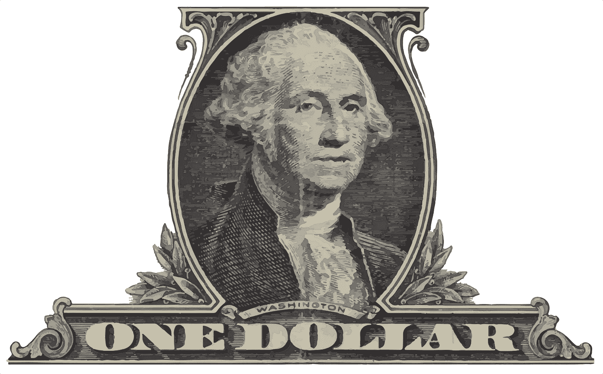
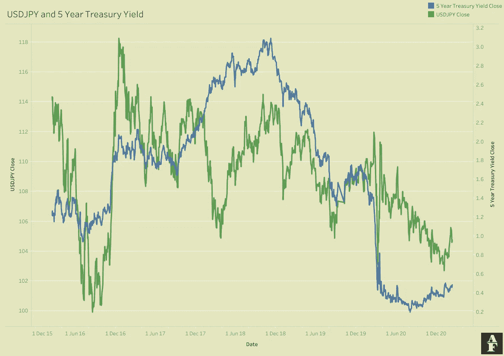

# 债券市场——为你的财务分析增加了另一个变量

> 原文：<https://pub.towardsai.net/the-bond-market-adding-another-variable-to-your-financial-analysis-256abe15d4b0?source=collection_archive---------1----------------------->

## [预测分析](https://towardsai.net/p/category/predictive-analytics)

图片由[玛丽·帕尔克](https://pixabay.com/users/905513-905513/?utm_source=link-attribution&utm_medium=referral&utm_campaign=image&utm_content=1352097)从[皮克斯拜](https://pixabay.com/?utm_source=link-attribution&utm_medium=referral&utm_campaign=image&utm_content=1352097)拍摄

债券市场非常重要，因为它与资金流动直接相关。它是市场和风险情绪的一个强有力指标，可以帮助我们了解投资者如何看待全球经济的现状和未来前景。

一句话，债券市场是公司和政府借钱的地方。这些机构发行债券，本质上是一种附有利息和到期数据的借据，详细说明债券将如何偿还。这些债券可以在二级市场上买卖，其价格将根据标准的经济驱动因素波动。

当我们提到债券时，我们指的是政府债券，尤其是美国政府债券。这些是债券事实上的标准，是交易最频繁的大幅度交易，鉴于美国经济的规模和重要性，通常被视为货币价值的基准。

给你一个最近的历史，美国国债在 2009 年之前占据了美国债券市场的大部分。2008 年莱曼兄弟(Lehmann Brothers)破产以及随后的房地产泡沫破裂和金融崩溃之后，美国经济一蹶不振。从 2008 年 Q1 开始的 6 个季度中，美国经历了 5 个季度的英镑负增长，其中 2008 年第 4 季度和 2009 年 Q1 经济分别萎缩了 8.66%和 4.49%。除了大幅降息之外，美国政府意识到，他们需要采取更严厉的措施来刺激经济，因为他们正在经历自上世纪 30 年代大萧条以来从未见过的事情。2008 年 11 月，美联储宣布了第一轮量化宽松政策，旨在通过购买长期证券向经济注入巨额资金。美联储最初承诺投资 6000 亿美元，他们希望这将鼓励消费者支出，刺激企业增长和银行放贷。

量化宽松有两大宏观效应。首先是美元大幅贬值。在金融危机开始时，由于笼罩市场的悲观情绪以及投资者随后的避险本性，贸易活动严重减少。这导致全球美元供应量下降，最初导致美元价值飙升。当美联储在 2008 年末引入 QE 时，我们很快就看到了效果，因为美元暴跌。最简单的形式是，货币供应量增加导致货币价值下降，因为货币更容易获得。

QE 的第二个效应是我们最感兴趣的，债券市场的扭曲。流入美国经济的新资金是人造货币，是政府直接干预的结果。因此，货币和债券价格的变化并不是由于市场力量的变化而发生的，而是这种干预的直接结果。因此，债券市场并不代表资金的真实潜在价值，自 2009 年以来，美国国债仍被视为通用基准，但正因为如此，人们对待美国国债的态度略有谨慎。

美国在 2009 年引入了单一债券市场，以提供一个不受政府干预的债券来源。这些债券由地方管理机构发行，并将在我们的周报中通过一个常用的 ETF 进行跟踪，即 iShares National Muni Bond ETF(**NYSEARCA:MUB**)。

从情绪的角度来看，债券被视为“避风港”。因为它们是由政府发行的，所以风险相对较低，是投资者在市场前景不确定或负面时蜂拥而至的安全来源。

为了更好地理解债券，我们需要定义一些术语:

*   票面价值——债券价格的面值。这通常是像 1000 美元或 10000 美元的普通面额。
*   息票——债券支付的利息。这是在发布时确定的。
*   到期日——债券的期限，或贷款人获得利息的时间。一旦到期，贷款人将获得全额偿还。
*   收益率——你在债券上获得的回报。收益率最简单的计算方法是每月支付的利息除以债券价格。

债券价格和收益率之间的关系中的一个重要因素。随着债券价格上涨，收益率下降，反之亦然，举个例子就能更好地理解这一点。

假设你以面值 1000 美元购买了一份债券。它的票面利率为 5%，期限为 10 年。有了这些数字，你每年将得到 50 美元，然后你的 1000 美元面值将在 10 年后返还。因此，按 50/1000 计算，当前收益率也是 5%。
现在，根据供求关系，债券的价格会在二级市场上波动。尽管息票是固定的，但价格会变化，因此收益也会变化。如果债券需求下降，你被迫以低于 1000 美元的价格卖出，比如 800 美元，收益率现在是 6.25% (50/800)。如果对债券的需求上升，你可以卖出更多，也许这次是在 1200 美元，收益率现在是 4.17% (50/1200)。

债券市场与货币关系密切。更高的收益率往往会吸引更多的投资者。来自世界各地的投资者将他们的货币兑换成美元，以购买债券，这将导致美元升值。这不是一种完美的关系，当然在金融市场上没有什么是完美的，因为这里有许多其他因素在起作用。鉴于美元的主导地位，这仍然是一个强有力的指标，我们可以添加到任何金融模型中。

美元日元和 5 年期美国国债

尽管量化宽松扭曲了债券市场，但美国国债仍然是全球货币价值的基准。鉴于美元在全球经济中的主导地位，这是一个非常重要的市场，我们需要了解这个市场，尤其是在交易货币时，同时也要了解投资者的整体市场情绪。最终，我们希望借助决定市场趋势的大型机构的趋势，而正是这些机构通过在安全避风港和高风险资产之间转移资金，向我们传达他们的情绪。

感谢您花时间阅读这篇文章。如果你喜欢这些内容，我将推出一份新的算法金融时事通讯，名为 Algo Fin，你可能会感兴趣。这篇时事通讯将探索数据科学和金融之间的联系，最初的重点是货币市场，但我希望在未来建立更多的途径。时事通讯目前是免费加入的，因为我仍然计划为付费用户推出，所以如果这听起来像你可能感兴趣的东西，它绝对值得查看[这里](https://algofin.substack.com)！。