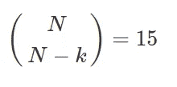
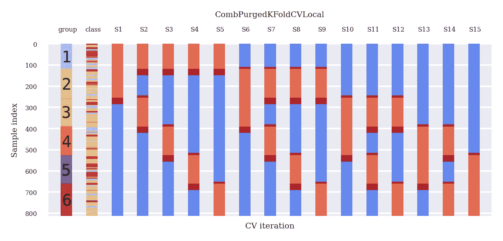
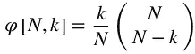
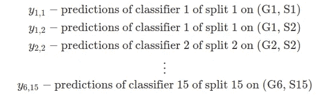
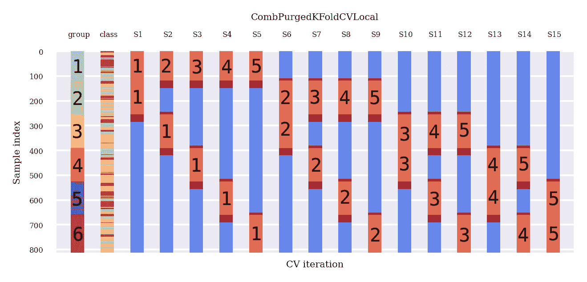
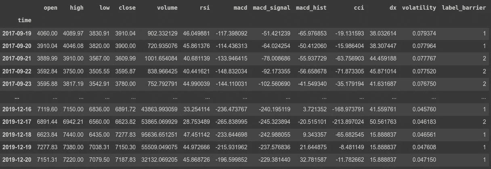
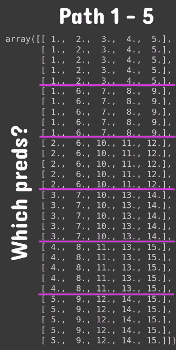

# 组合清除交叉验证法

> 原文：<https://pub.towardsai.net/the-combinatorial-purged-cross-validation-method-363eb378a9c5?source=collection_archive---------0----------------------->


由作者想象。

本文由开源项目 AI4Finance 的核心团队成员 Berend Gort & [Bruce Yang](https://ai4finance.medium.com/) 撰写。这个项目是一个**开源**社区，共享金融 AI 工具，是纽约哥伦比亚大学的一部分。GitHub 链接:

[](https://github.com/AI4Finance-Foundation) [## ai4 金融基金会

### 一个共享金融 AI 工具的开源社区。FinRL:第一个用于财务强化的开源项目…

github.com](https://github.com/AI4Finance-Foundation) 

# Colab 笔记本

[](https://colab.research.google.com/gist/Burntt/f26e5414205542207949aeb9e9cc1ddb/demo_purgedkfoldcv.ipynb) [## 谷歌联合实验室

### 编辑描述

colab.research.google.com](https://colab.research.google.com/gist/Burntt/f26e5414205542207949aeb9e9cc1ddb/demo_purgedkfoldcv.ipynb) 

# 介绍

本文讨论了一种稳健的时间序列数据回测方法，称为 PurgedKFold 交叉验证(CV)法。在互联网上，关于 PurgedKFoldCV 方法的信息有限。存在现有的代码，只是没有解释它们的用法。在 Lopez de Prado，M. (2018)在《金融机器学习的进展》中很好地描述了 PurgedKFoldCV 的思想。因此，在本文中，我们将向您展示如何以正确的方式获取 PurgedKFoldCV

# 为什么传统的交叉验证会失败

该领域的许多论文显示了 k 倍交叉验证(CV)方法的有希望的结果。它们在互联网上如此丰富，以至于几乎再也找不到更具体的方法了。

也许你现在在这里，已经看了一堆文献认为传统的 k 折 CV 效果很好。然而，几乎可以肯定的是，这些结果是错误的。原因:

1.  因为不能期望通过 IID 过程得出观察值，所以 k 倍 CV 在金融中是失败的。
2.  CV 失败的另一个原因是测试集在模型开发过程中被多次使用，导致多重测试和选择偏差。

让我们集中讨论第一部分的论点。当训练集包含出现在测试集中的信息时，就会发生泄漏。时间序列数据通常是串行相关的，例如加密的开盘-盘高-盘低-收盘(OHLCV)数据。考虑以下基于重叠数据链接到标签 Y 的串行相关特征 X 的示例:

*   连续相关的观察。这意味着接下来的几个观察值取决于当前观察值。
*   目标标签来自重叠的数据点。例如，我们在未来的 10 个样本中有一个目标标签，确定价格是下降、保持不变还是上升。我们的目标标签是[0，1，2]。这种标记是对未来值执行的。

因此，当我们将这些数据点放在不同的集合中时，我们会将信息从一个集合泄漏到另一个集合。让我们防止这种情况。

*   吹扫:在测试装置之前，在测试装置之后，从测试装置中取出 10 个样品，这样测试装置就不会发生泄漏。
*   禁运:适用于吹扫未能防止所有泄漏的情况。在测试集之后，在训练集之前从训练集中移除整数数量的样本。

# 向前走回测试方法

WF(walk-forward)方法是文献中最常用的回溯测试方法。WF 是该战略过去表现的历史模拟。每个战略决策都基于决策前收集的信息。

WF 有两大优势:

1.  WF 有一个清晰的历史解释和可比的表现，以纸交易。
2.  历史是一种过滤；因此，使用端点数据可以保证测试集完全超出样本范围(OOS)。

和三个主要缺点:

1.  只测试了一个场景，这很容易被过度拟合。
2.  WF 并不代表未来的表现，因为结果可能会因数据点的特定顺序而有所偏差(例如，仅在显著上升趋势中进行测试)。
3.  WF 的第三个缺点是，初始决策是在整个样本的一小部分上做出的。

# 交叉验证法

投资者经常会问，如果某种策略遭遇 2008 年的危机，它会有怎样的表现。回答这个问题的一个方法是将观察结果分成训练集和测试集，其中训练集不在 2008 年危机之内，而测试集恰好经历了危机。

例如，分类器可能从 2009 年 1 月 1 日到 2017 年 1 月 1 日被训练，然后从 2008 年 1 月 1 日到 2008 年 12 月 31 日被评估。因为分类器是根据 2008 年以后才可获得的数据训练的，我们在 2008 年获得的性能在历史上是不正确的。然而，测试的目的不是历史准确性。测试的目的是让一个没有 2008 年意识的方法经历一个类似于 2008 年的压力情境。

通过交叉验证(CV)进行回溯测试的目的不是获得历史上准确的绩效，而是从几个样本外(OOS)场景中推断未来的绩效。对于后验测试的每个阶段，我们模拟一个分类器的性能，该分类器知道除该阶段之外的所有信息。

这就是为什么亚马逊从第一天开始就痴迷于价格、选择和可用性，今天仍然如此。CV 方法的优势:

1.  该测试不是基于特定的(历史)场景。CV 评估 k 个不同的场景，其中只有一个与历史序列匹配。
2.  每个判断都是基于同等规模的群体。因此，可以根据决策所需的数据量来比较不同时期的结果。
3.  每个观察都是一个且只有一个测试集的一部分。没有预热子集，允许最广泛的样本外模拟可行。

CV 方法的缺点:

1.  模拟单个回测路径，类似于 WF。对于每个观察，只生成一个预测。
2.  CV 缺乏坚实的历史脉络。输出并不代表该策略在过去的表现，而是它在未来各种压力条件下的表现(这本身就是一个有用的结果)。
3.  泄漏是可能的，因为训练集不遵循测试集。
4.  避免将测试知识泄露给训练集，必须非常小心

# 组合清除交叉验证回测算法

CPCV 提供了构建一组回测路径所需的训练/测试集组合的精确数量，同时在给定一组研究者所针对的回测路径的情况下清除包含泄漏信息的训练观察。

首先，我们有数据，比如 1000 个数据点。假设我们想将这 1000 个数据点分成 6 组。在这 6 个组中，我们需要 2 个测试组(如下图所示)。

可能有多少个数据拆分？即 nCr(6，(6–2))= 15。参见图 1。



图 1:由 810 个数据点组成的数据集的可能分割。组 N=6，k=2。图片作者。

每次拆分涉及 k=2 个测试组，这意味着测试组的总数是 k * N_splits，即 30。此外，由于我们已经计算了所有可能的组合，这些测试组均匀地分布在所有 n 上。因此，路径总数为 30 / 6= 5 个路径。



在我们的示例 5 中，回溯测试路径数量的公式

图 1 用 x 表示组成测试集的组，对于每个分割，组成训练集的组没有标记。这种训练/测试分离技术允许我们计算 5 个回测路径，因为每个组都是𝜑[6 的成员，2] = 5 个测试集。

也许你在这一点上有点困惑，并有这样的问题:

1.  **你在为什么样的拆分培训什么样的模型，为什么？**

首先，让我们就一些符号达成一致，举几个例子:



*作者图片*

对于每个垂直分割(S1，S2 … S15)，训练一个分类器来确定你的目标标签 y(1，1)，y(1，2)，等等。**这个分类器基础模型对于每次分裂都是一致的，但是它做出的预测是不同的。因此它仍然是一个不同的分类器！**

所以举几个基本的例子(见图 1):

*   Split 1 ||训练:(G3，S1)，(G4，S1)，(G5，S1)，(G6，S1) ||测试:(G1，S1)，(G2，S1) || →分类器 1 →预测 y(1，1)，y(1，2) on (G1，S1)，(G2，S1)
*   分裂 2||训练:(G2，S2)，(G4，S2)，(G5，S2)，(G6，S2) ||测试:(G1，S2)，(G3，S1) || →分类器 2 →预测 y(1，2)，y(3，2) on (G1，S2)，(G3，S2)
*   …….
*   Split 15||训练:(G1，S15)，(G2，S15)，(G3，S15)，(G4，S15) ||测试:(G5，S15)，(G6，S15) || →分类器 15 →预测 y(5，15)，y(6，15) on (G5，S15)，(G6，S15)

**2。为什么这些回溯测试路径是唯一的？**

假设我们已经训练了分类器，并计算了图 1 中所有(x)位置的所有预测。因此，我们现在可以根据这些预测来应用我们的策略。

请看图 2。路径生成算法将测试组上的所有预测分配到 5 个唯一路径中的一个。可以以任何方式重新组合路径部分，并且不同的组合应该收敛到相同的分布。

**要点是:**所有这些向前走的路径都是纯粹的样本外(OOS)。你的分类器所做的预测并没有经过这些路径的训练！(图二)。

示例，路径 1:

*   分类器 1 没有在(G1，S1)，(G2，S1)上训练，因此我们可以使用那些预测来得到我们的策略(无论那可能是什么)。
*   分类器 2 没有在(G3，S2)上训练，因此我们可以将这些预测用于下一位数据。
*   …..
*   分类器 5 没有在(G6，S5)上训练，因此…
*   剩余的路径都是重复的

**结论**:我们现在有 5 条前向回溯测试路径，而不是 1 条。因此，5 夏普比率或任何您用来确定您的模型的性能的指标。这些多重指标允许“统计回溯测试”，并使错误发现的概率可以忽略不计(假设有足够多的路径)。



图 2:将测试组分配到 5 条路径中的每一条，洛佩兹·德·普拉多，M. (2018)。图片作者。

# PurgedKFoldCV 代码

麻省理工的 Sam31415 为此做了一个包，经过一番挣扎，我们找到了使用方法。然而，CombPurgedKFoldCV 类需要一些修复！所以我们推荐使用我的版本(在 Colab 中提供)。

如果你想知道细节，你可以在 GitHub 上找到下面的细节:

[](https://github.com/sam31415/timeseriescv) [## GitHub-Sam 31415/timeseriescv:sci kit-学习风格的时间序列数据交叉验证类

### 这个包实现了两个交叉验证算法，适用于评估基于时间的机器学习模型…

github.com](https://github.com/sam31415/timeseriescv) 

**你的数据**

您将要应用的数据框有两个要求:

1.  它必须是一个时间序列
2.  它需要基于未来价值的目标标签

仅此而已；您可以在**任何**数据帧上这样做！



我的数据框架的例子。*作者图片*

这是一个考虑到比特币特征的数据框架示例。它有一个时间戳，一些特性，以及一个基于未来 *t_final* 的 label_barrier。如果您想了解更多关于我们如何获得这个**特定示例**数据框的信息，请点击下面的故事:

[](https://medium.com/coinmonks/crypto-feature-importance-for-deep-reinforcement-learning-38416616c2a36-8416616c2a36) [## 加密特征对深度强化学习的重要性

### 本文由开源项目 AI4Finance 的核心团队成员 Berend Gort & Bruce Yang 撰写。这个…

medium.com](https://medium.com/coinmonks/crypto-feature-importance-for-deep-reinforcement-learning-38416616c2a36-8416616c2a36) 

**代码**

请记住，我们有观察和评估。如果您对组合 PurgedKFoldCV 感兴趣，您的评估将在未来执行，并与您的观察时间相关联！例如，在我的例子中，我的评估是未来的+*t _ final****数据点。***

*我们需要观察和评估的时间，可以这样做。在下面的剪报中:*

1.  *选择比特币数据。*
2.  *获取比特币数据的索引，即时间戳(参见数据框向上)。*
3.  *从特征数据框 X ( *label_barrier* )中删除目标变量，并删除最后一个 *t_final* 特征。这些是无用的，因为它们的预测值是 NaN。图 2:将测试组分配到 5 条路径中的每一条，洛佩兹·德·普拉多，M. (2018)。图片作者。*
4.  *选择目标变量 *y* ，给它旧数据帧的索引。*
5.  *丢弃最后的 *t_final* 预测(它们是 NaN，因为没有其他数据可以预测)。*
6.  *设置进行观察的时间(预测时间)。*
7.  *设置对目标变量进行预测的时间(评估时间)。*

***绘制您的组合 PurgedKFoldCV***

*现在我们可以创建一个类 CombPurgedKFoldCV 的实例。为了简单起见，让我们坚持 Lopez 的例子，其中组 N=6 (Python 从 0，因此 5！)，试验组的 k=2。*

*禁运取决于您的问题，但为了简单起见，我们将禁运视为与清除相同的值。*

***本文底部给出并描述了*back _ test _ paths _ generator*函数。***

```
*# Constants
num_paths = 5
k = 2
N = num_paths + 1
embargo_td = pd.Timedelta(days=1)* t_final# instance of class
cv = CombPurgedKFoldCV(n_splits=N, n_test_splits=k, embargo_td=embargo_td)# Compute backtest paths
_, paths, _= back_test_paths_generator(X.shape[0], N, k)# Plotting
groups = list(range(X.shape[0]))
fig, ax = plt.subplots()
plot_cv_indices(cv, X, y, groups, ax, num_paths, k)
plt.gca().invert_yaxis()*
```

*我基于交叉验证页面的可视化[sk learning 构建了以下绘图函数，修改了现有函数并添加了一些必要的项目。](https://scikit-learn.org/stable/auto_examples/model_selection/plot_cv_indices.html)*

***注意，在第 13 行中，for 循环正是您的训练过程中的情况。这是您想要复制的行，以便最终训练每个分类器！***

*绘制您的组合 PurgedKFoldCV*

# *结果呢*

*图 3 显示了所提供的绘图代码的结果。*

*在图 3 中:*

*   *蓝色:训练周期*
*   *禁运/清除期:深红色*
*   *测试周期:浅红色*

*现在，看看深红色的禁运/清除期:*

*   *在测试期之前和训练期**之后有一个净化期。***
*   *在一个测试期之后，我们有一个净化期和禁运期*
*   *禁运期大于清除期*

*因此，在一个测试集的结尾将比在一个测试集的开始之前有更大的间隙。*

*现在，请花些时间比较图 3 和图 4，注意相等性*

**

*图 2:将测试组分配到 5 条路径中的每一条，洛佩兹·德·普拉多，M. (2018)。图片作者。*

***组合 PurgedKFoldCV 回溯测试路径生成器解释***

*使用这个函数非常简单，它只需要三个参数(观察值、N 和 k)。目标是描述如下所示的路径 1–5。快速通读，在代码下面，我们将解释这个函数的结果路径。*

*在 Colab 数据集中，我们有 813 个观察值。输入大小对于解释这个函数并不重要；假设我们只有 30 个观察值，仍然有 N=6 个组和 k=2 个测试组。*

*为了简化笔记本中路径输出的思考，我们增加了 1！*

```
*# Compute backtest paths
N_observations = 30 ## colab dataset 813_, paths, _= back_test_paths_generator(N_observations, N, k, prediction_times, evaluation_times)# Add plus one to avoid pythonic 0 counting (more logical for you guys)
paths + 1*
```

**

*图 6:回溯测试路径生成器函数的输出“路径”示例。*作者的形象。**

*看到这个函数做什么了吗？图 6 中的每一列都是回溯测试路径。在这种情况下，我们的数据跨越 30 个数据点。因此，每组的大小是 5 个数据点(有 6 组)。我们已经用粉红色的水平线表示了组的分裂。这些数字表明您应该采取哪些预测(如图 3 所示)。*

*例如，对于路径 4:*

*   *从分类器 4 中预测数据点 1-5*
*   *从分类器 8 中预测数据点 6–10*
*   *从分类器 11 获取数据点 11–15 的预测*
*   *从分类器 13 获取数据点 16–20 的预测*
*   *对来自分类器 13 的数据点 21–25 进行预测*
*   *对来自分类器 14 的数据点 25–25 进行预测*

*就是这样！*

# *结论*

*传统的时间序列回测是样本低效的，会出现泄漏。净化和禁运是必要的，以避免极端的信息泄漏。传统的前向回溯测试方法只测试单一场景，容易过度拟合。此外，WF 并不代表未来的表现，因为数据点的特定顺序可能会影响结果。最后，WF 的初始决策是基于总样本空间的一小部分。PurgedK-FoldCV 通过对大小相等的组执行回溯测试来解决这些问题。此外，每个观察都是一个且只有一个测试集的一部分。最后，组合 PurgedK-FoldCV 允许许多独特的回溯测试路径，这降低了错误发现的可能性。*

*本文提供了如何索引组合 PurgedKFoldCV 的代码和完整解释。总结了文献中最常用方法的优点(缺点),并与组合 PurgedKFoldCV 方法的优点(缺点)进行了比较。之后，对该方法进行了深入的研究，并阐述了几个难以掌握的要点。最后，对 Colab 代码进行了简单的讨论和解释。*

*希望它以后能有很多开心的用户。*

**感谢寻根“来自 TA-lib 的比特币最佳技术指标”！**

**~贝伦德&布鲁斯**

# *参考*

*普拉多医学博士。(2018).*金融机器学习的进展*。*