# 分类的混淆矩阵

> 原文：<https://pub.towardsai.net/the-confusion-matrix-for-classification-eb3bcf3064c7?source=collection_archive---------0----------------------->

## 潜入混乱矩阵进行分类| [走向 AI](https://towardsai.net)

## 了解准确性、召回率、精确度、ROC、AUC 和 F1 分数


对混淆矩阵感到困惑？

混淆矩阵产生了用于评估分类算法(如逻辑回归或决策树)性能的最理想的度量套件。它通常用于二进制分类问题，但也可以通过简单的 [***二进制化输出***](https://scikit-learn.org/stable/auto_examples/model_selection/plot_roc.html) 来用于多标签分类问题。

如果没有修辞，混淆矩阵当然可以告诉我们分类模型的*****精度、ROC、AUC、*** 以及 ***F1-score*** 。**

**我们将在几分钟内仔细查看这些指标…**

**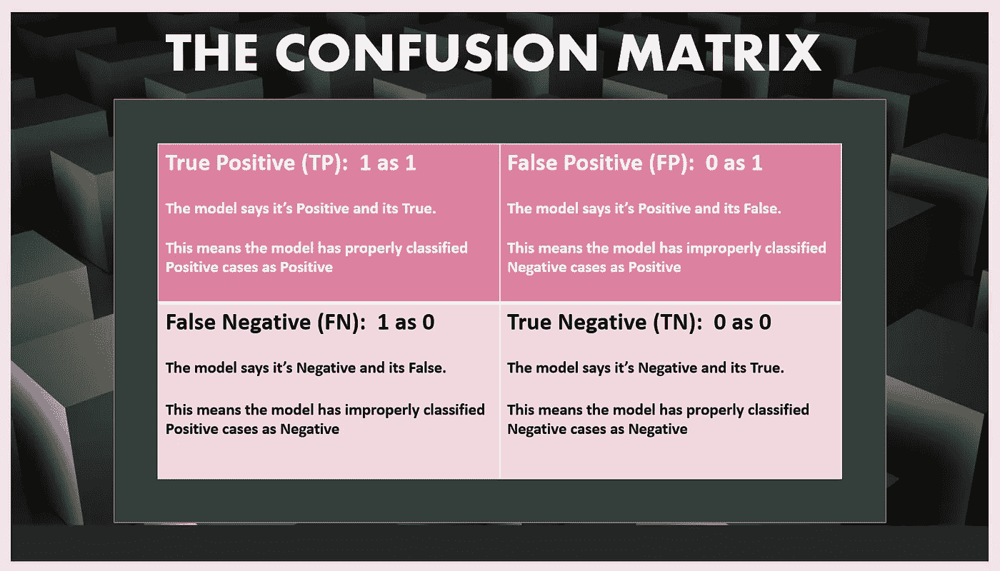**

****混淆矩阵的单元格汇总。****

## **让我们检查混淆矩阵的单元:**

**假设我们正在构建一个二元分类模型，将患者分为**糖尿病患者(1)** 或**非糖尿病患者(0)** 。**

****真阳性(1 归类为 1):****

**这是储存被正确分类为阳性的阳性病例数*的单元格。换句话说，有多少糖尿病患者被恰当地归类为糖尿病患者。***

*****假阳性(0 分类为 1):*****

***这是储存不正确分类为阳性的阴性病例数*的单元格。也就是说，非糖尿病患者被不恰当地归类为糖尿病患者的数量。****

*****真阴性(0 分类为 0):*****

***这是储存阴性病例数的单元格 ***正确分类为阴性的*** 。因此，将非糖尿病患者的数量适当地归类为非糖尿病患者。***

****假阴性(1 归类为 0):****

**最后，这是储存阳性病例数 ***不正确地*** 分类为阴性的细胞……不正确地分类为非糖尿病的糖尿病患者数。**

****

**训练一个模型| [img_credit](https://www.google.com/url?sa=i&source=images&cd=&ved=2ahUKEwja7YmS3_jjAhUCSxoKHeIbBmUQjRx6BAgBEAQ&url=https%3A%2F%2Fwww.cogitotech.com%2Fblog%2Fwhat-are-the-various-types-of-data-sets-used-in-machine-learning%2F&psig=AOvVaw36gyBJZeVBmFCg_HzlN-rn&ust=1565541225859382)**

## **让我们玩一些现实生活中的数据…**

**让我们构建一个二叉决策树分类器，将患者分为**糖尿病患者(1)** 和**非糖尿病患者(0)。****

**我们将使用由加州大学信息与计算机科学学院出版的*皮马印第安人糖尿病数据集的数据模拟生成的数据集。***

**参见[***链接***](https://raw.githubusercontent.com/Blackman9t/Machine_Learning/master/diabetes.csv) 到患者原始 CSV 文件和 [***链接***](https://raw.githubusercontent.com/Blackman9t/Machine_Learning/master/doctors.csv)*到医师数据集。***

***让我们导入需要的模块***

```
*****print(__doc__)****import numpy as np
import matplotlib.pyplot as plt
import seaborn as sns
import pandas as pd
import itertools** # for plotting the ROC Curve
**from sklearn.metrics import roc_curve, auc*****
```

***让我们从 GitHub 导入数据集，并读入熊猫数据框***

```
*****data_link = '**[**https://raw.githubusercontent.com/Blackman9t/Machine_Learning/master/diabetes.csv'**](https://raw.githubusercontent.com/Blackman9t/Machine_Learning/master/diabetes.csv')**diabetes_df = pd.read_csv(data_link)****diabetes_df.head()*****
```

***让我们检查形状和缺失数据计数。***

***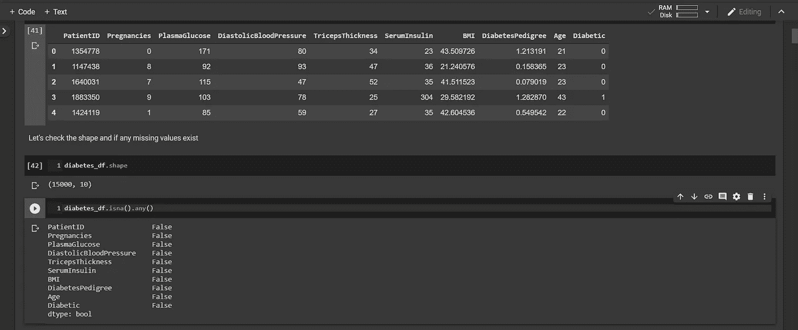***

***我们可以看到前 5 行。数据集有 15000 行和 10 列。它没有缺失值。***

***对于一个分类问题，我们需要关注数据集。让我们看看我们的特征矩阵的分布。这可以帮助我们选择最理想的特征归一化方法。首先，让我们定义一种绘制每个特征分布的方法。***

***在这里看到方法 [***的链接***](https://github.com/Blackman9t/Machine_Learning/blob/master/Understanding_Confusion_Matrix1.ipynb) ，因为它相当冗长。***

**所以让我们在上面定义的*糖尿病 _df* 数据帧上调用方法。这将创建每个独立变量的历史图。**

```
****plot_features(diabetes_df)**>>**
```

**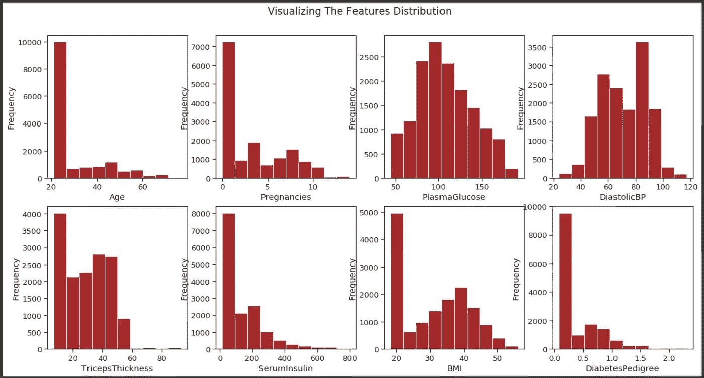**

**我们可以看到变量的分布:-年龄，怀孕，血清白蛋白和糖尿病是相似的。它是不对称的单峰的。一开始有一个由许多低值组成的主导模式。然后是一些中到高的值，这些值会使形状向右倾斜。**

**其他变量如血糖、糖化血红蛋白、肱三头肌厚度和身体质量指数似乎具有大致对称的正态分布。身体质量指数非常有趣，在 20 和 40 值附近呈双峰分布，在 25-55 范围内呈钟形正态分布。**

**有一点很清楚，该数据集中的大部分值分布在下限内。**

**让我们试着使不对称变量的分布正常化。我们将使用一种简单的特征工程技术，只需将这些值转换成它们的对数值。**

**本质是使我们的模型适当地一般化，而不偏向任何特定的倾斜值集。**

```
****for i in diabetes_df.columns:
    if i in ['Age', 'DiabetesPedigree', 'BMI', 'SerumInsulin']:
        print(i)
        diabetes_df[i] = diabetes_df[i].apply(np.log)** >>SerumInsulin 
BMI 
DiabetesPedigree 
Age**
```

**我们再来看看分布的形状。**

**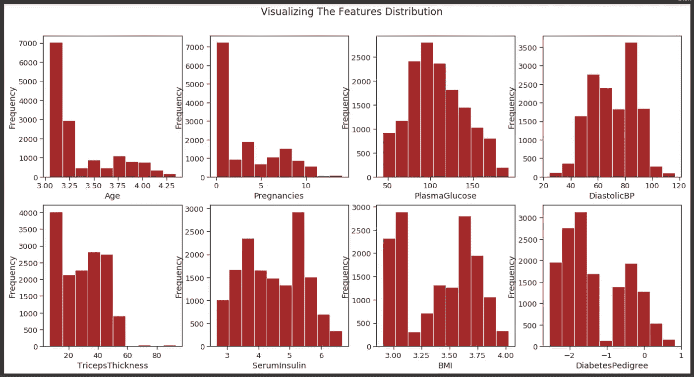**

**我们可以看到糖尿病、身体质量指数、血清白蛋白的分布有所改善，年龄分布也略有改善。**

**记住有两个数据集，一个是病人的数据，另一个是医生的数据。让我们看看医生的数据集，检查它的形状以及是否存在缺失值。**

```
****doctors_link = '**[**https://raw.githubusercontent.com/Blackman9t/Machine_Learning/master/doctors.csv'**](https://raw.githubusercontent.com/Blackman9t/Machine_Learning/master/doctors.csv')**doctors_df = pd.read_csv(doctors_link, encoding='latin-1')**
# Note the above code line throws a UnicodeDecodeError except we encode the string in latin-1 as shown above.**doctors_df.head()****
```

**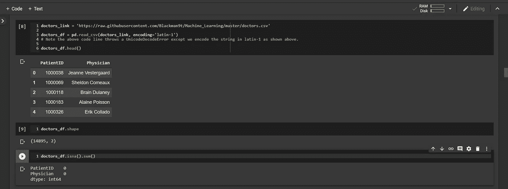**

****我们可以看到医生数据集的前 5 行。它有 14895 行和 2 列。它没有缺失值。****

**接下来，我们需要连接两个数据集，这样我们就可以看到哪个医生治疗了哪个病人。由于两个数据集有相同的 PatientID 列，我们将在这个列上连接它们，使用病人数据集的左外连接(或左连接)和右边的医生数据集。**

**这将确保所有患者的记录都完好无损，即使有些医生的记录可能会丢失。因为我们有 15000 名患者和 14895 名医生的记录。**

```
**# let's merge both datasets into a new dataframe and check the shape and if missing values exist.
**diabetes_doctor_df = pd.merge(diabetes_df, doctors_df, how='left', on='PatientID' )****diabetes_doctor_df.head()****
```

**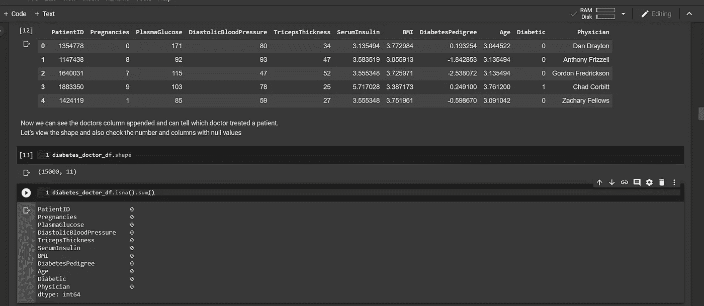**

****我们可以看到合并后的数据集。现在，通过合并 PatientID 列，我们知道哪个医生治疗了哪个病人。它也没有丢失值。****

**但是等等……等等，我们在一个数据集中有 14895 个条目，与另一个有 15000 个条目的数据集合并，但是 pandas 告诉我们没有丢失值？？**

****

**[**img_credit**](https://img.freepik.com/free-vector/thinking-emoji-with-sunglasses_1319-541.jpg?size=338&ext=jpg)**

> **拥有健康的好奇心是数据科学课程无法教给你的一项极其重要的技能。我们需要每天认真地、有意识地发展这种技能。**

**让我们来看看数据集中独特的医生的数量。**

```
****diabetes_doctor_df.Physician.nunique()** >> **109****
```

**这告诉我们只有 **109 个独特的医生。****

**让我们看看数据集中独特患者的数量。**

```
****diabetes_doctor_df.PatientID.nunique()**
>>
  **14895****
```

*****现在有意义了，***
有 14895 个独特的患者，而医生的记录正好有 14895 个患者的条目。
患者数据集有 15000 个条目的事实仅仅是因为一些患者有多个条目。
由于我们合并了 PatientID 列上的医生和患者，合并正确地将每个医生分配给他们治疗的患者，即使我们只有 109 个不同的医生。**

****

****爽！！|** [**img_credit**](https://image.freepik.com/free-vector/smiling-face-with-sunglasses-emoji_1319-432.jpg)**

**这就解释了。**

****为机器学习准备数据集:****

**正如机器学习的常见情况一样，在我们可以使用数据训练模型之前，需要进行一些数据准备。
我们将对特征进行归一化，以便具有大值的特征不会支配训练。**

**存在一些数据标准化方法，如 ***简单特征缩放*** 、 ***最小最大方法*** 和 ***Z 分数*** 或 ***标准分数*** 。**

**查看每个特征的分布形状，具有大致正态分布钟形的特征将使用 ***Zscore 方法*** 进行归一化。
而具有变化的大值和低值的那些将使用 ***最小-最大方法*** 进行归一化。关于这个见 [***微软 Azure ML***](https://github.com/Blackman9t/Machine_Learning/blob/master/DAT263x-Lab1.pdf) 的链接。**

> ****1。z 分或标准分:**
> *这里的每个值，我们减去平均值或均值…*
> *然后除以标准差。*
> *这给出了一个介于-3 和 3 之间的范围，但可以更大或更小***
> 
> **Xnew= Xold 均值/标准差(σ)**
> 
> *****2。最小-最大方法:***
> *该方法取每个值，减去最小值，然后除以范围(Max-min)……*
> *结果值的范围在零(0)和一(1)之间***
> 
> **xnew = Xold Xmin/Xmax Xmin**

**因此，让我们将这些方法应用于所选的列。**

```
**# First select the features only and iterate through each one
**for i in diabetes_doctor_df.columns[:-2]:
    mean = diabetes_doctor_df[i].mean()
    std = diabetes_doctor_df[i].std()
    mini = diabetes_doctor_df[i].min()
    maxi = diabetes_doctor_df[i].max()**

    # if columns are not Age or Pregnancies, apply the Z_score norm method
    **if i not in ['Age', 'Pregnancies']:
        diabetes_doctor_df[i] = diabetes_doctor_df[i].apply(lambda x: (x - mean) / std)**

    # Else if columns are either Age or Pregnancies, then apply the Min-Max norm method
    **else:
        diabetes_doctor_df[i] = diabetes_doctor_df[i].apply(lambda x: (x - mini) / (maxi - mini))****
```

**让我们来看看数据集**

```
****diabetes_doctor_df.head()****
```

**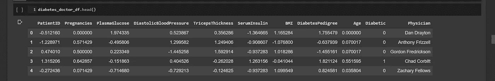**

****归一化数据集的前 5 行。****

**现在我们已经准备好了数据集，我们将使用它来训练和评估分类器机器学习模型。我们将数据分成训练集和测试集，用它们来验证由训练模型生成的预测。**

****

****在我们开始组装和训练模型之前，让我们确认最后一件事……****

## **数据集的类别分布是什么？**

**简而言之……在 15，000 个观察结果中，有多少属于每个类别？**

```
****diabetes_doctor_df.Diabetic.value_counts()**>>
**0 10000
1 5000****# Class 0 or Non-Diabetics has 10,000 observations
# Class 1 or Diabetics has 5,000 observations****
```

**这是一个问题，因为我们的模型将使用一个数据集进行训练，该数据集的一类观察值的数量是另一类的两倍。这意味着我们的模型将学习 0 级或非糖尿病患者的特征，远胜于学习如何对糖尿病患者进行分类。这可不好。**

```
**# Let's visualize the current class-distribution**plt.figure(figsize=(8, 8))****x = diabetes_doctor_df.Diabetic.replace(to_replace=[0, 1], value=['Non-Diabetics','Diabetics'])
sns.countplot(x)
plt.title('Count of Diabetics and Non-Diabetics')
plt.show()****
```

**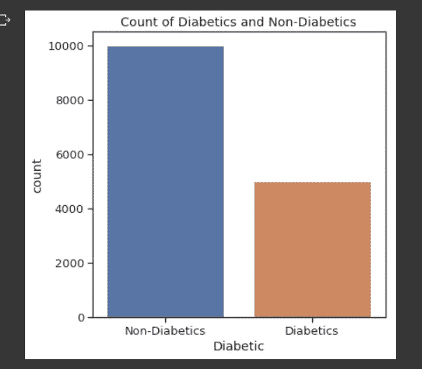**

****糖尿病患者和非糖尿病患者的阶层分布****

## **平衡数据集:**

**如前所述，不平衡的数据集使得分类器对于优势类具有高识别率 **( *灵敏度* )** 。在不平衡的数据集中，模型的 F1 值可能不可靠。 [***链接***](https://sebastianraschka.com/faq/docs/computing-the-f1-score.html)**

**让我们继续使用 SMOTE ***(合成少数过采样*** [***技术***](https://imbalanced-learn.readthedocs.io/en/stable/generated/imblearn.over_sampling.SMOTE.html) ***)来平衡数据集。*** 注其他技术也可用于处理不平衡数据。详见本 [***丰富文章***](https://towardsdatascience.com/handling-imbalanced-datasets-in-machine-learning-7a0e84220f28) 。**

**SMOTE 将通过综合创建少数类的更多观察值来平衡数据集，以等同于优势类。在这种情况下，将创建额外的 5，000 个观察值并将其添加到糖尿病类，这样每个类就有 10，000 个观察值，总共有 20，000 个观察值。**

```
****from imblearn.over_sampling import SMOTE
sm = SMOTE(sampling_strategy='minority', random_state=19, k_neighbors=5)**# Let's pass the features and label to the SMOTE object.**over_sampled_features, over_sampled_label = sm.fit_resample(feature_matrix, label)**# Let's print out the shape of the over_sampled object**print('Shape of resampled feature set is:',over_sampled_features.shape)
print('Shape of resampled target data is:',over_sampled_label.shape)**>>
**Shape of resampled feature set is: (20000, 8) 
Shape of resampled target data is: (20000,)**# we now have 20,000 observations divided equally between classes Diabetics and Non-Diabetics**
```

**我们可以想象新的阶级分布。**

**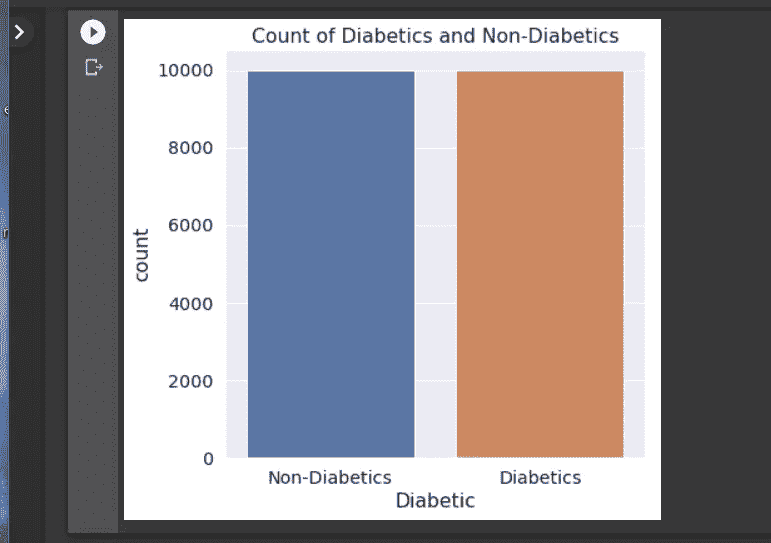**

****观测值的等类分布。这意味着我们现在有 20，000 个观察值。****

**好了，让我们导入所需的库来分割数据集。**

```
**# we shall import train_test_split module to split the dataset
**from sklearn.model_selection import train_test_split****
```

**现在，我们可以继续将数据集分为训练集和测试集，其中 70%用于训练，30%用于测试。通过设置参数 *test_size=0.3。*参见下面的代码**

```
****X_train, X_test, y_train, y_test = train_test_split(over_sampled_df.iloc[:,:-1], over_sampled_df.Diabetic, test_size=0.3, random_state=1234)**# let's print out the shapes of the training and testing datasets
**print('X_train shape is',X_train.shape)
print('X_test shape is',X_test.shape)
print('y_train shape is',y_train.shape)
print('y_test shape is',y_test.shape)**>> This prints out
**X_train shape is (14000, 8) 
X_test shape is (6000, 8) 
y_train shape is (14000,) 
y_test shape is (6000,)****
```

**所以我们有 14000 个训练观察和 6000 个测试观察。**

## **定义混淆矩阵指标:**

**如前所述，混淆矩阵产生了评估分类器模型的最理想的度量。它显示了*和 ***真阴性(TN)*** ，*这些是正确分类的* *病例*和 ***假阳性(FP)*** 和 ***假阴性(FN)*** ，*这些是错误分类的病例****

****

> **在 [**二元分类**](https://en.wikipedia.org/wiki/Binary_classification) 中，**精度**(也叫 [**正向预测值**](https://en.wikipedia.org/wiki/Positive_predictive_value) )是相关实例在检索到的实例中所占的比例…**
> 
> **而 **recall** (也称为 [sensitivity](https://en.wikipedia.org/wiki/Sensitivity_and_specificity) )是已经检索到的相关实例占相关实例总数的比例。**
> 
> **因此，精确度和召回率都基于对 [**相关性**](https://en.wikipedia.org/wiki/Relevance) **的理解和度量。参见** [**链接**](https://en.wikipedia.org/wiki/Precision_and_recall)**

## ****1。准确度:****

**准确性仅仅是正确分类的案例的分数。例如，如果我们的模型正确地将 10，000 名*糖尿病患者中的 ***7，000 人和 10，000 名*非糖尿病患者中的*8，000 人分类，这意味着:-******

*******TP = 7000，FN = 3,000，TN = 8,000，FP = 2000*。******

****这意味着我们的模型有一个****的 75%* 。*******

******准确度= (TP + TN) / (TP + TN + FP + FN)******

******精度=(7000+8000)/(7000+8000+2000+3000)= 0.75******

****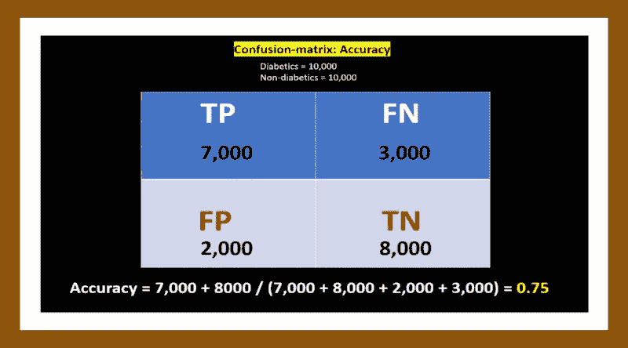****

******通过混淆矩阵计算准确度******

****对于分类模型来说，准确性本身并不是一个可靠的衡量标准。原因很简单:-使用我们的不平衡数据集，例如，想象该模型对所有的*10，000 个非糖尿病病例进行正确分类***【100%】***，并且仅对 5，000 个 糖尿病病例中的 ***2，000 个进行正确分类***(40%)**模型将是:-***********

******(10000+2000)/15000 = 80%准确*** 。***

***然而，这种模型在将糖尿病患者归类为 ***时几乎毫无用处，60%*** 的病例会被错误归类。***

## *****2。回忆或敏感度或真阳性率:*****

***召回仅仅是从数据集中真实阳性案例的总数中正确分类的阳性案例的分数。例如，如果有 ***10，000 个*** ***真实或真实阳性*** 糖尿病病例，并且我们的模型正确地将***7，000 个***归类为糖尿病患者*，这意味着 ***3000 个*** 被错误地归类为非糖尿病患者 ***(FN)*** 。如果我们的模型也正确地将***8000**10000***非糖尿病人*分类，这就意味着 ***2000*** 非糖尿病人被错误地分类为 ***(FP)。********

****因此***TP = 7000，FN = 3,000，TN = 8,000，FP = 2000***。****

****这意味着我们的型号有**召回**的**70%*。*******

******召回= TP / (TP + FN)******

******召回= 7000 / (7000 + 3000) = 0.7******

****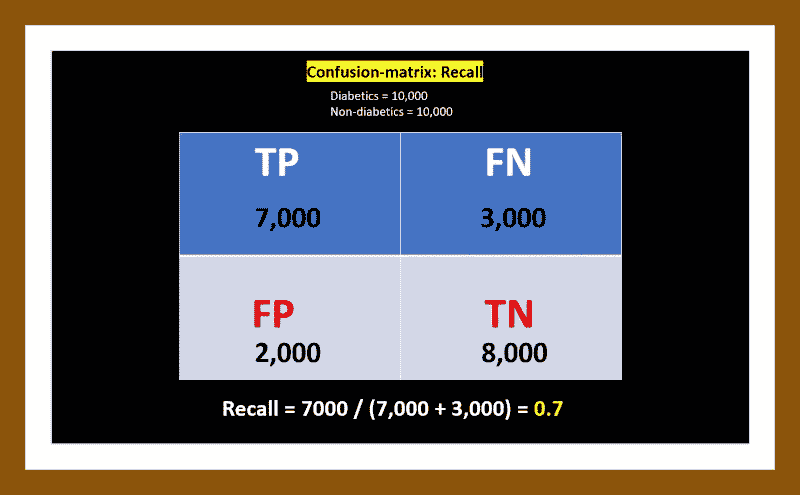****

******通过混淆矩阵计算召回率******

## ******3。精度或正预测值:******

****精确度只是模型识别为阳性的案例总数中正确分类的阳性案例的分数。例如，如果有 ***10，000 个真实或真实阳性的*** 糖尿病病例，并且我们的模型正确地将*7，000 个归类为糖尿病患者***【TP】***，这意味着 ***3，000 个*** 被错误地归类为***(T79)如果我们的模型也正确地将***8000***从***10000***非糖尿病人***【TN】***中分类出来，这就意味着 ***2000*** 非糖尿病人被错误地分类为 ***(FP)。***********

***因此***TP = 7000，FN = 3,000，TN = 8,000，FP = 2000***。***

***这意味着我们的模型有一个****的 78%。*******

*******精度= TP / (TP + FP)*******

*******精度= 7000 / (7000 + 2000) = 0.78*******

*****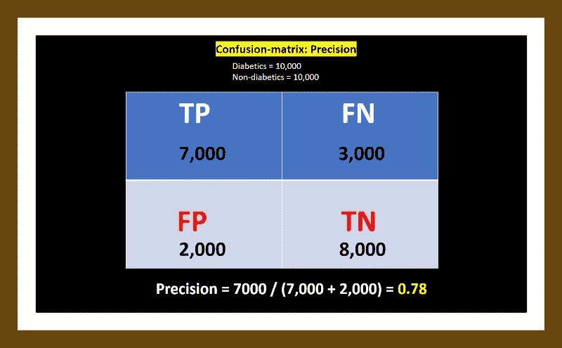*****

*******通过混淆矩阵计算精度*******

> *****在分类任务中，对于糖尿病类来说，1.0 的完美精度分数意味着被标记为属于糖尿病类的每个项目确实属于糖尿病类。而 1.0 的召回意味着来自糖尿病类的每个项目都被标记为属于糖尿病类。*****

## *******精确度和召回率之间的权衡:*******

*******让我们暂时用脑癌代替糖尿病……*******

*****通常，精确度和召回率之间存在反比关系，有可能以降低另一个为代价来提高一个。*****

*****考虑一个脑外科医生，他的任务是从病人的大脑中移除一个癌症肿瘤。外科医生需要切除所有的肿瘤细胞，因为任何残留的癌细胞都会使肿瘤再生。*****

*****相反，外科医生不得移除健康的脑细胞，因为这会使患者的大脑功能受损。外科医生可能在他切除的大脑区域更加自由，以确保他已经提取了所有的癌细胞。这个决定增加了召回率，但降低了精确度。*****

*****另一方面，外科医生在切除大脑时可能会更加保守，以确保只提取癌细胞。这个决定增加了精确度，但是降低了召回率。*****

*****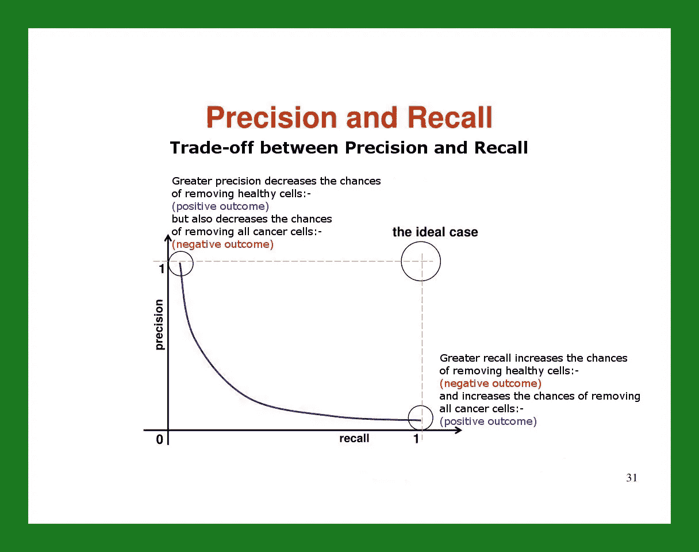*****

*******精确度和召回率的权衡*******

> *****也就是说，更大的召回增加了清除健康细胞**(阴性结果)**的几率，增加了清除所有癌细胞**(阳性结果)**的几率。*****
> 
> *****更高的精度会降低移除健康细胞的几率**(阳性结果)**，但也会降低移除所有癌细胞的几率**(阴性结果)**。*****

## *****4.f1-分数或谐波-平均值:*****

*****通常，精度和召回分数被组合成一个单一的度量，它立即告诉我们，我们的模型执行得有多好。F1-Score(精确度和召回率的加权 [***调和平均值***](https://en.wikipedia.org/wiki/Harmonic_mean) )就是这样一个度量。*****

> ****完美的 F1 分数是 1.0 或 100%。越接近 1.0，模型越好。****

****从上面的例子中，我们得到了 0.78 的精确度和 0.7 的召回率****

****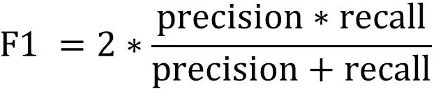****

*******因此:F1 = 2 *(0.78 * 0.7)/(0.78+0.7)= 0.74*******

# ****回到我们的分类任务…****

****有了上述指标，我们有望很好地解释，让我们继续我们的任务，将临床患者的*15000 个观察结果分类为 ***【糖尿病(1)*** 或 ***非糖尿病(0)*** 。我们刚刚完成了一个 SMOTE 数据平衡活动，创建了 ***5，000 个*** 附加观察值，给我们一个 ***总计 20，000 个*** 观察值，平均分成两个类。*****

****然后我们把数据拆分成***14000 个*** 训练集和***6000 个*** 测试集。****

********

****让我们构建决策树分类器，并导入用于计算 F1 分数、混淆矩阵和 Log_loss 的模块****

```
**from sklearn.tree import DecisionTreeClassifier
from sklearn import metrics
from sklearn.metrics import f1_score
from sklearn.metrics import confusion_matrix
from sklearn.metrics import log_loss**
```

## ****我们将定义三种方法:-****

1.  ****绘制混淆矩阵，并给它传递一些参数****
2.  ****用于绘制 ROC 图****
3.  ****用于创建最大深度范围从 1 到 100 的最佳决策树分类器或模型。****

```
****1\. plot_confusion_matrix(cm, classes,
                          normalize=False,
                          title='Confusion matrix',
                          cmap=plt.cm.Blues):****2\. plot_roc_chart(model)****3\. best_decision_tree_classifier(X_train, X_test, y_train, y_test)****
```

****为了避免冗长，我不会在这里完整地复制和粘贴这些方法。但是可以跟着笔记本一起上[***Github***](https://github.com/Blackman9t/Machine_Learning/blob/master/Understanding_Confusion_Matrix1.ipynb)。****

## ****混淆矩阵分析:****

1.  ******评估不平衡数据集:******

****如果我们没有平衡数据集( ***10，000*** class-0 和 ***5，000*** class-1)并使用它为模型训练上述三种方法的确切参数，请参见下面的结果:****

****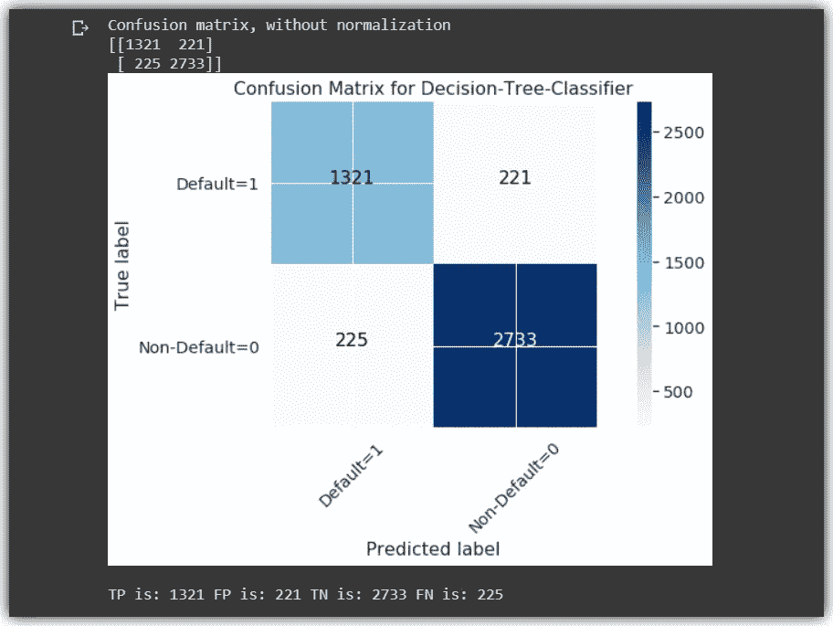****

******不平衡数据集混淆矩阵******

****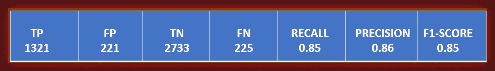****

******不平衡数据集指标得分******

******2。评估平衡数据集:******

****让我们也来看看平衡数据集的混淆矩阵，使用上面定义的与不平衡数据集完全相同的方法。****

****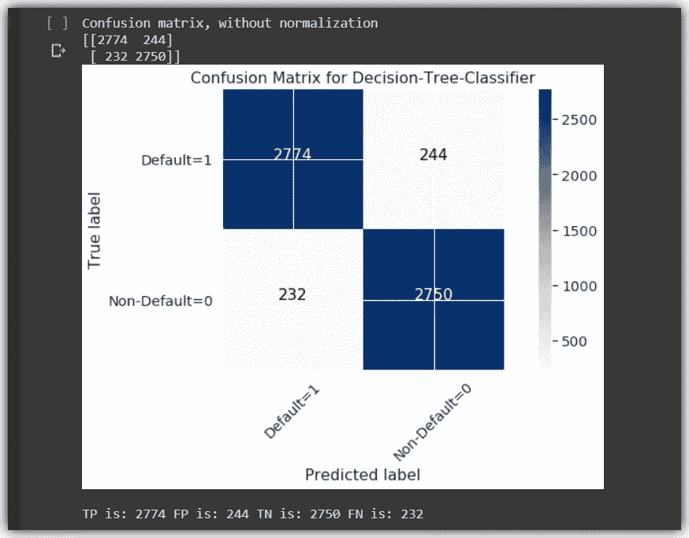****

******平衡数据集混淆矩阵******

****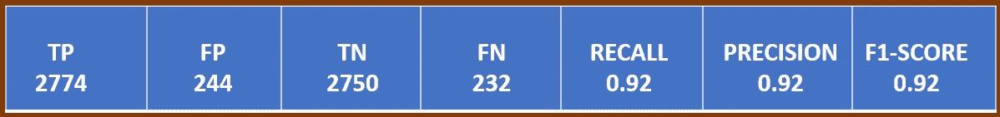****

******平衡数据集指标得分******

****我们可以清楚地看到，通过简单地平衡我们的数据集，该模型能够在对患者进行分类方面表现得更好。所有指标都比 ***召回率、精确度、F1 分数和 AUC 分数*** 有所提高。请参见下表:-****

****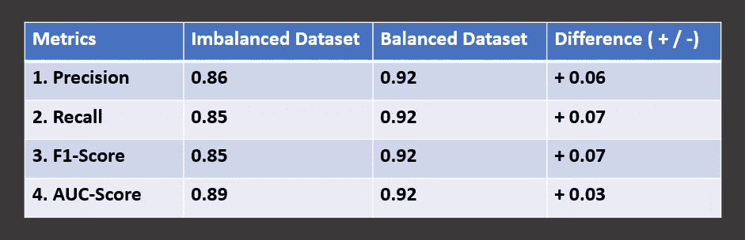****

******比较不平衡数据集和平衡数据集的指标******

****该模型在平衡数据集方面做得很好。在所有关键指标中得分至少为 92%。这在涉及患者实际分类的真实场景中非常重要。****

****请记住，该模型不仅返回 0 或 1，它实际上还返回一个介于 0 和 1 之间的数字，显示每个患者的概率得分。****

```
**# getting the probability of the predicted observations.**probs = model.predict_proba(X_test)****
```

****这意味着被分类为非糖尿病(0)的患者可能具有接近糖尿病阈值的概率得分。因此，使用好的分类器模型，医疗从业者将更好地被告知建议和管理这样的患者。****

## ****最后，让我们看看 ROC 曲线和 AUC-Score:****

****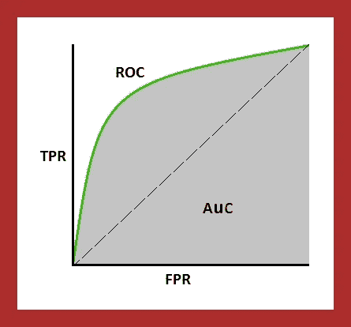****

******ROC 曲线和 AUC 测度|** [img_credit](https://www.google.com/url?sa=i&source=images&cd=&ved=2ahUKEwiw46_7qI_kAhVOJhoKHRV6CmgQjRx6BAgBEAQ&url=https%3A%2F%2Ftowardsdatascience.com%2Funderstanding-auc-roc-curve-68b2303cc9c5&psig=AOvVaw3NnO2RRX-xsk2sBTtYetJp&ust=1566317248928586)****

****简单来说，**受试者工作特性曲线或** ROC 曲线显示了**(正确分类的阳性病例)*和**(错误分类的阳性病例)*之间的权衡******

****让我们定义一些绘制 ROC 曲线时要考虑的指标。****

1.  ******真阳性率** : *又名回忆，又名灵敏度*。这只是我们之前定义的召回。它告诉我们从数据集中的阳性病例总数中正确识别为***【TP】***的阳性病例的比例。****

********

****2.**真阴性率** : *又名特异性，又名选择性。*这只是从数据集中的阴性病例总数中测量被正确识别为***【TN】***的阴性病例的比例****

****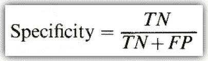****

****3.**假阳性率**:这是数据集中实际阴性病例总数中，被错误分类为阳性的阴性病例数的分数***【FP】***。****

****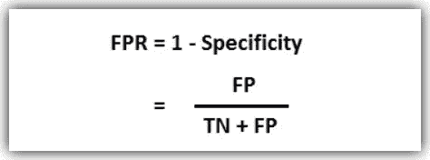****

****所以事实是，如果我们绘制一张图表，将所有对应的 ***真阳性率*** 的值放在 Y 轴上，将所有对应的 ***假阳性率*** 的值放在 X 轴上，结果将是 ROC 曲线。****

********

******ROC 曲线:TPR 和 FPR 所有对应值的曲线图******

****ROC 曲线下的**面积**或 **AUC** 是真阳性率和假阳性率之间的权衡。****

> ****一个完美的分类器将具有 1.0 的 **AUC，表明在真阳性率和假阳性率之间没有折衷。因此，ROC 曲线越靠近左上位置(1，1)，AUC 得分越好。参见[链接](https://github.com/Blackman9t/Machine_Learning/blob/master/DAT263x-Lab1.pdf)**链接****

****让我们看看不平衡数据集和平衡数据集的 ROC 曲线。****

****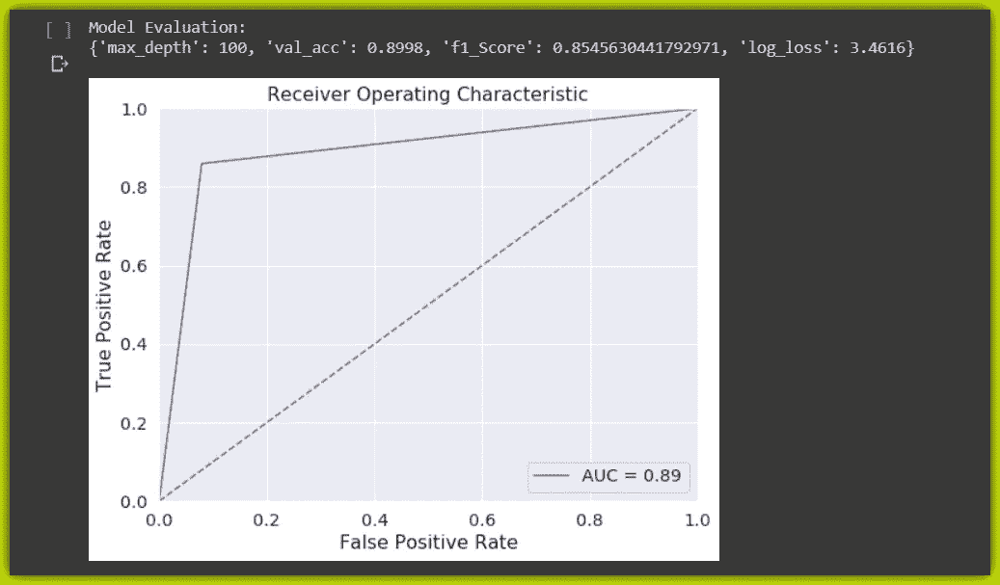****

******不平衡数据集的 ROC 曲线。AUC = 0.89****| log _ loss = 3.4616 | val _ ACC = 0.8998******

****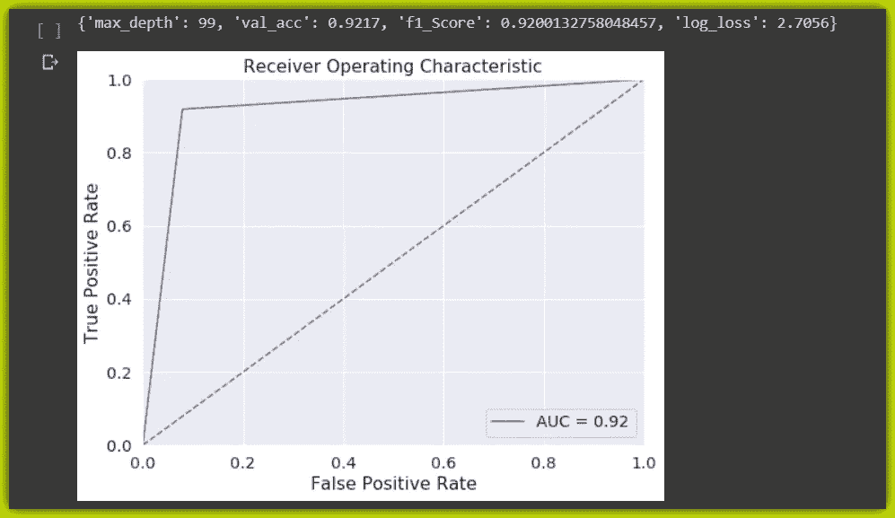****

******平衡数据集的 ROC 曲线。AUC = 0.92****| log _ loss = 2.7056 | val _ ACC = 0.9217******

## ****总结:****

****这是一次颇有见地的会议，感谢您耐心阅读。我们学习了如何使用历史图检查分类任务的数据集。我们还解释了历史图和数据的分布，以便根据每个特征分布选择理想的特征归一化技术。****

****然后使用 SMOTE 技术检查类分布并平衡数据集。我们继续为机器学习准备数据集，并深入挖掘混淆矩阵的单元和各种指标。****

****最后，我们进行了分类，并比较了模型在不平衡数据集和平衡数据集上的性能。然后我们学习了 ROC 曲线和 AUC 分数。****

****原始数据集( [***患者***](https://raw.githubusercontent.com/Blackman9t/Machine_Learning/master/diabetes.csv) 和 [***医师***](https://raw.githubusercontent.com/Blackman9t/Machine_Learning/master/doctors.csv) )和 [***笔记本***](https://github.com/Blackman9t/Machine_Learning/blob/master/Understanding_Confusion_Matrix1.ipynb) 都在 Github 上。****

****如果你需要复习统计学，一定要去看看斯坦福大学*[***提供的免费课程***](https://lagunita.stanford.edu/courses/course-v1:OLI+ProbStat+Open_Jan2017/about)*****

******干杯！******

## ****关于我:****

****劳伦斯是技术层的数据专家，对公平和可解释的人工智能和数据科学充满热情。我持有 IBM 的 ***数据科学专业*** *和* ***高级数据科学专业*** *证书。我已经使用 ML 和 DL 库进行了几个项目，我喜欢尽可能多地编写函数代码，即使现有的库比比皆是。最后，我从未停止学习和实验，是的，我拥有几个数据科学和人工智能认证，并且我已经写了几篇强烈推荐的文章。*****

****请随时在以下网址找到我****

****[**Github**](https://github.com/Lawrence-Krukrubo)****

****[**领英**](https://www.linkedin.com/in/lawrencekrukrubo/)****

****[**推特**](https://twitter.com/LKrukrubo)****