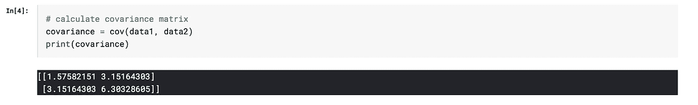

# 协方差和相关杂波…

> 原文：<https://pub.towardsai.net/the-covariance-and-correlation-clutter-2c73557f476d?source=collection_archive---------2----------------------->

我记得有很长一段时间，我在这两个魔鬼之间感到困惑——协方差和相关性。和相似之处没有帮助！:(

所以我在这里，写了我的第一篇文章，并试图简化这个庞大的数据世界——以及随之而来的统计数据。我会尽量让我的帖子简短而甜蜜。我希望它们能帮助像我这样没有耐心的新手保持动力。所以让我们学习，粉碎杂乱！！

好吧，试着把自己放在下面描述的场景中。如果:
1 .你会有什么感觉？你在赛跑，但没人告诉你比赛有多长。交易是每 1 分钟告诉你你走过的距离。
2。你的朋友带你去听音乐会，在每个小时的开始，你会被告知已经过了多长时间，但不会被告知音乐会持续了多长时间。
3。你在写考试。你必须完成所有的问题，但你不知道考试有多长！(这个让我不寒而栗..)

总之，挺吓人的，是吧？好吧，让我们回到统计上来。也许现在听起来就不会这么恐怖了！

所以，协方差和相关性都告诉我们两个变量之间的关系。一个增加会导致另一个增加吗？

1.  什么事？很好。然后你说这两个变量有正相关和正协方差。比如水越喝越尿！
2.  没有吗？那好吧..也许你有两个完全独立的变量。例如，我睡了多少个小时并不影响南达科他州的降雨量。
3.  坚持住！一个变量的增加会减少另一个变量吗？瞧啊。你得到了负相关和负协方差。嗯，让我想想…我吃得越多，就越瘦？哈哈，但愿如此。

无论如何……那么为什么是两个不同的术语？我们在这个世界上要学的还不够多吗？

嗯，还记得我上面给的三个吓人的场景吗？是什么让他们变得可怕？我不介意参加考试或比赛..只要告诉我他们每个人有多长，我就没事了！

这就是协方差和相关性的区别。协方差值没有界限，但是相关性将保持在-1 和 1 之间。
所以我可以说 A 和 B 的协方差是 20 或 50。你如何衡量影响？没有上限。所以我们知道 A 和 B 在一起运动，但是影响有多大呢？这就是相关性发挥作用的地方。我可以告诉你 A 和 B 的相关系数是 0.3 或者 0.7，或者其他任何值。但是当我这样说的时候，你有 1 作为相关性的上限，所以它给你一个更好的影响强度的图片！

让我们看一个 python 中的例子:

首先，我们使用随机数生成器来生成数组:

生成数组的方式是，第二个数组值从它们各自的第一个数组值开始递增。让我们计算协方差矩阵。

矩阵的对角线=每个变量与其自身之间的协方差。其他值=两个变量之间的协方差。

所以这里的协方差是 3.15…..3.15 作为一个没有上下文对不对的绝对数字没有好处？我们只知道是否有正相关，但有多强？

我们来看看相关性。

这提供了关于两个阵列之间强相关性的更多信息。

太好了…我希望你喜欢这本书:)再见，现在..