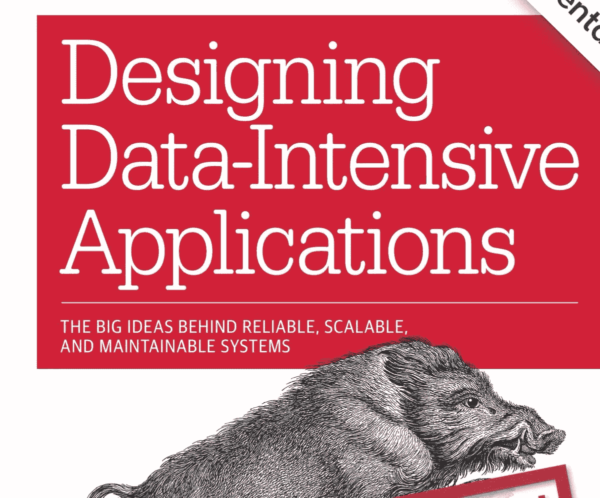

# CS 读书俱乐部:设计数据密集型应用

> 原文：<https://pub.towardsai.net/the-cs-book-club-designing-data-intensive-applications-2bb887099c13?source=collection_archive---------0----------------------->

## [数据工程](https://towardsai.net/p/category/data-engineering)

克里斯托弗·阿克曼在推特上提供

作为软件工程师，跟上我们领域的最新技术和发展是非常重要的。软件比大多数其他领域发展得更快，所以深思熟虑和持续的学习将永远是我们工作描述的一部分。这种学习的大部分将以实践项目的形式进行，使用新的框架、语言和技术，但经典的教科书方法将永远有它的位置，尤其是在学习支撑我们使用的具体技术的更多理论和抽象主题时。正是因为这个原因，我开始了这个博客系列——**CS 读书会**。

至此，让我们开始我们的第一次回顾: [**设计数据密集型应用程序:可靠的、可伸缩的和可维护的系统背后的伟大思想**](https://www.amazon.com/Designing-Data-Intensive-Applications-Reliable-Maintainable/dp/1449373321) 。

# 动机

《设计数据密集型应用程序》是由剑桥大学分布式系统研究员 Martin Kleppmann 博士撰写的。这是一本很厚的书，涵盖了大数据、数据工程、数据分析和分布式系统中的许多主题。它已经成为从事大数据工作的工程师的首选资源，所以作为一名数据工程师，我很自然地被它吸引住了。这也是我的朋友 Kshitij Aranke 推荐的，他是 badge 的高级数据分析工程师，之前在 LinkedIn 担任大数据工程师，所以我认为它肯定是合法的。

# 摘要

我在上面提到过，这是一本提供大数据中许多主题的扩展覆盖面的大部头，但扩展不应与全面混淆。正如作者自己提到的，这本书旨在调查大数据领域以及将我们带到今天的许多技术和发展。这份长达 600 页的“调查”证明了我们日常接触的许多大数据系统背后所编织的难以置信的工程和复杂性。

这本书涵盖了许多单独的主题，但是将各章联系起来的一个主题是如何设计可靠的、可伸缩的和可维护的系统的核心问题。当我们学习数据库时，这个问题引导着叙述，从如何使用文本文件实现自己的数据库的思想实验开始，一直到分布式系统可能失败的各种细微方式。

从这本书中，你会对现代数据系统有更深刻的理解和欣赏。作者避免了行话和教条，他强调了该领域的微妙本质——每个决定都是一种权衡，不同的系统可以容忍不同的权衡。

# 伟大的想法

这本书的一些重要内容是:

*   当系统正确工作时，即使出现故障，系统也是可靠的。
*   当系统运行良好时，即使负载增加，系统也是**可伸缩的**。
*   当系统可以很容易地修改和适应变化的需求时，它们就是**可维护的**。
*   数据通常用文档、关系或图形数据库来表示。每种方法都有利弊。
*   数据可能存储在联机事务处理(OLTP)或数据仓库系统中。它们服务于不同的目的。
*   OLTP 数据库可以是日志结构的，也可以是可变的。各有利弊。
*   复制是使用集群实现的。这些可能是单引线、多引线或无引线簇。每一个都代表着权衡和挑战，并且有必要进行细致入微的理解来预测每一个是如何腐败和失败的。
*   有效的分区提高了性能，但是分区的分布式系统可能很难推理。
*   事务是一种有用的抽象，它隐藏了并发问题和竞争条件，否则应用程序设计几乎不可能。
*   像网络延迟和时钟偏差这样的基本问题使得在分布式系统中很难达成共识并提供确定性保证。
*   共识和线性化在单领导者系统中很容易实现，但这在技术上只是将 can 踢到领导者故障转移的点。视系统而定，线性化可能不是完全必要的，并且可能更容易处理未达成共识的后果。
*   MapReduce 范式为分布式批量数据处理提供了一个抽象。
*   消息代理提供了处理和分析流数据的框架。
*   可能有理由转向基于日志的不可变数据库系统，该系统使用历史中的事件序列来计算状态，而不是直接操纵状态。
*   大数据是一个令人兴奋且快速发展的领域，但我们必须注意我们工作的道德影响。

# 结论

这本书是我读过的最有启发性的技术书籍之一。它揭示了分布式系统，尤其是分布式数据系统的内部工作方式，并揭示了我们有时很容易忘记的隐藏的复杂性，这要感谢像雪花和 AWS 这样的服务。作者还设法在广度和深度之间找到了完美的平衡——涵盖了各种各样的主题，有足够的深度让你真正体会到其中的错综复杂，但又不会让你迷失在细节中。最后，他教授数据库设计和分布式系统的基本原则方法为许多背景的读者理解他的推理和理解这个主题提供了一个桥梁。

*如果您想进一步讨论或联系，请随时联系* [*LinkedIn*](https://www.linkedin.com/in/jagveersingh/)