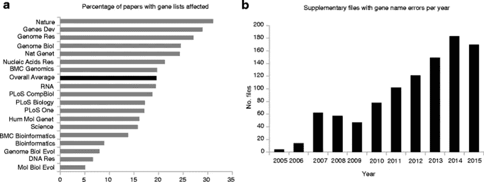
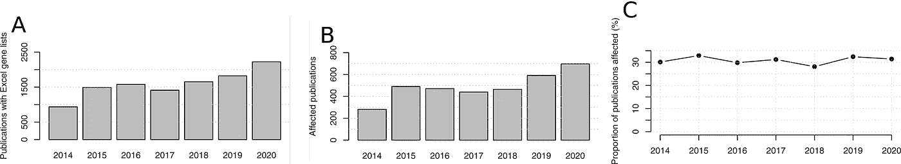
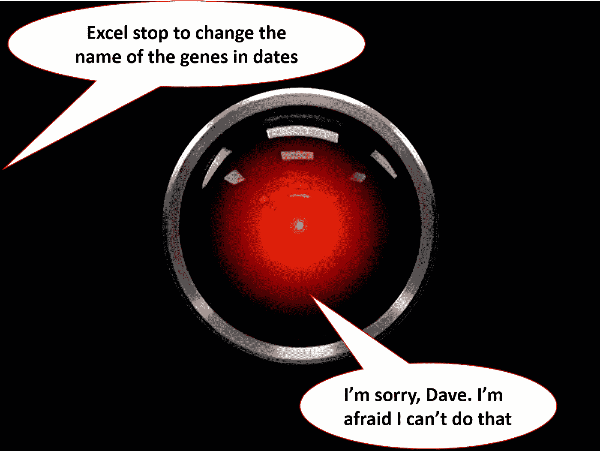
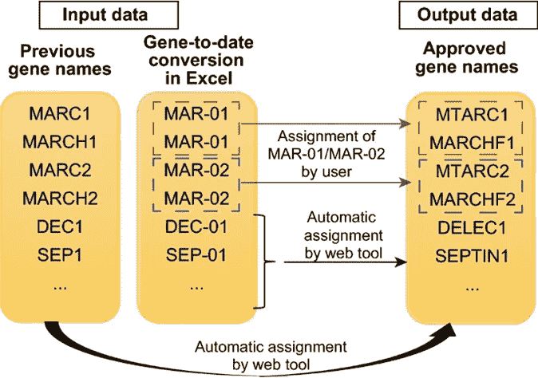

# MS-excel 如何成为生物信息学噩梦的奇怪案例

> 原文：<https://pub.towardsai.net/the-curious-case-of-how-ms-excel-was-a-nightmare-for-bioinformatics-cc937a697350?source=collection_archive---------1----------------------->

## Ms-Excel 在数据科学中有害的一个例子

在 Excel 随意把格式改成自己确实喜欢的样子的习惯面前，我们是怎么没有力量的？

**Ms-Excel 自作主张的刻骨铭心之罪**

科幻电影中不乏机器决定无视人类命令而造反的(2001:太空漫游，举个最著名的例子)。任何与 Ms-Excel 共事过的人可能都会认为，这种反乌托邦式的未来并非不可能发生。

> **戴夫** : **打开舱门，哈尔。**
> 
> 哈尔:对不起，戴夫。恐怕我做不到。
> 
> 2001:太空漫游

我不知道为什么，但 Ms-Excel 对日期很着迷，这种热情导致随机将数字和首字母缩略词转换成日期。2016 年，[一篇科学文章](https://genomebiology.biomedcentral.com/articles/10.1186/s13059-016-1044-7)对该现象进行了分析，并意识到文献中约 20%的文章包含与 Ms-Excel 相关的错误。比如 *SEPT2* (Septin 2)和 *MARCH1* (膜相关环指(C3HC4) 1，E3 泛素蛋白连接酶)默认转换为‘2-Sep’和‘1-Mar’。有时，MS-Excel 甚至做得更好:它在“2006/09/02”中转换了 *SEPT2* 。您无法关闭这种自动格式化功能，纠正它是一个艰苦的过程。

在同一篇文章中，他们分析了 2005 年至 2015 年的 35，000 多篇文章，显示每一份期刊都受到了影响。具有讽刺意味的是，分析中受影响最大的期刊是《自然》,它被认为是科学期刊的圣经。

从原[条](https://genomebiology.biomedcentral.com/articles/10.1186/s13059-016-1044-7)*补充 Excel 文件中基因名称错误盛行。****a****Excel 文件中有补充基因列表的已发表论文受基因名称错误影响的百分比。* ***b*** *按年份增加的基因名称错误数*

**经济组学革命**

右图还显示了这个问题是如何逐年急剧增加的。事实上，[组学革命](https://www.genomicseducation.hee.nhs.uk/blog/the-omics-revolution/)始于 21 世纪初，当时下一代序列开始变得更加便宜和广泛。现在很少有文章没有进行过一些[组学分析](https://en.wikipedia.org/wiki/Omics)(像 [RNAseq](https://en.wikipedia.org/wiki/RNA-Seq) 、 [ChipSeq](https://en.wikipedia.org/wiki/ChIP_sequencing) 等等)。为什么？因为这些新技术能够提供肿瘤或组织的快照。迄今为止，他们已经实现了单细胞分辨率(如[单细胞 RNAseq](https://en.wikipedia.org/wiki/Single_cell_sequencing) )。

由于你可以获得大量的信息，这些分析变得无处不在。从癌症研究到临床试验，科学家们越来越依赖一些测序的结果。这些大型序列每年会产生数万亿字节的数据，为了分析它们，有必要使用 Bash 脚本、R 和 python。

考虑到需要使用复杂的脚本来分析所有这些数据，人们会认为情况已经有所改善，我们再也不用担心 Ms-Excel 了。相反，2021 年的一篇文章显示，我们没有吸取教训，MS-Excel 比以往任何时候都更加活跃。

改编自原文:“2014-2020 年期间基因名称错误的流行。(A)附有补充 Excel 基因列表的出版物。(B)受基因名称错误影响的出版物。受影响的发布的比例。

可以看出，错误的数量没有减少(如果没有增加，则保持不变)。

**为什么电子表格如此普及？**

很难将 Ms-Excel 与生物学或其他科学学科联系起来，但它无处不在。不仅仅是因为它通常默认安装在实验室和医院的所有计算机上。它的成功在于这样一个事实，尽管它有很多缺陷和其他不切实际的麻烦，但它允许快速进行大量的分析。学生和教授可以在几分钟内打开大量文件，进行基本的分析和可视化。此外，向科学期刊提交出版物时，这也是公认的格式之一。

当然，R 和 Python 表现得更好，允许对大量数据和图表进行更复杂的分析。另一方面，你必须知道语法和安装库，你在一系列的错误中浪费了大量的时间。所以当你累了的时候，桌面上的绿色图标是如此的诱人。

图片由作者提供(改编自电影《2001 太空中的奥迪赛》的一个画面)

我们能解决它吗？

2017 年，[雨果基因命名委员会](https://www.genenames.org/) (HGNC)决定[重新命名 27 个基因](https://www.theverge.com/2020/8/6/21355674/human-genes-rename-microsoft-excel-misreading-dates)，以免混淆。由于这些委员会通常很难组织起来，并且通常在选择上很保守，想象一下他们有多恼火决定重新命名基因，仅仅是为了让它们对 Excel 友好。然而，正如我们所看到的，这还不够。

研究人员提出了不同的解决方案:事实上，2016 年的文章已经提出了解决这个问题的脚本。2022 年(这表明这个问题仍然很重要)[其他研究人员](https://www.nature.com/articles/s41598-022-17104-3)提出了一个 web 工具来自动更正 Excel 错误识别的基因名称(你可以在这里找到)。

来自[文章](https://www.nature.com/articles/s41598-022-17104-3):“基因更新器原理图。如果提供了旧的基因名称，这些基因将自动转换为更新的批准的基因名称。”

现在说这些努力是否能解决问题，或者 Ms-Excel 是否还会困扰研究人员的睡眠，还为时过早。

**结论和要点**

> “这是 Excel 的世界，我们只是生活在其中。” *— jgalt212 上* [*黑客新闻*](https://news.ycombinator.com/item?id=5198989)

HGNC 创立了如何决定基因名称的指导方针(通常针对人类的愚蠢，避免选择愚蠢或冒犯性的名称)。然而，他们忘记了计算机的愚蠢和 Ms-Excel 是如何广泛传播的。诚然，科学家可以放弃 Ms-Excel，但它到处都在安装，有时你需要很快。

这个故事的美妙之处在于，它只需要一个微不足道的细节就能产生大规模的邪恶效果。潜在的简单 Ms-Excel 错误(希望是无意的，或者它已经是机器接管世界计划的一部分？)可以拖好几年。《自然》杂志上的一篇文章可能会被引用数十次，甚至数百次，并对全世界的研究人员产生影响。毕竟，基因检测正变得越来越普遍，癌症治疗也越来越取决于突变图谱。因此，在分析文章或基因列表时，非常谨慎是必要的。

这个故事还告诉我们，数据收集和选择是至关重要的，但算法和软件的选择也是如此。此外，Ms-Excel 对不同类型的数据(例如，数字或字符串)表现出奇怪的行为，在数据科学中应该避免(以避免有害的影响)。此外，人们应该始终考虑到最终用户，因为他们可能会以一种无法想象的方式被使用，带来灾难性的后果。

# 如果你觉得有趣:

你可以寻找我的其他文章，你也可以 [**订阅**](https://salvatore-raieli.medium.com/subscribe) 在我发表文章时得到通知，你也可以在**[**LinkedIn**](https://www.linkedin.com/in/salvatore-raieli/)**上连接或联系我。**感谢您的支持！**

**这是我的 Github 知识库的链接，我计划在这里收集代码和许多与机器学习、人工智能等相关的资源。**

** [## GitHub - SalvatoreRa/tutorial:关于机器学习、人工智能、数据科学的教程…

### 关于机器学习、人工智能、数据科学的教程，包括数学解释和可重复使用的代码(python…

github.com](https://github.com/SalvatoreRa/tutorial)**