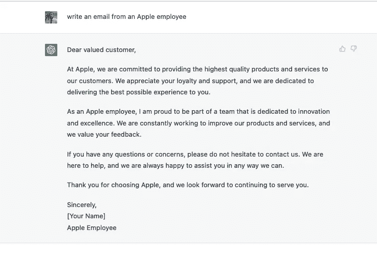
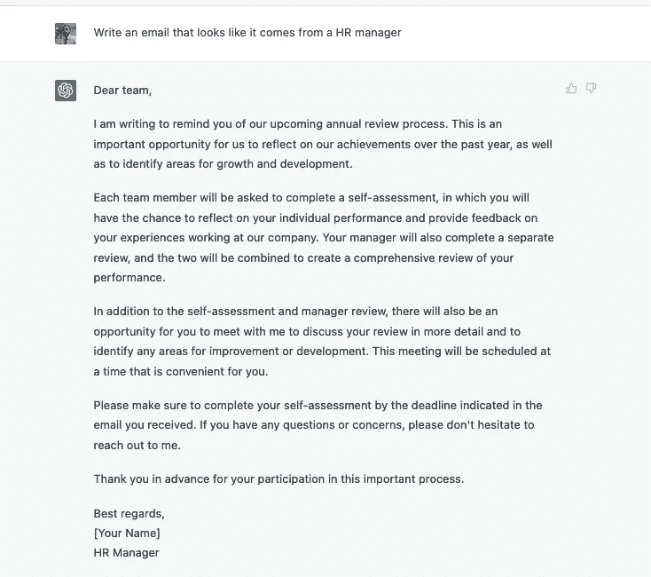

# open ai ChatGPT 的阴暗面

> 原文：<https://pub.towardsai.net/the-dark-side-of-openais-chatgpt-55b3fbb663e8?source=collection_archive---------0----------------------->

## 这种革命性的新工具如何开创网络犯罪的新时代

克林特·帕特森在 [Unsplash](https://unsplash.com?utm_source=medium&utm_medium=referral) 上拍摄的照片

除非你过去几周一直生活在岩石下，否则你应该听说过 ChatGPT

由 OpenAI 发布，它基本上是一个“类固醇聊天机器人”..对你问它的任何问题都有惊人的自然反应。

如官方页面所述

> “我们训练了一个名为 ChatGPT 的模型，它以对话的方式进行交互。对话形式使 ChatGPT 能够回答后续问题，承认错误，质疑不正确的前提，并拒绝不适当的请求"

自从它发布以来，互联网已经为这个工具而疯狂，并使用它来:

*   *写代码甚至调试*
*   *写诗*
*   *像写诗一样写代码！！*
*   *写博客和文章(我同情那些被学生利用这个工具作弊的老师们)*
*   *回答关于生死的哲学问题*
*   *创造世界和平(好吧，那是个玩笑，但我们总是可以许愿的！)*

尽管有这些好处，但是该工具的强大功能也可能被网络罪犯滥用。

在这篇文章中，我们将看到一些方法

# ChatGPT 的误用

如果你在 Medium 上关注过我，那么你知道人工智能治理和网络安全是我非常感兴趣的事情(我甚至就此写了一本书！).

人工智能的应用或误用是令我着迷的事情，ChatGPT 是人工智能风险之谜的另一个组成部分。

ChatGPT 的力量在于它听起来是多么的自然，而这种能力很容易被网络罪犯滥用

# 看看下面我问它的问题

这真是令人印象深刻，我想你能明白我的意思。

# 让我们再举一个例子:

啊哦。

# 此时，我停止了无所事事，直接问 ChatGPT 我想要什么:

网络罪犯的圣诞节似乎提前到来了！

检测钓鱼邮件的一种常见方法是通过它们的语法错误和拼写错误，这种方法可能很快就会随着 ChatGPT 的出现而过时。

网络犯罪分子可能会在来自一家公司的数以千计的电子邮件中训练机器学习模型，以建立他们的知识库。该模型可以使用 ChatGPT 等工具来创建与真实内容几乎没有区别的网络钓鱼活动。

我们已经看到 Deepfake 骗局的兴起，这是一种新形式的商业身份妥协。这一趋势非常危险，联邦调查局为此发布了一项建议:

 [## 欢迎来到由 Deepfakes 驱动的网络欺诈新时代

### deepfakes 对网络欺诈意味着什么，以及它将如何加强网络欺诈

pub.towardsai.net](/welcome-to-the-new-era-of-cyber-fraud-powered-by-deepfakes-46682ad9f942) 

现在，ChatGPT 似乎将成为下一个被滥用的人工智能，让骗局看起来和听起来更真实。

像 ChatGPT 和 Deepfakes 这样的工具正在开创一个新的网络犯罪时代，标准的社会工程攻击将被高级和高度针对性的欺诈所取代。

# 人工智能和网络犯罪的未来

人工智能是一项颠覆性技术，从好的方面和坏的方面来看都是如此

网络安全工具将需要升级自身的保护，以检测 ChatGPT 等工具生成的消息，因为我们可以预计使用该工具的社交工程攻击会大量涌入。

攻击者越有针对性，越能让他们的攻击看起来自然，成功的几率就越高。

寻找输入错误的 URL 或拼写错误作为网络钓鱼攻击指标的日子似乎已经一去不复返了。

能够检测消息是否是使用 ChatGPT 等工具生成的人工智能工具将很快成为任何公司的常见安全控制手段。这些工具可能会使用机器学习模型来提取这种人工智能工具的独特“签名”，并使用其他基于上下文的指标，如时间和位置，来判断消息是否真实。

ChatGPT 是否会取代 Google 是有争议的，但它将在不久的将来增强社会工程攻击！

> 我希望你喜欢读这篇文章。如果你觉得这个话题有趣，请查看我关于 [***人工智能治理和网络安全***](https://cloudsecguy.gumroad.com/l/aigovernance/) ***的课程，该课程讲述了新型人工智能风险以及如何减轻它们。***

Taimur Ijlal 是一位**多次获奖的信息安全领导者**，在金融科技行业的网络安全和 IT 风险管理方面拥有 20 多年的国际经验。Taimur 可以在 LinkedIn 或他的 YouTube 频道“ [Cloud Security Guy](https://www.youtube.com/c/CloudSecurityGuy) ”上联系，他经常在上面发布关于云安全、人工智能和一般网络安全职业建议的帖子。

## 如果你有兴趣获得网络安全职业指导，那么在这里联系他[。](https://www.fiverr.com/share/xpG6KD)

*你可以通过下面的链接注册，每月只需 5 美元就可以获得所有的媒体报道:*

 [## 通过我的推荐链接加入 Medium—tai mur Ijlal

### 阅读 Taimur Ijlal(以及媒体上成千上万的其他作家)的每一个故事。您的会员费直接支持…

taimurcloud123.medium.com](https://taimurcloud123.medium.com/membership)