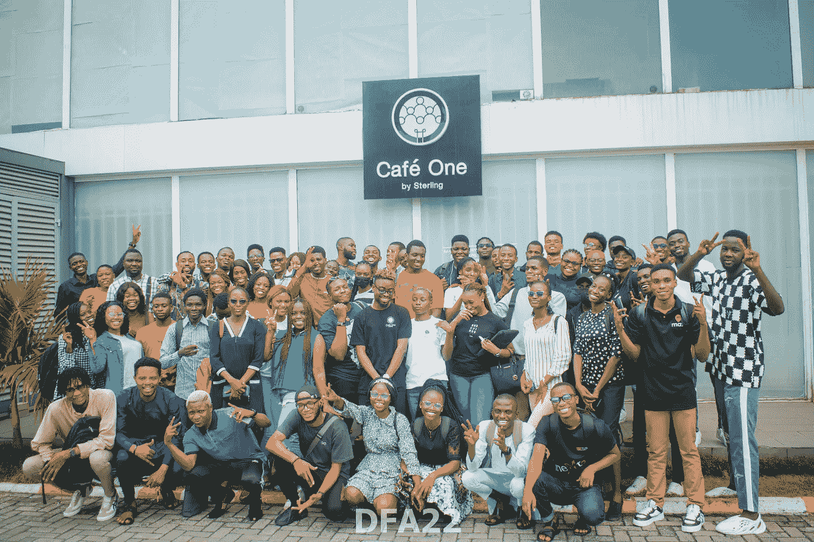
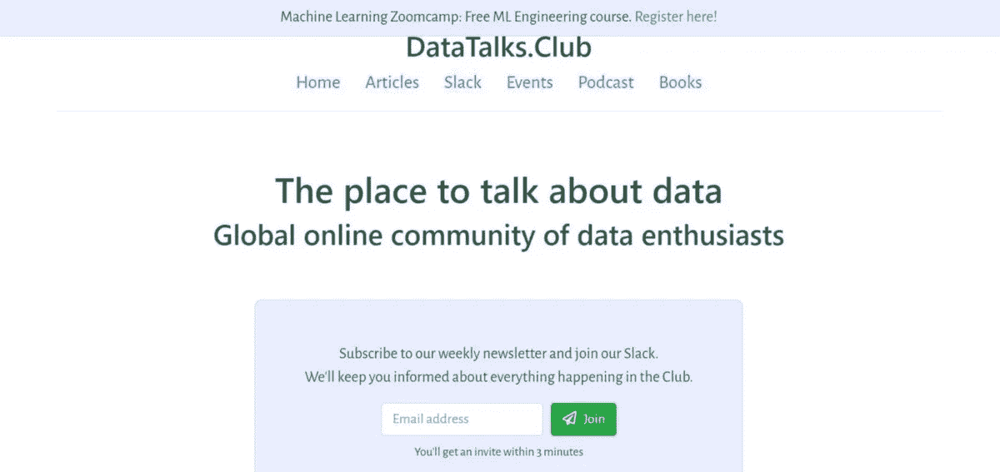
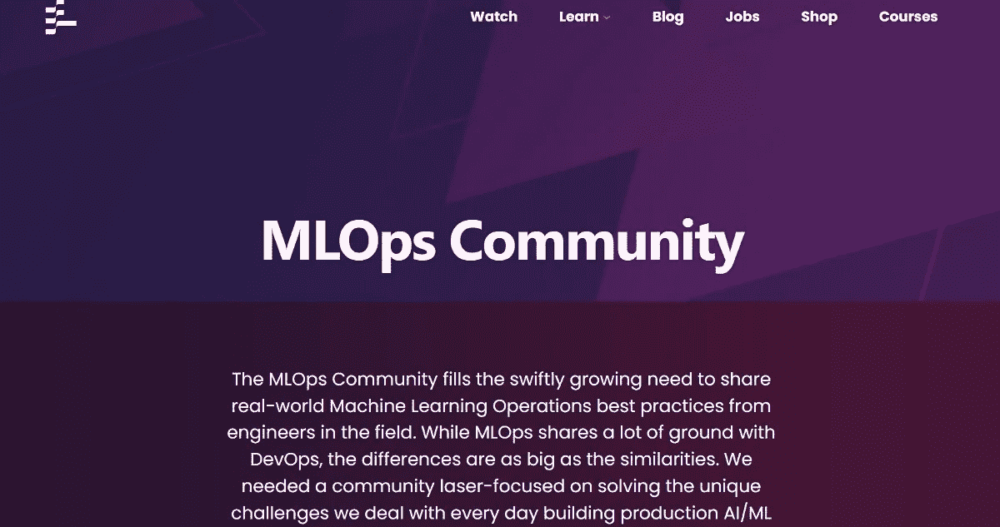
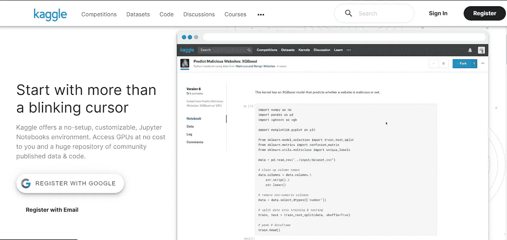
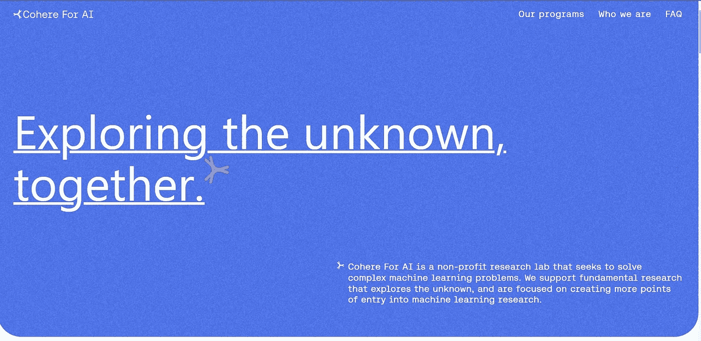
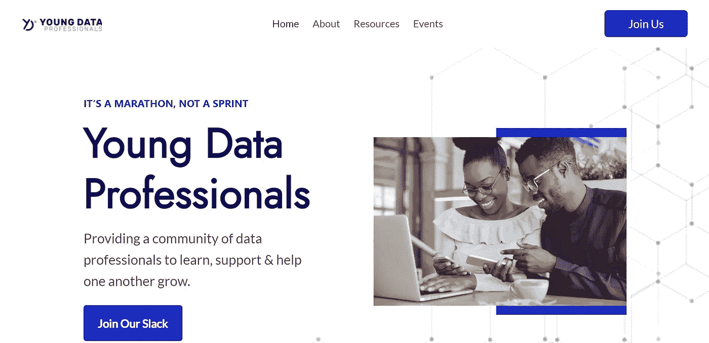
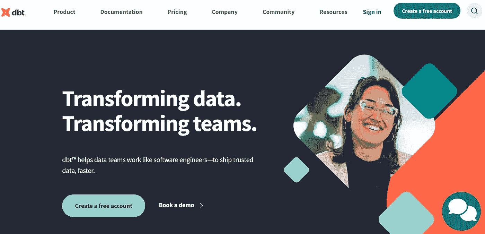
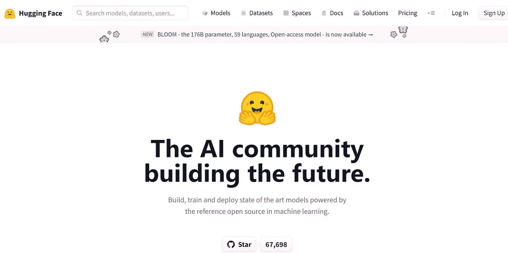
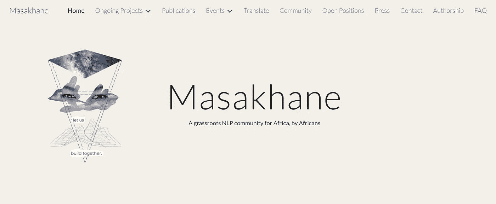
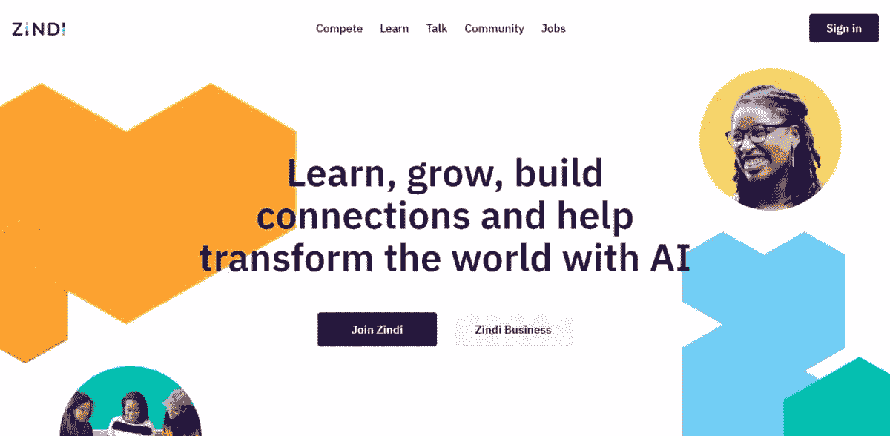

# 数据社区即服务

> 原文：<https://pub.towardsai.net/the-data-community-as-a-service-part-1-1bd268add482?source=collection_archive---------2----------------------->

对数据社区、其重要性、优势以及社区成员如何从中获益的观点。

照片由 [Flickr](https://www.flickr.com/photos/196655918@N05/) 上的[data fast Africa](https://datafestafrica.com/)拍摄

**为什么是这篇文章？**

*我写这篇文章是为了教育和让数据爱好者和从业者看到社区对全球数据空间中的个人的重要性。*

> 独自一人，我们能做的很少；团结起来，我们可以做很多事情——海伦·凯勒。

我们的世界是相互联系的，人们对传统职业道路和传统教育越来越失望。在这样一个世界里，人们在数据领域和学习经验方面投入额外的努力，这有什么好奇怪的？

*以低成本获得可靠体验的最佳方式是什么？*

*答案是 D.C.A.A.S —* ***数据—社区即服务*** *。*

*数据社区即服务是一种现象，在这种现象中，访问一组数据从业者非常有价值，我们可以将它视为数据社区和数据从业者之间的相互关系。*

**这篇文章是给谁看的？**

*   技术和非技术数据专业人员。
*   对加入数据社区感兴趣的数据爱好者，与其他数据从业者联系，并在他们的数据职业生涯中获得一条清晰的道路。
*   寻找最佳数据社区的数据专业人士，加入志同道合者的行列。

# 你会学到什么？

*   为什么选择数据社区即服务？
*   什么是数据社区？
*   作为数据爱好者或从业者加入数据社区的好处。
*   面向数据爱好者和专业人士的数据社区列表及其具体影响。

**为什么数据社区是一种服务？**

社区本身定义了人类，一个‌forms 国家、国家和大洲社区的集合体。

开发者社区也不例外。

世界各地进入科技行业的人数每天都在增加。

这里的开发人员是数据从业者，因为我说的是数据社区即服务。

随着数据的增长，对其他数据职业的需求也在不断增长，因为数据无处不在，而信息却很稀缺。

> 数据社区即服务是一个概念，它允许数据社区的成员学习和分享想法，同时维护护栏和参数，使数据社区能够专注于改善所有人的更大目标，这一概念的成功依赖于社区的受信任状态，因此其成员在分享和参与社区时会感到舒适

随着数据职业的不断发展，需要建立数据社区，因为人类天生是群居的，即人类是社会性的。

> 人类是群居动物，因此自然地寻求他人的陪伴，作为他们幸福的一部分——亚里士多德

# 什么是数据社区？

我们可以简单地将数据社区定义为一群技术和非技术人员，即数据科学家、数据工程师、数据分析师、数据产品经理、数据社区经理等等。

我们将它们封装在一个名为数据从业者的保护伞下，这些从业者有着共同的态度或兴趣，其中包括三个关键要素:

1.  **社区参与** —回答、提问和相互支持。
2.  **组织** —组织聚会、黑客马拉松&会议。
3.  **工作** —构建、参与开源项目，&在他们的工作场所提供数据解决方案。

> 从组织的角度来看，数据社区可能对营销和销售计划很有价值，但目标应该是专注于为社区中的数据从业者提供价值。最重要的是，要确保数据从业者在社区中发现值得他们花费时间的价值，从长远来看，这将会有所回报。总之，这一切都是为了建立真正的关系。

# 作为数据科学家或机器学习工程师加入社区的好处

在这种情况下，数据科学家或机器学习工程师是数据从业者的通称。

我用这个是因为这是最接近我的职业。

如果你是数据工程师，那就把它替换成作为数据工程师加入社区的福利。

1.  方向。
2.  网络和机会。
3.  拓宽你的知识面。
4.  支持、激励和坚持

1.  方向-它正确地指引你。数据领域充满了复杂性，尤其是对于初学者。大多数时候，你开始需要澄清。所以加入一个社团可以指引你。

你可以联系并询问有经验的人，然后决定把重点放在哪里。尽管你有多聪明，但你不可能学到数据科学领域的所有东西。

但是在正确的道路上得到指引，并学习你需要学习什么才能找到工作，这是非常重要的。既然你隐含的理由是赚钱。

注意:许多初学者抱怨他们需要一个导师。

作为一个初学者，你有没有考虑过在社区中保持活跃，并在出现问题时提问？

导师不一定是直接的。一个社区可以填补这个空白。

2 **。社交机会**——当你加入一个社区，你会认识不同的人，社区里有很多工作机会。许多人仅仅通过加入一个社区就获得了他们梦寐以求的工作。

3 **。它扩展了你的专业领域**——当你加入一个社区；你注意到发生了什么。

它向您展示了关于数据科学相关主题的讨论。你看到人们给出了你正在努力解决的问题的答案。

它在不知不觉中塑造和提高你。

**4。寻求支持、激励、坚持——这个过程可能会非常艰难。有时你发现你只是因为缺乏支持和动力而一直拖延，但是当你加入一个社区，看到人们建设和学习会激励你不要放弃。**

> 我的建议是:加入社区，保持活跃

# **面向数据爱好者和专业人士的顶级数据社区列表及其具体影响。**

这些是我从个人经验、研究、在线评论和与社区成员的交谈中发现在数据空间中有用的数据社区列表。

*   [**DataTalksClub**](https://datatalks.club/)

数据谈话俱乐部

**DataTalksClub** 社区是由 [Alexey Grigorev](https://twitter.com/Al_Grigor) 领导的由数据爱好者、数据/产品分析师、数据科学家、机器学习工程师、数据工程师、分析工程师、开发人员倡导者和软件工程师/ Python 开发人员组成的全球在线社区。

这是一个谈论数据、机器学习和工程、参加每周活动和从免费课程中学习、询问职业问题和讨论职业选择的地方。

**DataTalksClub** 有一些惊人的资源，像 [MLOps Zoomcamp](https://github.com/DataTalksClub/mlops-zoomcamp) 、[数据工程 Zoomcamp](https://github.com/DataTalksClub/data-engineering-zoomcamp/) 和 [ML](https://github.com/alexeygrigorev/mlbookcamp-code/tree/master/course-zoomcamp) zoom camp。

[社区指南](https://datatalks.club/slack/guidelines.html#jobs)、[松弛通道](https://datatalks.club/slack.html)

*   [**MLOps 社区**](https://mlops.community/)

MLOps 社区

由[德梅特里奥斯·布林克曼](https://www.linkedin.com/in/dpbrinkm/)领导的 **MLOps 社区**满足了分享该领域工程师的真实世界机器学习操作最佳实践的快速增长的需求。

MLOps 社区需要一个专注于解决构建生产 AI/ML 管道的独特日常挑战的社区。

MLOps 社区遍布 18 个国家，拥有超过 5200 万成员。

一些 MLOps 本地聚会的示例如下:

*   由 [Gift Ojeabulu](https://twitter.com/GiftOjeabulu_) 、 [Stephen Oladele](https://twitter.com/nerdCyberArtist) 和 [Tochukwu Nwoke](https://twitter.com/Nwoke_bots) 组织的 [MLOps 社区 Lagos](https://www.meetup.com/en-AU/lagos-mlops-community/)
*   [多伦多的 MLOps 社区](https://www.meetup.com/en-AU/toronto-mlops-community/)。

所有 [Meetup 链接](https://www.meetup.com/pro/mlops-community/)、[松弛频道](https://go.mlops.community/slack)

*   [**数据非洲**](http://datafestafrica.com)

非洲数据

**Data estafrica，**现为**非洲数据社区，**始于四位数据从业者( [Gift Ojeabulu](https://twitter.com/GiftOjeabulu_) 、 [David Abu](https://twitter.com/DavidAbu_) 、 [Oyinbooke Olarenwaju](https://twitter.com/TheOyinbooke) 和 [Opeyemi Fabiyi](https://twitter.com/Opiano_1) )的讨论，他们认为有必要为非洲所有与数据相关的职业创建一个社区。

这是有史以来第一次在非洲展示和汇集数据空间内所有职业的活动和社区。

如果您是该领域的数据分析师、数据科学家、数据工程师、AI/ML 工程师、低代码开发人员、学生、研究人员、数据经理、数据消费者或招聘人员，那么**非洲数据社区**适合您。

**非洲数据社区**通过举办基于解决方案的黑客马拉松、会议和互动在线社区，在非洲建立了数据社区，这些社区在帮助数据爱好者和专业人士方面有着良好的记录。

在线[社区](https://discord.gg/f6aXkgn7SA)

*   [**摇摇晃晃**](https://www.kaggle.com/)

卡格尔

**Kaggle** 是 [Google LLC](https://en.wikipedia.org/wiki/Google_LLC) 的子公司，是一个由[数据科学家](https://en.wikipedia.org/wiki/Data_science)和[机器学习](https://en.wikipedia.org/wiki/Machine_learning)实践者组成的在线社区。Kaggle 允许用户查找和发布数据集，在基于网络的数据科学环境中探索和构建模型，与其他数据科学家和机器学习工程师合作，并参加竞赛以解决数据科学挑战。

Kaggle 于 2010 年通过提供机器学习竞赛起家，现在还提供公共数据平台、基于云的数据科学工作台和人工智能教育。

*   [**连贯为艾**](https://cohere.for.ai/)

CohereforAI

**Cohere For AI** 是一个由[莎拉·胡克](https://twitter.com/sarahookr)领导的非营利性研究实验室，旨在解决复杂的机器学习问题。这个社区支持探索未知的基础研究，并专注于创建更多进入机器学习研究的切入点。

这个社区是研究人员、工程师、语言学家、社会科学家和终身学习者联系和合作的空间。个人从世界各地走到一起，欢迎你，不管你是导师，辍学生，刚入门，博士，硕士，本科，无党派，行业，学术，还是不确定。

Cohere for AI 社区很高兴支持社区驱动的研究，并受成员兴趣的影响。

[凝聚社区](https://share.hsforms.com/10OrjljwpQ52ILJA6ftENIwch5vw)

*   [**数据技术空间**](https://www.datatechspace.org/)

数据技术空间

**DataTech Space (DTS)** 是一个由 [Jessica Uwoghiren](https://twitter.com/jessica_xls) 领导的免费在线社区，专门面向对数据相关领域(即数据分析、数据科学、数据工程、机器学习等)感兴趣的个人。)不管他们的技术水平如何。

这个社区为初露头角的数据爱好者提供了一个支持系统，并将他们与同龄人和经验丰富的专业人士联系起来。

这个社区有 2 个层次，电报和不和谐频道。

[数据技术空间社区](https://www.datatechspace.org/register)

*   [YDP](https://ydprofessionals.com/about.html)

YDP

**年轻数据专家(YDP)** 是一个由聪明、年轻、精力充沛的数据爱好者组成的部落和充满活力的社区，他们拥有不同水平的专业知识，由 [Opeyemi Fabiyi](https://twitter.com/Opiano_1) 领导。

YDP 参与了关于数据的热烈讨论，并为成员们富有挑战性的任务提供了解决方案。YDP 还帮助社区成员提高技能，以跟上分析领域的全球趋势。

YDP 社区是 dbt Lagos Nigeria 🇳🇬 Meetup 的驱动者，引领着非洲数据生态系统中分析工程的意识。

■缺乏社区

*   [**DBT 社区**](https://www.getdbt.com/)

DBT

DBT 是目前最流行的开源工具之一。dbt 的在线 Slack 社区号称是最大的分析工程交流中心之一，共有超过 22，700 名成员！

虽然对话通常与 dbt 和连接到 dbt 的工具有关，但是一些数据领域的顶尖人才正在这里积极地分享他们的想法。

这个社区本身是最受欢迎、最温暖人心的团体之一，这并没有什么坏处。

[DBT 社区](https://www.getdbt.com/community/join-the-community/)

*   [**拥抱脸**](https://huggingface.co/)

拥抱脸

由 Omar Sansevero 领导的拥抱脸社区正在推进良好的机器学习，并使其更容易获得。一路走来，抱脸有助于技术向更好的方向发展。

拥抱脸有一个蓬勃发展的开源生态系统，有各种背景(从 ML 研究人员到对模型偏见感兴趣的学生)。有十几个开源项目，一个了不起的社区，数以千计的贡献者和合作者。

成千上万的创作者作为一个社区，用人工智能解决音频、视觉和语言问题。

[不和谐社区](https://discord.com/invite/JfAtkvEtRb)、[论坛](https://discuss.huggingface.co/)、[课堂](https://huggingface.co/classrooms)

*   [**正身**](https://www.masakhane.io/)

马萨坎

Masakhane 是一个草根组织，它的使命是加强和促进非洲人对非洲语言的自然语言处理研究。

[马萨坎社区](https://www.masakhane.io/community)

*   

****

**津迪**

****Zindi** 拥有最大的非洲数据科学家社区，致力于利用机器学习和人工智能解决世界上最紧迫的挑战。**

**Zindi 将数据科学家与组织联系起来，并提供一个学习、磨练技能和找工作的地方。**

**Zindi 旨在改造非洲大陆，并向世界展示非洲的数据科学人才。**

**津迪社区**

****其他令人惊叹的数据社区**:**

*   **[MLSpace](https://discord.gg/mlspace-the-machine-learning-community-736298460231499817)**
*   **[迭代社区](https://discord.com/invite/N5YzBBuFms)**
*   **[所有关于数据](https://discord.gg/CA49pjaSdt)**
*   **[DagsHub-社区](https://discord.gg/YPHZsZBP5U)**
*   **[非洲妇女数据](https://docs.google.com/forms/d/e/1FAIpQLSdZdnLbzXHVizQGDONNLX4KIfUHV1_6p3Y81_xxUxzRZ-fvug/viewform)**

****参考文献****

**[1] Jovian Cicmil，[https://medium . com/swlh/community-as-a-service-a-business-model-for-the-21 century-b7e 0612 e 7095](https://medium.com/swlh/community-as-a-service-a-business-model-for-the-21st-century-b7e0612e7095)(2021)**

# **我们在这里得出结论…**

**无论是经验丰富的数据从业者还是新手，参加技术活动、加入数据社区并保持活跃都是数据领域的最佳体验之一。**

**恭喜你！现在，您已经很好地了解了作为数据爱好者或从业者加入数据社区、数据社区即服务以及面向数据爱好者和专业人士的活跃数据社区的好处。**

**我迫不及待地想看到您采用我在本文中解释的内容，并开始在数据领域与它们一起兴风作浪。**

**在 [LinkedIn](http://linkedin.com/in/gift-ojabu/) 上联系我**

**在[推特](https://twitter.com/GiftOjeabulu_)上与我联系**