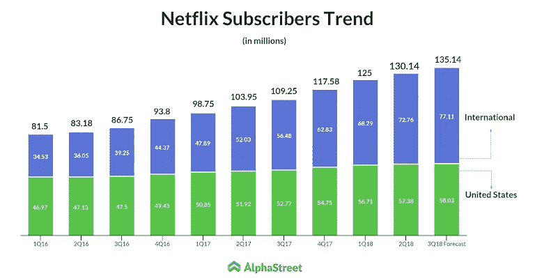
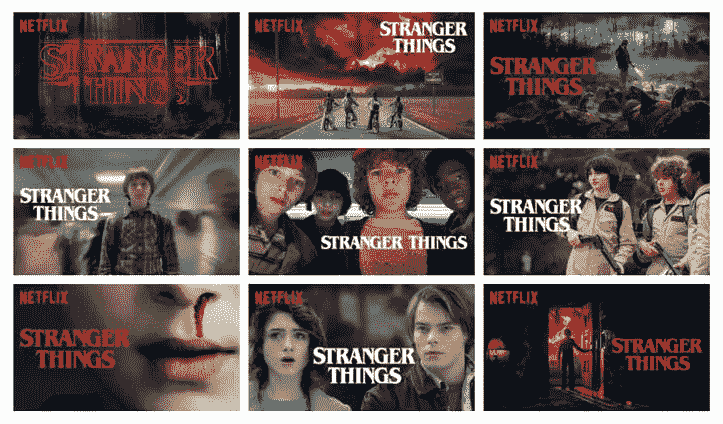
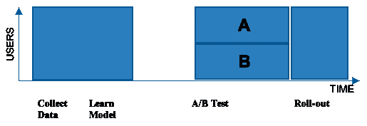
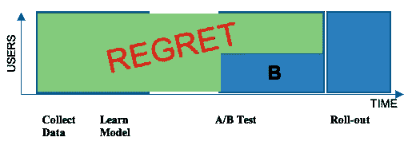

# 网飞背后的数据科学

> 原文：<https://pub.towardsai.net/the-data-science-behind-netflix-6128eaaabc83?source=collection_archive---------1----------------------->

## “网飞不仅是一项成功的服务，而且完全是一项数据驱动的服务。”

# **网飞在数字上**

L 去年网飞宣布签约全球***1.35 亿*** 付费客户。

网飞的美国用户的人口统计数据完美地代表了美国整体人口在不同因素方面的情况，如财富、年龄和教育。

信贷 AlphaStreet [1]

# 网飞的商业模式

由于没有广告，网飞的商业模式依赖于长期订阅其服务的客户。**客户越开心，他们订阅服务的时间就越长。**

这就是为什么识别和分析影响观众享受的因素对网飞的业务至关重要。

# 影响顾客享受的因素

因为在早期，网飞通过对节目/电影的评级来获取观众的喜爱程度。

随着流式视频成为主要关注点，更多的**数据点**变得可用，从而洞察客户。

**数据点包括…**

***一天中的某个时间*** 有人在看什么东西。

用户**年龄**和 ***性别*** (基于个人登录)

***选择电影花费的时间***

电影或节目被 ***暂停/恢复*** 的频率

# 网飞预言“完美的情况”

使用所有上述数据点，网飞的数据科学家和工程师建立模型来预测“**完美情况”**，在这种情况下，客户持续接收他们喜欢的节目。

为此，它根据用户的观看偏好，将用户分配到超过 **1300 个** **聚类**中的**3–5 个不同的聚类**。

# 数据驱动的电影分类

利用数据科学技术，网飞服务公司创造了**76897**种独特的方式来描述 ***种电影*** 。

这些被称为**“另类流派”**，这就是网飞提出的非常具体的电影/节目建议的原因( ***)例如，“电影般的:圣诞之心”*** )

类似电影建议[2]

显然，它们超越了经典类别，如戏剧、科幻和喜剧。

# 封面图像个性化

正如您所观察到的，所有用户基于他们的电影偏好都有不同的封面，这也可能会随着时间而变化。

这是网飞为带来更多新观众所做的最重要的事情。

**网飞**模特 ***为成功的类似标签节目*** 展示“封面图片”的颜色和风格。

此外，他们尝试不同版本的封面图像，以找出哪一个对用户更有效。

个性化封面图片[3]

# 实现方法

网飞的推荐引擎由机器学习算法驱动。传统上，我们收集一批关于我们的成员如何使用服务的数据。然后我们对这批数据运行新的机器学习算法。接下来，我们通过 [A/B 测试](https://medium.com/netflix-techblog/its-all-a-bout-testing-the-netflix-experimentation-platform-4e1ca458c15)针对当前生产系统测试这个新算法。A/B 测试通过在成员的随机子集上进行试验，帮助我们了解新算法是否优于我们当前的生产系统。A 组成员获得当前产品体验，而 B 组成员获得新算法。如果 B 组的成员对网飞有更高的参与度，那么我们就向全体成员推广新算法。不幸的是，这种批处理方法招致遗憾:许多成员在很长一段时间内没有从更好的体验中受益。下图对此进行了说明。

带有 A/B 测试的用户数据[4]

[5]

# 结论

网飞利用数据科学为观众提供他们想要的内容，颠覆了电视行业。

# 参考

[1][https://news.alphastreet.com/netflix-earnings-q2-2018/](https://news.alphastreet.com/netflix-earnings-q2-2018/)

[2][https://alvinalexander.com/](https://alvinalexander.com/)

[3][4][5][https://medium . com/网飞-tech blog/artwork-personal ization-c 589 f 074 ad 76](https://medium.com/netflix-techblog/artwork-personalization-c589f074ad76)