# 数据科学方法论

> 原文：<https://pub.towardsai.net/the-data-science-methodology-50d60175a06a?source=collection_archive---------0----------------------->

## [数据科学](https://towardsai.net/p/category/data-science)

## 了解数据科学生命周期…

T 文档串与函数的相关性是通过指定函数的正确参数和用例来指导未来的用户(包括未来的自己)……对数据科学家来说**数据科学方法论**也是如此。

> [数据科学方法论](https://cognitiveclass.ai/courses/data-science-methodology-2/)是一个迭代的方法系统，通过规定的步骤序列，指导数据科学家采用理想的方法来解决数据科学的问题。

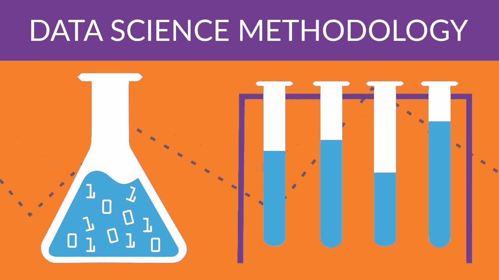

## 为什么选择数据科学方法论？

简而言之，数据科学方法旨在按照**规定的顺序回答 10 个基本问题，**涵盖了数据科学项目的五个主要方面。这些方面是:

**1。从问题到方法**

**2。从需求到收集**

**3。从理解到准备**

**4。从建模到评估**

**5。从部署到反馈**

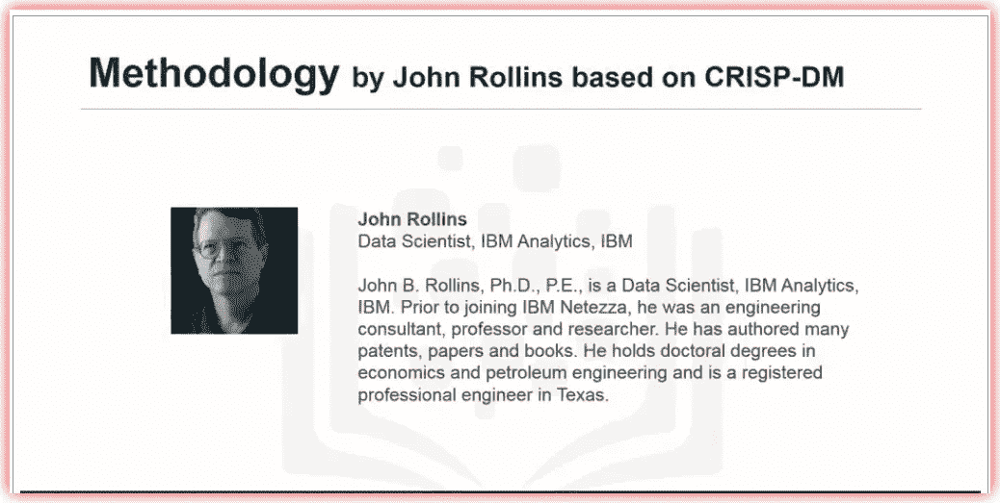

[img_credit](https://www.coursera.org/learn/data-science-methodology/lecture/lMNmc/welcome)

> 本文中引用的数据科学方法是由 IBM 经验丰富的高级数据科学家 John Rollins 开发的，他基于 [**CRISP-DM**](https://en.m.wikipedia.org/wiki/Cross-industry_standard_process_for_data_mining) 流程以及他在 IBM…[**link**](https://cognitiveclass.ai/courses/data-science-methodology-2/)**担任数据科学家二十多年的经验开发了这一方法。**

让我们来看看数据科学方法中每个步骤的高级描述，以及每个数据科学家都应该问的十(10)个基本问题。

# 从问题到方法:

## ***1。你想解决的问题是什么？***

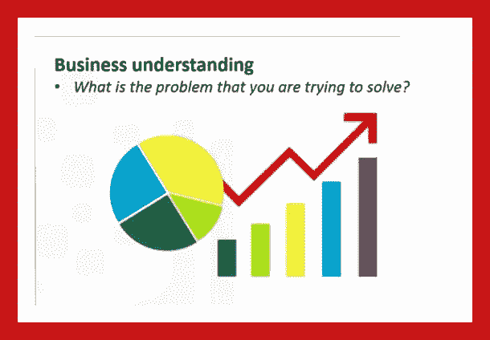

第一步。商业理解。

例如，如果一个企业主问‘我们如何才能降低执行一项活动的成本？’…数据科学家需要了解目标是提高活动效率还是增加业务盈利能力。

在这种情况下，作为一名数据科学家，提出正确的问题始于理解企业所有者的目标。

正确的问题将为解决问题的理想分析方法提供信息。

## ***2。你如何用数据来回答这个问题？***

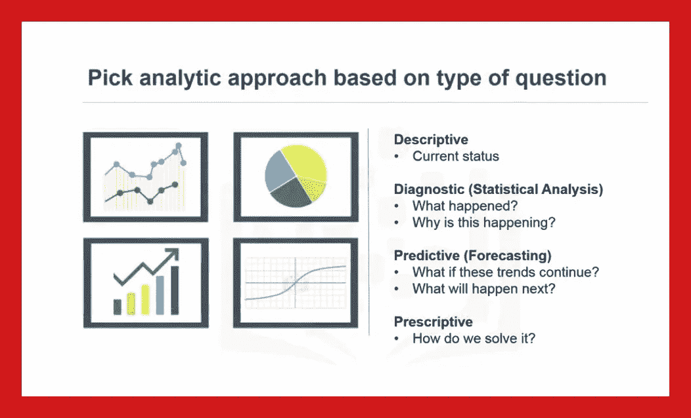

第二步。分析方法。

选择正确的分析方法取决于所提的问题。这需要对业务有清晰的理解。分析选项可能包括:-

[统计分析](https://cognitiveclass.ai/courses/data-analysis-python/)

[预测模型](https://cognitiveclass.ai/badges/machine-learning-python/)

[描述性模型](https://cognitiveclass.ai/courses/data-visualization-with-python/)

[分类或其他形式的机器学习模型](https://cognitiveclass.ai/courses/machine-learning-with-python/)。

# 从需求到收集:

## ***3。回答问题需要哪些数据？***

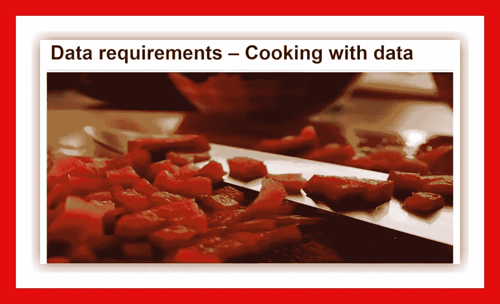

第三步。数据要求

如果在步骤 1 和 2 中需要解决的问题是*“配方”*，而数据是“*成分*”，那么数据科学家需要知道需要哪些成分，如何获取和收集它们，以及如何准备数据以达到预期的结果。

这里的任务包括:-

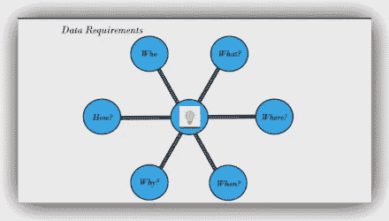

数据需求过程

为初始数据收集确定必要的数据内容、格式和来源

## ***4。数据从哪里来(确定所有来源)，如何获取？***

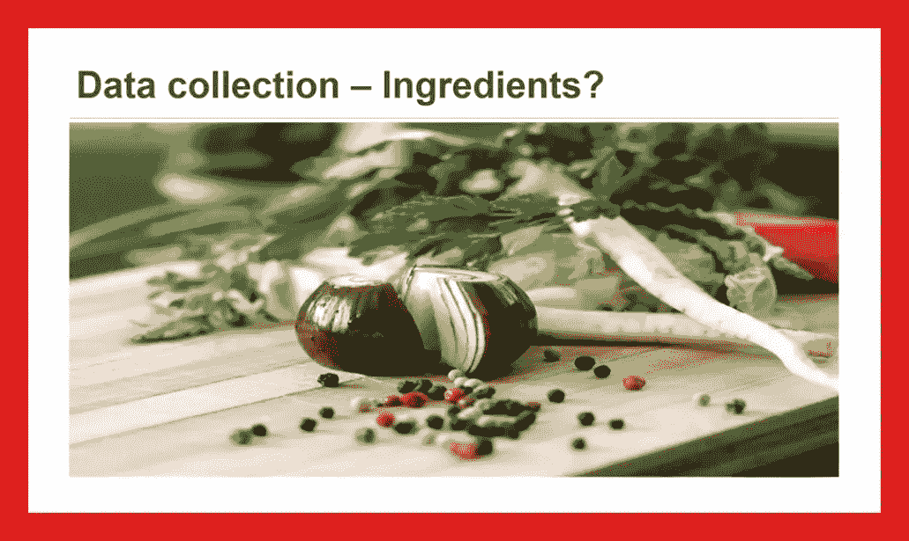

步骤 4:数据收集

在这一阶段，修订数据要求，并决定是否收集更多的数据。一旦收集了数据成分，数据科学家就会很好地理解他们将要处理的内容。

收集数据要求您知道在哪里可以找到数据元素。这些可能来自现有的 [*公共数据仓库*](https://medium.com/towards-artificial-intelligence/the-50-best-public-datasets-for-machine-learning-d80e9f030279) (检查日期戳作为旧数据比比皆是！)，网络抓取，或者如果您的项目涉及地理位置数据，可以在类似[***【foursquare.com】***](https://foursquare.com/)的门户网站上调用 API 来检索这些实时数据。

数据要求和数据收集阶段极其重要，因为收集的相关数据越多，模型就越好。

# 从理解到准备:

## ***5。你收集的数据代表了要解决的问题吗？***

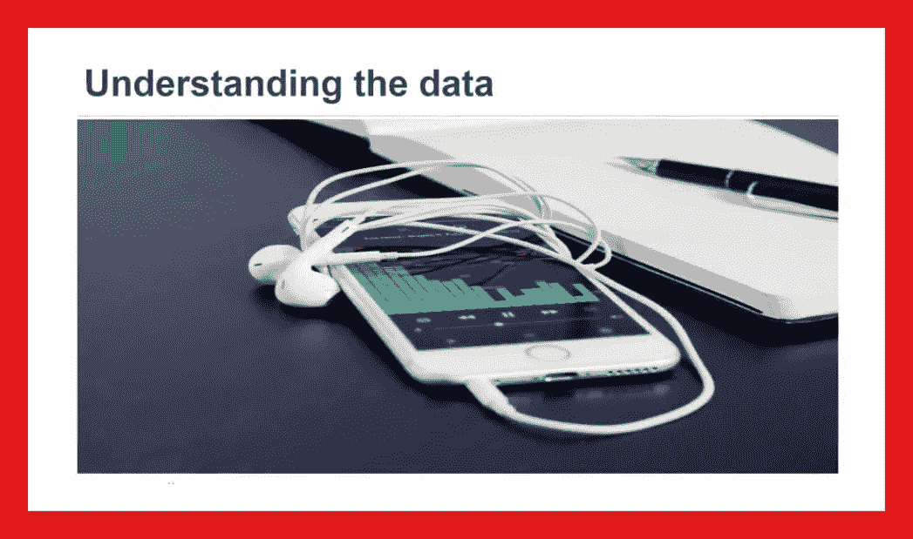

步骤 5:数据理解

为了理解数据，我们对变量或列进行描述性统计。这些统计数据可能包括单变量、平均值、中值、众数、最小值、最大值和标准差。pandas.describe()函数提供了一个很好的描述性统计摘要。

在这一阶段，对公司数据的理解也是相关的，两两相关也是相关的，以查看变量的相关程度，去掉可能高度相关的变量，因此是冗余的，只留下一个变量用于建模。

可视化库，如 Matplotlib 和 seaborn，可以用来更好地了解数据。缺失值评估现在也完成了。

## **6*。操纵和处理数据还需要做哪些工作？***

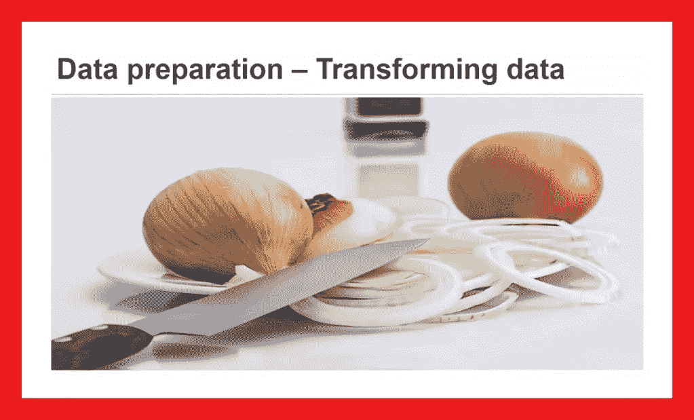

步骤 6:数据准备概念

从某种意义上说，数据准备类似于清洗新鲜采摘的蔬菜，因为不需要的元素都被去除了…加上数据收集和理解，数据准备是数据科学项目中最耗时的方面 [***占据了整个项目时间的 70%甚至 90%***](https://courses.cognitiveclass.ai/courses/course-v1:CognitiveClass+DS0103EN+v3/courseware/bd64ccdf56ad4ea1afe870e26d583038/d0cea537238c47a0ac4835e1463a3c7d/) 。

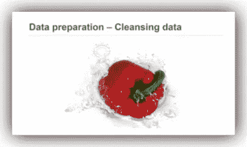

在这一阶段转换数据是一个将数据转换到更容易处理的状态的过程。数据清理包括解决以下问题

1.  ***缺失数据***
2.  ***无效值***
3.  ***删除重复***
4.  **格式*格式*格式**
5.  [***特征工程***](https://elitedatascience.com/feature-engineering-best-practices)

这一阶段必须正确，否则，如果这一阶段是随意完成的，您就有回到绘图板的风险。

# 从建模到评估:

## ***7。通过什么方式可以将数据可视化以得到所需的答案？***

步骤 7:建模概念

建模旨在回答两个关键问题

A.数据建模的目的是什么？

B.流程的特点是什么？

建模侧重于开发描述性或预测性的模型

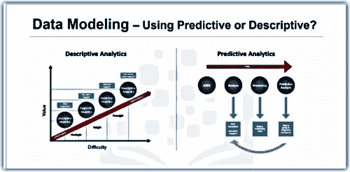

描述性和预测性数据建模； [img_credit](https://www.coursera.org/learn/data-science-methodology/lecture/CC8mt/modeling-concepts)

例如，描述性模型可以根据客户的现有偏好来判断客户可能更喜欢什么样的新服务……推荐系统和聚类算法就是这种算法的一些例子。

虽然预测建模可以根据当前数据判断未来值或类别，但一些示例是分类和线性或逻辑回归算法。

模型的选择基于步骤 2 中为步骤 1 中所述问题选择的分析方法。

## ***8。使用的模型真的回答了最初的问题还是需要调整？***

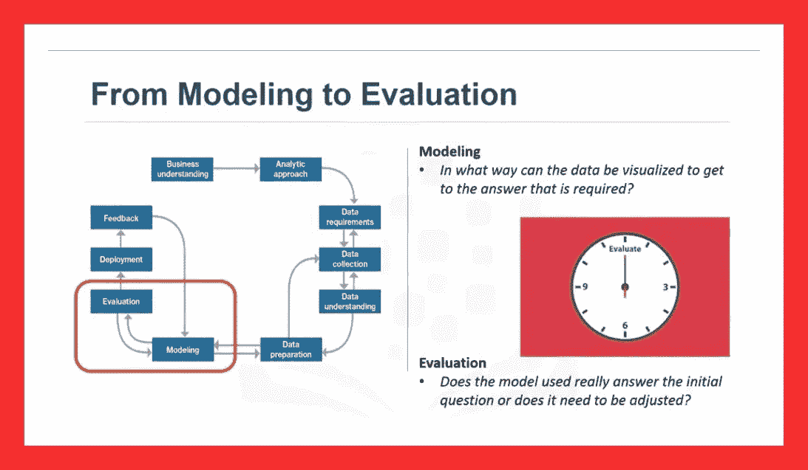

步骤 8:评估模型

模型评估与模型构建密切相关。这样，模型创建和评估是迭代完成的。

模型评估在模型开发期间和模型部署之前执行。评估允许对模型的质量进行评估，也是查看它是否满足初始要求的一种方式。

模型评估有两个主要阶段:

**诊断措施阶段**

**统计显著性阶段**。

前者关心模型的实际性能，给定一个测试数据集，而后者关心模型预测或描述的**真**或**可信**程度。

# 从部署到反馈:

## ***9。你能把这个模型付诸实践吗？***

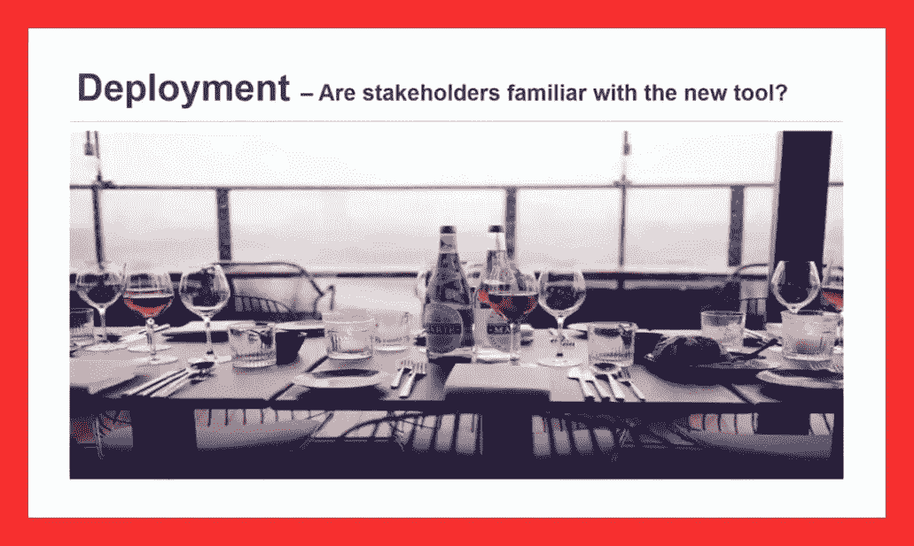

步骤 9:部署模型

虽然数据科学模型可能会提供一个解决方案，但使该解决方案对解决初始问题相关且有用的关键是让相关的利益相关者熟悉所产生的工具。

这个阶段需要有效的沟通技巧。

该模型最初可能被部署到有限数量的涉众，或者被部署到一个测试环境中，以建立在全面应用它时的信心。

该模型使用起来必须相对直观，负责应用该模型解决类似问题的工作人员必须接受培训。记录这个阶段可能出现的初期问题是很重要的。

## **10*。你能得到建设性的反馈来回答这个问题吗？***

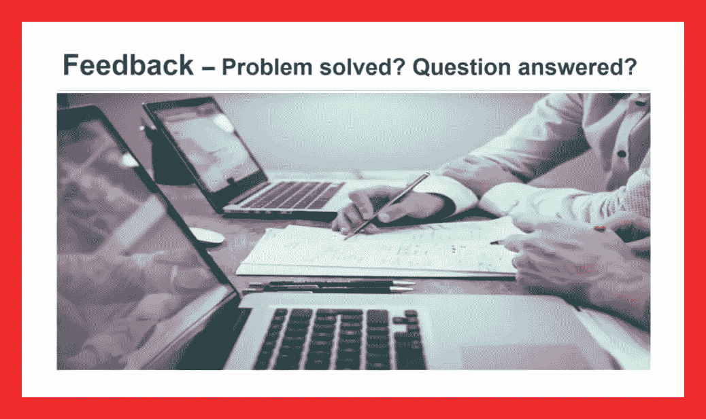

第十步:反馈

部署后，来自用户的反馈将用于完善模型并评估其性能和影响。只要需要解决方案，这种情况就会持续下去。

反馈流程基于这样一个理念，即“你知道的越多，你就越想知道”……这包括从现场收集新数据，以进一步开发模型。

# 结论:

请记住，数据科学方法论是一个 ***迭代*** 过程，遵循 ***规定的顺序。*** 这样就提供了一个 ***结构*** 。

**迭代**意味着这是一个持续的循环…模型得到训练、评估和部署。客户向数据科学家提供反馈，数据科学家收集新数据，处理并进一步更新模型，以提高性能。

**规定顺序**的意思是，循序渐进。

**注意:**可能会有多个步骤同时发生，如数据需求和收集步骤，但好的一面是数据科学方法的结构让我们在解决数据科学问题时能够最有效地利用时间和资源。

## 最后

通过有条不紊地回答十(10)个简单问题，我们看到了一种方法不仅可以帮助我们解决数据科学问题，还可以帮助我们解决任何其他问题。

如需了解更多详细信息，请查看此免费课程 [***数据科学方法论***](https://cognitiveclass.ai/courses/data-science-methodology-2/)*来自[***cognitiveclass . ai***](https://cognitiveclass.ai/courses/)*

## *干杯！*

## *关于我:*

*劳伦斯是技术层的数据专家，对公平和可解释的人工智能和数据科学充满热情。我持有 IBM 的 ***数据科学专业*** *和* ***高级数据科学专业*** *证书。我已经使用 ML 和 DL 库进行了几个项目，我喜欢尽可能多地编写函数代码，即使现有的库比比皆是。最后，我从未停止学习和实验，是的，我拥有几个数据科学和人工智能认证，并且我已经写了几篇强烈推荐的文章。**

*请随时在以下网址找到我*

*[Github](https://github.com/Lawrence-Krukrubo)*

*[**领英**](https://www.linkedin.com/in/lawrencekrukrubo/)*

*[**推特**](https://twitter.com/LKrukrubo)*