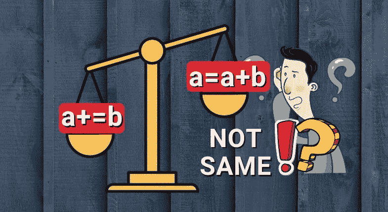

# Python 中 a=a+b 和 a+=b 的区别

> 原文：<https://pub.towardsai.net/the-difference-between-a-a-b-and-a-b-in-python-a7338d96e408?source=collection_archive---------0----------------------->

## [编程](https://towardsai.net/p/category/programming)



# 介绍

我相信你已经知道 Python 中的串联运算符 **+** 和 **+=** 。顾名思义，连接操作符用于连接多个序列类型(例如，连接两个列表)。同样，当您想要重复一个序列类型 **n 次**时，使用 ***** 和 ***=** 。你也知道这两者会产生相同的结果。

但是许多 Python 开发者认为 **my_list1 += my_list2** 是**my _ list 1 = my _ list 1+my _ list 2**的简写符号。同样的道理也适用于 **my_list1 *= n** 和 **my_list1 = my_list * n.** 但这远非事实。

在这篇短文中，你将了解到 **+** vs **+=** 和 ***** vs ***=** 的区别。

# +和+=

让我们看下面一个使用列表的例子。当您尝试使用 **+** 运算符连接两个列表 **mylist_1** 和 **mylist_2** 时，它会创建一个**新对象**，并将 **mylist_1** 分配给新对象。

如你所见 **mylist_1** 和 **mylist_2** 指向两个不同的内存位置。并且连接的结果也指向不同的存储器位置。

```
>>> mylist_1 = [1, 2, 3]
>>> mylist_2 = [4, 5]
>>> print(id(mylist_1), id(mylist_2))
1614327515784 1614319969800>>> mylist_1 = mylist_1 + mylist_2
>>> print(mylist_1)
>>> print(id(mylist_1))
[1, 2, 3, 4, 5]
1614319969416
```

现在，看看同一个例子，但是使用了**就地连接操作符** **+=** 。如您所见， **+=** 操作符没有创建新的对象。 **mylist_1** 在串联前后指向相同的内存位置。我们可以说 **mylist_1** 变异了。

```
>>> mylist_1 = [1, 2, 3]
>>> mylist_2 = [4, 5]
>>> print(id(mylist_1), id(mylist_2))
1614325213896 1614316889416>>> mylist_1 += mylist_2
>>> print(mylist_1)
>>> print(id(mylist_1))
[1, 2, 3, 4, 5]
1614325213896
```

但是，对于不可变的对象，如 int、floats、string 等。没关系。从下面的例子可以看出，在两种情况下，串联前后 **num1** 的存储位置是不同的。

```
>>> num1 = 10
>>> num2 = 20
>>> id(num1), id(num2)
(140726841418416, 140726841418736)>>> num1 = num1 + num2
>>> id(num1)  
140726841419056>>> num1 += num2
>>> id(num1)
140726841419696
```

**两个串联运算符的区别在于,+创建一个新列表，而+=就地修改一个现有列表。**

# ***和*=**

重复操作符的行为也类似于我们刚刚学习的连接操作符。参考下面的例子。 **mylist1** 的存储位置在重复(*)运算符前后不同。

```
>>> mylist1 = [1,2]
>>> id(mylist1)
2020051867784>>> mylist1 = mylist1 * 3
>>> print(mylist1)
[1, 2, 1, 2, 1, 2]
>>> id(mylist1)
2020051883912
```

现在，让我们看看使用 ***=** 操作符的同一个例子。如您所见，在串联操作之前和之后，mylist1 的内存位置是相同的。所以， **mylist1** 是用*=运算符变异的。

```
>>> mylist1 = [1,2]
>>> id(mylist1)
2020051837832>>> mylist1 *= 3
>>> print(mylist1)
[1, 2, 1, 2, 1, 2]
>>> id(mylist1)
2020051837832
```

就地重复操作符对不可变对象也没有影响，因为我们不能修改不可变对象。

**两个重复操作符之间的区别在于,*创建一个新列表，而*=就地修改一个现有列表。**

# **优点**

使用原地连接(+=)或原地重复(*=)的主要好处是它比普通的连接或重复操作更快。因为就地操作改变了对象，Python 不必创建新的对象，这样可以节省一些时间。

## **级联速度比较**

从下面的例子可以看出，+=比+运算符稍快一些。+运算符花费了 2.42 秒，而+=运算符花费了 2.29 秒。

**+操作员**

```
>>> code = """
>>> mylist_1 = [1, 2, 3, 4, 5, 7, 8]
>>> mylist_2 = [9, 10]
>>> mylist_1 = mylist_1 + mylist_2
>>> """
>>> import timeit
>>> timeit.timeit(stmt=code, number=10_000_000)
2.428993300000002
```

**+=操作员**

```
>>> code = """
>>> mylist_1 = [1, 2, 3, 4, 5, 7, 8]
>>> mylist_2 = [9, 10]
>>> mylist_1 += mylist_2
>>> """
>>> import timeit
>>> timeit.timeit(stmt=code, number=10_000_000)
2.293214599999999
```

## **重复速度比较**

从下面的例子可以看出，* **=** 比*运算符稍微快一些。*运算符采用

***操作员**

```
>>> code = """
>>> mylist_1 = [1, 2, 3, 4, 5, 6, 7, 8, 9, 10]
>>> mylist_1 = mylist_1 * 2
>>> """>>> import timeit
>>> timeit.timeit(stmt=code, number=10_000_000)
4.3188133
```

***=操作员**

```
>>> code = """
>>> mylist_1 = [1, 2, 3, 4, 5, 6, 7, 8, 9, 10]
>>> mylist_1 *= 2
>>> """>>> import timeit
>>> timeit.timeit(stmt=code, number=10_000_000)
4.291261399999999
```

# 结论

在本文中，您已经理解了`**+ and +=**`和`* and *=`操作符之间的一个重要区别。*和+操作符创建一个新列表，而 t `+= and *=`就地修改一个现有列表。

*原载于 2021 年 6 月 22 日*[***python 简化***](https://pythonsimplified.com/know-the-difference-between-add-vs-inplace/)**。**

# *进一步阅读*

*   *[Python 中 iterables 和迭代器的区别](https://pythonsimplified.com/making-sense-of-python-iterables-and-iterators/)*
*   *[Python 中 sort()和 sorted()的区别](https://pythonsimplified.com/difference-between-sort-and-sorted-in-python/)*
*   *[最有争议的 Python 的海象算子](https://pythonsimplified.com/the-most-controversial-python-walrus-operator/)*
*   *[使用 Geopy 在 Python 中进行地理编码](https://pythonsimplified.com/geocoding-in-python-using-geopy/)*
*   *[了解 Python 中的索引和切片](https://pythonsimplified.com/understanding-indexing-and-slicing-in-python/)*
*   *[Python 列表 Vs Tuple](https://pythonsimplified.com/python-list-vs-tuple/)*

****希望你喜欢看这篇文章。如果你喜欢我的文章并想订阅 Medium，你可以在这里这样做:****

*[](https://chetanambi.medium.com/membership) [## 通过我的推荐链接加入媒体- Chetan Ambi

### 作为一个媒体会员，你的会员费的一部分会给你阅读的作家，你可以完全接触到每一个故事…

chetanambi.medium.com](https://chetanambi.medium.com/membership)*