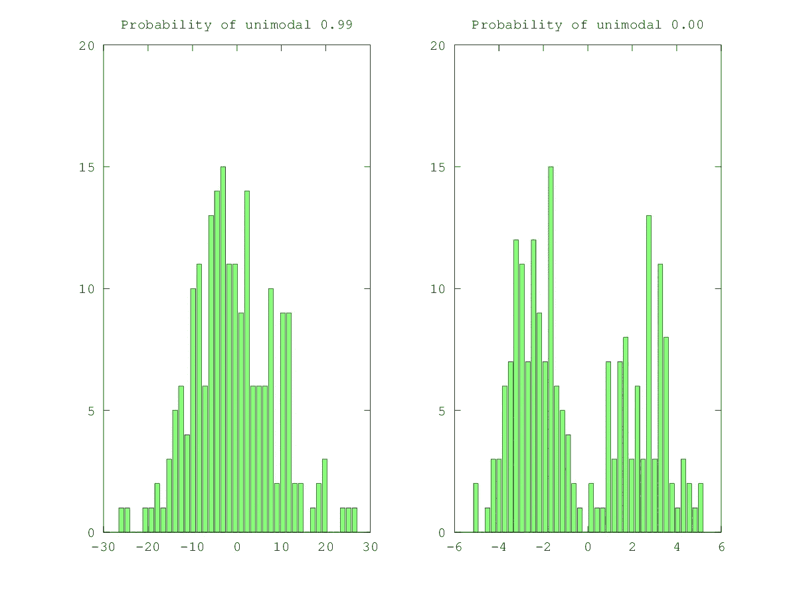
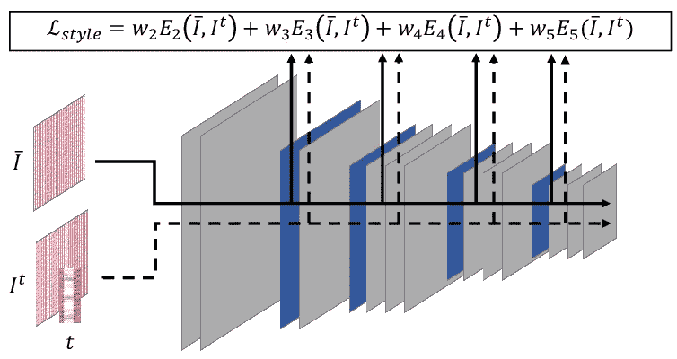

# MSE 损耗的危害及如何消除

> 原文：<https://pub.towardsai.net/the-disadvantage-of-mse-loss-and-how-to-remove-them-a18c5fa224ee?source=collection_archive---------1----------------------->

## [机器学习](https://towardsai.net/p/category/machine-learning)

## 如何改进使用均方误差损失获得的结果

由[安妮·斯普拉特](https://unsplash.com/@anniespratt?utm_source=medium&utm_medium=referral)在 [Unsplash](https://unsplash.com?utm_source=medium&utm_medium=referral) 上拍摄

均方差是机器学习和数据科学中最常用和最直接的基于回归的损失函数之一。它被用在一系列任务中，例如从表格数据到计算机视觉、NLP、强化学习等特定用例的线性回归。除了 MSE 之外，MAE 的应用也很广泛，与 MSE 损耗高度相似。

尽管在机器学习中被高度使用，但它也有缺陷，这是我想在本文中强调的。有具体的方法可以最小化它的缺点以获得更好的结果，这将在最后讨论。为了简单和更好的理解，讨论和用例保持与计算机视觉相关。

# 缺点:

照片由 [Antoine Dautry](https://unsplash.com/@antoine1003?utm_source=medium&utm_medium=referral) 在 [Unsplash](https://unsplash.com?utm_source=medium&utm_medium=referral) 上拍摄

MSE、MAE 等损失函数通常受到数据集中存在的不确定性的影响。在训练模型时，可能会出现这样的情况:对于相同的输入，可能会有各种同样可能的结果。在所有这些情况下，MSE 损失函数旨在通过模糊预测或简单地说，取可能输出的平均值来适应预测中的不确定性。这是因为所有可能结果的平均值将导致训练期间参数空间的全局最小值。类似地，MAE loss 预测了所有这些结果的中位数。基于 L-范数的损失函数的这种结果模糊导致诸如低质量结果、模糊等伪像。

> 这些伪像在图像到图像和视频到视频的任务中很常见，例如超分辨率、视频预测、结构化预测、相机姿态回归等。

# 统计解释:

(来源:作者)

损失函数假设数据集中的数据样本遵循高斯分布，这对于任何真实的数据集来说几乎都不是这样。这种假设也导致了数据集分布本质上应该是单峰的限制，这意味着应该只有最可能的结果。这种假设在大多数情况下严重失败，因为现实生活中的数据集。

如果数据集分布不是单峰的，则 MSE 损失用于训练网络。然后，它将尝试将多峰分布拟合为高斯分布，这通常意味着在 MSE 损失的情况下对峰值进行平均，或者在 MAE 损失的情况下对中值进行合并。

使用 MSE 损失，作为来自网络的所有可能结果的平均值的预测将试图最小化误差，因为获得的预测将是全局最优的，因此避免了更精细的细节，例如面部特征和细微的帧间运动，因为它们被网络认为是噪声。

# 如何提高成绩？

照片由 [Jungwoo Hong](https://unsplash.com/@hjwinunsplsh?utm_source=medium&utm_medium=referral) 在 [Unsplash](https://unsplash.com?utm_source=medium&utm_medium=referral) 上拍摄

为了改善结果，机器学习研究人员尝试了许多不同的方法来解决平均可能预测的问题。还应注意，网络的大部分是确定性的，即，因为它们对相同的输入返回相同的结果。大多数神经网络被设计成产生最可能的结果，而不是返回许多可能的结果。

给出了许多不同的方法来解决 MSE 损失函数中的上述问题，两种最常用的方法如下

*   对抗训练
*   知觉丧失

## 对抗训练:

(来源:【https://pixabay.com )

自 2014 年 GANs 问世以来，通过使用极大极小游戏对数据分布进行建模，研究取得了突破性进展，并改进了结果以生成输出。在对抗性训练中，使用鉴别器通过与来自数据集的样本竞争网络预测来训练模型。使用鉴别器帮助，网络产生微妙的纹理并消除模糊效果。

然而，应该注意的是，通过使用对抗性训练引入的纹理是肤浅的，并且不符合地面真相。

## 感知损失:

[https://www . researchgate . net/publication/334279687 _ Automatic _ Extraction _ and _ Synthesis _ of _ Regular _ Repeatable _ Patterns](https://www.researchgate.net/publication/334279687_Automatic_Extraction_and_Synthesis_of_Regular_Repeatable_Patterns)

在感知损失中，地面真实和预测通过预先训练的神经网络，并且中间层的 MSE 被计算为损失。此过程中最常用的网络是在 ImageNet 数据集上训练的 VGG19。VGG19 的前五层用于此过程。

使用感知损失的理由是，它提取输出图像/视频的特征和表示，并试图最小化它们之间的差异。因此，有人认为，通过使用感知损失函数，网络正试图了解数据集分布的微妙特征。

该损失与 MSE 损失一起使用，并且在训练期间通常具有< 1%的系数，因为许多图像可能具有相似的纹理。我们试图学习的是图像之间的相似性，而不是纹理。所以，大多数时候，它通常被用作一个正则化。

# 结论:

使用所有这些方法来减少平均的影响已经被证明是有帮助的，并且给出一些更好的结果。但是，大多数方法仍然依赖于基于像素距离的损失函数。因此，回归均值问题仍然是一个活跃的研究领域。