# 离散的“电影分级”分布

> 原文：<https://pub.towardsai.net/the-discrete-movie-rating-distribution-fd413e1ec19b?source=collection_archive---------2----------------------->

## [数学](https://towardsai.net/p/category/mathematics)

## 电影收视率的统计分析

分布是描述现实世界模式的预定义数学函数(这不是正式的定义，但是可以非常直观地理解为什么要学习统计学中的分布)。存在多种分布的原因是每种分布都模拟了与现实不同的模式。

## 使用分布的例子

*   股票价格遵循对数正态分布

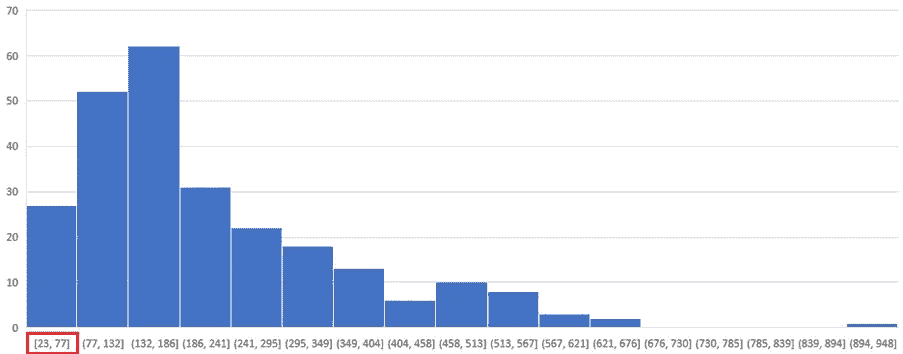

对数正态分布

*   股票收益服从正态分布

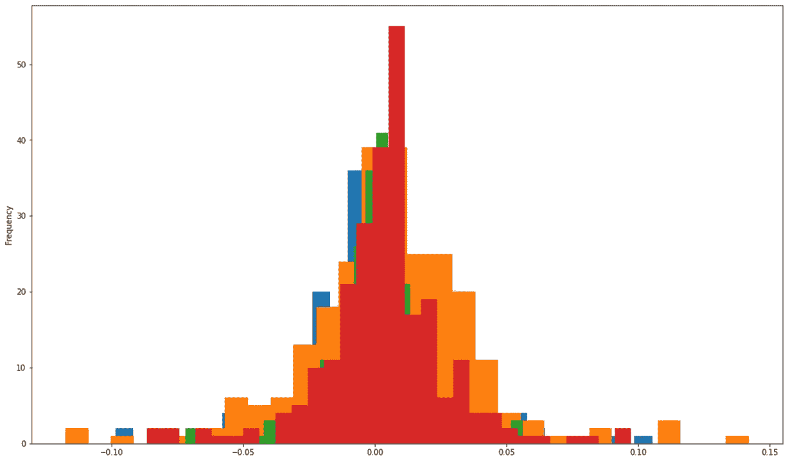

正态分布

*   掷骰子的概率遵循均匀分布

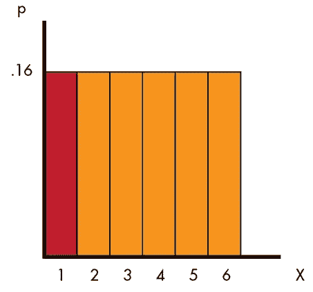

均匀分布

*   猜测投掷硬币的准确次数的概率遵循二项分布

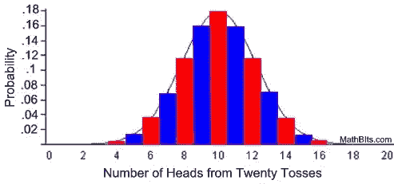

二项分布

*   …

从上面的例子中您可以注意到，您可以将现实生活中的数据转换成一种分布，这种分布能够仅使用几个参数而不是整个数据集来描述该模式。

## 电影评论

如果你搜索任何电影评论，你可以很容易地注意到一个有趣的模式:

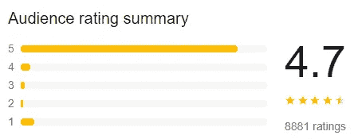

复仇者联盟残局，2019

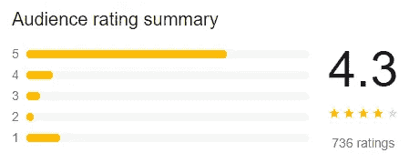

冰冻三尺，2013

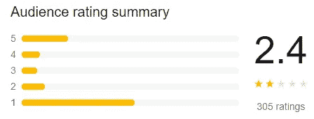

神奇四侠，2015

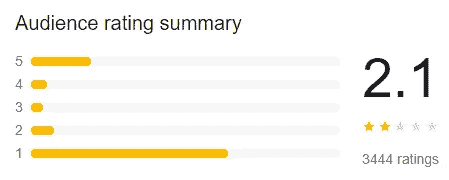

阿特米斯奇幻历险，2020 年

你可以搜索许多不同的电影评级，你可能会发现相同的模式。我找不到任何 API 或数千部电影评级的公开数据，因此这是一个假设:

> 我不依赖于电影的质量，大部分的收视率会分布在明星分布的尾部

这意味着，即使用户可以在 1 到 5 的范围内选择，他也可能会选择 1 或 5，而忽略中间的值。至少，大多数用户是这么做的。

# 用数学方法描述这种行为

现在，我们能用一个数学函数，更准确地说，概率分布来描述这种行为吗？给定一些参数，例如复仇者联盟的评分分布的大小，我们可以估计用户给出评分的**概率。**

## 没有这样的分布

不幸的是，目前还没有可以模拟类似模式的发行版。有趣的是，从这篇学术论文的[开始，一些研究人员已经试图监测和概念化这种模式。](https://www.researchgate.net/figure/The-amount-of-ratings-that-were-given-with-either-a-dynamic-or-a-static-feedback-system_fig3_220724114)

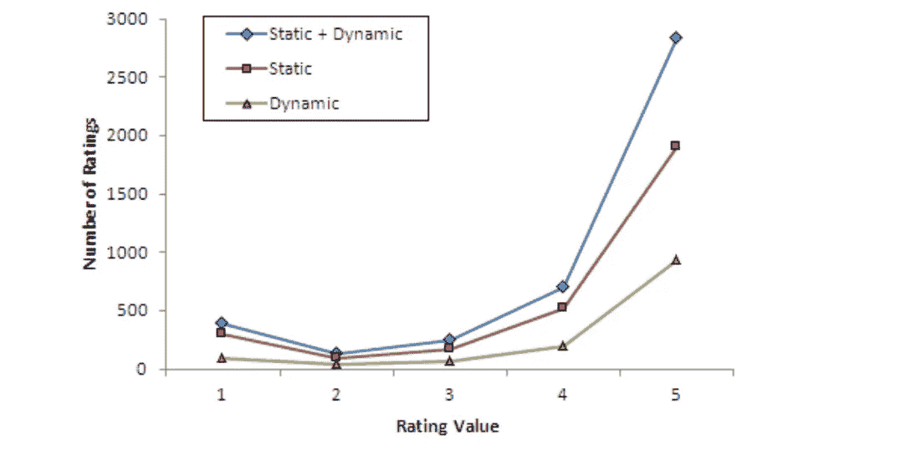

来源:[https://www . research gate . net/figure/The-amount-of-ratings-that-given-with-a-dynamic-or-a-static-feedback-system _ fig 3 _ 220724114](https://www.researchgate.net/figure/The-amount-of-ratings-that-were-given-with-either-a-dynamic-or-a-static-feedback-system_fig3_220724114)

## 类似的分布会是什么样子呢？

*   分离的

这些值只能是{1，2，3，4，5}，不能是介于两者之间的值。

*   u 形

我猜想，唯一需要的两个参数是分布的长度和 T2 旋转。

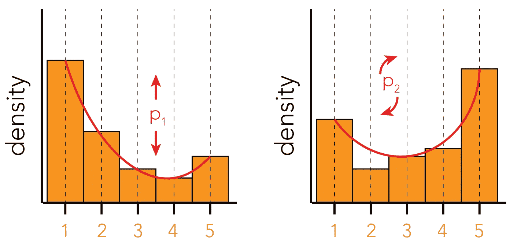

我将如何指定这两个参数

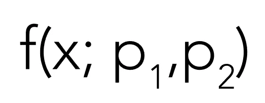

概率分布函数的作用