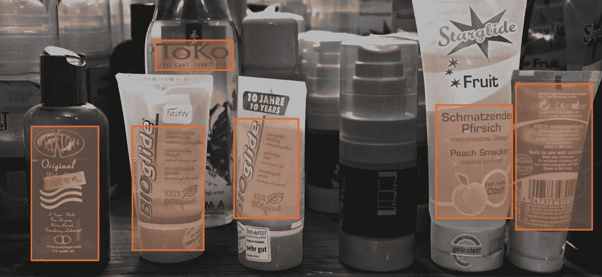

# 内容适度的基本指南

> 原文：<https://pub.towardsai.net/the-essential-guide-to-content-moderation-f34c1990d1d2?source=collection_archive---------3----------------------->

## [技术](https://towardsai.net/p/category/technology)

## 审查内容是一项复杂的任务，通常涉及许多额外的流程，远远超出了审查暴力或极端内容这一有争议的工作。

来源: [Lionbridge AI](https://lionbridge.ai/articles/the-essential-guide-to-content-moderation/)

内容审核是对网站上出现的文本、图像和视频应用一套准则的行为，通常特别关注用户提交的内容。它包括监测和识别潜在的有害内容，评估它是否符合网站的指导方针，并过滤掉任何不合适的内容。

在本文中，我们将讨论内容审核涉及的内容，并介绍一系列处理和过滤内容的不同方法。毕竟，尽管该行业面临许多挑战，内容适度正成为在线业务的重要组成部分。清楚地了解它可以帮助你与顾客建立更密切的关系，并保护你的品牌声誉。

有关 Lionbridge 如何保护您的用户免受不良内容影响的更多信息，请查看我们的[内容审核服务](https://lionbridge.ai/services/content-moderation/)。

# 什么构成了敏感内容？

内容审核的主要目的是从网站中删除不适当的内容。这通常以包含暴力、仇恨言论或裸体的图形或极端内容的形式出现。根据每个站点的具体要求，可以在更大或更小的程度上进行调节。一些留言板以言论自由为荣，而其他留言板，如社交网站，不得不在易用性和保护年轻用户之间达成艰难的平衡。

然而，在审核内容时，也要记住一系列 UX 挑战。用户已经开始期望他们经常访问的网站保持一致的高标准，这也延伸到用户提交的内容。因此，通过称为重复数据消除的过程快速识别和删除重复内容非常重要。同样，低质量的图像或视频提交也是审核工作的常见目标。

大量的网站也有法律问题需要他们的版主考虑。例如，诽谤或受版权保护的内容会让一家公司付出数千美元的法律赔偿。对于许多企业来说，当务之急是在这些内容被任何外部方标记之前识别并删除它们。

# 您可以审核哪些内容类型？

除了内容敏感的许多不同方式之外，审核服务还必须应对几种不同类型的内容。内容仲裁者或算法通常必须处理以下至少一种内容类型:

# 文本

一个网站上需要审核的文本种类之多令人震惊。从评论和论坛帖子到你网站上的整篇文章，几乎任何类型的文本都需要评估。因此，版主和审核算法必须善于扫描不同长度和风格的文本，寻找不想要的内容。

此外，由于语言的复杂性，文本审核可能是一项极其困难的任务。例如，为了检测网络欺凌或仇恨言论，有必要超越明确的关键词，看看短语、句子甚至段落整体上是否违反了你的社区行为准则。虽然文本可能不包含任何敏感内容的明显标志，但它仍可能包含对您的站点极具破坏性的行为。

# 形象

虽然识别不合适的图片看起来很简单，但是在调节它们时，需要考虑许多挑战。首先，检测用户提交内容中的裸体或露骨图像有时取决于上下文。在美国构成不雅图像的内容与在沙特阿拉伯构成不雅图像的内容非常不同。一些公司也可能根据他们的产品在不同的地方划定界限，例如内衣品牌，在那里需要一定数量的裸体来营销和讨论他们的产品。因此，图像审核服务提供商在监控网站时，还必须考虑目标受众、市场甚至公司。

# 录像

图形或暴力视频内容一直是围绕内容审核的许多争议的根源。这可能是因为它也是最难控制的内容类型之一。虽然图像和文本通常可以很快通过审查，但视频可能非常耗时，迫使主持人从头到尾观看视频。如果只有几帧视频是露骨的，它可能会彻底改变观众对网站的看法。如果您的平台允许视频提交，搜索这些隐藏的违反社区准则的行为会对您的审核工作产生重大影响。

视频主持人还需要同时执行几项任务。除了实际的视频内容，任何附加的音频或字幕都需要经过审查，以确定是否有露骨的语言或仇恨言论。与实际的视频内容分开，音频或字幕可能与视频不精确匹配或不满足必要的质量阈值。除了上面概述的许多市场、观众和质量问题，这使得视频审核成为一个艰巨的挑战。

# 内容审核的类型

最适合你的内容审核方法取决于你网站的目标。重要的是要考虑你是否希望人们能够快速方便地交流，或者更重要的是保持你的网站在任何时候都完全没有敏感内容。有一系列不同类型的内容调节，它们位于这两个目标之间的不同点上。最常见的如下:

# 预调节

不足为奇的是，这涉及到所有用户提交的内容在显示在网站上之前都被放在一个队列中等待审核。通过预先审核，有可能通过检查每一个评论、图片或视频来阻止网站上的所有敏感内容。然而，对于重视即时性和无障碍参与的在线社区来说，这种调节方法可能会导致严重的问题。它最适合需要高度保护的网站，例如儿童经常光顾的网站。

# 后节制

如果用户参与很重要，但仍然需要一个全面的审核计划，后审核通常是一个好的选择。它允许用户立即发布他们的提交，但也将其添加到队列中进行审核。这既允许即时性，也允许版主监控行为。然而，由于每个评论都是由版主批准的，因此可伸缩性可能是一个问题。由于所有的内容都必须经过批准，如果任何不适当的东西从网上漏了出去，网站也可能要承担责任。

# 反应性缓和

对于依赖于社区成员的可扩展计划，反应式调节是一种可能的解决方案。这种类型的审核要求用户标记任何他们认为冒犯或违反社区准则的内容。通过让用户参与到这个过程中，反应式审核将版主的努力引向最需要他们关注的内容。然而，也有风险，攻击性的内容会在网站上保留很长一段时间，这可能会损害网站的声誉。

# 主管审核

与反应性审核类似，主管审核包括从在线社区中选择一组审核者。也被称为单边审核，这个系统给某些用户在使用网站时编辑或删除提交内容的特权。如果仔细选择主管，这种方法可以迅速删除敏感内容，并且随着社区的发展很容易扩展。然而，如果版主错过了攻击性的文本、图像或视频，也容易产生上述负面影响。

# 商业内容审核(CCM)

CCM 主要涉及监控社交媒体平台的内容。它通常外包给专家，这些专家的任务是确保平台上的内容遵守特定网站和市场的社区指南、用户协议和法律框架。由于这项工作是由专家完成的，尽管有时涉及的主持人面临困难或有争议的情况，但通常保证有一个良好的审核标准。

# 分布式调节

作为最不干涉的仲裁系统之一，分布式仲裁将大量的信任和控制权交给了社区。它通常包括允许用户对他们看到的提交内容进行评级或投票，标记违反任何现有指导原则的内容。这通常是在有经验的版主的指导下进行的，如果一个网站有一个大而活跃的社区，这种方法会很有效。尽管如此，分布式审核系统仍然很少见。允许一个社区几乎完全自我调节的风险是许多公司不愿意承担的，特别是因为这可能对他们的品牌和声誉产生负面影响。

# 自动调节

最后，自动审核是一种越来越流行的审核方法。顾名思义，它包括使用各种工具来过滤、标记和拒绝用户提交的内容。这些工具可以是简单的过滤器，用于搜索禁止的词语或阻止特定的 IP 地址，也可以是机器学习算法，用于检测图像和视频中的不当内容。目前，这些工具中的许多是在某种人类调节之外使用的，但随着它们在分析对话的能力方面变得更加复杂，它们可能在不久的将来成为一种可行的独立选择。

# 谁执行内容审核？

国际媒体充分报道了人类主持人忍受的艰难工作条件。这份工作的压力很大，需要不断接触互联网上一些最极端的内容，这导致这些职位的离职率极高。随着内容审核对审核者身心健康的巨大影响进一步暴露，使用机器学习来承担这项工作看起来越来越像是一个可取的选择。

机器学习算法已经以各种方式实现，以消除人类工作者的极端内容负担。这些算法建立在人类前辈的工作基础上，因为它们是使用以前标记的内容的大型数据集进行训练的。从这个庞大的相关例子库中，该算法推断出管理安全和敏感内容之间区别的规则。对这些规则的复杂理解使得算法能够越来越准确地标记明确的材料。

开发这些模型的下一步涉及建立处理上述一些更复杂的不当内容的能力，如网络欺凌。未来的内容审核工具将能够计算出一项内容的相对“风险”分数，然后再决定何时以及是否应该对其进行审核。

目前，内容审核的复杂性意味着完全自动化仍然是一个遥远的梦想。然而，随着该行业适应保护其工人，人在回路中的调节工作流程将变得更加普遍。这些都建立在人类和机器的优势之上，允许算法清除大部分不适当的内容，同时将困难的、主观的内容提交给人类监督员。这样，人工智能在这一领域的持续扩张不仅有助于保护互联网用户，也有助于保护版主免受内容世界最糟糕的影响。

# 为什么内容适度很重要？

与你的客户建立稳固持久的关系绝对至关重要。创建一个人们可以与你互动的网上平台，不仅会扩大你的客户群，还会让你对如何改进你的产品有宝贵的见解。

然而，这些策略必然伴随着风险。通过开放你的业务和创建一个社区，你也为来自互联网黑暗面的不良内容打开了大门。人们很容易争辩说，这只会影响拥有某些产品的公司，但实际上它会影响所有业务。只需一条不恰当的内容就能破坏与潜在客户的关系——之后就很难再赢回他们了。

通过使用内容审核对您的网站实施高标准，您可以保护自己免受各种法律问题的影响，保护您不断增长的社区，并最终表明您关心—不仅关心您创造的环境，还关心您的公司与世界打交道的方式。

# 哪里可以找到内容审核服务？

Lionbridge 的内容审核服务在全球 150 个主要市场以 300 多种语言运营，可以保护您的本地和国际业务。无论您是需要数据来构建自动审核系统，还是需要一个工作团队来外包您的工作，您都可以相信我们会保护您的社区并改善您的用户体验。请立即联系我们了解更多信息。

[由伊娃·k ./`伊娃·k .[http://www.gnu.org/licenses/old-licenses/fdl-1.2.html GFDL 1.2 版或法尔]'在维基共享资源下制作的特色图片。](https://commons.wikimedia.org/wiki/File:Gleitmittel_Personal_Lubricants.jpg)

*由丹尼尔·史密斯原创，发表于*[*https://lionbridge . ai*](https://lionbridge.ai/articles/the-essential-guide-to-content-moderation/)*。经原作者许可，本文已被转载。*